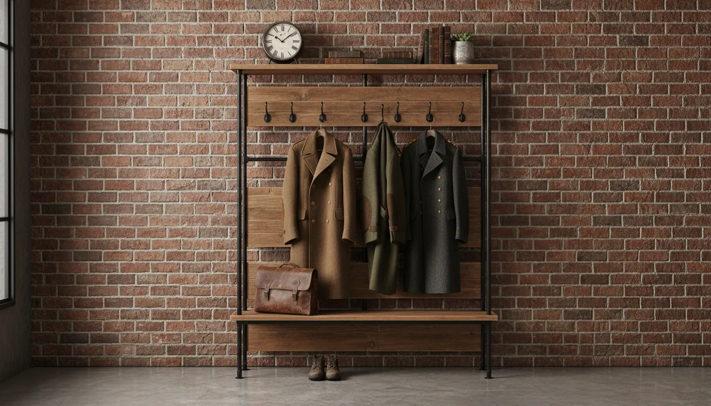
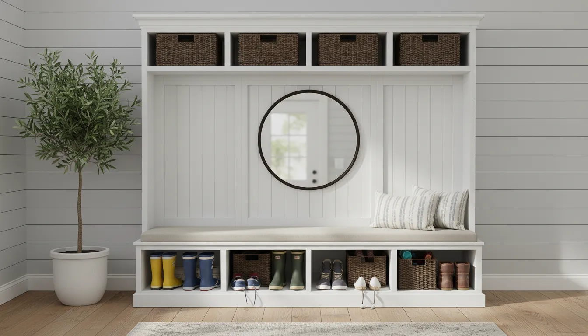
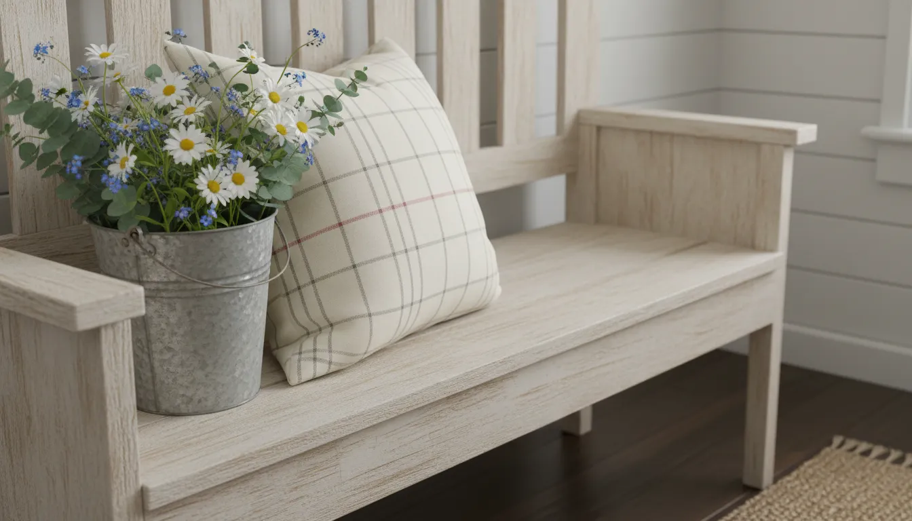

# 7 Stunning Farmhouse Hall Trees That Define Rustic Entryway Charm

The entryway is the handshake of the home. It is the first space that greets guests and the final threshold you cross before facing the world. Yet, despite its importance, the entryway often falls victim to the chaos of daily life. Piles of shoes, discarded jackets, and misplaced keys can quickly turn a welcoming foyer into a source of stress. The solution to this common dilemma lies at the intersection of robust functionality and timeless aesthetics: the farmhouse hall tree.

Farmhouse design has transcended passing trends to become a staple of American interior architecture. Its enduring popularity stems from a focus on comfort, practicality, and a connection to natural materials. When applied to entryway furniture, this design philosophy yields pieces that are not only durable enough to withstand muddy boots and heavy winter coats but are also visually striking enough to anchor the room’s decor.

In this comprehensive guide, we will explore seven distinct styles of farmhouse hall trees that define rustic charm. From industrial fusions to classic shiplap designs, these pieces prove that organization does not require a sacrifice of style.

## The Anatomy of Rustic Charm

Before diving into specific models and styles, it is essential to understand what constitutes the "farmhouse" aesthetic in the context of storage furniture. Unlike the ornate carvings of Victorian furniture or the sharp, glossy lines of modern minimalism, farmhouse design relies on honest materials and utilitarian forms.

A quintessential farmhouse hall tree often features a blend of distressed wood and matte metal. The wood tones range from deep, warm walnuts to whitewashed oaks that evoke the feeling of a sun-bleached cottage. The hardware is typically substantial—think wrought iron hooks and heavy-duty drawer pulls—emphasizing durability.

Furthermore, the structure of these units is designed for "heavy lifting." They are multipurpose stations that combine a bench for sitting, hooks for hanging, and often shelves or cubbies for stowing gear. This all-in-one approach is what makes them indispensable for maintaining a tidy home. For more insights on maximizing small spaces, you might consider reading about [vertical storage solutions](/posts/maximizing-vertical-storage-in-small-entryways).

## 1. The Classic Shiplap & White Oak Stand

The first entry on our list pays homage to the modern farmhouse movement popularized by designers over the last decade. This style is characterized by the use of bright white finishes paired with natural wood accents, specifically shiplap paneling.

Shiplap, originally used as waterproofing for ships, brings a distinct horizontal texture to the back panel of the hall tree. When painted a crisp white, it reflects light, making even small entryways feel more spacious. The bench seat, typically finished in a natural oak stain, provides a grounding contrast.

This style is perfect for homeowners who want their entryway to feel airy and clean. The contrast between the white vertical paneling and the warm wood seat creates a sophisticated look that pairs beautifully with neutral wall colors and woven textures.

## 2. The Industrial-Rustic Fusion

For those who prefer a slightly edgier look, the industrial-rustic hall tree is a stunning choice. This design leans heavily into the "form follows function" ethos of early 20th-century factories, blending raw steel frames with reclaimed or distressed wood.

The silhouette of these units is often open and airy, lacking the solid back panel found in traditional wooden hall trees. Instead, a sturdy metal framework supports the wooden elements. This "skeleton" structure is excellent for smaller spaces where you want to avoid blocking sightlines.

The wood used in these pieces often features saw marks, knots, and variations in grain, celebrating the imperfections of the material. The metal is usually finished in matte black or oil-rubbed bronze.

If you are looking to incorporate this robust aesthetic into your home, you can explore options such as this **[Industrial Farmhouse Hall Tree](https://www.amazon.com/s?k=Industrial+Farmhouse+Hall+Tree&tag=hats0f8-20)**.

## 3. The Barn Door Mudroom Locker

Few elements scream "farmhouse" quite like a sliding barn door. Integrating this mechanism into a hall tree adds a dynamic layer of functionality and visual interest. These units are typically larger, mimicking the look of built-in mudroom lockers.

The sliding door is not merely decorative; it serves a crucial purpose. It allows you to conceal the more chaotic aspects of your entryway storage. Perhaps you have one side dedicated to guest coats and the other to the family's muddy hiking gear. With a sliding door, you can easily hide the clutter while keeping the essentials accessible.

These units often feature "X" bracing on the doors, a nod to traditional barn construction. The hardware—the rail and rollers—becomes a focal point, adding a touch of mechanical beauty to the piece.

## 4. The Corner Maximizer

Not every home is blessed with a grand foyer. Many entryways are tight corners or narrow hallways where floor space is at a premium. The corner hall tree is an ingenious solution that turns dead space into a functional storage zone.

Designed with a right-angle back, these units snuggle perfectly into the corner. despite their smaller footprint, they pack a punch in terms of storage. A typical corner unit includes a triangular bench, a lower shelf for shoes, and two sides of hooks for coats and bags.

The farmhouse charm in these units is often conveyed through beadboard backing and curved molding at the top, softening the angular nature of the furniture. It is an ideal way to add rustic character to apartments or smaller cottages without overwhelming the square footage.

## 5. The Repurposed Antique Look

Authenticity is a cornerstone of rustic design. While not everyone can source a 100-year-old pew to convert into a hall tree, many modern manufacturers are creating pieces that replicate the look of repurposed antiques.

These hall trees often feature "chippy" paint finishes, where layers of paint seem to have worn away to reveal the wood beneath. They may incorporate architectural salvage elements, such as antique corbels supporting the upper shelf or vintage cast-iron hooks.

The color palette for this style tends to be more adventurous than the standard white or wood tone. You might find units in muted sage greens, slate blues, or distressed creams. These colors evoke a sense of history and nostalgia, making the furniture feel like a family heirloom rather than a store-bought item.

## 6. The Wide Bench Family Station

For large families, a standard hall tree often falls short. When there are four or five people shedding coats and kicking off shoes simultaneously, you need a unit with significant width and dedicated zones. The wide bench family station is the heavyweight champion of entryway organization.

These units can span 60 inches or more, providing ample seating for two people to put on shoes at the same time. The storage beneath the bench is often divided into cubbies, allowing each family member to have a designated spot for their footwear.

To maintain the rustic aesthetic on such a large piece, designers often utilize beadboard backing and substantial crown molding. Adding baskets to the overhead cubbies can introduce texture and hide seasonal items like scarves and gloves.

For families needing robust organization, a **[Solid Wood Entryway Bench](https://www.amazon.com/s?k=Solid+Wood+Entryway+Bench&tag=hats0f8-20)** with integrated storage can be the foundation of a highly functional mudroom.

## 7. The Minimalist Rustic Rack

Sometimes, less is more. The minimalist rustic hall tree strips away the bulk, focusing on clean lines and the beauty of raw materials. This style is particularly effective in modern farmhouses where the goal is to reduce visual clutter.

These units often consist of a simple, thick slab of live-edge wood serving as the bench, supported by hairpin legs or a simple metal frame. Above, a floating shelf with hooks replaces the full back panel. This separation between the bench and the coat rack creates a sense of openness.

While visually light, these pieces rely on the quality of the wood to make a statement. A slab of walnut or maple with a visible grain pattern serves as natural art. This style works exceptionally well when paired with other [minimalist organization techniques](/posts/minimalist-entryway-organization-tips).

## Choosing the Right Wood and Finish

The soul of a farmhouse hall tree lies in its materials. Understanding the different wood types and finishes can help you select a piece that will age gracefully.

**Reclaimed Wood:** This is the gold standard for rustic furniture. Wood salvaged from old barns, factories, or fences carries a history that cannot be replicated. It is durable and environmentally friendly, though often comes at a higher price point.

**Pine:** A traditional favorite for farmhouse furniture, pine is a softer wood that takes stain beautifully. It is prone to dents and scratches, but in the rustic aesthetic, this wear and tear is often considered a feature rather than a flaw, adding to the "lived-in" charm.

**Mango Wood:** Increasingly popular in sustainable furniture, mango wood offers unique grain patterns and a kaleidoscopic range of colors from golden brown to gray. It is highly durable and water-resistant, making it an excellent choice for entryways that see wet coats and umbrellas.

**Metal Finishes:** The metal components should complement the wood. Matte black is the most common choice for a stark, modern farmhouse look. However, brushed nickel or antique brass can offer a softer, more traditional appearance.

## Functional Considerations: Storage and Capacity

While aesthetics are important, a hall tree must perform. When evaluating potential units, consider the specific needs of your household.

### Shoe Storage
Shoes are the primary culprit of entryway clutter. Decide whether you prefer open shelves or closed drawers. Open shelves allow for easy access and better air circulation for damp shoes, but they require you to keep the shoes tidy. Drawers or flip-down cabinets offer a cleaner look but can be cumbersome for daily use.

### Hook Height and Strength
Consider the height of the hooks. If you have children, look for a unit with a lower tier of hooks or one that allows you to add additional hooks at a kid-friendly height. Furthermore, ensure the hooks are double-bolted. Single-screw hooks often loosen over time under the weight of heavy winter coats and backpacks.

### Bench Weight Capacity
Always check the weight rating of the bench. A hall tree is a piece of seating furniture, and it needs to safely support the weight of an adult—or two—sitting down to tie laces. A flimsy bench will wobble and eventually fail, posing a safety hazard.

For a versatile option that balances hanging space with shoe organization, consider looking into a **[Rustic Entryway Coat Rack Bench](https://www.amazon.com/s?k=Rustic+Entryway+Coat+Rack+Bench&tag=hats0f8-20)**.

## Styling Your Hall Tree

Once you have selected and installed your hall tree, the final step is styling. This is where you transition the piece from a storage unit to a design feature.

**Textiles:** Soften the hard lines of wood and metal with textiles. A few throw pillows on the bench in buffalo check, grain sack stripe, or textured linen can instantly make the space feel cozy. A throw blanket draped over the arm adds a layer of warmth.

**Baskets:** Baskets are the secret weapon of farmhouse organization. Woven seagrass, water hyacinth, or wire baskets with fabric liners are perfect for the upper shelves or under-bench cubbies. They hide the visual noise of gloves, hats, and dog leashes while adding texture.

**Seasonal Decor:** The top shelf of a hall tree is an ideal stage for seasonal vignettes. A wreath hung over the mirror or back panel can be changed out quarterly—fresh greens for winter, dried wheat for autumn, or eucalyptus for spring.

## Installation and Safety

A hall tree is a tall, heavy piece of furniture. In a busy entryway, it is subject to bumps and pulls. To ensure safety, especially in homes with children or pets, securing the unit to the wall is non-negotiable.

Most high-quality units come with anti-tip kits. These usually consist of a strap or bracket that anchors the top of the unit to a wall stud. If your unit does not include one, they are readily available at hardware stores. Taking ten minutes to install this safety feature can prevent serious accidents.

Additionally, consider the flooring beneath the unit. If you are placing a heavy wood and metal stand on hardwood floors, use felt pads under the legs to prevent scratching. If the unit sits on a rug, ensure the rug is secured with a non-slip pad so the entire assembly does not shift when someone sits down.

## Conclusion

The farmhouse hall tree is more than just a place to hang a coat; it is a statement of lifestyle. It represents a desire for a home that is welcoming, organized, and rooted in the beauty of natural materials. Whether you opt for the crisp brightness of shiplap, the ruggedness of industrial metal, or the clever utility of a corner unit, there is a style to suit every rustic vision.

By carefully considering your space constraints, storage needs, and aesthetic preferences, you can select a piece that will serve your family for years. A well-chosen hall tree transforms the frantic energy of leaving and arriving into a smooth, organized, and beautiful experience. It invites you to leave the stress of the world at the door and truly come home.