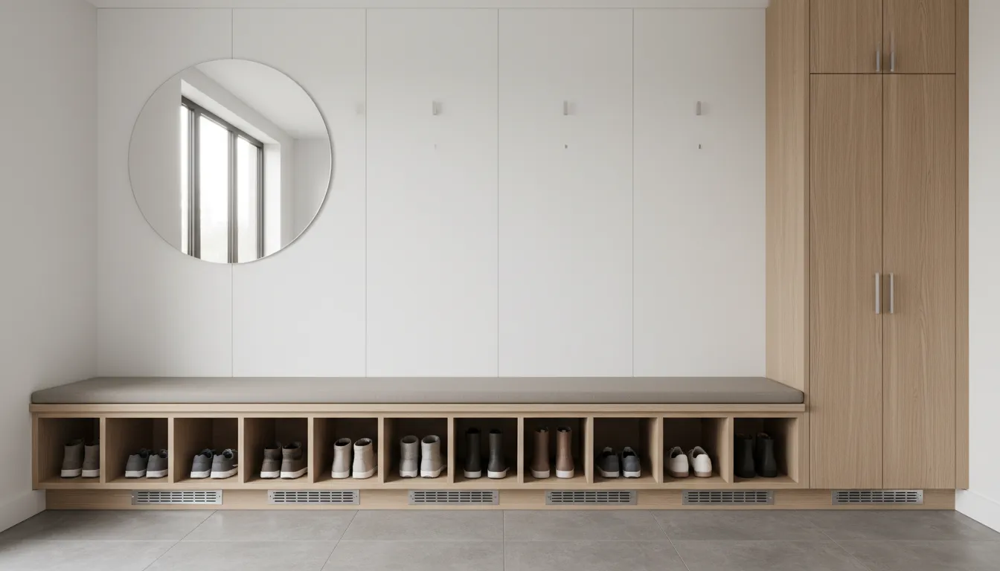
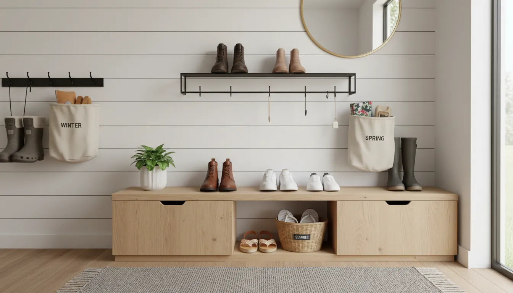

# Athletic Shoe Storage: Keeping Smelly Sneakers Out of the Entryway

The modern entryway serves a dual purpose that is often at odds with itself. On one hand, it is the architectural handshake of the home—a space designed to welcome guests with cleanliness, style, and a sense of order. On the other hand, it functions as the primary transition zone for an active lifestyle, becoming the drop-off point for muddy cleats, damp running shoes, and high-performance sneakers that carry the distinct olfactory evidence of a hard workout.

Balancing the aesthetic requirements of a curated home with the functional necessities of an athletic household is a challenge that plagues interior designers and homeowners alike. When athletic footwear accumulates by the front door, it creates not only a visual stumbling block but also an atmospheric issue that can permeate the entire lower level of a residence.

To reclaim the entryway, one must move beyond simple shoe racks and embrace a comprehensive strategy that involves moisture management, strategic relocation, and hidden storage solutions. This guide explores the most effective methods for managing athletic footwear, ensuring your home remains a sanctuary rather than a locker room.

## The Odor Equation: Pre-Storage Maintenance

Before discussing where to put the shoes, it is imperative to address the condition of the footwear itself. Storing damp, perspiring sneakers inside a closed cabinet is a recipe for bacterial growth and permanent material damage. The first line of defense in keeping the entryway fresh is not containment, but mitigation.

### Ventilation and Moisture Control

The primary culprit behind "gym shoe smell" is not sweat itself, but the bacteria and fungi that thrive in the warm, moist environment inside a shoe. Therefore, the immediate removal of moisture is the most critical step in the storage process. Throwing shoes directly into a bin or basket immediately after use traps humidity, allowing bacteria to multiply.

Implementing a "drying phase" is essential. For households with heavy athletic activity, this might involve a designated staging area in a garage or mudroom where shoes are allowed to air out for at least four hours before being placed in permanent storage. This protocol preserves the integrity of the shoe's materials and significantly reduces the odor load in the home.

For those living in humid climates or dealing with particularly intense training schedules, passive drying may not be sufficient. Electric shoe dryers that use gentle thermal convection are highly effective at neutralizing the environment where odors breed.

**Recommended Solution:**
[Peet Original Electric Shoe and Boot Dryer](https://www.amazon.com/s?k=Peet+Original+Electric+Shoe+and+Boot+Dryer&tag=hats0f8-20)

### Biological and Chemical Interventions

While ventilation handles the moisture, residual bacteria often require direct intervention. Natural deodorizers such as cedar inserts or charcoal bags are excellent for maintenance. Activated charcoal is particularly effective as it absorbs moisture and traps odor molecules within its porous structure without adding artificial fragrances that merely mask the smell.

For more aggressive odor control, essential oil sprays containing tea tree or eucalyptus oil offer antibacterial properties. However, these should be applied sparingly and allowed to dry completely before the shoes are placed in any enclosed storage unit.

## Strategic Zones: Relocating the Mess

The most effective way to keep athletic shoes out of the entryway is to establish a secondary entry point or a "dirty zone" that intercepts the mess before it reaches the main living areas. Redefining the flow of traffic in your home can alleviate the pressure on the front door.

### The Garage Transition Zone

If your home layout allows, the garage is the ideal location for a primary athletic shoe drop zone. By installing heavy-duty shelving near the door connecting the garage to the house, you create a firewall against dirt and odors.

This area does not need to be as aesthetically polished as the interior, allowing for rugged, open-wire shelving that promotes airflow. This is the best location for muddy cleats, trail running shoes, and oversized basketball sneakers that rarely fit in standard interior cabinetry. To make this system effective, it requires strict adherence to a "shoes off in the garage" policy. A simple bench and a durable rug can make this transition comfortable, encouraging family members to swap outdoor gear for house slippers before entering.

### The Mudroom Maximizer

For homes with a dedicated mudroom, the challenge is often organization rather than location. Mudrooms can quickly become chaotic dumping grounds if not rigorously structured. The key here is individualization. Assigning specific cubbies or drawers to each family member enforces accountability.

Open lockers with lower shoe cubbies work well for frequently used items, but athletic shoes often require more specific containment to prevent odor migration. Consider incorporating ventilated drawers or wire baskets within the mudroom cabinetry. This keeps the visual clutter hidden while allowing the necessary air circulation.

### The Laundry Room Solution

In many floor plans, the laundry room is adjacent to the garage or back entrance. Leveraging this proximity can be a game-changer for athletic households. Since the laundry room is already equipped for cleaning and chemical storage, it is a natural habitat for dirty gear.

Installing a deep utility sink for scrubbing mud off cleats and a dedicated drying rack above the dryer creates a workflow where shoes are cleaned and dried before they are ever considered for storage. This functional approach treats athletic footwear as gear to be maintained rather than just clothing to be stored.

## Hidden in Plain Sight: Entryway Camouflage

Not every home has a mudroom or a usable garage entrance. For apartment dwellers and those whose front door is the only point of entry, the shoes must stay in the entryway. In these scenarios, the strategy shifts from relocation to concealment. The goal is to make the shoes invisible and undetectable to the nose.

### The Tip-Out Shoe Cabinet

The tip-out shoe cabinet is the premier solution for narrow entryways. Unlike traditional racks that extend far into the room, tip-out cabinets have a slim profile, often protruding less than ten inches from the wall. They utilize vertical space, storing shoes at an angle.

These units effectively hide the visual clutter of neon-colored running shoes behind a sleek facade that mimics high-end furniture. When selecting a tip-out cabinet for athletic shoes, ensure the compartments are sized adequately. High-top sneakers and bulky trainers may require removing dividers or selecting a model specifically designed for larger footwear sizes.

**Recommended Solution:**
[Slim Tip-Out Shoe Cabinet with 3 Drawers](https://www.amazon.com/s?k=Slim+Tip-Out+Shoe+Cabinet+with+3+Drawers&tag=hats0f8-20)

### The Bench with Secret Compartments

A bench is a staple of entryway design, providing a place to sit while putting on or taking off shoes. However, the space beneath the seat is often underutilized or left open, which exposes the clutter. A storage bench with a hinged lid or sliding doors offers a discreet repository for athletic wear.

To prevent the interior of the bench from becoming a breeding ground for odors, look for designs with slatted backs or breathable rattan fronts. If the bench is solid wood, consider drilling inconspicuous holes in the back panel to facilitate air exchange. Lining the bottom of the storage compartment with a removable, washable mat is also advisable to catch dried mud and turf beads.

### Basket Systems and visual cohesion

If open storage is the only option, visual uniformity is the antidote to chaos. Woven baskets or uniform bins can hide athletic shoes on open shelves. The texture of natural fibers like seagrass or wicker adds warmth to the entryway while obscuring the contents.

Assign one large basket per person. This limits the number of pairs that can be kept in the entryway, enforcing a natural cap on accumulation. When the basket is full, a pair must be moved to long-term storage (like a bedroom closet) to make room for the current rotation.

## Specialty Athletic Gear: Cleats, Boots, and High-Tops

Standard shoe racks are rarely designed to accommodate the specialized shapes and soil levels of athletic gear. Soccer cleats, hiking boots, and basketball high-tops present unique storage challenges that require specialized solutions.

### Dealing with Mud and Debris

Field sports introduce elements of nature—mud, grass, and clay—into the home. Placing these items on a standard wooden shelf or inside a fabric organizer will ruin the furniture and make cleaning difficult.

The essential tool for field athletes is the boot tray. A high-walled rubber or heavy-duty plastic tray captures melting snow, mud, and water, protecting your floors. For a more sophisticated look, these trays can be filled with polished river stones. The stones elevate the shoes slightly, allowing water to drain away from the soles, which speeds up drying and hides the dirt accumulating at the bottom of the tray.

### Vertical Verticality for High-Tops

High-top sneakers and hiking boots take up significant vertical space, often requiring two standard shelf heights. Adjustable shelving systems are crucial here. If you are building custom cabinetry or installing a closet system, ensure the shelf pin holes allow for varying heights.

Alternatively, wall-mounted gravity racks that hold shoes by the toe or heel can be effective for boots, as they prevent the shaft of the boot from creasing and allow air to circulate around the ankle area.

**Recommended Solution:**
[Heavy Duty Boot Tray with Raised Edges](https://www.amazon.com/s?k=Heavy+Duty+Boot+Tray+with+Raised+Edges&tag=hats0f8-20)

## Routine and Discipline: The Family Systems Approach

Even the most expensive storage hardware will fail without a behavioral system to support it. The accumulation of athletic shoes in the entryway is usually a symptom of a breakdown in household habits. Establishing clear rules regarding shoe rotation is as important as the furniture you buy.

### The One-In, One-Out Rule

Athletes often rotate through multiple pairs of shoes, but they rarely need access to all of them simultaneously. Implement a rule where only the currently active pair remains in the entryway or primary drop zone. Retired pairs, or those used for off-season sports, should be cleaned and relegated to deep storage in bedroom closets or under-bed organizers.

For example, during soccer season, cleats stay in the mudroom. Once the season ends, they are cleaned, stuffed with newspaper to hold their shape, and moved to the garage or a high shelf, making room for basketball shoes. This seasonal rotation keeps the prime real estate of the entryway unburdened.

### The Weekly Reset

Despite best efforts, shoes tend to migrate. A "Weekly Reset" scheduled for Sunday evenings can restore order. During this brief 10-minute window, family members are responsible for collecting any footwear that has strayed into the living room or accumulated in the entryway and returning it to its designated home. This prevents the "sneaker pile" from reaching critical mass.

## Integrating Style with Function

The ultimate goal is to solve the storage problem without sacrificing the design aesthetic of your home. Athletic storage does not have to look industrial or cheap. By selecting materials that complement your existing decor, shoe storage can become an architectural feature.

### Material Consistency

If your entryway features mid-century modern teak, avoid buying a white wire rack. Look for storage cabinets with wood veneers that match your trim. If your home is industrial farmhouse, metal lockers or galvanized steel bins can serve as stylish, functional shoe storage.

Customizing IKEA furniture is a popular route for achieving a high-end look on a budget. Taking a standard shoe cabinet and adding custom brass hardware, a new top surface of reclaimed wood, or painting it to match the wall color can make the storage unit recede into the room, reducing visual noise.

### Lighting and Airflow

Dark corners encourage dampness. If you are converting a closet into shoe storage, consider installing motion-sensor LED strip lighting. Not only does this make it easier to find specific pairs, but the light also creates a boutique atmosphere that encourages family members to keep the space tidy.

Furthermore, ensure that whatever cabinetry you choose allows for airflow. Solid doors should be avoided in favor of louvered doors, cane webbing, or decorative metal grates. If you have custom joinery, ask the carpenter to rout ventilation channels into the toe kick or the back of the shelving unit.

For more inspiration on how to blend these functional elements into a cohesive design, explore our guide on [entryway organization ideas](/posts/entryway-organization-ideas), which dives deeper into decorative principles.

## DIY Customizations for Shoe Storage

For the handy homeowner, creating a bespoke solution often yields the best results for athletic shoe storage, as it allows for exact sizing based on the specific footwear your family uses.

### Copper Pipe Shoe Racks

For an industrial-chic look that is virtually indestructible, consider constructing a shoe rack from copper plumbing pipes. Copper naturally possesses antimicrobial properties, which can subtly assist with hygiene. The open structure of a pipe rack ensures maximum ventilation, making it ideal for drying damp sneakers. This type of rack can be mounted directly to the wall, floating off the floor to make vacuuming underneath easy.

### Repurposed Vintage Lockers

Vintage school or gym lockers are an excellent solution for athletic families. They are designed specifically for this purpose, with built-in vents and durable metal construction that can withstand mud and moisture. A set of vintage lockers can be powder-coated in a vibrant color to become a statement piece in a hallway or mudroom. They offer ample height for lacrosse sticks or baseball bats alongside the shoes, keeping all gear centralized.

## The Psychology of the Drop Zone

Understanding why shoes pile up is key to preventing it. Humans follow the path of least resistance. If putting shoes away requires opening a door, pulling out a drawer, and untying laces, the shoes will likely end up on the floor.

### Reducing Friction

To keep the entryway clear, the storage solution must be as effortless as kicking the shoes off. Open shelving or cubbies are generally more successful for children and teenagers than closed cabinets. If you require closed storage for aesthetic reasons, consider "drop-front" boxes or drawers that operate smoothly.

Labeling is another psychological tool that increases compliance. A label that says "Running Shoes" or "Dad's Gym Gear" defines the territory. It removes the decision-making process of "where does this go?" and creates a sense of ownership and territorial responsibility.

## Maintenance for Longevity

Maintaining the storage system is as important as maintaining the shoes. Over time, shoe racks accumulate grit, dried mud, and small stones. This debris acts like sandpaper, scratching the finish of the shelves and potentially damaging the soles of other shoes.

### Vacuum and Wipe Down

Incorporate the shoe storage area into your regular vacuuming routine. Use a crevice tool to get into the corners of cubbies or the bottom of the boot tray. Once a month, wipe down the shelves with a mild disinfectant. This keeps the area smelling fresh and prevents the buildup of mold spores that could transfer back onto the shoes.

For wooden furniture, be wary of moisture transfer from the soles of shoes. Even "dry" shoes can hold humidity. Using shelf liners—whether cork, rubber, or heavy-duty paper—protects the wood and makes cleaning easier, as the liners can be removed and shaken out or washed.

## Conclusion

Keeping smelly sneakers and bulky athletic shoes out of the entryway requires a multifaceted approach that combines hygiene, strategic placement, and smart furniture choices. It is not merely about finding a box to put things in; it is about creating a system that respects the lifestyle of the athlete while preserving the sanctity of the home.

By treating the source of the odors, designating specific zones for "dirty" gear, and utilizing furniture that disguises functionality with style, you can achieve an entryway that is both welcoming and practical. The battle against the sneaker pile is won not with a single purchase, but with a commitment to a system that prioritizes ventilation, organization, and discipline.

For further reading on maximizing small spaces, consider reviewing our article on [small hallway storage solutions](/posts/small-hallway-storage-solutions), which complements the strategies discussed here. With the right tools and habits, your entryway can return to being a beautiful introduction to your home, rather than an obstacle course of laces and rubber.