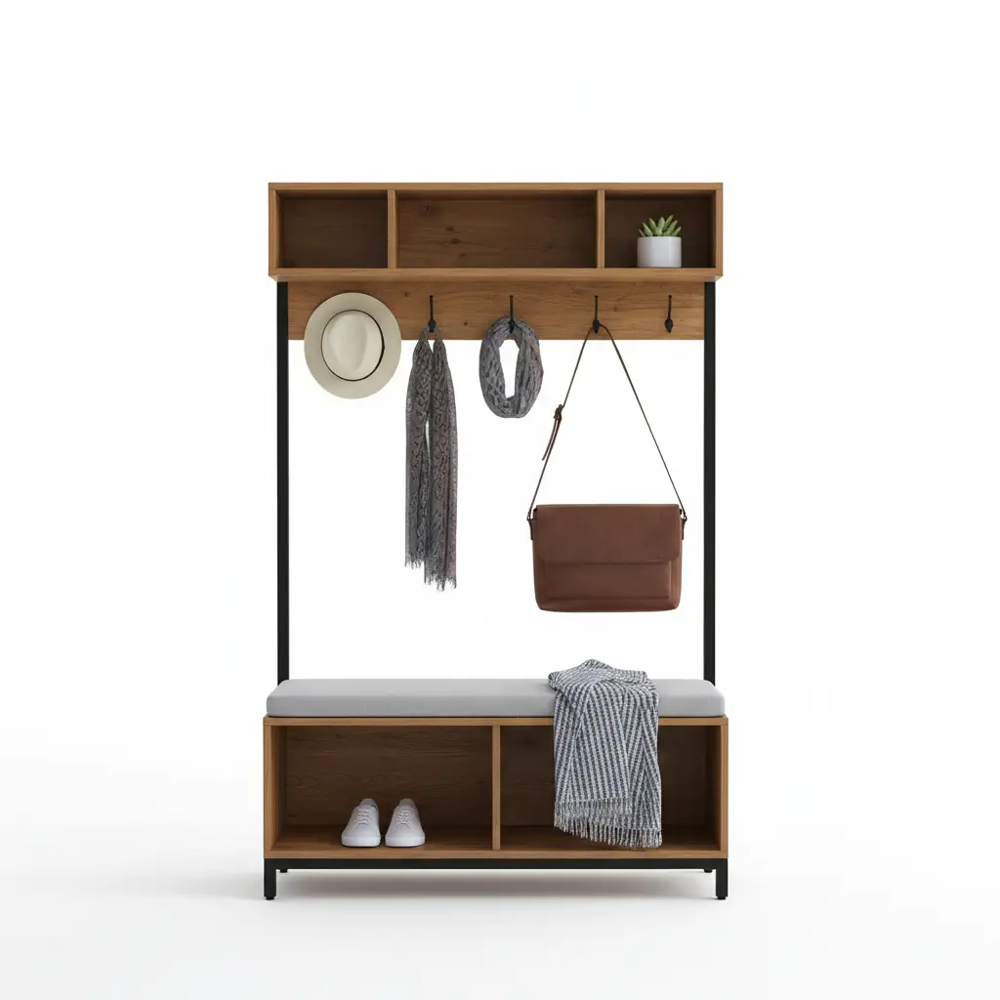
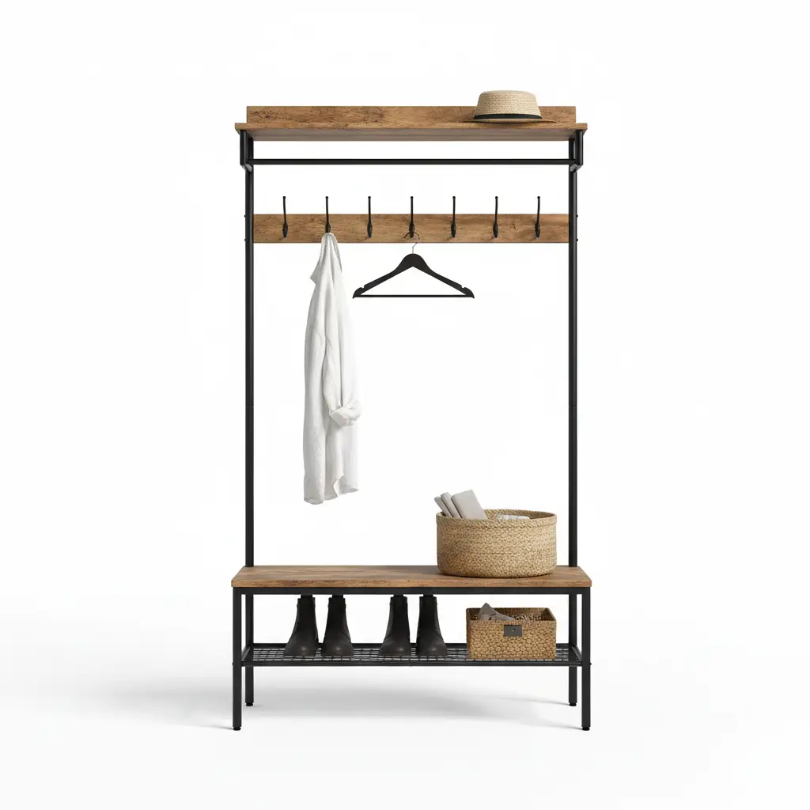
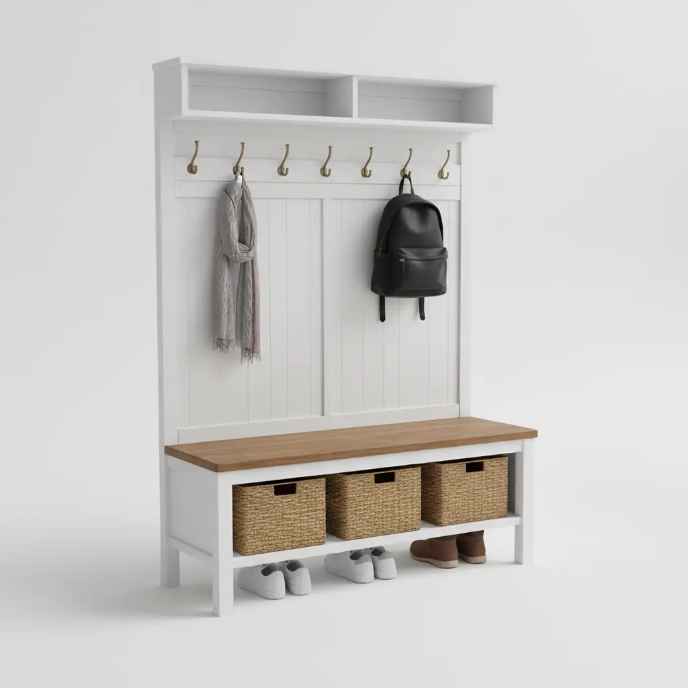

The entryway is the handshake of your home. It is the first thing guests see and the last thing you experience before heading out into the world. Naturally, we want this space to be both beautiful and functional. Enter the **hall tree**—the undisputed heavyweight champion of entryway organization. It combines seating, coat hanging, shoe storage, and often a mirror into one singular, stylish unit.

However, there is a common tragedy in the world of interior design: the "Return of the Giant Furniture." You find a gorgeous hall tree online, it arrives, you assemble it, and suddenly your front door won’t open more than 45 degrees, or your light switches are buried behind a wooden panel. 

To avoid the frustration of a furniture mismatch, you need more than just a general idea of where the piece will go. You need a surgical approach to spatial planning. In this comprehensive guide, we will break down the **10 critical measurements** you must take before purchasing a hall tree to ensure it fits your lifestyle, your architecture, and your aesthetic.

## Why Precision Matters in Entryway Design

Entryways are often high-traffic zones with limited square footage. Unlike a living room where you can shift a sofa a few inches to the left without much consequence, entryways are dictated by **architectural fixed points**: doors, stairs, outlets, and narrow corridors. 

A hall tree that is too deep creates a "bottleneck" effect, making your home feel cramped. A hall tree that is too tall might interfere with crown molding or low-hanging light fixtures. By measuring accurately, you aren't just checking if the furniture "fits"—you are ensuring the **flow of movement** (circulatory ergonomics) remains intact.

---

## The 10 Critical Measurements for Your Hall Tree

### 1. Total Wall Width (The "Footprint" Limit)
The most obvious measurement is the width of the wall where the hall tree will sit. However, don't just measure the wall from corner to corner. 
*   **The Pro Tip:** Measure the "usable" width. This means accounting for any door casings or trim. If your wall is 60 inches wide but has a 4-inch door frame on one side, your maximum furniture width should ideally leave at least 2 inches of "breathing room" on either side to avoid a "crammed-in" look.
*   **LSI Keyword Note:** Consider the *spatial clearance* needed for visual balance.

### 2. Ceiling Height vs. Unit Height
Most modern hall trees range from 65 to 80 inches in height. If you have standard 8-foot (96-inch) ceilings, you are usually safe. However, if you are placing the unit in a basement entryway or a home with dropped ceilings, every inch counts.
*   **The "Reach" Factor:** Remember that you need space *above* the hooks to actually hang a coat. If the top of the hall tree is 2 inches from your ceiling, you won't be able to lift a coat loop over the hook easily. Aim for at least 10–12 inches of clearance between the top of the unit and the ceiling.

### 3. Depth and the "Walkway Rule"
This is where most homeowners fail. The depth of a hall tree (how far it sticks out from the wall) is usually between 15 and 18 inches. 
*   **The Rule of Thumb:** You should maintain a minimum of **36 inches of clear walkway** in front of any furniture. If your hallway is only 40 inches wide, an 18-inch deep hall tree will leave you with only 22 inches of walking space—far too narrow for two people to pass or for carrying groceries.

### 4. Door Swing Radius
Nothing is more frustrating than a front door that bangs into a hall tree. 
*   **How to Measure:** Open your door to its full 90-degree (or wider) position. Measure the distance from the wall to the edge of the door. Your hall tree must be placed outside of this "swing zone." 
*   **Hidden Danger:** Don't forget the door handle! Even if the door clears the unit, a protruding handle might strike the side of the hall tree, causing damage over time.

### 5. Baseboard and Trim Depth
Most furniture measurements are taken from the back of the unit. However, your walls have baseboards. 
*   **The Gap Issue:** If your baseboard is 1 inch thick, your hall tree will sit 1 inch away from the wall at the top, creating a slanted appearance or a gap where items can fall.
*   **The Solution:** Look for hall trees with a **"baseboard cutout"** or measure the depth of your baseboards to see if you'll need to anchor the unit to the wall with spacers.

### 6. Power Outlet and Vent Locations
Entryway walls are prime real estate for light switches, outlets, and HVAC return vents. 
*   **The "Invisible" Obstacle:** If your hall tree covers a light switch, you'll be reaching behind a wooden board every time you come home in the dark. 
*   **The Heat Factor:** Never block a floor or wall vent with a solid-base hall tree. It restricts airflow and can be a fire hazard if the unit is made of certain materials.

### 7. Bench Height for Ergonomics
If you plan on sitting on the hall tree to put on shoes, the bench height is critical. 
*   **Standard Comfort:** A standard chair height is 17 to 19 inches. If the hall tree bench is only 14 inches high, it may be difficult for older adults or those with knee issues to stand up. Conversely, if it's too high, children’s feet will dangle.
*   **Internal Link Opportunity:** Check out our guide on [Entryway Bench Ergonomics](/posts/choosing-the-right-entryway-bench-height) for more details.

### 8. Hook Height and Accessibility
Who is using this hall tree? 
*   **Child-Friendly Access:** If you have small children, the hooks on a standard 72-inch unit may be out of reach. 
*   **The "Long Coat" Clearance:** Measure from the hooks to the bench. If you wear long trench coats or parkas, you need enough vertical space so the coats don't bunch up on the bench. Usually, a 45–50 inch drop is ideal for adult outerwear.

### 9. Floor Levelness and Slope
Older homes often have "charming" (read: slanted) floors. 
*   **The Wobble Test:** Use a spirit level on the floor where the hall tree will stand. A tall, top-heavy unit on an uneven floor is a tipping hazard. 
*   **Safety First:** Always plan to use the **anti-tip kit** included with the furniture, especially if you have children or pets.

### 10. Visual Symmetry and Window Alignment
If your entryway has a window, placing a tall hall tree right next to it can make the room feel lopsided.
*   **The Sightline:** Measure the distance from the floor to the bottom of the window sill. If your hall tree bench is higher than the window sill, it might look awkward from the outside. Aim to align the horizontal lines of your furniture with the architectural lines of your home.

---

## Top 3 Hall Tree Recommendations (Tested for Fit)

To help you visualize how these measurements apply in the real world, we’ve selected three top-rated hall trees that cater to different spatial needs.

### 1. Best for Large Mudrooms: Walker Edison Furniture Company Wide Hall Tree

This unit is a powerhouse of storage. It is wider than your average hall tree, making it perfect for families. It features a robust metal frame and high-quality MDF shelves.

**Key Specs to Watch:**
*   **Width:** 60 inches (Requires a significant wall span).
*   **Depth:** 16 inches.
*   **Height:** 72 inches.

**Pros:**
*   Massive storage capacity with lower cubbies for shoes.
*   Industrial modern aesthetic fits most decors.
*   Double hooks provide extra hanging space.

**Cons:**
*   Requires two people for assembly.
*   The wide footprint makes it unsuitable for narrow hallways.

[Check Price on Amazon](https://www.amazon.com/s?k=Walker+Edison+Wide+Hall+Tree&tag=hats0f8-20)

---

### 2. Best for Small Spaces: VASAGLE Coat Rack Hall Tree with Bench

If you are dealing with a tight "walkway clearance" (Measurement #3), this VASAGLE unit is a lifesaver. It uses a slim profile and an open-frame design to keep the entryway feeling airy.

**Key Specs to Watch:**
*   **Width:** 28.3 inches (Great for small nooks).
*   **Depth:** 13.3 inches (Ultra-slim).
*   **Height:** 72 inches.

**Pros:**
*   Very affordable and easy to assemble.
*   Adjustable feet to help with uneven floors (Measurement #9).
*   Removable hooks allow for customization.

**Cons:**
*   Bench weight limit is lower than solid wood options.
*   Not ideal for very heavy winter coats if overloaded.

[Check Price on Amazon](https://www.amazon.com/s?k=VASAGLE+Hall+Tree+with+Bench&tag=hats0f8-20)

---

### 3. Best Traditional Style: Crosley Furniture Brennan Entryway Mudroom Hall Tree

For those who want a built-in look without the cost of custom cabinetry, the Crosley Brennan offers a classic, sophisticated design. It features a louvered base and a clean white or black finish.

**Key Specs to Watch:**
*   **Width:** 40 inches.
*   **Depth:** 18.5 inches (Check your door swing!).
*   **Height:** 74.5 inches.

**Pros:**
*   Elegant design that hides shoes behind a door.
*   Solid construction feels like a permanent fixture.
*   Integrated mirror options available in the collection.

**Cons:**
*   Deepest profile of the three; requires a wider entryway.
*   Assembly is time-consuming.

[Check Price on Amazon](https://www.amazon.com/s?k=Crosley+Furniture+Brennan+Hall+Tree&tag=hats0f8-20)

---

## The Ultimate Hall Tree Buying Guide: Beyond the Tape Measure

While measurements are the foundation, choosing the right hall tree involves a few more critical decisions. 

### Material Matters: Wood vs. Metal vs. Composite
*   **Solid Wood:** The most durable and beautiful, but also the most expensive. Great for "forever homes."
*   **MDF/Engineered Wood:** Cost-effective and often comes in more trendy finishes. However, it can be susceptible to water damage from wet boots.
*   **Metal Frames:** Excellent for the "Industrial" or "Farmhouse" look. They are incredibly sturdy and usually have a smaller visual footprint, making the room feel larger.

### Storage Features: Cubbies, Drawers, or Baskets?
Think about *what* you are storing. 
*   **Open Cubbies:** Great for quick access to shoes but can look messy if not organized.
*   **Drawers:** Perfect for hiding away keys, mail, and dog leashes.
*   **Upper Shelves:** Ideal for seasonal items like hats and gloves in baskets.

### Assembly and Installation
Most hall trees are "Ready to Assemble" (RTA). 
*   **Tool Check:** Ensure you have a screwdriver, a level, and a stud finder. 
*   **Wall Anchoring:** We cannot stress this enough—**anchor your hall tree to the wall.** Entryway furniture is prone to tipping when multiple heavy coats are hung on the top hooks or when a child tries to climb the bench.

### Style Synchronization
Your hall tree should complement the existing architecture. 
*   **Modern/Minimalist:** Look for clean lines, thin metal legs, and no-hardware designs.
*   **Rustic/Farmhouse:** Look for reclaimed wood textures, "X" bracing, and matte black hardware.
*   **Traditional:** Look for crown molding details, wainscoting back panels, and turned legs.

---

## Frequently Asked Questions (FAQs)

**Q: How much space should I leave between a hall tree and the front door?**
A: At minimum, you need enough space for the door to open fully (90-110 degrees) without the handle or the door face touching the furniture. Usually, this means placing the hall tree at least 3-4 feet away from the hinge side of the door.

**Q: Can I put a hall tree in a narrow hallway?**
A: Yes, but look for "slimline" models with a depth of 12-14 inches. Avoid units with bulky benches and opt for something with wall-mounted hooks and a very thin shoe rack below.

**Q: Are hall trees safe for households with toddlers?**
A: Only if they are properly anchored to wall studs. Most hall trees are top-heavy by nature. Use the provided anti-tip hardware or purchase heavy-duty furniture straps.

**Q: What is the best height for coat hooks?**
A: For adults, hooks are typically placed between 60 and 70 inches from the floor. For children, 36 to 48 inches is the "sweet spot" for independence.

---

## Conclusion: Measure Twice, Buy Once

A hall tree is more than just a piece of furniture; it is the organizational heartbeat of your home. By taking the time to measure your **wall width, ceiling height, walkway depth, and door swing**, you eliminate the guesswork and the "buyer's remorse" that comes with poorly fitted furniture.

Remember to account for the "invisible" factors like light switches and baseboards. Whether you choose the massive storage of the **Walker Edison**, the slim profile of the **VASAGLE**, or the classic elegance of the **Crosley**, ensure your choice respects the flow of your home.

Your entryway should welcome you with open arms—not a cramped corner. Happy decorating!