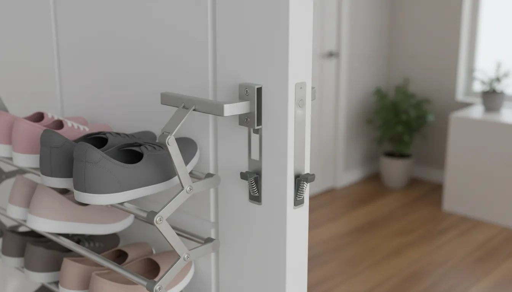
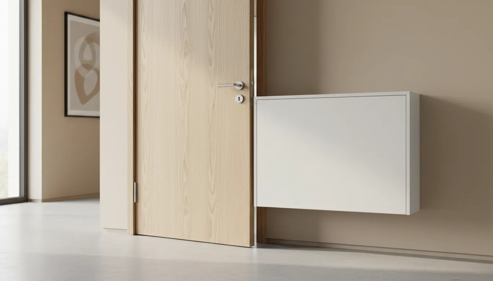
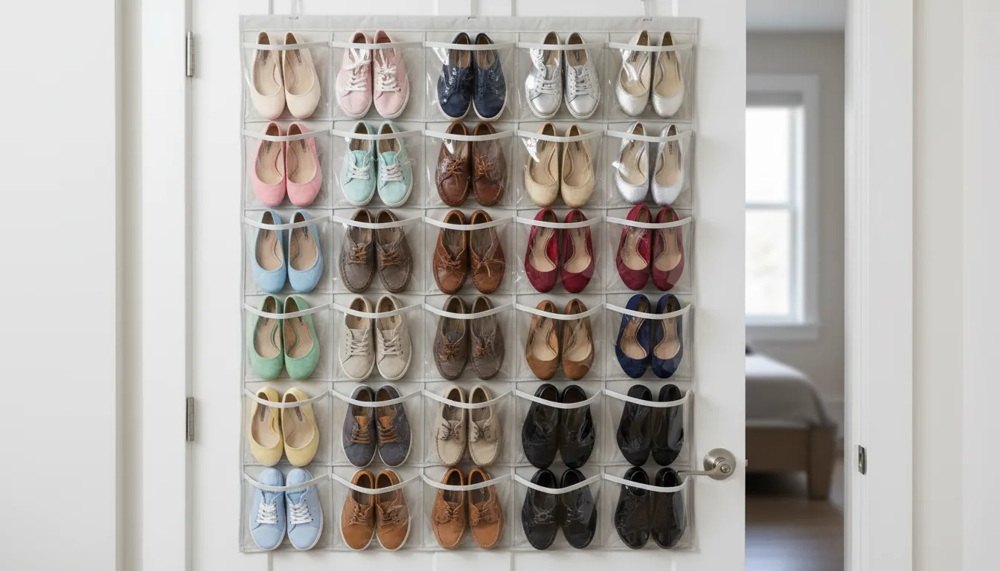

# Behind-the-Door Shoe Storage Hacks: Hidden Solutions for Small Spaces

In the architecture of modern living, particularly within urban apartments and compact homes, floor space is the ultimate luxury. As square footage shrinks, the accumulation of daily necessities—specifically footwear—often results in a chaotic entryway. The "shoe mountain" by the front door is not merely an aesthetic nuisance; it is a functional barrier that disrupts the flow of the home. 

However, there is a distinct area of "dead space" that exists in almost every room, often overlooked by even the most diligent organizers: the vertical plane behind the door. When opened, a door creates a triangular pocket of space against the wall that is rarely utilized. By capitalizing on this area with behind-the-door shoe storage hacks, homeowners can reclaim their floors, protect their footwear, and maintain a visually serene environment.

This comprehensive guide explores the mechanics, aesthetics, and practical applications of behind-the-door storage. We will move beyond basic plastic pockets to discuss structural solutions, weight distribution, and sophisticated DIY integrations that turn a hidden corner into a storage powerhouse.

## The Physics of Vertical Storage: Why Behind the Door Works

Before purchasing hardware, it is essential to understand the spatial dynamics of your room. The space behind a door is technically referred to as the "door swing radius." While you cannot place furniture there without obstructing the door's movement, the door itself serves as a mobile wall.

Utilizing this space requires a shift in perspective from cubic footage (floor area) to linear verticality. A standard interior door offers approximately 14 to 16 square feet of vertical storage space. When you multiply this by the number of doors in a home—bedroom, closet, bathroom, pantry—the potential for storage expansion is massive.

However, leveraging this space requires attention to two critical factors: the "gap" and the "hinge."

1.  **The Header Gap:** Most over-the-door hooks require a gap of at least 2mm (about the thickness of a coin) between the top of the door and the doorframe header. Without this clearance, the door will not close properly, leading to frame damage.
2.  **Hinge Strength:** Not all doors are created equal. Solid wood doors can support significant weight, while hollow-core doors (common in newer builds) have limits. Overloading a hollow-core door can strip the screws from the hinges.

## Over-the-Door Organizers: Choosing the Right Material

The market is saturated with hanging organizers, but for a sophisticated home, material selection matters. The cheap, clear plastic pockets often associated with college dorms can look tacky and degrade quickly. For a seamless look that mimics high-end interior design, consider fabric, mesh, or rigid metal structures.

### The Fabric and Mesh Approach

Fabric organizers offer a softer aesthetic that blends well with bedroom or nursery decor. High-quality canvas or heavy-duty polyester breathes, which is vital for shoe health. Leather or suede shoes require air circulation to prevent mold and odor buildup.

Mesh pockets are particularly effective because they allow you to identify the shoes instantly while maintaining airflow. When selecting a fabric organizer, look for reinforced stitching and grommets. The weight of twenty pairs of shoes is substantial; weak stitching will unravel within months.

If you are looking for a versatile starter option that balances durability with breathability, consider looking for heavy-duty pocket organizers.

[Shop Heavy-Duty Over-the-Door Organizers on Amazon](https://www.amazon.com/s?k=heavy-duty-over-the-door-shoe-organizer&tag=hats0f8-20)

### Rigid Wire and Metal Racks

For a more structured look, metal wire racks are superior. Unlike fabric pockets, which can sag and bulge, metal racks hold the shoe at a fixed angle. This is particularly beneficial for preserving the shape of structured footwear like leather loafers or high heels.

Metal racks often feature adjustable tiers, allowing you to customize the distance between shelves to accommodate ankle boots or high-top sneakers. When installing metal racks, ensure they come with tension mechanisms or lower adhesives. A common complaint with metal racks is the "clatter" factor—the noise made when the rack hits the door as it opens or closes. Securing the bottom of the rack is non-negotiable for a quiet home.

## Advanced DIY Solutions: Customizing the Dead Space

While pre-fabricated organizers are convenient, they may not fit every aesthetic or specific shoe collection. For those willing to wield a drill or a level, custom DIY solutions offer a built-in look that elevates the storage from "temporary fix" to "architectural feature."

### The Tension Rod Technique for High Heels

If you possess a collection of heels, tension rods are a brilliant, non-invasive solution, particularly for closet doors or narrow alcoves behind a door. By installing multiple tension rods horizontally across a recessed door frame or a narrow nook behind the door, you create a rail system.

 The heel of the shoe hooks over the back rod (or against the wall), while the sole rests on the front rod. This display method is commonly used in boutiques because it showcases the shoe profile. It requires no screws, making it renter-friendly.

To implement this, you need industrial-strength rods that will not slip under weight.

[Shop Heavy-Duty Tension Rods on Amazon](https://www.amazon.com/s?k=heavy-duty-tension-rods&tag=hats0f8-20)

### Towel Bars and S-Hooks

Repurposing bathroom hardware is a classic interior design hack. Mounting tiered towel bars on the back of a solid wood door creates a sleek, minimalist rail system.

*   **For Sneakers and Flats:** Slip the shoes between the bar and the door. The tension holds them in place.
*   **For Boots and Sandals:** Use S-hooks or curtain clips hanging from the towel bar to suspend boots by their shafts or sandals by their straps. This keeps boots off the floor, preventing the material from creasing at the ankle.

This method allows for finish-matching. If your door handles are matte black, install matte black towel bars for a cohesive, intentional look.

### The Floating Shelf Approach

For a truly hidden solution, consider mounting ultra-slim floating shelves or picture ledges to the wall *behind* the door, rather than on the door itself. This works if you have a doorstop that prevents the door from opening a full 90 degrees against the wall.

By installing shallow picture ledges (usually 3 to 4 inches deep) on the wall, you can perch heels and slim sneakers in the space that is usually preserved for the door handle clearance. This is an excellent way to use the wall without interfering with the door's operation, provided you measure the depth of the door handle accurately.

For more ideas on utilizing wall space effectively, read our guide on [Maximizing Entryway Functionality](/posts/maximizing-entryway-functionality).

## The Hidden Cabinet Strategy

Sometimes, the best way to store shoes is to hide them completely. In tight hallways, standard shoe cabinets are too deep. However, ultra-slim tipping shoe cabinets are designed specifically for this dilemma.

These cabinets are often only 6 to 7 inches deep. While they are usually mounted on walls, they can be installed on the wall directly behind an open door. Because they are so shallow, the door can open nearly all the way, only stopping a few inches short of the wall.

This turns the "dead triangle" behind the door into a secure, enclosed storage unit. The top of the cabinet can also serve as a landing strip for keys and mail, effectively creating a hidden foyer.

## Installation Best Practices: Protecting Your Home

Implementing behind-the-door storage requires precautions to ensure you do not damage your property.

### 1. The Weight Check
Always verify the integrity of your door. If you knock on the door and it sounds hollow, it is likely a hollow-core door constructed of a honeycomb cardboard interior framed by wood. These doors have a maximum weight load. If using an over-the-door rack on a hollow core door, restrict the contents to lightweight running shoes, flats, and sandals. Heavy work boots should remain on the floor.

### 2. Scratch Prevention
Metal brackets sitting on top of a painted door frame will eventually cause chipping and scuffing. To prevent this, apply thin felt pads or strips of moleskin to the underside of the brackets before hanging them. This creates a soft barrier between the metal and the wood.

### 3. Stabilization
The sound of shoes banging against a door is the hallmark of a cheap installation. If your organizer does not come with bottom clips, use double-sided foam tape or Command strips to secure the bottom of the organizer to the door. This ensures that when the door swings, the organizer moves as one cohesive unit with the door, rather than swinging like a pendulum.

## Aesthetic Integration: Making It Invisible

Functionality should not come at the cost of visual peace. A chaotic jumble of multi-colored sneakers hanging on a door can look messy, even if the floor is clear. To maintain a sophisticated look, apply the principles of visual camouflage.

### Color Blocking and Camouflage
Choose an organizer that matches the color of your door. If you have standard white doors, buy a white organizer. If you have natural wood doors, look for beige or brown fabrics, or use clear pockets. When the background of the organizer matches the door, the unit visually recedes, allowing the eye to gloss over the structure.

### The Curtain Concealment
If you are using an open wire rack or shelves behind a door that is frequently left open (like a bedroom door), the visual clutter might be distracting. A simple solution is to install a ceiling-mounted curtain track or a tension rod with a light curtain in front of the storage area (if space permits). However, a more direct approach is hanging a lightweight fabric cover over the rack itself.

For versatile hanging solutions that accommodate various door depths, adjustable hooks are essential.

[Shop Adjustable Over-the-Door Hooks on Amazon](https://www.amazon.com/s?k=adjustable-over-door-hooks&tag=hats0f8-20)

## Maintenance and Organization Logic

Hardware is only half the solution; habits are the other half. To keep your behind-the-door system functional, you must organize strategically.

### Frequency of Use
Store your most frequently worn shoes at waist height. This ergonomic placement means you do not have to bend down or reach high up for your daily runners. Reserve the top pockets for special occasion footwear or out-of-season items, and use the bottom pockets for heavy items or shoes you rarely wear.

### Seasonal Rotation
A behind-the-door organizer has finite space. Adopt a seasonal rotation strategy. In summer, winter boots should be cleaned and stored in under-bed bins or high closet shelves, while sandals take prime real estate on the door. This keeps the organizer from becoming overcrowded and protects heavy winter gear from stretching out lightweight pockets.

For further reading on maintaining a clutter-free home, explore our article on [Seasonal Storage Rotations](/posts/seasonal-storage-rotations).

## Addressing Non-Standard Doors

Not every home has standard hinged doors. Here is how to handle tricky architectural features.

### Bi-Fold Doors
Closets with bi-fold doors are notoriously difficult for storage because they fold in on themselves. Standard over-the-door hooks prevent the door from folding. The solution is using a specific bracket designed for bi-fold doors, which clamps onto the single solid panel, or utilizing the wall space *inside* the closet immediately to the left and right of the door frame (the "return" walls).

### Sliding Barn Doors
Barn doors sit flush against the wall, leaving zero clearance for behind-the-door storage. If you have barn doors, you cannot mount storage on the back of the door itself. Instead, you must look to the adjacent walls or utilize the interior of the casing if the barn door covers a deep closet.

## Conclusion

Reclaiming the space behind your door is one of the most effective ways to increase storage capacity in a small footprint. It transforms a passive structural element into an active organizational tool. Whether you opt for a high-end metal rack, a soft fabric organizer, or a custom DIY rail system, the key to success lies in proper installation and thoughtful curation.

By moving your footwear from the floor to the door, you not only protect your shoes from damage but also open up the flow of your home, creating an entryway that welcomes you rather than trips you. The best storage solutions are the ones that work so well you forget they are there—and the space behind the door is the perfect place to start.