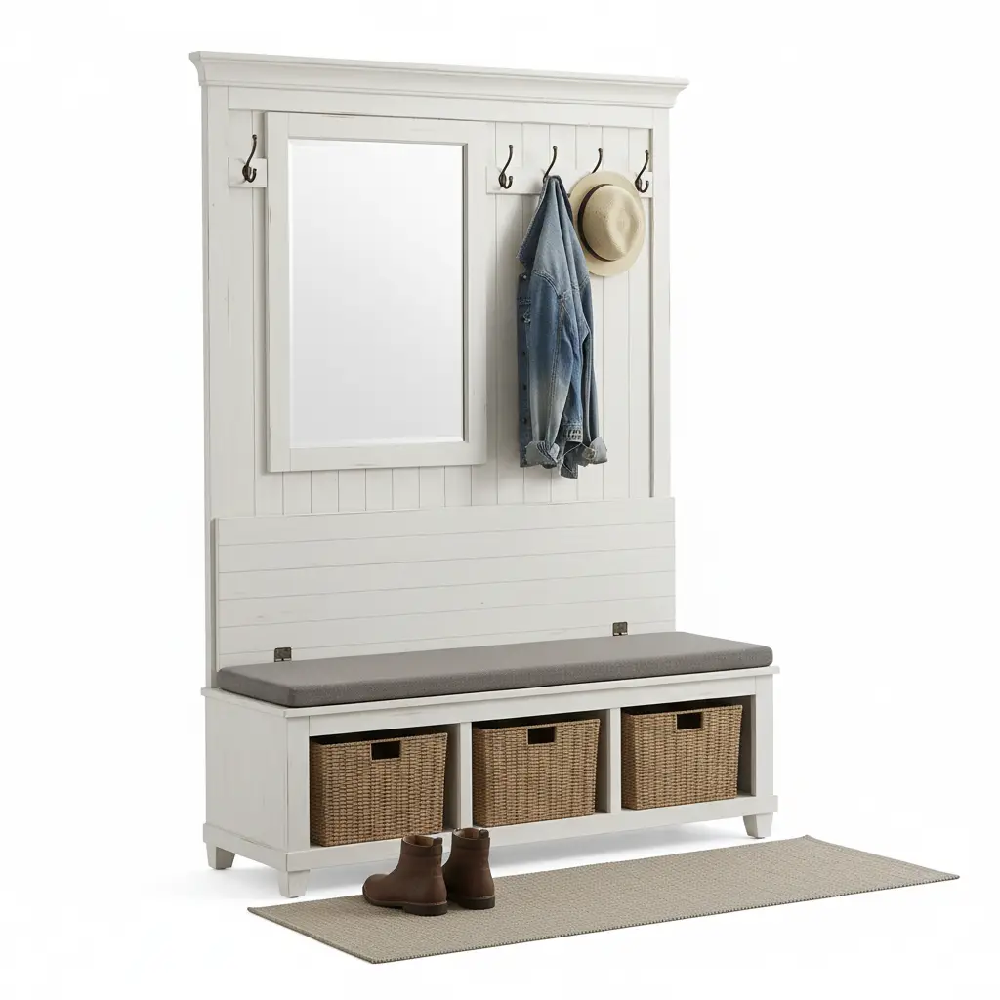
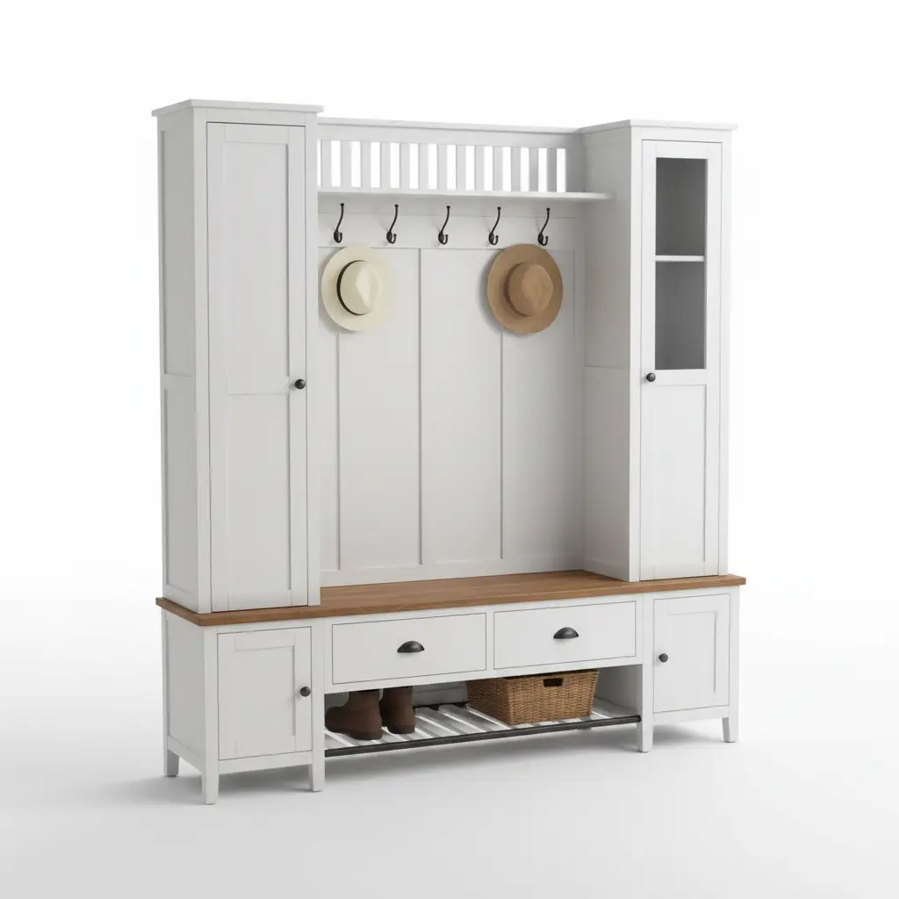

The entryway is the handshake of your home. It is the first space guests encounter and the last place you linger before heading out into the world. For decades, the standard hall tree—a vertical unit with a few hooks and a hard wooden bench—has served as the utilitarian workhorse of the American foyer. But as our homes evolve into multifunctional sanctuaries, the "utilitarian" look is giving way to something far more sophisticated. 

We are moving **beyond the bench**. 

Today’s homeowners are demanding more than just a place to drop their keys; they want comfort, aesthetic appeal, and ergonomic design. Whether you are dealing with a cramped hallway or a sprawling mudroom, the seating integrated into your storage units can make or break the functionality of the space. In this deep dive, we will explore the creative seating options that are transforming hall trees and mudroom lockers from simple organizers into high-end design features.

## The Evolution of Entryway Seating

Historically, the hall tree was a Victorian invention designed to hold hats, coats, and umbrellas. Seating was often an afterthought—a narrow, hard surface meant for a quick shoe change. However, the rise of the "mudroom" in modern architecture has shifted the focus toward daily transit. We spend more time in these zones than we realize: checking the mail, wrestling toddlers into snowsuits, or simply taking a breath after a long commute.

The evolution of seating in this space follows three primary trends:
1.  **Softness and Texture**: Moving away from cold wood to upholstered surfaces.
2.  **Modularity**: Seating that can move, expand, or hide away.
3.  **Ergonomics**: Designing for different ages, from low-profile benches for children to higher perches for those with mobility concerns.

## Why Creative Seating Matters for Your Mudroom

When we talk about "creative seating," we aren't just talking about a different color of paint. We are talking about the intersection of **form and function**. A well-chosen seating option can:

*   **Increase Dwell Time**: A comfortable seat encourages family members to actually sit down and remove their shoes, rather than tracking dirt through the house.
*   **Maximize Vertical Space**: By integrating seating with lockers, you utilize the "dead space" that often exists in hallways.
*   **Enhance Resale Value**: High-quality, built-in feeling furniture like a premium hall tree is a major selling point for modern homebuyers.

If you are looking for more traditional inspiration, you might enjoy our guide on [Small Entryway Storage Ideas](/posts/small-entryway-storage-ideas) to see how to fit these concepts into tight quarters.

---

## 1. Upholstered Transitions: Adding Comfort to Utility

The most significant shift in hall tree design is the move toward upholstery. A hard wooden bench is durable, but it isn't inviting. By adding a padded seat—either integrated or as a custom cushion—you soften the visual lines of the mudroom.

### Integrated Padded Benches
Some modern hall trees now come with built-in foam padding covered in heavy-duty, stain-resistant fabrics like Sunbrella or faux leather. This is ideal for households with pets or children where durability is as important as comfort.

### Custom Cushioning
If you have an existing hall tree, adding a custom-tailored bench cushion can completely change the vibe. Opt for high-density foam (at least 2 inches thick) and a fabric that complements your hallway’s color palette. Deep blues, charcoals, and earth tones are currently trending for 2026.

## 2. The Integrated Ottoman: Modularity at Its Best

For those who find a fixed bench too restrictive, the **integrated ottoman** is a game-changer. This design features a hall tree with a hollow lower section where a matching ottoman or stool can be tucked away when not in use.

**Benefits include:**
*   **Versatility**: Pull the ottoman out to use as extra seating in the living room when guests arrive.
*   **Accessibility**: It allows you to sit closer to the ground, which is often easier for putting on boots or tying laces.
*   **Visual Lightness**: Removing the solid base of a hall tree makes a small entryway feel larger.

## 3. Split-Level Seating for Multi-Generational Homes

In a home with both small children and seniors, a single-height bench rarely fits everyone’s needs. Creative mudroom lockers are now incorporating **split-level seating**. 

Imagine a set of lockers where one section features a lower bench (around 12-14 inches high) for kids, while the adjacent section offers a standard chair-height seat (18-20 inches). This ergonomic approach ensures that everyone in the family has a dedicated, comfortable spot to prepare for the day.

---

## Top 3 Creative Seating Hall Trees for 2026

To help you navigate the vast market of entryway furniture, we have selected three standout products that exemplify creative seating and robust storage.

### 1. Bush Furniture Salinas Hall Tree with Storage Bench

The **Bush Furniture Salinas Hall Tree** is a masterclass in "Mission-style" elegance meets modern utility. While it features a traditional wooden bench, its design allows for the easy addition of a custom cushion, and its tapered legs give it a sophisticated silhouette that works in both coastal and farmhouse interiors.

*   **Key Features**: 4 double prong hooks, spacious cubby shelves, and a sturdy 250lb weight capacity bench.
*   **Pros**:
    *   Timeless aesthetic that fits most decors.
    *   High-quality hardware that doesn't feel flimsy.
    *   Available in multiple finishes like Antique White and Cape Cod Gray.
*   **Cons**:
    *   Assembly can be time-consuming (expect 2+ hours).
    *   The bench surface is hard wood, so you may want to purchase a separate cushion for long-term comfort.

[Check Price on Amazon: Bush Furniture Salinas Hall Tree](https://www.amazon.com/s?k=Bush+Furniture+Salinas+Hall+Tree+with+Storage+Bench&tag=hats0f8-20)

---

### 2. VASAGLE Industrial Hall Tree with Padded Seat

If you are looking for immediate comfort without the need for DIY additions, the **VASAGLE Industrial Hall Tree** is an exceptional choice. It breaks the mold by including a high-density foam padded seat covered in sleek synthetic leather. This is the epitome of "Beyond the Bench."

*   **Key Features**: 9 removable hooks, 2 mesh shoe shelves, and a heavy-duty steel frame.
*   **Pros**:
    *   The padded seat is incredibly comfortable for daily use.
    *   Industrial design is perfect for modern lofts or contemporary homes.
    *   Very stable thanks to the adjustable feet.
*   **Cons**:
    *   The industrial look may be too "raw" for traditional homes.
    *   Faux leather can get warm in high-temperature climates.

[Check Price on Amazon: VASAGLE Padded Hall Tree](https://www.amazon.com/s?k=VASAGLE+Industrial+Hall+Tree+with+Padded+Seat&tag=hats0f8-20)

---

### 3. Crosley Furniture Brennan Entryway Hall Tree

The **Crosley Furniture Brennan** offers a more "built-in" locker feel. What makes its seating creative is the deep-set bench area that provides a sense of enclosure and privacy. It feels less like a piece of furniture and more like a dedicated "nook" in your home.

*   **Key Features**: Two large overhead cubbies, integrated shoe storage, and a wide seating area.
*   **Pros**:
    *   Provides a very organized, "locker" aesthetic.
    *   Solid construction with a high-quality finish.
    *   The deep bench allows for significant decorative pillow arrangements.
*   **Cons**:
    *   Has a larger footprint; not ideal for very narrow hallways.
    *   The price point is higher than entry-level models.

[Check Price on Amazon: Crosley Furniture Brennan Hall Tree](https://www.amazon.com/s?k=Crosley+Furniture+Brennan+Entryway+Hall+Tree&tag=hats0f8-20)

---

## The Ultimate Buying Guide: Choosing Your Creative Seating

When moving beyond the standard bench, there are several technical and aesthetic factors you must consider to ensure your hall tree serves you well for years to come.

### 1. Measurements and Clearances
Before you fall in love with a design, measure your space twice. 
*   **Depth**: A standard bench is 15-18 inches deep. If you choose an upholstered option, ensure the padding doesn't push the depth beyond what your hallway can accommodate.
*   **Height**: If you are installing lockers with a top shelf, ensure you have at least 12 inches of clearance from the ceiling to avoid a "cramped" look.
*   **Swing Space**: If your hall tree is near a door, ensure the seating area doesn't interfere with the door’s swing radius.

### 2. Weight Capacity
Not all hall trees are created equal. If you plan on having two adults sit on the bench simultaneously, look for a unit with a weight capacity of at least **300 lbs**. Many budget-friendly models max out at 200 lbs, which can lead to structural failure over time.

### 3. Material Selection
*   **Solid Wood**: The gold standard for longevity. It can be sanded and refinished if it gets scratched by belt buckles or keys.
*   **MDF/Engineered Wood**: More affordable and resistant to warping, but cannot be easily repaired if the laminate peels.
*   **Metal**: Best for the "Industrial" look. It’s incredibly durable and easy to clean, making it perfect for high-traffic mudrooms.

### 4. Fabric and Maintenance
If you opt for a padded seat, the fabric choice is critical. Entryways are high-moisture zones (think wet raincoats and snowy boots).
*   **Performance Fabrics**: Look for "Olefins" or "Solution-dyed Acrylics" which resist mold and fading.
*   **Leather/Vegan Leather**: Easy to wipe down, but can be susceptible to scratches from sharp objects.
*   **Removable Covers**: Ideally, any cushion should have a zippered cover that is machine washable.

For more tips on maintaining your entryway furniture, check out our post on [Organizing Your Mudroom for Every Season](/posts/organizing-your-mudroom-for-every-season).

## DIY Upgrades: How to "Creativize" a Standard Bench

If you already own a hall tree and aren't ready to replace it, you can still move "beyond the bench" with these simple upgrades:

1.  **The Sheepskin Layer**: Tossing a high-quality faux sheepskin rug over a wooden bench adds instant luxury and warmth.
2.  **Bolster Pillows**: Instead of standard throw pillows, use bolster pillows at the ends of the bench. They provide lumbar support and make the unit look more like a custom daybed.
3.  **Woven Textures**: Place a low-profile woven basket underneath the bench. This creates a visual "anchor" and provides a place for guest slippers.
4.  **Lighting**: Install battery-operated LED puck lights underneath the top shelf of the hall tree. This illuminates the seating area, making it safer and more inviting at night.

## The Psychology of the Entryway

Why do we care so much about a bench? Environmental psychology suggests that "transitional spaces" like entryways act as mental filters. When you enter a home that has a dedicated, comfortable place to sit and decompress, your cortisol levels actually begin to drop. 

A cluttered, uncomfortable entryway creates "transition stress." By investing in creative seating—something that feels intentional and cozy—you are signaling to your brain (and your guests) that the chaos of the outside world stays at the door.

## Conclusion: Elevating Your First Impression

The hall tree is no longer just a place to hang a coat; it is a vital component of a well-designed home. By looking **beyond the bench** and exploring creative seating options like integrated upholstery, modular ottomans, and ergonomic split-levels, you turn a utility zone into a destination.

Whether you choose the classic lines of the **Bush Furniture Salinas**, the modern comfort of the **VASAGLE Padded Tree**, or the architectural presence of the **Crosley Brennan**, remember that the best seating is the one that fits your family's unique rhythm. 

Don't settle for a hard plank of wood. Give yourself a place to land at the end of the day that is as stylish as it is supportive. Your home—and your feet—will thank you.

---

### Summary of Recommended Products

| Product Name | Style | Key Feature | Best For |
| :--- | :--- | :--- | :--- |
| **Bush Furniture Salinas** | Traditional/Farmhouse | Tapered Legs & Large Cubbies | Timeless Appeal |
| **VASAGLE Industrial** | Modern/Industrial | Built-in Padded Seat | Maximum Comfort |
| **Crosley Brennan** | Transitional/Locker | Deep-set Nook Design | Large Mudrooms |

For more inspiration on how to maximize your home's storage, explore our [Full Entryway Collection](/posts/).