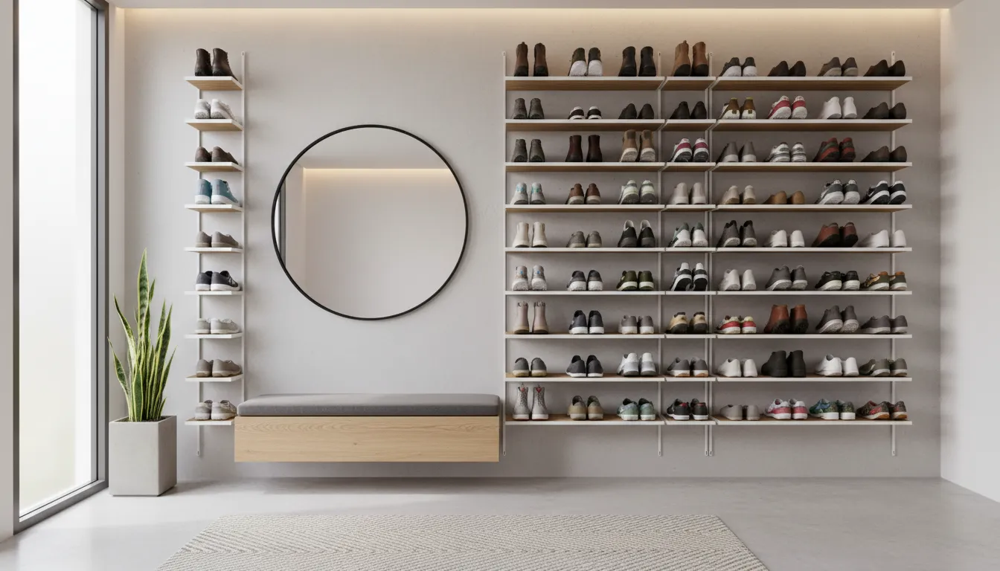
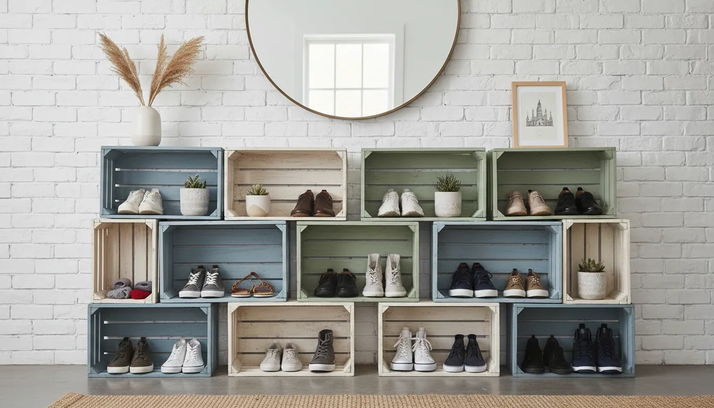
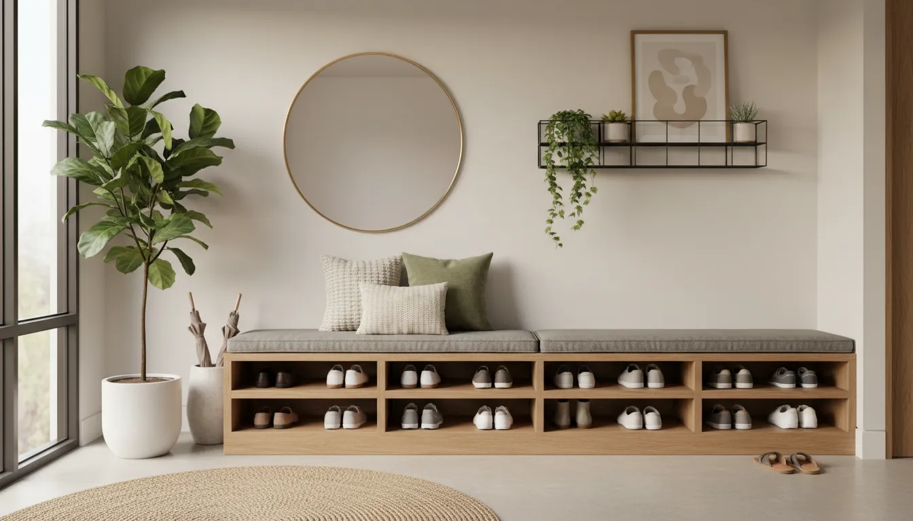

# Budget-Friendly Shoe Storage Solutions Under $50 for the Entryway

The entryway is the handshake of the home. It is the first space that greets you after a long day and the impression your guests receive upon arrival. However, in many households, this critical transition zone becomes a chaotic dumping ground for footwear. Sneakers kick about near the door, boots slouch in corners, and dress shoes accumulate dust in piles. The visual clutter creates immediate mental stress, contradicting the sense of sanctuary a home should provide.

Contrary to popular belief, achieving a curated, magazine-worthy mudroom or foyer does not require custom carpentry or expensive designer furniture. With a strategic approach and a modest budget of $50, you can implement highly effective, aesthetically pleasing storage systems. This guide explores the most efficient, economical ways to tame the shoe chaos, focusing on solutions that blend functionality with sophisticated design principles.

## The Psychology of a Clutter-Free Entryway

Before diving into specific products and methodologies, it is essential to understand why this organization matters. The concept of "visual noise" refers to the unpleasant sensory input created by disorganization. When you enter a home and immediately step over a pile of shoes, your brain registers a task that needs to be completed, spiking cortisol levels.

By establishing a dedicated place for every pair of shoes, you are not merely cleaning; you are establishing a boundary between the outside world and your domestic retreat. A streamlined entryway sets the tone for the rest of the house. It signals that the home is managed, ordered, and peaceful. Fortunately, the market offers a plethora of organizational tools that cater to this need without demanding a significant financial investment.

## Assessing Your Space and Inventory

The first step in any successful organization project is assessment. Purchasing storage solutions without measuring your space or counting your inventory is a recipe for frustration.

### The "Landing Strip" Concept
Evaluate the physical dimensions of your entryway. Do you have a sprawling foyer, a narrow hallway, or perhaps no defined entryway at all—just a door that opens into a living room? 
*   **Narrow Hallways:** require vertical solutions with shallow depth to preserve the walkway.
*   **Open Foyers:** allow for wider furniture pieces like benches or tiered racks.
*   **Non-existent Entryways:** require multifunctional furniture that blends with the living area.

### Inventory Audit
Count the number of shoes that genuinely need to live by the door. It is rarely necessary to keep every pair you own in the entryway. A good rule of thumb is to keep only the pairs used daily or weekly: running shoes, work shoes, and seasonal boots. Occasional footwear, such as formal heels or specialty hiking gear, should be relegated to [closet organization systems](/posts/optimizing-bedroom-closet-storage).

Once you have a count—say, eight to ten pairs—you can select a solution that fits exactly what you need, preventing the storage unit itself from becoming a clutter magnet.

## Vertical Storage: Maximizing Wall Real Estate

When floor space is at a premium, the only way to go is up. Vertical storage is the most efficient way to handle shoe volume in tight quarters. Utilizing the walls draws the eye upward, creating an illusion of height, while keeping the floor clear for easy cleaning.

### Wall-Mounted Racks and Rails
For a sleek, industrial, or minimalist look, wall-mounted racks are unbeatable. You can find simple metal rails or tension rods for under $50 that allow heels to hook over a bar or sneakers to rest on tension supports. 

Consider mounting two or three towel bars on the back of a coat closet door or directly on an entryway wall. This allows you to tuck the toes of shoes behind the bar, holding them flush against the wall. This "floating" shoe effect is modern and keeps the floor entirely visible, which makes a small room feel larger.

### The Evolution of Over-the-Door Organizers
Historically, over-the-door organizers were unsightly plastic pockets that yellowed over time. Today, the market has evolved. You can find fabric organizers in structured linen or heavy-duty canvas with reinforced grommets. These look far more sophisticated and can hide behind the entry closet door or be displayed openly if the fabric complements your decor.

For a solution that fits within our budget, look for organizers with rigid inserts in the shelves. These prevent the "sagging" look common with cheaper models and provide a sturdy platform for heavier footwear like loafers or ankle boots.

## Ground-Level Organizers: Racks and Benches

If you have the floor space, a ground-level rack is the most accessible solution for family members of all ages. The key to keeping this under $50 while maintaining a high-end look is material selection.

### The Bamboo Advantage
Bamboo is an exceptional material for shoe racks. It is naturally moisture-resistant—vital for wet or muddy shoes—and sustainable. Furthermore, bamboo often comes in a warm, neutral wood tone that mimics much more expensive hardwoods like oak or teak. 

A simple three-tier bamboo rack offers high durability and visual warmth. Unlike flimsy plastic racks that can wobble, bamboo provides structural integrity. Many models are stackable, meaning you can start with one unit under $50 and add a second later if your needs grow.

**Recommended Product:**
For a reliable, aesthetic option that fits the budget, consider a multi-tier bamboo organizer.
[Check prices on Amazon for Bamboo Shoe Racks](https://www.amazon.com/s?k=bamboo+shoe+rack+3+tier&tag=hats0f8-20)

### Metal Expandable Racks
For a more utilitarian or modern industrial aesthetic, expandable metal racks are ideal. The primary benefit here is versatility; the rack can extend from 24 inches to 45 inches, depending on your available space. This customization ensures the rack looks built-in rather than like an afterthought. 

Look for matte black or brushed nickel finishes. These finishes tend to look more expensive than chrome, which can sometimes appear dated or cheap. A matte black metal rack sits quietly in a room, receding visually rather than demanding attention.

## Hidden Storage Hacks

Sometimes, the best way to organize shoes is to hide them completely. If you prefer a visual landscape free of footwear, enclosed storage is the priority. While large armoires are expensive, smaller hidden solutions fit well within a $50 budget.

### The Storage Ottoman
A small storage ottoman serves a dual purpose: it acts as a place to sit while putting on shoes and a hidden repository for the shoes themselves. While you won't find a large leather bench for under $50, you can find collapsible fabric ottomans or small cubes with reinforced lids.

This is particularly effective for "visual clutter" items like brightly colored running sneakers or flip-flops that might clash with your entryway decor. By placing two small square ottomans side-by-side, you create a bench effect while doubling your hidden storage capacity.

**Recommended Product:**
A collapsible linen-look storage ottoman can hide 4-6 pairs of shoes while providing seating.
[Check prices on Amazon for Storage Ottomans](https://www.amazon.com/s?k=storage+ottoman+bench+entryway&tag=hats0f8-20)

### Baskets and Bins
Woven baskets are the secret weapon of interior designers. A large seagrass or wicker basket placed under a console table can hold multiple pairs of shoes. This is often referred to as the "drop zone" method. It is realistic for families with children who are unlikely to line up their shoes neatly on a rack.

To keep this looking intentional rather than messy, choose a basket with a structured rim and sturdy handles. Natural textures like hyacinth or rattan add warmth to the space. If you have a floating shelf or a bench, placing identical wire or fabric bins underneath creates a sense of rhythm and order.

## DIY and Repurposed Solutions

If you possess a modicum of creativity and a few basic tools, you can create custom shoe storage that looks significantly more expensive than the materials cost. DIY solutions allow you to tailor dimensions to the exact inch, maximizing every sliver of space.

### The Crate Shelf System
Wooden crates, available at most craft stores for $10 to $15 each, can be stained or painted to match your interior design. By stacking two or three crates on their sides and securing them with wood glue or brackets, you create a rustic, modular shelving unit.

The beauty of this system is its flexibility. You can arrange them vertically for a tower effect in a narrow corner or horizontally for a low-profile console. Sanding the wood and applying a dark walnut stain can transform cheap pine into a piece that resembles vintage farmhouse furniture.

### PVC Pipe Shoe Rack
For a modern, geometric look, large-diameter PVC pipes can be cut into equal lengths (matching the length of your shoes) and glued together in a honeycomb pattern. Once assembled, spray paint the entire structure in a high-gloss white, gold, or navy blue. 

This creates a sculptural element in the entryway. It is incredibly cheap, durable, and waterproof. This solution works particularly well for sneakers and flats, though it may not accommodate tall boots.

## Maximizing Small Entryways and Apartments

In apartments or homes where the front door opens directly into a living space, the footprint of your storage solution is critical. Here, we look for "slim profile" furniture.

### The Tip-Out Drawer Solution
While large wooden tip-out cabinets are expensive, there are budget-friendly versions made of lightweight materials or heavy-duty plastic that mimic the mechanism. These cabinets are often only 6 to 9 inches deep, significantly slimmer than a standard 12-15 inch shoe rack. 

The shoes are stored vertically in a tilting drawer. This utilizes the height of the shoe rather than the length, saving precious floor space. While finding a high-quality furniture piece under $50 in this category is challenging, you can often find modular plastic units or fabric-based vertical towers that achieve the same spatial economy.

**Recommended Product:**
Look for a narrow, vertical shoe tower or a fabric-based shelf system that mimics a cabinet.
[Check prices on Amazon for Narrow Shoe Storage Towers](https://www.amazon.com/s?k=narrow+vertical+shoe+rack&tag=hats0f8-20)

### Utilizing Corners
Corners are often "dead space" in design. A corner shelving unit, often used for shower organization or books, can be repurposed for shoes. Triangular corner racks fit snugly where walls meet, keeping the main walkway completely clear. This is an excellent way to utilize space that would otherwise remain empty.

## Styling Your Storage: Making Cheap Look Expensive

The difference between a "cheap shoe rack" and a "stylish entryway vignette" often lies in the styling rather than the furniture itself. Even a $20 metal rack can look chic if integrated correctly into the space.

### The Rule of Three
When arranging items on top of a shoe rack or console, use the rule of three. Group items of varying heights: perhaps a tall vase with greenery, a medium-sized framed photo, and a small catch-all dish for keys. This draws the eye away from the shoes below and focuses it on the decor above.

### Lighting and Greenery
Poor lighting makes clutter look worse. Ensure your entryway is well-lit. If you are using a dark corner for storage, add a small battery-operated puck light or a nearby floor lamp.

Incorporating a plant (real or high-quality faux) near your shoe storage adds life and softness. The organic shape of leaves contrasts with the rigid lines of shoe racks and the manufactured nature of footwear, creating a balanced visual composition.

### Color Coordination
While you cannot control the color of your shoes, you can control the storage. Match the color of your storage unit to your wall color for a built-in look, or choose a contrasting color for a statement piece. If you use bins or baskets, ensure they match exactly. Uniformity creates calm.

## Seasonal Rotation and Maintenance

The most beautiful storage system will fail if it is overloaded. To maintain a functional entryway under a budget, you must adopt a maintenance routine. The $50 solution works best when it isn't asked to do the job of a $500 closet system.

### The "One In, One Out" Policy
If you buy a new pair of sneakers that lives in the entryway, an old pair must be moved to the bedroom closet, donated, or discarded. This prevents the "creeping clutter" that eventually overwhelms small racks.

### Seasonal Swaps
Treat your entryway storage as dynamic, not static. When spring arrives, heavy winter boots should be cleaned and moved to long-term storage (under the bed or in the attic). Replace them with sandals and canvas sneakers. This rotation keeps the volume of shoes manageable and ensures that only relevant footwear occupies the prime real estate of the entryway. 

For tips on handling off-season items, you might explore [garage storage strategies](/posts/garage-storage-strategies-for-seasonal-gear) to keep your main living areas clear.

### Cleaning the Hardware
Shoe racks accumulate dirt, mud, and grit rapidly. Once a month, wipe down the shelves. If you use a fabric organizer or ottoman, vacuum the interior. Keeping the storage unit clean prevents it from looking dingy and extends the life of the product.

## Conclusion

Creating an organized, welcoming entryway does not require a renovation contractor or a luxury budget. It requires a thoughtful assessment of your space, a realistic audit of your shoe inventory, and the strategic selection of affordable products.

Whether you choose the warmth of a bamboo rack, the industrial efficiency of a wall-mounted rail, or the hidden utility of a storage ottoman, the goal remains the same: to reduce visual noise and smooth the transition into your home. With less than $50, you can transform a cluttered drop zone into a functional, serene space that sets a positive tone for your entire living environment. The key is not just in the buying, but in the styling and maintaining of the space you create.