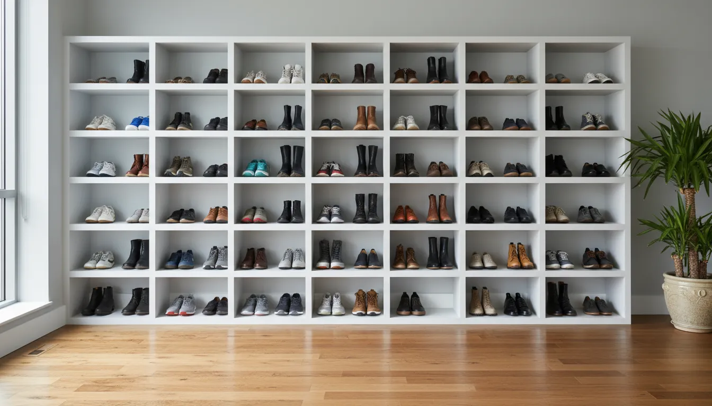
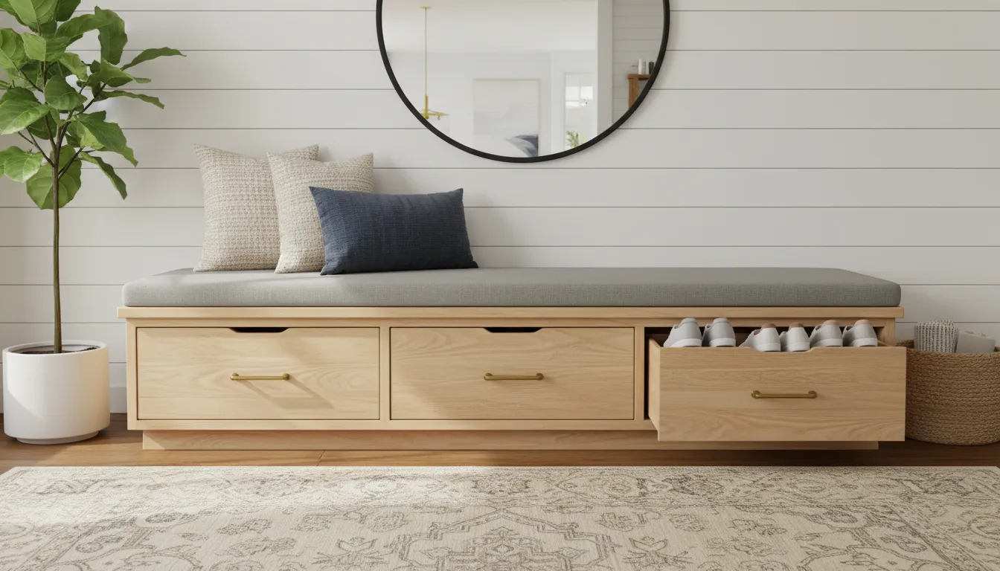
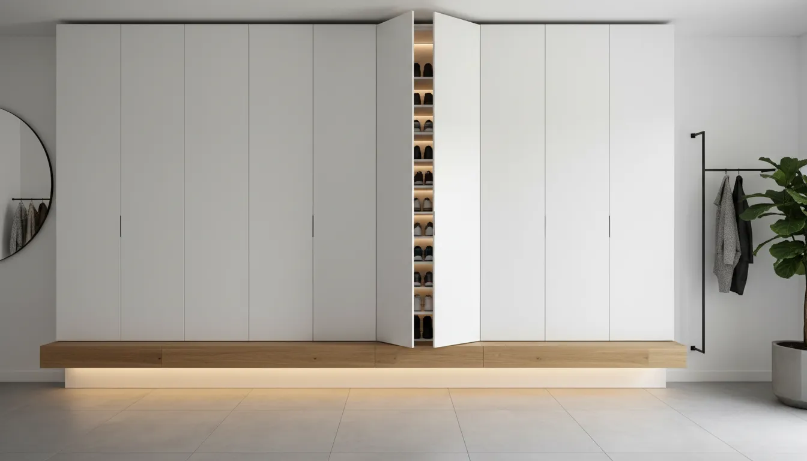

# Built-In Shoe Storage Solutions: Customizing Your Entryway Closet

The entryway is the handshake of the home. It is the first space guests encounter and the final checkpoint before you step out into the world. Yet, for many homeowners, this critical transition zone becomes a bottleneck of clutter, primarily driven by footwear. Piles of sneakers, discarded boots, and scattered heels can instantly degrade the aesthetic appeal of a home while adding unnecessary friction to your daily routine.

The solution lies not in purchasing temporary racks or plastic bins, but in architectural intentionality. Built-in shoe storage transforms the entryway closet from a dark, chaotic catch-all into a sophisticated, highly functional asset. Custom millwork and integrated shelving systems allow you to reclaim floor space, protect your footwear investment, and increase the overall value of your property.

This comprehensive guide explores the strategic design, material selection, and organizational principles necessary to create a built-in shoe storage solution that is as beautiful as it is practical.

## The Case for Built-In Storage

Unlike freestanding furniture, built-in storage is designed to work in harmony with the existing architecture of your home. It utilizes every available inch of vertical and horizontal space, eliminating the "dead zones" often found above or beside standard racks. 

From a design perspective, built-ins offer visual continuity. When the storage system matches the trim, molding, and finish of the surrounding room, it ceases to look like storage and begins to look like high-end decor. Furthermore, a well-executed custom closet suggests a level of care and luxury that appeals strongly to future buyers, making it a sound financial investment in your real estate asset.

## Assessing Inventory and Spatial Constraints

Before drafting a blueprint or consulting a carpenter, one must conduct a thorough audit of both the space and the items intended for storage. A successful built-in design is predicated on accurate data regarding usage habits and volume.

### Analyzing Footwear Inventory

Begin by categorizing the household footwear. Shoe dimensions vary drastically, and a "one size fits all" shelf height often results in wasted space or crushed uppers. Consider the following categories:

*   **Flat Footwear:** Sandals, loafers, and slippers generally require 4 to 5 inches of vertical clearance.
*   **Athletic Shoes:** Sneakers and running shoes typically need 6 to 7 inches.
*   **High Heels:** Depending on the heel height, these may require 7 to 9 inches.
*   **Ankle Boots:** These usually necessitate 8 to 10 inches.
*   **Tall Boots:** Knee-high and riding boots can require up to 20 inches of vertical space and special support to maintain their shape.

Calculate the total number of pairs in each category. A common mistake is designing for the current inventory without accounting for future acquisitions. It is advisable to build in a 20% surplus capacity to accommodate new purchases or guest storage.

### Measuring the Closet Dimensions

Precision is paramount. Measure the width, height, and depth of the closet interior. Pay particular attention to the depth. Standard reach-in closets are often 24 inches deep, while shoes typically only require 12 to 14 inches. This discrepancy offers an opportunity to create dual layers of storage or to utilize the back of the closet doors for auxiliary solutions. 

Additionally, identify obstructions such as baseboards, electrical outlets, or access panels that might interfere with installation. If you are planning to install drawers, ensure there is adequate clearance for them to open fully without hitting the door frame.

## Core Design Configurations

There are three primary architectural approaches to built-in shoe storage: the cubby grid, the adjustable shelving system, and the pull-out drawer. Each offers distinct advantages depending on your aesthetic preference and functional requirements.

### The Cubby Grid System

The cubby system is perhaps the most recognizable form of built-in shoe storage. It consists of a grid of fixed square or rectangular compartments.

*   **Pros:** This system maximizes density. By giving each pair its own dedicated "home," it prevents piling and makes it easy to spot missing items. It is excellent for families with children, as it enforces a simple organizational logic.
*   **Cons:** Fixed cubbies lack flexibility. If you acquire taller boots, they simply will not fit. Furthermore, cubbies can be difficult to clean, as dust accumulates in the corners of each individual box.

### Adjustable Angled Shelves

Inspired by high-end boutiques, angled shelves display shoes with the toe pointing downward, held in place by a "heel catch" or lip at the front of the shelf.

*   **Pros:** This is the most visually striking option. It turns your footwear collection into a display feature. The angle allows for better visibility of the shoe style, particularly for heels and sneakers.
*   **Cons:** Angled shelves consume more vertical space per pair than flat shelves. They are less efficient for high-density storage needs.

### Pull-Out Shelves and Drawers

For deep closets, pull-out shelves (gliding on drawer slides) are the superior choice.

*   **Pros:** These utilize the full depth of a 24-inch closet. You can store two rows of shoes on a single shelf—one row in front and one in back—and simply slide the shelf out to access the rear pairs. This effectively doubles your storage capacity.
*   **Cons:** The hardware increases the cost and complexity of the build. Heavy-duty slides are required to support the weight of multiple pairs of shoes.

For those considering a hybrid approach involving adjustable components, high-quality hardware is essential for longevity.

[Check out Heavy Duty Adjustable Closet Hardware on Amazon](https://www.amazon.com/s?k=heavy+duty+closet+shelf+brackets&tag=hats0f8-20)

## Material Selection and Finishes

The durability of your built-in relies heavily on the materials chosen. Entryway closets are high-traffic zones exposed to moisture, mud, and grit.

### Melamine and Laminate

Melamine (particleboard coated with a resin-saturated paper) is the industry standard for custom closets. It is cost-effective, easy to clean, and available in a vast array of colors and woodgrain patterns. High-quality thermal-fused laminate is resistant to scratches and moisture, making it ideal for wet shoes.

### Plywood with Wood Veneer

For a more premium look and increased structural rigidity, furniture-grade plywood with a real wood veneer is the preferred choice. It can be stained to match the hardwood floors or existing millwork in your home. However, wood veneer requires sealing with a high-grade polyurethane to protect it from water damage caused by wet soles.

### Solid Wood

While solid wood offers unmatched beauty and strength, it is susceptible to warping with humidity fluctuations. If you choose solid wood, ensure the lumber is kiln-dried and properly acclimated to your home's environment before construction.

## Maximizing Vertical Real Estate

In many entryway closets, the space between the top shelf and the ceiling is wasted. When designing a custom built-in, carry the cabinetry all the way to the ceiling.

### The "Off-Season" Upper Zone

Use the highest shelves for out-of-season footwear. In the summer, this area houses winter boots and heavy hiking gear; in the winter, it stores sandals and canvas sneakers. Because these items are accessed infrequently, the height is not a functional hindrance. To maintain a clean visual, place these items in uniform bins or behind cabinet doors.

### The Floor-Level Strategy

The bottom section of the built-in should be reserved for the most frequently worn shoes and for "wet storage." Ideally, the bottom shelf should be elevated 4 to 6 inches off the floor. This "floating" design allows you to easily sweep or vacuum underneath the unit. Alternatively, install a durable, waterproof tray at the very bottom to catch melting snow or mud from boots, protecting the cabinetry woodwork.

## Integrating Lighting

Proper illumination elevates a closet from a storage locker to a dressing room. Dark closets lead to disorganized closets because items are difficult to see and sort.

### Vertical LED Strips

Routing a channel into the side panels (gables) of your built-in to house vertical LED strip lights provides even illumination across every shelf. Unlike a single overhead bulb, which casts shadows on lower shelves, vertical lighting ensures that the bottom sneakers are just as visible as the top heels.

### Motion Sensors

For an entryway closet, hands-free operation is a luxury that quickly becomes a necessity. Installing a door-activated switch or a motion sensor ensures the lights activate the moment you open the closet, facilitating a quick exit during busy mornings.

[Check out Motion Sensor Closet Lighting Solutions on Amazon](https://www.amazon.com/s?k=motion+sensor+closet+light&tag=hats0f8-20)

## Ventilation and Shoe Care

One aspect of shoe storage that is often overlooked is air circulation. Shoes absorb moisture from feet, and if stored immediately in an airtight environment, they can develop odors or mold.

### Breathable Cabinetry

If your design includes doors to hide the shoes, consider using louvered doors or incorporating decorative metal grilles into the door panels. This allows air to cycle through the cabinet, keeping footwear fresh.

### Active Deodorization

For built-ins without doors, airflow is naturally better. However, incorporating cedar lining into the back of the shelves can provide natural moisture absorption and a pleasant, deterrent scent against moths and insects.

## Advanced Customization: The Bench Integration

If space permits, integrating a bench into your built-in unit creates a transition station. This allows you to sit comfortably while putting on or taking off shoes, which is particularly helpful for children or the elderly.

The space beneath the bench is prime real estate for deep drawers or reinforced cubbies for heavy work boots. Above the bench, hooks can be installed for coats, creating a full "mudroom" effect within a closet footprint.

## Organization Strategies for the New System

Once the physical structure is installed, the way you arrange the shoes will dictate the long-term functionality of the space.

### Categorization by Frequency

Place the "daily drivers"—the shoes you wear to work or for school runs—at eye level or waist height. This ergonomic placement reduces the need to bend down or reach up, streamlining your departure. Special occasion shoes should be relegated to the higher or lower extremities of the unit.

### Color and Style Coding

For a visually calming effect, organize shoes within their categories by color. Grouping all black heels together, followed by nude, then colorful options, creates a boutique aesthetic that reduces visual noise. This makes the closet feel less cluttered, even if it is full.

### Handling Tall Boots

Tall boots present a specific challenge: they tend to flop over, creating a messy pile and creasing the leather. Use boot shapers or specialized hanging boot files to keep them upright. In a custom built-in, you can request a higher shelf specifically for these items, perhaps with a dowel rod system to hang them by their internal loops.

[Check out Tall Boot Shapers and Inserts on Amazon](https://www.amazon.com/s?k=tall+boot+shapers&tag=hats0f8-20)

## DIY Installation vs. Professional Millwork

Homeowners must decide between tackling this project as a DIY renovation or hiring a professional closet company or carpenter.

### The DIY Route

For the handy homeowner, building a shoe storage system is feasible using plywood or MDF. Modular systems available at hardware stores can also be "hacked" to look custom by adding trim and baseboards.

*   **Cost:** Significantly lower labor costs.
*   **Time:** High time investment for planning, cutting, and finishing.
*   **Risk:** Mistakes in measurement or structural support can lead to sagging shelves or wasted materials.

### Professional Installation

Hiring a specialist ensures that the materials are cut with precision machinery and that the finish is factory-grade.

*   **Cost:** Higher upfront investment.
*   **Time:** Fast installation (often one day) after the design phase.
*   **Quality:** Guarantees weight-bearing capacity and seamless integration with uneven walls or floors.

For those interested in optimizing other areas of the home, you might consider reading about [maximizing small pantry spaces](/posts/maximizing-small-pantry-spaces) or exploring [garage organization systems](/posts/garage-organization-systems) to apply similar principles of vertical storage and categorization.

## The Resale Value Proposition

Real estate experts consistently cite "ample storage" as a top priority for homebuyers. An entryway closet with a custom built-in shoe system signals to a buyer that the home is well-maintained and organized. Unlike a movable rack, which a seller takes with them, a built-in is a fixture that adds tangible value to the property. It transforms a standard closet into a luxury amenity.

## Maintenance of Your Built-In System

To keep your custom storage looking pristine, regular maintenance is required.

1.  **Seasonal Deep Clean:** Twice a year, remove all shoes. Vacuum the shelves to remove grit that can scratch the finish. Wipe down surfaces with a damp cloth and a mild cleaner suitable for the material.
2.  **Hardware Check:** If you have pull-out shelves or drawers, check the glides for smooth operation. Tighten any screws that may have loosened due to vibration and daily use.
3.  **Shoe Inspection:** Use the seasonal rotation as an opportunity to inspect your shoes. discard or donate pairs that are worn out or no longer fit. A built-in system only works if it is not overflowing with unused items.

## Conclusion

Customizing your entryway closet with built-in shoe storage is more than a home improvement project; it is a lifestyle upgrade. By moving away from temporary, cluttered solutions and embracing architectural organization, you reclaim the entrance of your home. 

Whether you opt for a sleek wall of white laminate cubbies, a rich wood veneer with antique brass hardware, or a hidden system of pull-out drawers, the principles remain the same: assess your inventory, maximize vertical space, and prioritize accessibility. The result is a welcoming, orderly environment that sets a tone of calm sophistication the moment you walk through the door. 

Investing in your entryway is investing in your daily peace of mind. With careful planning and a focus on quality materials, your shoe storage solution will serve your functional needs and aesthetic standards for years to come.