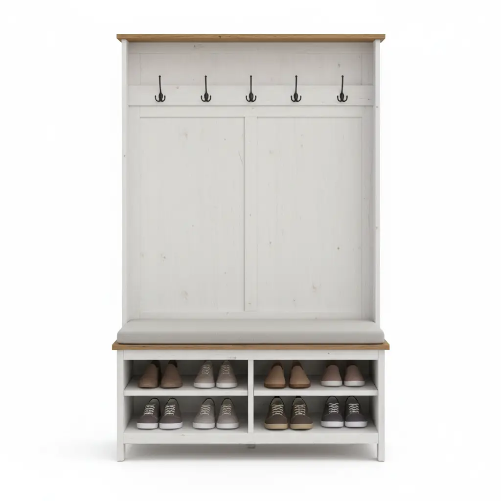
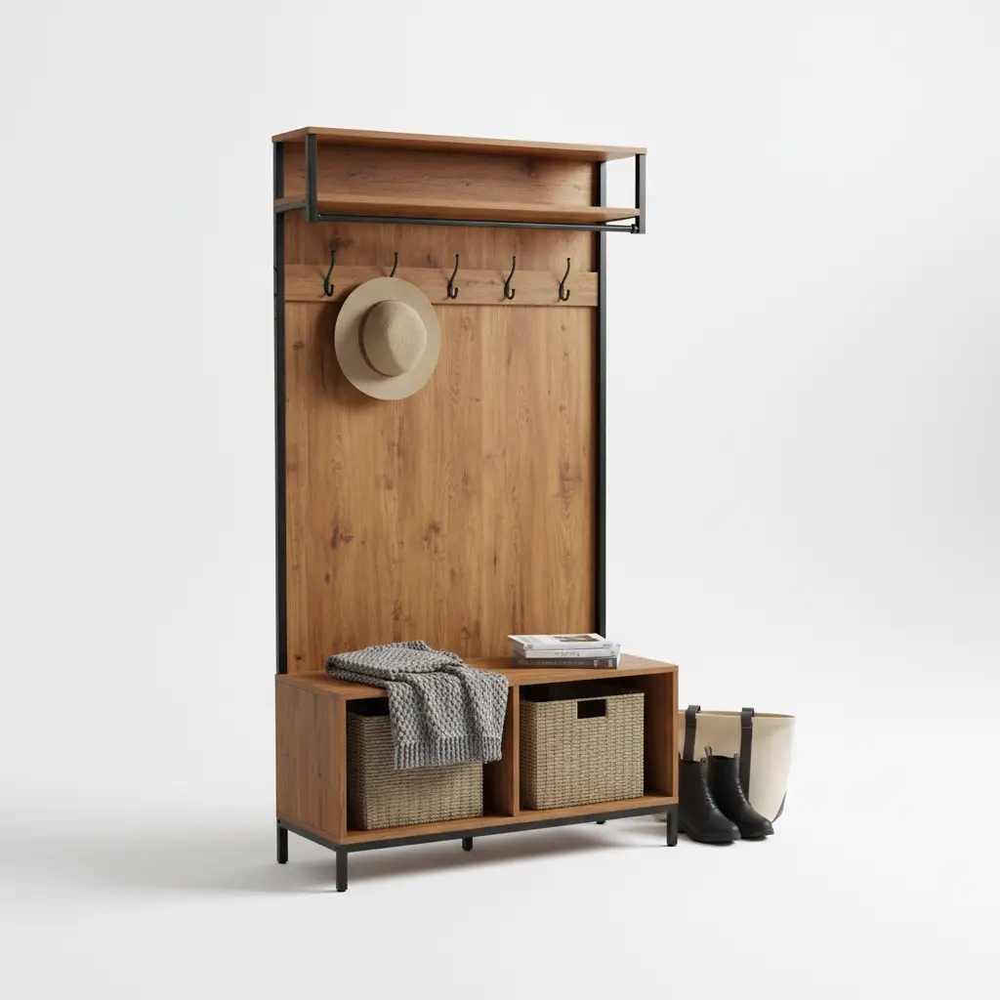

The entryway is the handshake of your home. It is the first thing guests see and the last thing you interact with before heading out into the world. Naturally, the furniture you choose for this high-traffic zone needs to be more than just "pretty"—it needs to be a workhorse. When shopping for the ultimate organizational centerpiece, the hall tree, you will inevitably face the "Material Dilemma": **Solid Wood vs. Particleboard.**

On one hand, you have the timeless, rugged appeal of solid timber, promising to last for generations. On the other, you have the sleek, modern, and undeniably affordable allure of engineered wood and particleboard. But which one is actually right for *your* lifestyle? 

In this deep-dive guide, we are going to peel back the veneers (literally) to examine the structural integrity, aesthetic longevity, and value-for-money of both options. Whether you are a minimalist on a budget or a homeowner looking for an heirloom piece, this comparison will provide the clarity you need to make an informed investment.

## The Anatomy of a Hall Tree: Why Material Matters

A hall tree isn't just a shelf. It is a bench, a coat rack, a mirror, and often a shoe storage unit all rolled into one. Because it supports the weight of sitting adults and heavy winter coats, the material's **tensile strength** and **fastener retention** are critical. 

If you choose a material that can't handle the daily "plop" of a backpack or the humidity of wet umbrellas, your beautiful entryway investment will quickly become a sagging eyesore. Let’s break down the contenders.

---

## Part 1: The Gold Standard—Solid Wood Hall Trees

When we talk about solid wood, we are referring to lumber harvested directly from trees like Oak, Pine, Mahogany, or Walnut. There are no glues or resins holding the core together; it is nature’s own engineering.

### The Advantages of Solid Wood
1.  **Unmatched Durability:** Solid wood is incredibly dense. It can withstand the rigors of a busy household—kicked boots, heavy bags, and the occasional accidental bump—without chipping or crumbling.
2.  **Refinishing Potential:** This is perhaps the biggest "pro." If a solid wood hall tree gets scratched, you can sand it down and restain it. If you change your home’s color palette in five years, you can paint it. It is a "forever" piece.
3.  **Structural Integrity:** Wood fibers are long and interlocking. This means screws and nails "bite" into the material and stay there. A solid wood hall tree won’t become "wobbly" over time as easily as its engineered counterparts.
4.  **Aesthetic Depth:** No two pieces of solid wood are the same. The grain patterns, knots, and natural color variations provide a warmth and character that printed laminates simply cannot replicate.

### The Trade-offs
*   **Price Point:** You are paying for the growth time of the tree and the craftsmanship required to mill it. Solid wood is a significant upfront investment.
*   **Environmental Sensitivity:** Wood is a living material. It breathes. In extremely humid or dry environments, solid wood can slightly expand or contract, which may lead to minor warping if not properly sealed.
*   **Weight:** These pieces are heavy. Once you put a solid wood hall tree in place, you likely won't want to move it again without help.

---

## Part 2: The Modern Contender—Particleboard and MDF

Particleboard (also known as chipboard) is made by compressing wood chips, sawmill shavings, and resin into a solid sheet. Medium-Density Fiberboard (MDF) is a step up, using finer wood fibers for a smoother finish. These are almost always finished with a **veneer** (a thin layer of real wood) or a **laminate** (a plastic-based "sticker" with a wood-grain print).

### The Advantages of Particleboard
1.  **Affordability:** This is the primary driver. You can often get a stylish, multi-functional hall tree for a third of the price of solid wood.
2.  **Uniformity:** Because it is manufactured, there are no knots or "weak spots." Every inch of the board is consistent in density.
3.  **Lightweight:** If you are a renter or someone who likes to rearrange furniture frequently, the lighter weight of particleboard is a blessing.
4.  **Style Versatility:** Laminates can mimic almost any texture—from reclaimed barn wood to high-gloss marble—allowing for very trendy designs at low costs.

### The Trade-offs
*   **Moisture is the Enemy:** This is the "Achilles' heel" of particleboard. If water gets under the laminate (common in entryways with wet boots), the wood chips will swell and the board will literally crumble. It cannot be repaired once this happens.
*   **Limited Lifespan:** Particleboard has a "memory." Once a screw is stripped out of the hole, it is very difficult to get it to hold again. These are generally considered 3-to-5-year pieces of furniture.
*   **Off-Gassing:** Some lower-end particleboards use urea-formaldehyde in their resins, which can release VOCs (Volatile Organic Compounds) into your home.

---

## Head-to-Head: The Comparison Matrix

| Feature | Solid Wood | Particleboard / MDF |
| :--- | :--- | :--- |
| **Lifespan** | 20+ Years (Heirloom) | 3-7 Years (Disposable) |
| **Repairability** | High (Sand, Stain, Fill) | Low (Basically Impossible) |
| **Moisture Resistance** | Moderate (If sealed) | Very Low (Swelling risk) |
| **Weight Capacity** | Very High | Moderate to Low |
| **Assembly** | Often comes pre-assembled | Usually Flat-pack (DIY) |
| **Price** | $$$ - $$$$ | $ - $$ |

For more on organizing these spaces, check out our guide on [Maximizing Style in Small Spaces](/posts/maximizing-style-in-small-spaces-corner-hall-tree-solutions).

---

## Top 3 Hall Tree Reviews: From Premium to Budget

To help you visualize these differences, we have selected three top-rated products that represent the best of each material category.

### 1. The Heirloom Choice: Crosley Furniture Brennan Entryway Hall Tree

The **Crosley Furniture Brennan** is a masterclass in combining traditional aesthetics with modern functionality. While it utilizes a mix of solid hardwoods and high-quality veneers to keep the price accessible, its structural components are built for longevity.

*   **Material:** Solid Hardwood and Veneers.
*   **Best For:** Families who want a permanent fixture in their "forever home."
*   **Pros:** 
    *   Beautiful classic design with crown molding.
    *   Substantial weight capacity for the bench.
    *   Includes two large storage cubbies at the top and a spacious bench area.
*   **Cons:** 
    *   Higher price point than flat-pack options.
    *   Requires significant assembly time due to its size.

**[Check Price on Amazon](https://www.amazon.com/s?k=Crosley+Furniture+Brennan+Entryway+Hall+Tree&tag=hats0f8-20)**

---

### 2. The Stylish Middle Ground: Bush Furniture Salinas Hall Tree with Shoe Storage

The **Bush Furniture Salinas** collection is the perfect example of high-quality engineered wood (MDF/Particleboard). It features a "Mission" style that looks like authentic painted wood but comes at a significantly lower price point.

*   **Material:** High-quality Engineered Wood with a laminate finish.
*   **Best For:** Those who want the "Farmhouse" or "Coastal" look without the solid wood price tag.
*   **Pros:** 
    *   Includes 9 shoe cubbies to keep the floor clear.
    *   The laminate is surprisingly scratch-resistant.
    *   Available in multiple finishes like Antique White and Cape Cod Gray.
*   **Cons:** 
    *   Edges can be sharp; be careful during assembly.
    *   Not designed for heavy-duty sitting (check weight limits).

**[Check Price on Amazon](https://www.amazon.com/s?k=Bush+Furniture+Salinas+Hall+Tree&tag=hats0f8-20)**

---

### 3. The Industrial Budget Pick: Sauder North Avenue Hall Tree

If you are looking for a minimalist, modern vibe, the **Sauder North Avenue** is a fantastic choice. It uses a clever combination of a durable metal frame and particleboard shelves to create a sturdy unit that doesn't feel "cheap."

*   **Material:** Metal Frame with Particleboard/Laminate surfaces.
*   **Best For:** Apartments, dorms, or small entryways where space and budget are tight.
*   **Pros:** 
    *   Very affordable.
    *   The metal frame provides the structural rigidity that pure particleboard lacks.
    *   Open design makes small entryways feel larger.
*   **Cons:** 
    *   The "wood" look is clearly a laminate upon close inspection.
    *   Smaller storage capacity compared to the other two options.

**[Check Price on Amazon](https://www.amazon.com/s?k=Sauder+North+Avenue+Hall+Tree&tag=hats0f8-20)**

---

## Buying Guide: How to Choose the Right Material for Your Home

Choosing between these materials isn't just about your wallet; it's about your **lifestyle context**. Ask yourself these four questions before clicking "Buy Now."

### 1. What is your "Moisture Profile"?
Do you live in the Pacific Northwest where it rains daily? Or in a snowy climate where boots will be dripping slush onto the hall tree bench? 
*   **Solid Wood** is better if you can wipe it down, but **Particleboard** is a disaster waiting to happen in wet climates unless the laminate is perfectly sealed. If you go with particleboard, consider adding a rubber boot tray on top of the shelf to protect the material.

### 2. Is this a "Starter" or "Forever" home?
If you are in a rental and plan to move in a year, do not buy a 200lb solid oak hall tree. The movers will hate you, and the wood might get dinged in the truck. 
*   **Particleboard** is great for temporary living. If it gets damaged in the move, you aren't out $800. If you are in your "forever home," invest in **Solid Wood**—it will save you money in the long run because you won't have to replace it in five years.

### 3. Who is using it?
Are there toddlers who will use the hooks as monkey bars? Are there teenagers who will drop heavy sports bags with sharp cleats onto the bench?
*   **Solid Wood** can take the abuse. **Particleboard** hooks have a tendency to "tear out" of the backboard if pulled too hard, leaving a hole that is impossible to fix properly.

### 4. What is your DIY comfort level?
Almost all particleboard furniture comes "Flat-Packed" (think IKEA style). This requires hours of assembly and following complex diagrams. 
*   **Solid Wood** furniture often arrives semi-assembled or fully assembled, though this increases shipping costs. If you hate Allen wrenches, look for higher-end solid wood pieces.

---

## Maintenance Tips for Longevity

Regardless of which material you choose, proper care will extend the life of your hall tree.

### For Solid Wood:
*   **Dust Regularly:** Use a soft microfiber cloth.
*   **Oil/Wax:** Once a year, use a high-quality furniture wax to keep the wood hydrated and provide a moisture barrier.
*   **Avoid Direct Sun:** Prolonged exposure to UV rays can fade the natural color of the wood unevenly.

### For Particleboard/Laminate:
*   **Keep it Dry:** This is the golden rule. Never let standing water sit on the surface.
*   **Use Gentle Cleaners:** Avoid harsh chemicals that can dissolve the glue holding the laminate edges down. A slightly damp cloth is all you need.
*   **Tighten Screws Carefully:** Every few months, check the cam-locks and screws. If they are loose, tighten them *by hand*—using a power drill can easily strip the particleboard core.

---

## Conclusion: The Verdict

So, in the battle of **Solid Wood vs. Particleboard**, who wins?

**Choose Solid Wood if:** You value longevity, want to be able to repair or refinish your furniture, and have the budget to invest in a piece that will grow with your family. It is the sustainable, durable choice for a high-traffic entryway.

**Choose Particleboard/Engineered Wood if:** You are decorating on a budget, love modern/trendy styles that you might want to change in a few years, or need a lightweight solution for a temporary living situation.

The hall tree is the "clutter-killer" of the modern home. By choosing the right material, you aren't just buying furniture; you are buying peace of mind and an organized start to every day.

---