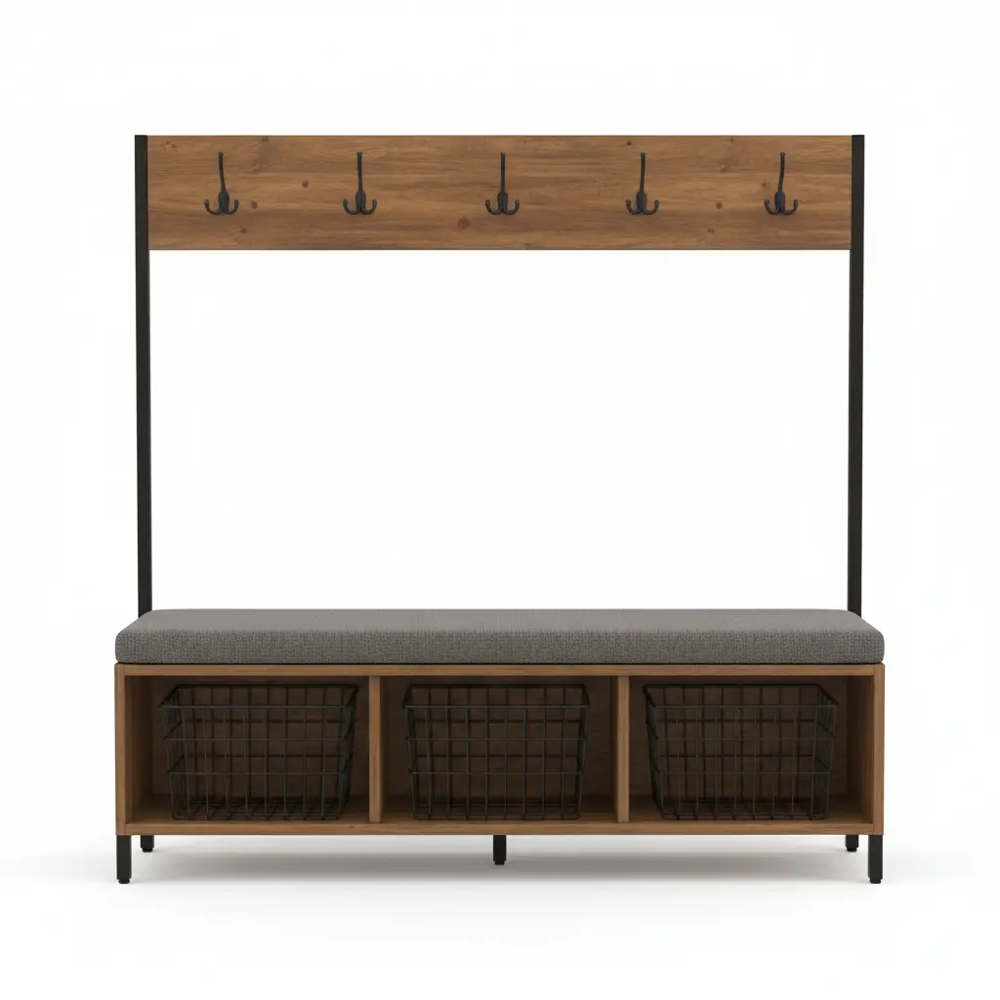
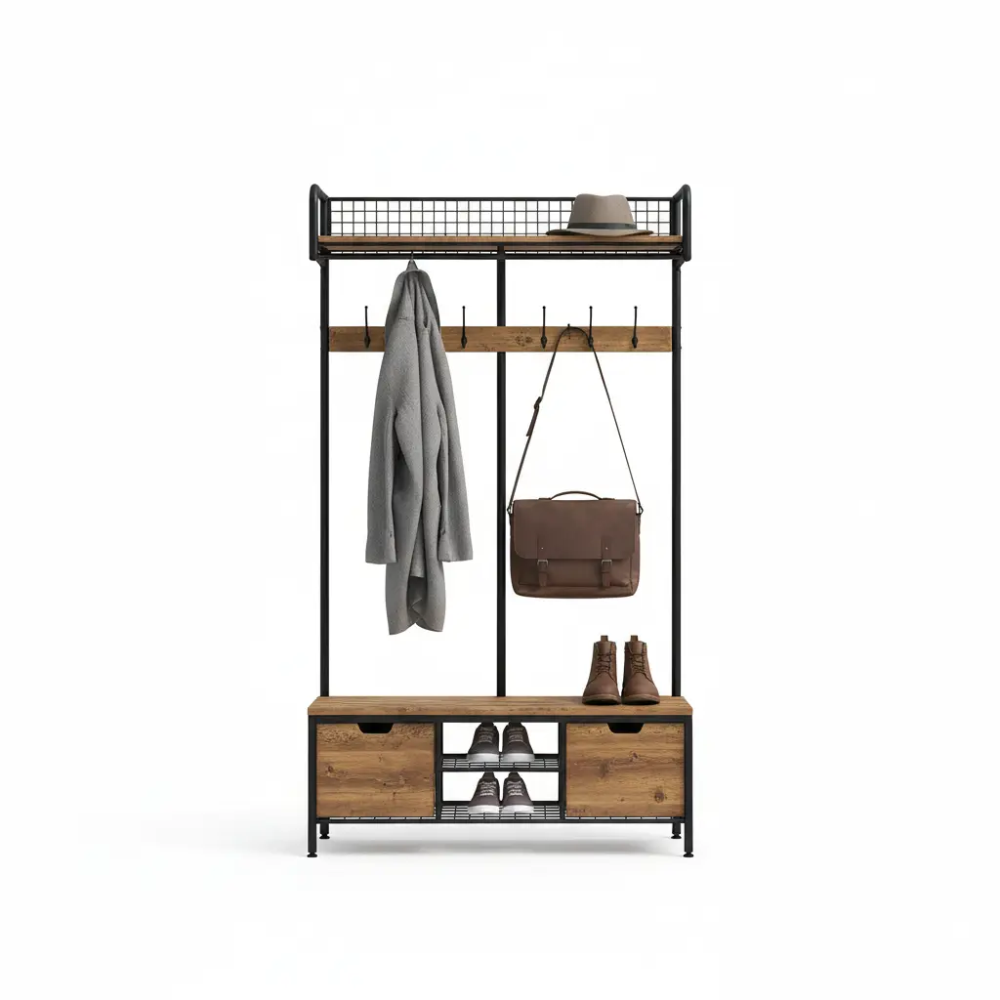
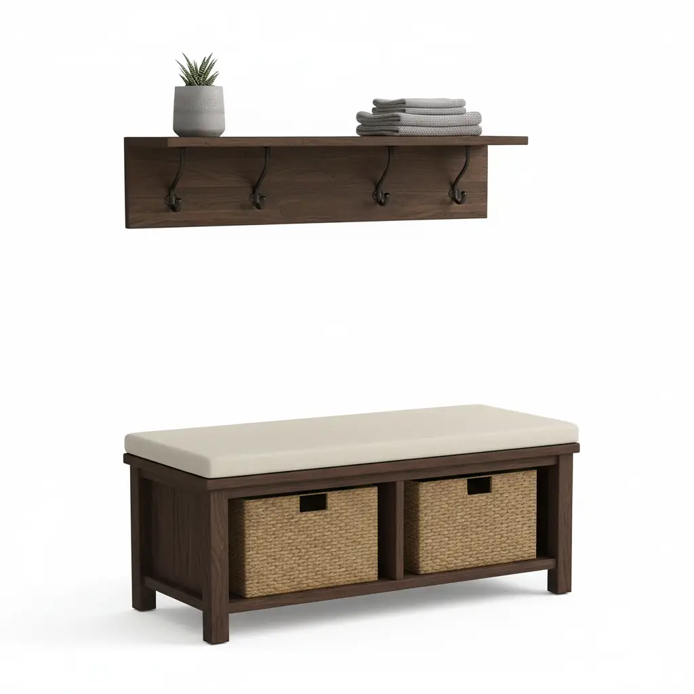

The entryway is the handshake of your home. It is the very first thing guests see when they step through the front door and the last thing you encounter before heading out into the world. In the realm of foyer organization, the **hall tree** stands as the undisputed king of functionality. It combines seating, hanging storage, and often shoe cubbies into a single, vertical silhouette. However, beyond its utility, the hall tree serves as a massive visual anchor.

Choosing the wrong color or finish can make your entryway feel cramped, cluttered, or aesthetically disjointed. Conversely, the right selection can elevate a simple mudroom into a sophisticated transition space. Whether you are aiming for a **modern minimalist** look, a **cozy farmhouse** vibe, or a **rugged industrial** aesthetic, understanding the nuances of color theory and furniture finishes is essential.

In this comprehensive guide, we will dive deep into the psychology of color, the durability of various finishes, and how to harmonize your hall tree with your existing flooring, wall colors, and architectural style.

## The Psychology of Color in the Entryway

Before picking a swatch, it is vital to understand how color affects the perception of space. Most entryways are narrow or lack significant natural light, making the color of your furniture a critical factor in how "breathable" the room feels.

### Light Colors: Expanding the Foyer
White, cream, light grey, and natural "blonde" wood finishes (like ash or maple) are excellent for small spaces. These colors reflect light, making a cramped hallway feel significantly more spacious. A **white hall tree** against a light-colored wall creates a seamless, "built-in" look that minimizes visual clutter.

### Dark Colors: Grounding the Space
Deep espressos, charcoals, and matte blacks offer a sense of sophistication and "weight." If you have a large, open-concept entryway with high ceilings, a dark hall tree can act as a stunning focal point, grounding the room and preventing it from feeling too airy or empty. However, be wary of dark finishes in low-light areas, as they can absorb what little light is available, making the space feel cave-like.

### Bold Accents: Making a Statement
While neutral tones are the safest bet for resale value, a bold navy, forest green, or even a dusty rose hall tree can inject personality into your home immediately. If the rest of your home follows a neutral palette, a colorful hall tree serves as a "surprise" element that defines the home's character.

## Understanding Furniture Finishes

The "finish" refers to the top coat or the texture of the material. It isn't just about color; it's about how the light hits the surface and how the piece feels to the touch.

### 1. Matte and Flat Finishes
Matte finishes have become incredibly popular in **modern and industrial designs**. They do not reflect light, which gives them a soft, contemporary appearance.
*   **Pros:** Hides fingerprints and small scratches better than gloss.
*   **Best for:** High-traffic areas where children or pets might touch the furniture frequently.

### 2. Satin and Semi-Gloss
This is the "Goldilocks" of finishes. It has a slight sheen that provides a clean, polished look without being overly reflective.
*   **Pros:** Easy to wipe down and offers a classic look that fits almost any decor style.
*   **Best for:** Traditional and transitional homes.

### 3. Distressed and Reclaimed Finishes
Commonly found in **farmhouse and rustic styles**, these finishes involve "faked" wear and tear—sanded edges, faux wormholes, or uneven staining.
*   **Pros:** Extremely forgiving. If you accidentally ding the wood with a vacuum cleaner, it simply adds to the "character."
*   **Best for:** Busy families and rustic interiors.

### 4. Natural Wood Grain
Sometimes, the best finish is one that highlights the organic beauty of the wood. Stains like oak, walnut, and cherry allow the grain to show through.
*   **Pros:** Adds warmth and organic texture to a room.
*   **Best for:** Mid-century modern or Scandinavian designs.

## Matching Your Hall Tree to Your Interior Style

To ensure your new piece of furniture doesn't look like an afterthought, you must align its finish with your home's overarching design language.

### Modern & Minimalist
In a modern home, "less is more." Look for hall trees with clean lines, hidden hardware, and solid colors. A **matte black metal frame** paired with a sleek walnut bench is a staple of this style. Avoid ornate carvings or "fussy" details. [Maximizing small entryways](/posts/maximizing-small-entryways) often requires these streamlined silhouettes to keep the path clear.

### Farmhouse & Shabby Chic
The farmhouse aesthetic thrives on contrast. A common approach is a "two-tone" finish—perhaps a white-painted frame with a natural wood bench seat. Distressed finishes in "Antique White" or "Grey Wash" are the hallmarks of this style. It pairs beautifully with wicker baskets and bronze hooks.

### Industrial & Urban Loft
Industrial design is all about raw materials. Look for hall trees that combine **powder-coated steel** with "rough-hewn" wood. The wood should look like it came from an old warehouse—think dark stains with visible knots and "imperfections."

### Traditional & Formal
If your home features crown molding, wainscoting, and antique rugs, a traditional hall tree in a rich **Mahogany or Cherry finish** is appropriate. These pieces often feature more architectural detail, such as raised panels or brass hardware, reflecting a timeless elegance.

## Top 3 Hall Tree Recommendations

To help you visualize these finishes in your own home, we have selected three top-rated hall trees that represent the most popular interior styles today.

### 1. Walker Edison Furniture Company 72-inch Entryway Storage Bench (Grey Wash)

The **Walker Edison Grey Wash Hall Tree** is the quintessential choice for those leaning toward a **Modern Farmhouse** or **Coastal** aesthetic. The grey wash finish is specifically designed to bridge the gap between cool and warm tones, making it incredibly versatile for homes with either grey or beige wall palettes.

**Why it works:**
The finish mimics the look of weathered wood without the splinters. It features four metal hooks and a spacious lower cabinet for shoe storage. The "Grey Wash" is particularly effective at hiding dust—a common nemesis in entryways.

*   **Pros:** Sturdy construction, beautiful textured finish, excellent value for the price.
*   **Cons:** Assembly can be time-consuming; the back panel is thinner than the main frame.

[Check Price on Amazon](https://www.amazon.com/s?k=Walker+Edison+Grey+Wash+Hall+Tree&tag=hats0f8-20)

---

### 2. VASAGLE Industrial Hall Tree (Rustic Brown & Black)

For those who love the **Industrial or Urban Loft** look, the **VASAGLE Industrial Hall Tree** is a masterclass in material contrast. It pairs a matte black iron frame with "Rustic Brown" engineered wood. This color combination is perfect for matching with leather accents or exposed brick.

**Why it works:**
The dark metal provides a structural "outline" that looks sharp and modern, while the rustic wood adds the necessary warmth to keep the entryway from feeling too "cold." It’s a compact unit, making it ideal for apartments or narrow foyers.

*   **Pros:** Very easy to assemble, high weight capacity for the bench, adjustable feet for uneven floors.
*   **Cons:** The "Rustic Brown" is a laminate finish, so it doesn't have the deep texture of real solid wood.

[Check Price on Amazon](https://www.amazon.com/s?k=VASAGLE+Industrial+Hall+Tree&tag=hats0f8-20)

---

### 3. Crosley Furniture Brennan Entryway Bench and Shelf (White)

If your goal is a **Clean, Traditional, or Transitional** look, the **Crosley Furniture Brennan** set in white is a top-tier contender. White furniture in the entryway acts as a blank canvas, allowing your colorful coats, scarves, and decorative pillows to pop.

**Why it works:**
The satin white finish is bright and airy. Because this is a two-piece set (a bench and a separate wall-mounted shelf), it offers incredible flexibility for homes with unique wall heights or those who want to place the hooks at a custom level for children.

*   **Pros:** Classic silhouette that never goes out of style, includes storage cubbies for baskets, high-quality hardware.
*   **Cons:** White shows scuff marks from shoes more easily; requires regular wiping to stay pristine.

[Check Price on Amazon](https://www.amazon.com/s?k=Crosley+Furniture+Brennan+White+Hall+Tree&tag=hats0f8-20)

---

## Coordinating with Existing Flooring

One of the biggest mistakes homeowners make is ignoring the floor. Your hall tree sits directly on your flooring, creating a direct visual comparison.

*   **Hardwood Floors:** If you have dark oak floors, avoid a hall tree in a slightly different dark oak; it will look like a "near miss." Instead, go for contrast. A white or light grey hall tree on dark floors looks intentional. If you want wood-on-wood, ensure the grains are significantly different or use a rug to create a "buffer zone."
*   **Tile/Stone:** Cold surfaces like tile benefit from the warmth of wood finishes. A "Rustic Brown" or "Walnut" hall tree can soften the look of a stone-tiled entryway.
*   **Carpet:** Ensure the hall tree has a solid base or adjustable feet. Darker finishes tend to look better on neutral carpeting as they provide a clear "anchor" point.

## Lighting: The Invisible Designer

Lighting changes everything. A finish that looks "Warm Oak" in the showroom might look "Orange" under your LED entryway lights.

1.  **Natural Light:** If your entryway has a window or a glass door, colors will appear true to life. You can afford to use darker, more matte finishes.
2.  **Artificial Light (Warm):** Traditional incandescent or "warm white" LEDs will pull out the yellow and red tones in wood. This makes "Cherry" or "Honey" finishes look very vibrant.
3.  **Artificial Light (Cool):** "Daylight" or cool LEDs can make wood look flat or even slightly greyish. In this lighting, a "Grey Wash" or "Modern White" finish usually looks best.

## Maintenance and Durability: The Reality of Entryway Life

Let’s be honest: the entryway is a war zone. Wet umbrellas, muddy boots, and heavy backpacks are the daily reality.

*   **Water Resistance:** Look for finishes that are "sealed." If you choose a raw wood or poorly finished piece, the moisture from wet coats will eventually warp the wood or cause the finish to bubble.
*   **Scuff Resistance:** Entryway benches take a lot of abuse from shoes. A **powder-coated metal** frame (like on the VASAGLE model) is virtually indestructible. If you choose a painted wood finish (like the Crosley model), keep a "touch-up pen" in the drawer to fix minor scuffs.
*   **Dust Visibility:** Dark, high-gloss finishes are the hardest to keep clean. They show every speck of dust and every fingerprint. If you aren't someone who enjoys dusting weekly, stick to lighter colors or "distressed" finishes where dust blends in.

## How to Choose: A Final Checklist

Still undecided? Follow this step-by-step process to narrow down your choice:

1.  **Measure the Space:** A dark, heavy hall tree in a 4-foot wide hallway will feel oppressive. Go for light colors or open-frame metal designs for tight spaces.
2.  **Identify Your "Anchor" Color:** Look at your flooring and wall color. Choose a hall tree that either matches your trim (for a built-in look) or contrasts your floor (for a focal point look).
3.  **Assess Your Lifestyle:** Do you have three kids and a muddy dog? Choose a **distressed grey or brown finish**. Are you a minimalist living alone? Go for **matte black or sleek white**.
4.  **Check the Hardware:** Don't forget the hooks and handles! If your door handle is brushed nickel, a hall tree with oil-rubbed bronze hooks might clash. Try to coordinate metals for a cohesive look.
5.  **Think Long-Term:** Trends like "Navy Blue" furniture are fun, but will you still love it in five years? If you're unsure, go with a classic wood stain or white, and add color through removable baskets and cushions.

## Conclusion

Choosing the right color and finish for your hall tree is a balancing act between aesthetics and practicality. By considering the light in your foyer, the style of your home, and the daily wear-and-tear your furniture will face, you can select a piece that isn't just a place to hang your hat—it's a reflection of your home's soul.

Whether you opt for the coastal charm of a [grey wash finish](#1-walker-edison-furniture-company-72-inch-entryway-storage-bench-grey-wash), the rugged utility of [industrial metal](#2-vasagle-industrial-hall-tree-rustic-brown--black), or the timeless purity of [satin white](#3-crosley-furniture-brennan-entryway-bench-and-shelf-white), your entryway will thank you for the upgrade. For more tips on keeping your home organized, check out our guide on [organizing your mudroom](/posts/organizing-your-mudroom).