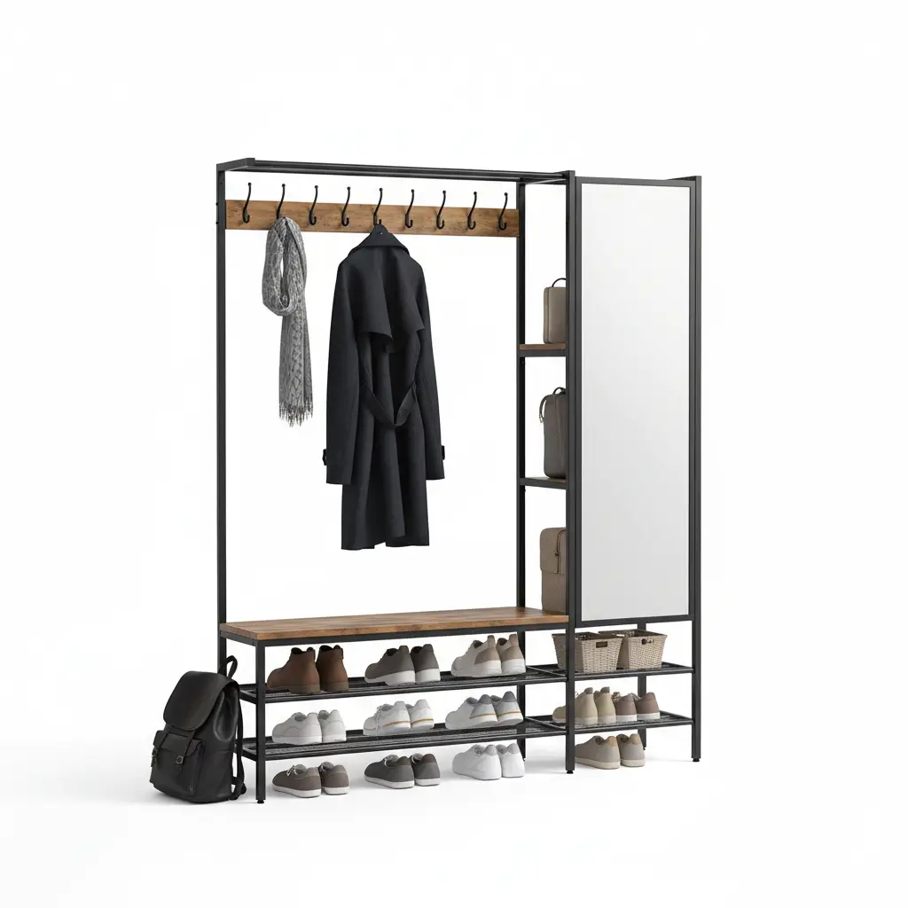
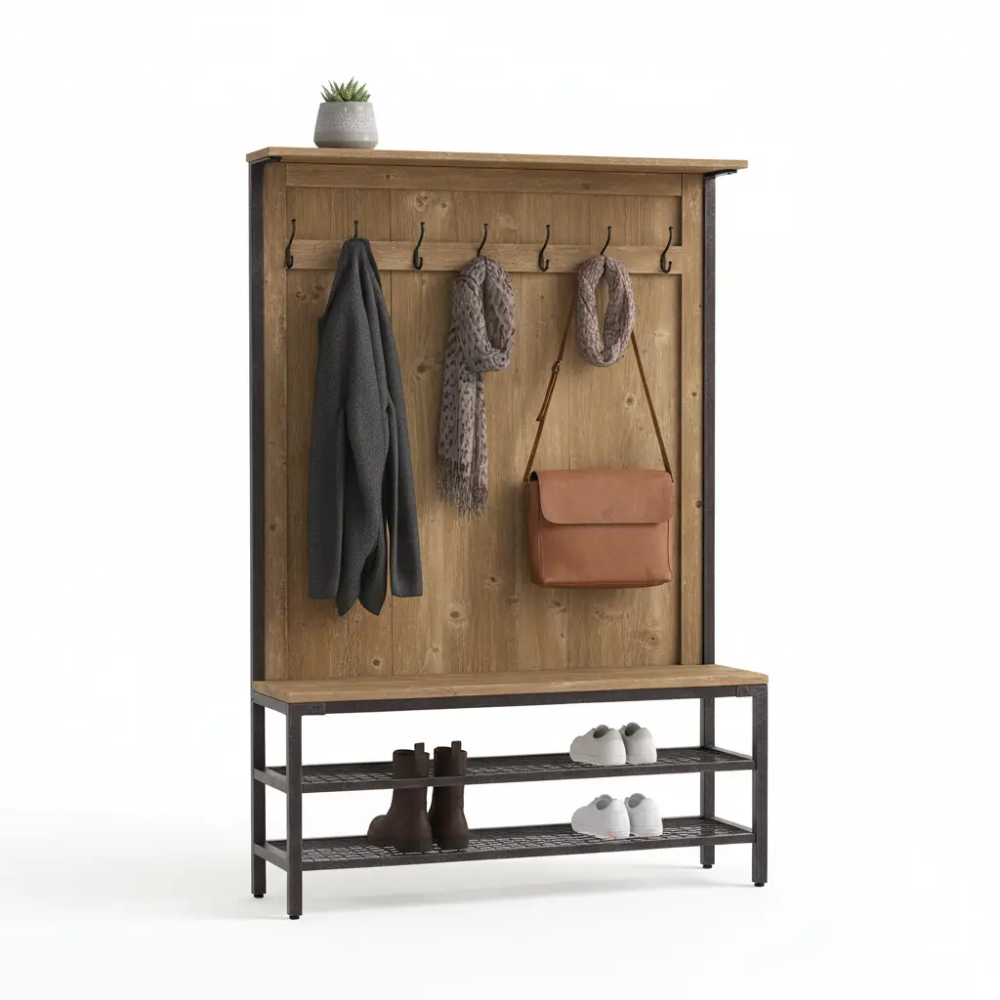
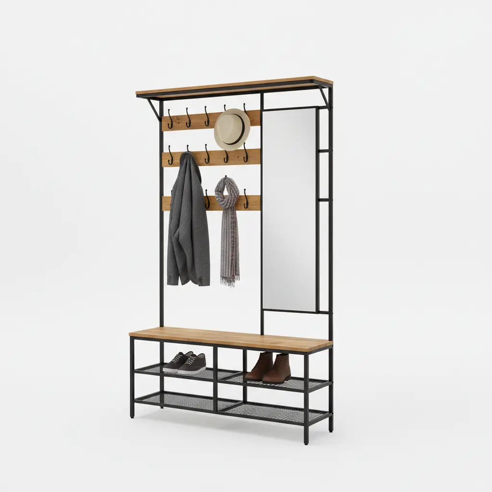

The entryway is the frontline of your home. It is the transition zone where the outside world meets your sanctuary. Consequently, the furniture in this space—most notably the **hall tree**—endures a level of wear and tear that few other pieces in your home can match. From soggy raincoats and muddy boots to heavy backpacks and abrasive road salt, your hall tree is a workhorse.

However, a hall tree is more than just a utility item; it is often the centerpiece of your foyer's aesthetic. Whether you own a rustic solid wood piece or a sleek, modern industrial metal unit, proper **cleaning and maintenance** are vital. Neglecting these tasks doesn’t just lead to an unsightly entryway; it can lead to structural failure, rust, and permanent wood damage.

In this comprehensive guide, we will dive deep into the specific needs of both wood and metal hall trees, providing you with a professional-grade maintenance schedule to keep your furniture looking brand new for decades.

## Why Maintenance Matters for Entryway Furniture

Before we get into the "how," let’s discuss the "why." Entryway furniture is subject to **environmental stressors** that bedroom or living room furniture rarely encounters.

1.  **Moisture Exposure:** Wet umbrellas and dripping coats introduce moisture, which is the primary enemy of both wood (warping/mold) and metal (corrosion).
2.  **Temperature Fluctuations:** Being near the front door means frequent blasts of cold or hot air, causing materials to expand and contract.
3.  **Abrasive Debris:** Sand, dirt, and salt from shoes can act like sandpaper on the finish of your shoe bench.
4.  **Weight Stress:** Overloaded hooks can strip screws or bend metal frames over time.

By following a dedicated maintenance routine, you protect your investment and maintain the hygiene of your home’s primary entry point.

## Part 1: Deep Cleaning and Maintaining Wood Hall Trees

Wood is a living, breathing material. Even after it has been harvested and turned into furniture, it reacts to its environment. Whether your hall tree is made of solid oak, pine, or high-quality MDF with a wood veneer, it requires specific care.

### Understanding Your Wood Finish
Before applying any cleaner, you must identify the finish. 
- **Oil/Wax Finishes:** These feel natural and "open." They require periodic re-oiling.
- **Lacquer/Varnish/Polyurethane:** These create a hard, plastic-like shell. They are more water-resistant but can crack or peel if mistreated.
- **Painted Wood:** Requires gentle cleaning to avoid chipping the pigment.

### The Daily/Weekly Dusting Routine
Dust is more than just an aesthetic issue; it can be abrasive. Use a **microfiber cloth** to wipe down the surfaces of your wood hall tree at least once a week. Avoid using feathered dusters, as they often just move dust around rather than capturing it.

### Deep Cleaning Wood Surfaces
Once a month, or when visible grime builds up, perform a deeper clean:
1.  **The Solution:** Mix a few drops of mild dish soap in a bowl of warm water. Avoid harsh chemicals or ammonia-based cleaners, which can strip the finish.
2.  **The Technique:** Dip a soft cloth into the solution, wring it out until it is barely damp, and wipe in the direction of the **wood grain**. 
3.  **Drying:** Immediately follow up with a dry microfiber cloth. Never let water sit on wood.

### Dealing with Scratches and Scuffs
Entryways are high-traffic areas. If your wooden hall tree develops scratches:
- **For Light Scratches:** Use a furniture touch-up marker or even a walnut (the oils in the nut can darken the scratch to match the wood).
- **For Deep Gouges:** Use a wood filler that matches your stain, sand it lightly once dry, and apply a small amount of matching finish.

### Seasonal Wood Conditioning
Wood can dry out and crack in low-humidity winter months. Every six months, apply a high-quality **furniture wax** or specialized wood conditioner. This creates a protective barrier against moisture and gives the wood a healthy glow.

---

## Top 3 Recommended Hall Trees for Durability and Style

To help you find a piece that is both easy to maintain and built to last, we have curated the top three hall trees currently on the market.

### 1. VASAGLE Hall Tree with Bench and Coat Rack

The VASAGLE Hall Tree is the gold standard for the "Industrial" look. It combines a robust steel frame with P2-grade engineered wood. This hybrid design is incredibly popular because it offers the warmth of wood with the structural integrity of metal.

**Pros:**
*   **Easy-to-Clean Surface:** The wood panels are finished with a water-resistant veneer that stands up well to wet coats.
*   **Adjustable Feet:** Perfect for uneven entryway floors, preventing the "wobble" that can loosen joints over time.
*   **High Load Capacity:** The bench can support up to 220 lbs, making it a functional seating area.

**Cons:**
*   **Assembly Time:** Requires a bit of patience during the initial setup.
*   **Veneer Sensitivity:** While water-resistant, it is not "waterproof." Spills should be wiped immediately.

[Check Price on Amazon](https://www.amazon.com/s?k=VASAGLE+Hall+Tree+with+Bench+and+Coat+Rack&tag=hats0f8-20)

---

### 2. Walker Edison Furniture Company Industrial Wood and Metal Hall Tree

If you are looking for something that leans more toward the rustic-modern aesthetic, the Walker Edison Hall Tree is a fantastic choice. It features a beautiful textured finish that mimics reclaimed wood.

**Pros:**
*   **Deep Storage:** The lower shelves are spacious enough for large boots and storage bins.
*   **Sturdy Hooks:** The metal hooks are powder-coated, preventing rust even when hanging damp raincoats.
*   **Aesthetic Versatility:** Fits perfectly in farmhouse, industrial, or modern decors.

**Cons:**
*   **Weight:** It is a heavy unit, so you’ll want to assemble it exactly where you plan for it to stay.
*   **Textured Grain:** The textured surface looks great but requires a bit more effort to dust than a smooth surface.

[Check Price on Amazon](https://www.amazon.com/s?k=Walker+Edison+Industrial+Wood+and+Metal+Hall+Tree&tag=hats0f8-20)

---

### 3. HOOBRO Coat Rack Hall Tree with Shoe Bench

The HOOBRO Hall Tree is an excellent budget-friendly option that doesn't sacrifice stability. It features a more minimalist metal frame that is exceptionally easy to maintain.

**Pros:**
*   **Compact Design:** Ideal for small apartments or narrow hallways.
*   **Rust-Resistant Frame:** The metal is treated with a smooth finish that is very easy to wipe down.
*   **Removable Hooks:** Allows for customization based on what you are hanging.

**Cons:**
*   **Bench Thickness:** The bench is slightly thinner than the other two models.
*   **Simplified Style:** May feel too "utility-focused" for those seeking a luxury look.

[Check Price on Amazon](https://www.amazon.com/s?k=HOOBRO+Coat+Rack+Hall+Tree+with+Shoe+Bench&tag=hats0f8-20)

---

## Part 2: Metal Hall Tree Care and Rust Prevention

Metal hall trees are often chosen for their durability and "indestructible" feel. However, metal is susceptible to its own set of issues—mainly oxidation and scratches to the protective coating.

### Cleaning Powder-Coated Metal
Most modern hall trees use **powder-coated steel**. This is a dry finishing process that creates a much tougher finish than conventional paint.
- **Cleaning:** Use a mixture of warm water and a non-abrasive soap. 
- **Avoid:** Never use steel wool or abrasive scouring pads. These will create micro-scratches in the powder coating, which allows moisture to reach the raw metal underneath, leading to rust.

### Preventing and Treating Rust
Rust is the "cancer" of metal furniture. It usually starts at the joints or where the metal meets the floor.
1.  **Inspection:** Every few months, check the hooks and the base for any orange-brown spots.
2.  **Treatment:** If you find rust, use a fine-grit sandpaper to gently remove the oxidation. Once the area is clean, apply a **rust-inhibiting primer** and a matching touch-up paint.
3.  **Prevention:** If you live in a coastal area with salty air or a region with snowy winters, consider applying a thin coat of car wax to the metal frame once a year. This provides an extra layer of protection against the elements.

### Hardware Maintenance
The hooks and screws are the most stressed components of a hall tree.
- **Tighten Regularly:** Because hall trees are used daily, the screws can vibrate loose. Check and tighten all bolts and screws every six months.
- **Lubrication:** If your hall tree has drawers or swinging hooks that squeak, a small drop of silicone-based lubricant (avoid WD-40 for long-term lubrication as it can attract dust) will keep them moving smoothly.

## Part 3: Caring for the "Hybrid" Hall Tree

Many of the best hall trees, like the ones reviewed above, are "hybrids" (wood and metal). These require a dual-action approach.
- **The Transition Zone:** Be careful when cleaning the area where wood meets metal. Ensure that the cleaning agent used for the metal doesn't soak into the wood edges, as the edges of engineered wood are often the most vulnerable to moisture.
- **Floor Protection:** Most metal hall trees come with plastic or rubber feet. Ensure these are intact. If a metal leg sits directly on a damp floor, it can leave permanent rust stains on your tile or wood flooring.

## Strategies for Longevity: The Professional Approach

Beyond cleaning, how you *use* your hall tree dictates how long it will last.

### 1. The "Wet Item" Rule
Never hang a soaking-wet trench coat or umbrella directly against a wooden back panel. The moisture will eventually seep through the finish and cause the wood to swell or the veneer to delaminate. Use the metal hooks, and if the item is dripping, consider a separate umbrella stand or let the coat drip-dry in the bathroom before moving it to the hall tree.

### 2. Weight Distribution
Avoid the "favorite hook" syndrome. We tend to hang everything on the middle hook because it’s convenient. This puts uneven stress on the frame. Distribute the weight evenly across all hooks to prevent the unit from leaning or the hooks from stripping.

### 3. Use Baskets
To protect the wooden shelves from the abrasive soles of shoes, use **wicker or plastic baskets**. This keeps dirt and salt contained and prevents the wood from getting scratched by grit caught in boot treads. For more ideas on organizing, check out our post on [organizing small entryways](/posts/maximizing-style-in-small-spaces-corner-hall-tree-solutions).

## Buying Guide: What to Look for in a Low-Maintenance Hall Tree

If you are in the market for a new hall tree, choosing the right materials from the start can save you hours of maintenance later.

### Material Choice
- **Solid Wood:** Highest longevity, can be refinished, but most expensive and sensitive to humidity.
- **Metal Frame with MDF:** Best value, very stable, but cannot be easily repaired if the veneer is badly damaged.
- **All-Metal:** Most durable and easiest to clean, but can feel "cold" in a home environment.

### Finish Quality
Look for terms like "Powder-Coated Steel" and "Melamine Finish" or "P2 Wood." These indicate that the materials are treated for higher durability and lower off-gassing.

### Structural Integrity
Check the weight capacity. A hall tree that is rated for 300 lbs will naturally hold up better to daily use than one rated for 100 lbs, as its joints and materials are thicker and more robust.

## Conclusion

A hall tree is the unsung hero of the home. It organizes our chaos and greets us at the end of a long day. By spending just 10 minutes a week on basic dusting and a few hours a year on deep cleaning and conditioning, you can ensure that your wood and metal hall tree remains a beautiful and functional part of your home for a lifetime.

Remember: **Moisture is the enemy, and consistency is the solution.** Keep it dry, keep it clean, and keep the hardware tight. Your entryway—and your guests—will thank you.

For more tips on keeping your home organized and stylish, don't forget to browse our other guides on [entryway furniture selection](/posts/the-ultimate-buying-guide-to-hall-trees-and-mudroom-lockers-in-2024).