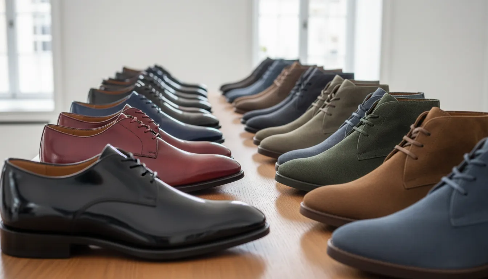
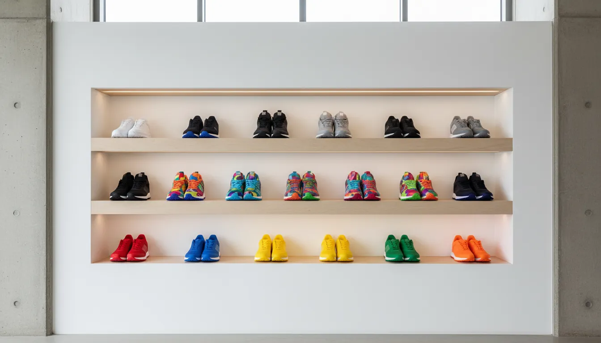
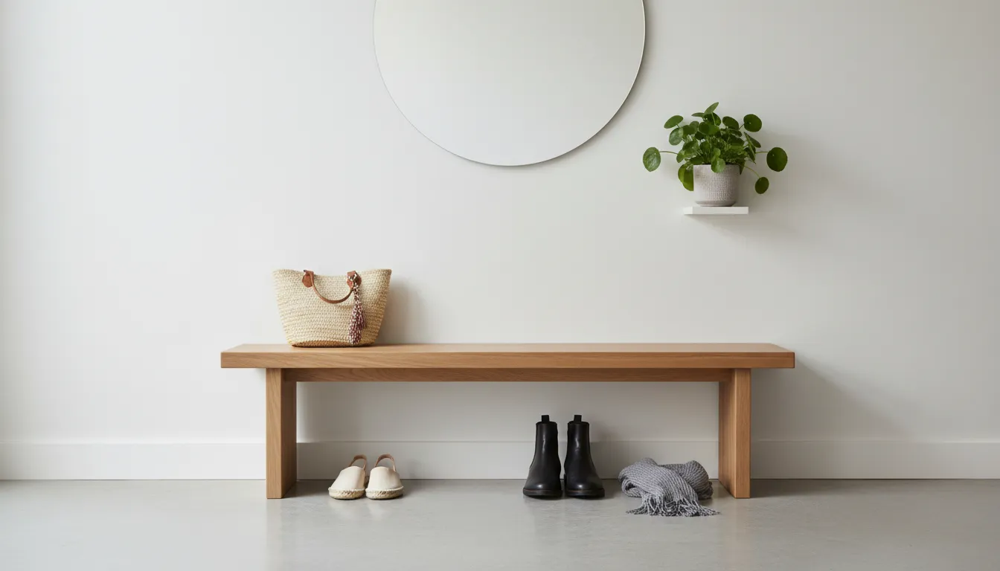

# Color-Coded Organization: A Visual Guide to Smart Shoe Storage Systems

The entryway often sets the tone for the entire home. It is the transitional space between the chaotic outside world and your personal sanctuary. However, for many households, this area becomes a cluttered graveyard of discarded footwear, creating visual noise that immediately induces stress. While traditional organization methods focus on utility—placing items where they fit—there is a superior approach that blends functionality with high-end design principles: color-coded organization.

Color-coding is not merely an aesthetic choice reserved for social media influencers or boutique retail displays. It is a cognitive tool that streamlines the decision-making process. By organizing your footwear collection through a chromatic lens, you transform a pile of shoes into a curated library. This guide explores the methodology behind color-coded shoe storage, the hardware required to execute it, and the maintenance strategies that ensure your system remains sustainable.

## The Psychology of Visual Order

Before diving into the logistics of shelving and sorting, it is essential to understand why visual organization is so effective. The human brain processes visual information significantly faster than text or abstract categories. When you open a closet or look at an entryway rack, "cognitive load" refers to the amount of working memory resources used. A jumbled pile of mixed colors and styles increases this load, resulting in decision fatigue.

By arranging footwear by color, you create a system of pattern recognition. If you are dressing for a formal event and require black pumps, your brain instinctively knows exactly where to look without scanning individual items. This reduction in visual friction not only saves time during the morning rush but also instills a sense of calm and control over your environment.

Furthermore, color-coded systems turn everyday items into decor. Instead of hiding your shoes away in opaque bins, you can display them as part of the room's architecture. This shifts the mindset from "storage" to "display," encouraging you to maintain the order because the result is visually rewarding.

## Assessing and Curating Your Collection

A successful organizational overhaul begins with an audit. You cannot organize clutter; you must first curate the collection. To implement a color-coded system effectively, you need a clear inventory of what you own.

Begin by gathering every pair of shoes in the house into a central location. This volume can be overwhelming, but it is a necessary step. Separate the shoes into three primary categories based on their lifecycle:

1.  **The Daily Rotation:** These are the shoes you wear frequently. They need to be the most accessible.
2.  **The Occasional/Seasonal:** Specialized footwear like heavy winter boots, formal heels, or hiking gear.
3.  **The Archive/Discard:** Shoes that are worn out, ill-fitting, or haven't been worn in over a year.

Once you have purged the "Archive" category, you are left with the shoes that will form your display. At this stage, group them by broad color families. You will likely find that you have dominant colors. Most wardrobes lean heavily towards neutrals—black, brown, white, and beige—with pops of accent colors. Recognizing these proportions will help you determine the type and size of storage solutions you require.

## Designing the Chromatic System

There are several methodologies for arranging shoes by color. The right choice depends on the size of your collection and the layout of your storage space.

### The Gradient Method (ROYGBIV)

The most visually striking method is the gradient approach, often referred to by the acronym ROYGBIV (Red, Orange, Yellow, Green, Blue, Indigo, Violet). However, since footwear rarely follows a perfect rainbow, a modified gradient is usually more practical for home storage.

Start with light neutrals on one end (whites, creams, nudes) and transition into colors, ending with dark neutrals (greys, browns, blacks). If you are utilizing vertical shelving, place the darker, heavier shoes at the bottom. This anchors the visual weight of the display, making the room feel grounded. Lighter shoes should be placed at the top to maintain an airy, open feel.

### The Block Method

For those with large collections of specific colors, the block method is highly effective. This involves dedicating entire shelves or cubby sections to a single color family. For example, you might have a "White Sneaker" zone, followed by a "Black Boot" zone. This creates distinct blocks of color that read as architectural elements.

### The Material Gradient

Within a color group, you can further refine the organization by texture or material. If you have five pairs of black shoes, arrange them from matte (suede or canvas) to shiny (patent leather). This subtle distinction adds a layer of sophistication that elevates the display from a simple storage rack to a boutique-style presentation.

## Hardware Solutions for Visual Logic

The effectiveness of color-coded organization relies heavily on the "canvas" you use. If the storage unit itself is cluttered or visually intrusive, the color arrangement will lose its impact. The goal is to maximize visibility while minimizing the hardware's profile.

### The Power of Transparency

To truly allow the colors to pop, clear acrylic storage is the gold standard. Unlike cardboard boxes that obscure the contents, clear boxes protect the shoes from dust while maintaining total visibility. This is crucial for a color-coded system; if you cannot see the color, the system fails.

Uniformity is key here. Using mismatched boxes will ruin the aesthetic lines you are trying to create. Stackable, drop-front shoe boxes allow you to access shoes without unstacking the pile, and their uniform shape creates a clean grid that lets the shoe colors act as the variable design element.

For those seeking the optimal balance of clarity and durability, high-quality acrylic stackable bins are essential.

[Shop Clear Stackable Shoe Storage Boxes on Amazon](https://www.amazon.com/s?k=Clear+Stackable+Shoe+Storage+Boxes&tag=hats0f8-20)

### Open Shelving and Floating Units

For entryways and walk-in closets, open shelving offers immediate access. Adjustable shelving is preferred, as it allows you to accommodate different shoe heights (tall boots vs. low-profile sneakers) without breaking the horizontal lines of the color gradient.

If floor space is at a premium, consider wall-mounted floating shelves. This draws the eye upward and turns your footwear into wall art. When installing shelves for a color-coded display, ensure the backdrop (the wall paint or cabinet backing) is neutral. A stark white or deep charcoal background will provide the necessary contrast to let the shoes stand out. For more ideas on maximizing vertical space, read our guide on [Vertical Entryway Solutions](/posts/vertical-entryway-storage-ideas).

## Implementing the System: A Step-by-Step Guide

Once you have your hardware and your curated collection, it is time to install the system.

**Step 1: Clean and Prep.** Before placing any shoe into a new system, it must be cleaned. Wiping down soles and polishing leather ensures that dirt is not transferred to your clean shelves.

**Step 2: Rough Sorting.** Lay the shoes out on the floor in your intended order. This allows you to visualize the gradient before committing to shelf placement. You might realize that your "nude" heels look better next to "blush" tones rather than "brown" tones.

**Step 3: The Placement Strategy.** Begin placing shoes onto the shelves or into boxes. If using shelves, maintain consistent spacing between pairs. "Breathing room" is critical in luxury retail design, and the same applies here. Overcrowding the shelf will destroy the color-blocking effect.

**Step 4: Handling Outliers.** Every collection has outliers—multi-colored sneakers or patterned flats that do not fit a single category. Create a dedicated "Statement" section for these. By grouping the patterns together, they form their own category rather than disrupting the flow of the solid colors.

## Color-Coding for Shared Spaces

Implementing this system in a home shared by a partner or children presents unique challenges. However, color-coding can actually simplify family organization.

### The Assigned Color Strategy

In a mudroom or shared entryway, assign a specific color of storage bin or tag to each family member. This is different from sorting the shoes by color; rather, it is sorting the *storage* by color. For example, one person uses navy bins, another uses grey. This allows each person to quickly identify their landing zone.

For families with young children, this visual cue is easier to follow than reading labels. You can integrate this with the shoe organization by having a "Blue Bin" for their daily sneakers, while their dress shoes remain in the main closet color gradient.

To implement this efficiently, consider using uniform bins with distinct color indicators or labels.

[Shop Color Coded Storage Bins and Labels on Amazon](https://www.amazon.com/s?k=Color+Coded+Storage+Bins+Labels&tag=hats0f8-20)

### The "Dump Zone" Management

Even the most organized systems must account for reality. In high-traffic entryways, have a designated basket (perhaps matching the darkest color in your gradient) for shoes that have just been taken off. This prevents a pile-up at the door. Once a week, these shoes are returned to their proper place in the color-coded lineup.

## Advanced Techniques for Sneakerheads and Collectors

For the serious collector, color-coded storage is not just about organization; it is about preservation and exhibition. Sneaker culture often revolves around specific colorways, and displaying them requires distinct considerations.

### UV Protection and Lighting

If you are displaying valuable footwear openly, be wary of sunlight. UV rays can fade vibrant colors and yellow translucent soles. Ensure your storage area is away from direct windows, or use UV-protective window film.

Artificial lighting, however, is your friend. LED strip lighting installed along the front or back of shelves can dramatize the color gradient. Use neutral white light (4000K) to render colors accurately. Warm light makes whites look yellow, while cool light can make leathers look harsh.

### Floating Displays

For the "Grails"—the rarest or most prized pairs in the collection—break the color gradient. These shoes deserve focal point status. Floating shelves allow you to mount these specific pairs on a wall separate from the main storage, acting as a gallery wall. This highlights the shoe's unique colorway without forcing it to compete with the rest of the gradient.

[Shop Floating Shoe Display Shelves on Amazon](https://www.amazon.com/s?k=Floating+Shoe+Display+Shelves&tag=hats0f8-20)

## Maintenance: The One-In-One-Out Rule

A color-coded system is delicate. Introducing a new pair of neon green sneakers into a collection dominated by earth tones requires shifting. To maintain the aesthetic integrity of your space, adopt the "One-In-One-Out" rule. When you purchase a new pair, assess if an old pair in the same color category can be retired.

Furthermore, seasonal rotation is vital for maintaining visual clarity. In summer, your front-facing storage should showcase the gradient of sandals and loafers. In winter, rotate these out for your boots. This keeps the gradient relevant to your daily needs and prevents the "visual noise" of mismatched seasonal gear. For tips on managing seasonal shifts, refer to our article on [Seasonal Closet Rotation](/posts/seasonal-closet-rotation-guide).

## Conclusion

Color-coded shoe organization is more than a trend; it is a systematic approach to home management that marries form and function. By reducing visual clutter, you reduce mental clutter. Whether you are arranging a massive walk-in closet or a modest entryway rack, the principles remain the same: edit the collection, prioritize visibility with the right hardware, and arrange by a logical color spectrum.

The result is a space that feels larger, cleaner, and intentionally designed. Your footwear becomes an asset to your home’s decor rather than a liability. Start small—perhaps by organizing just your daily rotation—and experience the satisfaction of a system that works as beautifully as it looks.