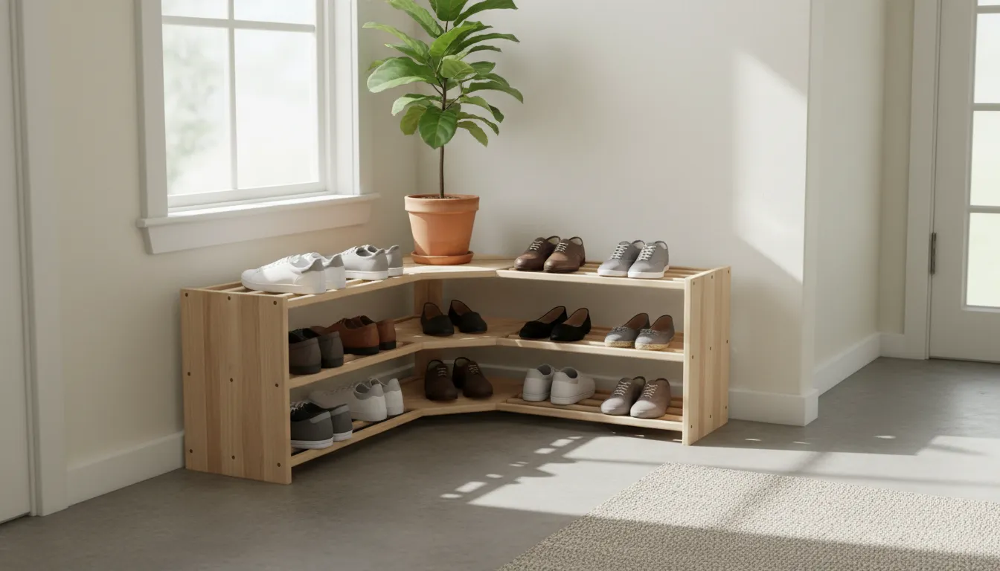
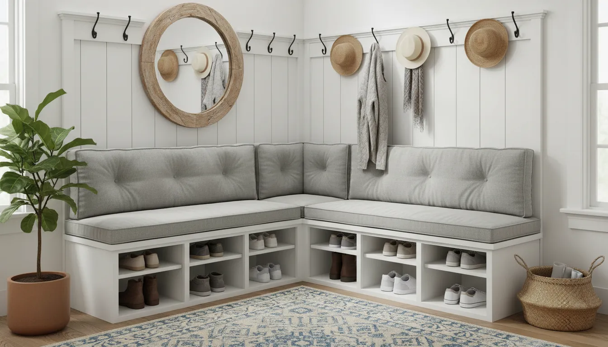
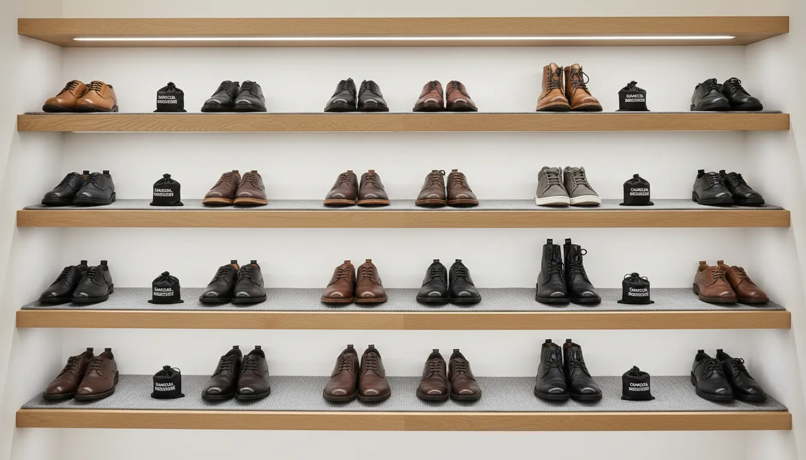

# Corner Shoe Storage Solutions: Utilizing Awkward Entryway Spaces

The entryway is the architectural handshake of your home. It is the first space that greets you after a long day and the primary impression guests receive upon arrival. However, for many homeowners and apartment dwellers, the entryway is also a chaotic bottleneck. It is a transition zone where exterior debris meets interior calm, often resulting in a cluttered pile of footwear that obstructs traffic flow and disrupts visual harmony.

The challenge is exacerbated in smaller homes where square footage is at a premium. In these scenarios, standard rectangular shoe racks or expansive mudroom lockers are simply not feasible. They protrude into walkways, bang against door frames, and generally consume too much usable floor area. This brings us to the most underutilized asset in interior design: the corner.

Corners are frequently dismissed as "dead space"—awkward geometrical artifacts where dust bunnies congregate. However, with the right strategic approach, these angular recesses can be transformed into high-efficiency storage zones. By leveraging verticality and specialized furniture design, a corner shoe storage solution can triple your storage capacity without sacrificing floor space. This guide explores the mechanics, aesthetics, and practical implementation of corner shoe storage to reclaim your entryway.

## The Geometry of Efficiency: Why Corners Matter

To understand the value of corner storage, one must first appreciate the geometry of the room. Most furniture is designed to sit flush against a flat wall. When you place a standard cabinet near a corner, you often leave a gap of six to twelve inches to accommodate baseboards or to prevent the unit from looking crowded. This gap is wasted real estate.

Corner-specific furniture creates a hypotenuse across that right angle or utilizes a pie-shaped footprint that nestles deep into the junction of two walls. This allows for a deeper storage cavity than a standard narrow hallway console could provide, without jutting out into the walking path. 

Furthermore, corners naturally draw the eye upward. A tall, slender unit placed in a corner acts as a visual anchor, increasing the perceived height of the ceiling while keeping the floor area open. This concept is central to [maximizing vertical storage](/posts/maximizing-vertical-storage) in compact living environments. By moving storage upward rather than outward, you maintain the "flow" of the room, essential for high-traffic areas like foyers and mudrooms.

## Assessing Your Entryway Architecture

Before purchasing furniture or breaking out the power tools, a thorough assessment of your specific entryway architecture is required. Not all corners are created equal, and overlooking structural details can lead to installation failures.

### 1. Accurate Measurement Protocols
Measuring a corner requires more than determining the distance from wall to wall. You must account for obstructions that could interfere with the placement of a storage unit.

*   **Baseboards and Molding:** Standard baseboards can add 0.5 to 1 inch of depth. If you are buying a pre-made unit, check if the legs are inset to accommodate baseboards, or be prepared to mount the unit to the wall above the trim.
*   **Switches and Outlets:** Ensure that a tall corner tower will not cover essential light switches or thermostat controls.
*   **Door Swing:** This is the most critical factor in entryways. Open your front door (and any adjacent closet doors) fully. Measure the clearance radius. Your storage solution must not impede the door from opening at least 90 degrees.
*   **Ventilation:** Avoid blocking floor registers or cold air returns, as this can impact your home's HVAC efficiency.

### 2. Inventory Analysis
The type of storage you need depends entirely on the footwear you own. A household of four with a penchant for hiking boots requires a vastly different system than a single professional with a collection of loafers and heels. 

Conduct a realistic inventory of the shoes that effectively "live" in the entryway. Do not count the dress shoes stored in the bedroom closet. Focus on the daily rotation. Count the pairs and measure the height of the tallest boots. This data will dictate the shelf spacing and depth required for your solution.

## Strategic Solutions for Corner Storage

Once you have mapped your space and defined your inventory, you can select a storage mechanism. Solutions generally fall into three categories: vertical towers, rotating systems, and hybrid furniture.

### Vertical Corner Towers: The Skyscraper Approach
For narrow corners where floor space is less than 20 inches wide, the vertical tower is the superior choice. these units typically feature triangular or trapezoidal shelves that stack upwards, sometimes reaching floor-to-ceiling heights.

The primary advantage of the vertical tower is density. You can fit seven to ten pairs of shoes in a footprint that creates almost no visual bulk. When selecting a tower, prioritize stability. Because they have a high center of gravity, they must be anchored to the wall to prevent tipping, especially in households with children or pets.

**Material Considerations:**
*   **Metal Wire:** Offers excellent ventilation, allowing damp shoes to dry quickly. However, dirt can fall through the wires onto the shoes below.
*   **Solid Wood/Laminate:** Provides a cleaner look and prevents debris transfer, but may require occasional wiping to remove mud or dust.
*   **Bamboo:** A sustainable, moisture-resistant option that works well in humid environments.

For those seeking a ready-made solution that balances aesthetics with rugged utility, consider a dedicated tall rack system.

[Check Price on Amazon: Tall Corner Shoe Rack Organizer](https://www.amazon.com/s?k=Tall+Corner+Shoe+Rack+Organizer&tag=hats0f8-20)

### The Rotating "Lazy Susan" Cabinet
Perhaps the most ingenious innovation in shoe storage is the rotating tower. These cylindrical or square cabinets feature internal shelving on a central pivot, allowing the user to spin the unit 360 degrees. 

The rotating mechanism doubles the accessibility of the storage. In a standard deep corner cabinet, shoes pushed to the back are often forgotten (the "black hole" effect). A rotating system brings the back to the front instantly. These units are often enclosed, which provides the added benefit of hiding the visual clutter of mismatched footwear behind a sleek facade.

While these units often carry a higher price point due to the hardware involved, their capacity is unmatched. A well-designed rotating tower can hold 20 to 30 pairs of shoes in a footprint of just 24 square inches.

[Check Price on Amazon: 360 Rotating Shoe Tower Cabinet](https://www.amazon.com/s?k=360+Rotating+Shoe+Tower+Cabinet&tag=hats0f8-20)

### Corner Benches and Hybrid Furniture
If your entryway lacks a seating area, a corner bench with integrated storage offers dual functionality. These L-shaped or triangular benches provide a place to sit while putting on shoes, which is particularly helpful for households with young children or elderly family members.

Storage in these units is typically accessed via:
1.  **Open Shelving underneath:** Good for frequently used shoes.
2.  **Lift-top Compartments:** Best for out-of-season items or accessories like umbrellas and shoe polish.
3.  **Drawers:** Offers concealed storage but requires clearance to open.

A corner bench grounds the entryway, making it feel like a furnished room rather than a hallway. To maximize utility, pair a corner bench with wall-mounted hooks above it for coats and bags, creating a complete "drop zone."

[Check Price on Amazon: Corner Entryway Bench With Shelf](https://www.amazon.com/s?k=Corner+Entryway+Bench+With+Shelf&tag=hats0f8-20)

## DIY and Custom Built-In Strategies

For those with irregular corners or a desire for a seamless architectural look, off-the-shelf products may not suffice. Custom built-ins or DIY modifications can yield professional results that add value to the home.

### The Floating Corner Shelf System
Floating shelves are excellent for keeping the floor clear, which makes vacuuming easier and maintains a sense of openness.
*   **Installation:** Use heavy-duty L-brackets or hidden floating shelf brackets anchored into the studs. 
*   **Spacing:** Install the bottom shelf at least 6 inches off the floor to allow for boot placement underneath. Space subsequent shelves 8 to 10 inches apart for standard shoes.
*   **Corner Joinery:** If building from scratch, miter the corners of the shelves at a 45-degree angle for a polished look, or butt-joint them if a rustic aesthetic is preferred.

### Tension Rod Hacks
For renters who cannot drill into walls, a high-tension rod system can create a makeshift corner closet. By installing tension rods vertically between the floor and ceiling, and attaching adjustable shelving or fabric organizers between them, you create a customizable rack that leaves no trace upon removal.

### Repurposing Bookcases
A standard narrow bookcase can be angled into a corner. However, this leaves a triangular gap behind the unit. Savvy DIYers can enclose this gap with trim to create a "built-in" appearance, or use the hidden space to run charging cables for electronics, turning the top of the shoe rack into a charging station.

## Design Integration: Merging Utility with Style

Storage should not look like an afterthought. To ensure your corner shoe solution elevates your home decor rather than detracting from it, consider the principles of visual weight and material harmony.

### Color Theory and Visual Weight
In a small entryway, heavy, dark furniture can feel oppressive.
*   **Match the Wall Color:** Painting a shelving unit the same color as the walls (e.g., "drenching") makes the storage disappear visually, reducing the feeling of clutter.
*   **Mirrored Finishes:** Some high-end rotating cabinets feature mirrored fronts. This serves a dual purpose: it provides a full-length mirror for outfit checks and reflects light to make the hallway appear larger.
*   **Open vs. Closed:** Open shelving forces you to be organized. If you know you are prone to tossing shoes haphazardly, opt for closed cabinetry. The visual peace of a closed door is often worth the extra investment.

### Lighting the Corner
Corners are notoriously dark. Adding lighting transforms a storage rack into a display feature.
*   **Puck Lights:** Battery-operated LED puck lights attached to the underside of shelves make it easy to identify shoes and add a boutique-like ambiance.
*   **Motion Sensors:** Installing a motion-sensor light strip at the base of the unit provides safety lighting for late-night arrivals without the need to fumble for switches.

## Advanced Organization Techniques

Owning the furniture is only half the battle; maintaining the system requires discipline and smart organization tactics.

### The "One-In, One-Out" Rule
Entryway storage is finite. It should be treated as a transit zone, not a permanent archive. Adopting a strict policy where a new pair of shoes entering the rack necessitates an old pair moving to the bedroom closet or donation pile prevents overflow.

### Categorization by Frequency
Structure the verticality of your storage based on usage frequency:
*   **Eye Level:** Daily drivers (sneakers, work shoes).
*   **Bottom Level:** Heavy items (boots) or shoes that are easily slipped on without bending down too far.
*   **Top Level:** Occasional wear or seasonal items.

### Managing Dirt and Moisture
The entryway is where the outside world touches your home. 
*   **Shelf Liners:** Use washable plastic or rubber liners on your corner shelves. This protects the wood from water damage and makes cleaning mud simple.
*   **Boot Trays:** Place a dedicated corner-shaped boot tray at the very bottom of your unit for wet weather gear.
*   **Odor Control:** Corners can trap air. Incorporate small sachets of activated charcoal or cedar blocks into the back of the shelves to neutralize odors naturally.

## The Psychology of an Organized Entryway

There is a distinct psychological benefit to resolving the chaos of the entryway. The concept of "cognitive load" suggests that physical clutter competes for our attention, resulting in decreased performance and increased stress. When you walk through the door and immediately step over a pile of shoes, your brain registers a "task" that needs to be done.

By implementing a dedicated corner solution, you are not just cleaning a floor; you are creating a mental boundary between the stress of the outside world and the sanctuary of your home. A streamlined entry sets the tone for the rest of the living space. It signals that the home is managed, ordered, and peaceful.

## Conclusion

The "awkward" corner is only awkward because it lacks purpose. By assigning it the specific function of shoe storage, you transform a architectural deficit into a highly efficient asset. Whether you opt for a sleek vertical metal tower, a high-capacity rotating cabinet, or a custom-built floating shelf system, the key is to respect the geometry of the space and the reality of your lifestyle.

Do not let your entryway become a stumbling block. Look to the corners. With the right planning and the appropriate storage vessels, you can reclaim your floor space and ensure that your home’s first impression is one of elegance and order.

For further inspiration on managing tight spaces, explore our guide on [small entryway organization ideas](/posts/small-entryway-organization-ideas) to continue your journey toward a clutter-free home.