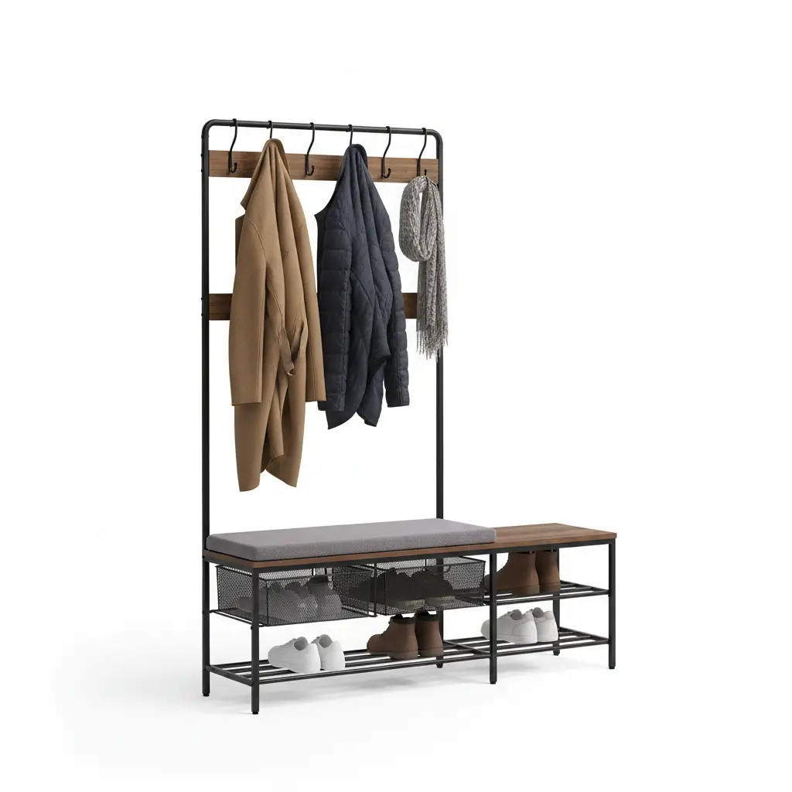

The entryway is more than just a passage from the outside world into your sanctuary; it is the "handshake" of your home. It sets the tone, provides the first impression, and—crucially—acts as the primary staging area for your daily life. At the heart of a functional entryway often sits the **hall tree**. While many hall trees are beautiful right out of the box, they are frequently treated as static pieces of furniture. However, the true magic happens when you treat a hall tree as a canvas for **customization and personal expression**.

Customizing your hall tree isn't just about aesthetics; it’s about aligning the furniture with the specific rhythms of your household. Whether you are a busy parent managing a mountain of backpacks, a minimalist seeking a sleek drop-zone, or a vintage lover looking to add character, this guide will walk you through the deep-dive process of adding personal touches and accessories to your hall tree.

## The Philosophy of the "Personalized Drop Zone"

Before we dive into the "how," we must understand the "why." A standard hall tree provides hooks, a bench, and perhaps some cubbies. But a **customized hall tree** addresses the nuances of your life. Do you always lose your keys? You need a dedicated bowl or magnetic strip. Is your hall tree in a dark corner? You need integrated lighting. 

Personalization bridges the gap between **utility and beauty**. By adding accessories that reflect your style—be it farmhouse, industrial, or modern—you transform a utilitarian object into a focal point of interior design.

## 1. Enhancing Functionality with High-End Accessories

The first step in customization is often upgrading the hardware and organizational components. Most mass-produced hall trees come with standard, functional, but often uninspired hardware.

### Upgrading the Hooks
One of the easiest yet most impactful changes you can make is swapping out the stock hooks. Consider **heavy-duty wrought iron hooks** for a rustic look or **brushed gold hardware** for a touch of modern luxury. When installing new hooks, think about "staggering" them. Placing hooks at different heights allows children to reach their own coats while keeping adult-length coats from dragging on the bench.

### The Power of Baskets and Bins
Cubbies are only as useful as the containers inside them. To customize your look:
- **Woven Seagrass Baskets:** Perfect for a coastal or organic modern vibe. They hide clutter effectively.
- **Metal Wire Bins:** Great for industrial styles; they allow you to see exactly what is inside.
- **Fabric Bins with Labels:** Ideal for families. Assign a bin to each family member to streamline the morning rush.

### Integrated Lighting
Many entryways lack sufficient natural light. Adding **battery-operated LED puck lights** or motion-sensor strips under the upper shelves of your hall tree can create a high-end, custom-built look without the need for an electrician. This "under-cabinet" style lighting makes it easier to find items in the early morning or late evening.

## 2. Adding Texture and Comfort: The Textile Layer

A hall tree can often feel "hard" due to its wood or metal construction. To soften the look and make it more inviting, you must introduce textiles.

### The Bench Cushion
If your hall tree features a seating area, a custom cushion is a game-changer. You can find standard sizes online, or for a truly personal touch, choose a durable outdoor fabric (which resists stains and wear) and have a custom foam pad covered. This adds a pop of color and makes the act of putting on shoes much more comfortable.

### Throw Pillows and Blankets
While it might seem counterintuitive to put a throw pillow in a mudroom area, a single, well-placed lumbar pillow can tie the entryway into the rest of your home’s decor. In colder months, draping a small wool throw over the bench adds a layer of "hygge" and warmth.

## 3. Top 3 Products to Elevate Your Hall Tree Customization

To help you get started on your customization journey, we have selected three high-quality products that serve as excellent bases or essential accessories for a personalized entryway.

### Product 1: VASAGLE Hall Tree with Storage Bench and Coat Rack

The **VASAGLE Hall Tree** is the quintessential "blank canvas" for customization. Its industrial mix of wood tones and matte black steel provides a sturdy foundation that works with various decor styles. It features a generous bench, 9 movable hooks, and two wire mesh shelves for shoes.

**Why it’s great for customization:**
The movable hooks are the standout feature here. Unlike fixed hooks, you can slide these to accommodate wider bags or bulky winter parkas. The mesh shelves are also perfect for adding "S-hooks" to hang umbrellas or dog leashes on the sides.

*   **Pros:** Extremely sturdy, adjustable feet for uneven floors, easy to assemble.
*   **Cons:** The industrial look may require extra "softening" with textiles if you prefer a traditional style.

[Check Price on Amazon](https://www.amazon.com/s?k=VASAGLE+Hall+Tree+with+Storage+Bench&tag=hats0f8-20)

---

### Product 2: Household Essentials Seagrass Wicker Baskets (Set of 2)

To truly customize a hall tree, you need high-quality storage. These **Household Essentials Seagrass Baskets** are designed to fit perfectly into standard cubbies. The natural texture provides a beautiful contrast to wood or metal frames.

**Why it’s great for customization:**
These baskets allow you to categorize your entryway. Use one for "Out the Door" essentials (sunscreen, sunglasses, keys) and the other for "Winter Wear" (gloves, scarves). They instantly hide the visual noise of small items.

*   **Pros:** Hand-woven, eco-friendly material, fits most standard hall tree cubbies.
*   **Cons:** Seagrass can have a natural scent initially that fades over time.

[Check Price on Amazon](https://www.amazon.com/s?k=Household+Essentials+Seagrass+Wicker+Baskets&tag=hats0f8-20)

---

### Product 3: Liberty Hardware Heavy Duty Coat and Hat Hook (6-Pack)

If you are looking to upgrade a basic hall tree or a DIY build, the **Liberty Hardware Heavy Duty Hooks** are the gold standard. Finished in a sophisticated Flat Black or Champagne Bronze, these hooks add an immediate sense of "custom cabinetry" to any piece of furniture.

**Why it’s great for customization:**
Replacing standard single hooks with these double-prong hooks effectively doubles your storage capacity. They are designed to hold heavy backpacks and winter coats without bending or pulling away from the wood.

*   **Pros:** High weight capacity, classic design, includes all mounting hardware.
*   **Cons:** Requires a drill for installation on solid wood surfaces.

[Check Price on Amazon](https://www.amazon.com/s?k=Liberty+Hardware+Heavy+Duty+Coat+Hooks&tag=hats0f8-20)

---

## 4. DIY Customization: Paint, Wallpaper, and Trim

For those who want to go beyond accessories, structural and surface-level DIY changes can completely transform a store-bought hall tree.

### The Power of Paint
Don't feel limited by the finish your hall tree came in. A weekend project involving **chalk paint** can turn a dark, heavy-looking piece into a light, airy farmhouse staple. For a modern look, consider a deep charcoal or navy blue with brass hardware. 

*Pro Tip:* If your hall tree is made of laminate or MDF, be sure to use a high-quality "bonding primer" first to ensure the paint adheres properly.

### Adding a Backdrop
The "back" of the hall tree is often a plain panel. This is a prime location for **peel-and-stick wallpaper**. 
- **Botanical prints** add a touch of nature.
- **Geometric patterns** create a modern, edgy vibe.
- **Beadboard paneling** (even the thin, glue-on versions) adds architectural interest and a classic mudroom feel.

### Mirror Magic
If your hall tree doesn't have a mirror, consider adding one. Not only is it practical for a last-minute hair check, but it also reflects light, making a small entryway feel significantly larger. You can find lightweight acrylic mirrors or small framed mirrors that can be mounted directly to the back panel.

## 5. Seasonal Styling: Keeping it Fresh

A customized hall tree should evolve with the seasons. This keeps your entryway from feeling stagnant and ensures it remains functional year-round.

### Spring/Summer
- **Accessories:** Swap heavy baskets for light cotton totes. 
- **Decor:** Add a small vase of fresh flowers or a potted "pothos" plant on the top shelf.
- **Function:** Dedicate a lower bin to beach towels or sunscreen.

### Fall/Winter
- **Accessories:** Introduce a boot tray at the base of the hall tree to catch snow and mud. 
- **Decor:** Drape a festive garland or a chunky knit blanket.
- **Function:** Increase the number of hooks or use "S-hooks" to hang damp umbrellas and heavy scarves.

## 6. Buying Guide: Choosing the Right Base for Customization

If you haven't purchased your hall tree yet, keep these factors in mind to ensure it is "customization-friendly":

1.  **Material:** Solid wood is the easiest to paint and drill into. However, high-quality engineered wood with a thick veneer is also a great candidate for most accessories.
2.  **Depth:** Ensure the bench is deep enough (at least 15-18 inches) to accommodate a cushion.
3.  **Backing:** Look for a hall tree with a solid back panel rather than an open frame if you plan on adding wallpaper or mounting extra mirrors.
4.  **Weight Capacity:** If you plan on sitting on the bench daily, look for a weight capacity of at least 250 lbs.

For more insights on selecting the perfect foundation, check out our guide on [Choosing the Right Hall Tree for Your Space](/posts/choosing-the-right-hall-tree).

## 7. Organizing by "Zone"

To make your customized hall tree truly functional, organize it into zones:
- **The High Zone (Top Shelf):** Seasonal items, hats, or decorative baskets for things you don't use daily.
- **The Mid Zone (Hooks):** The "active" zone for coats, bags, and keys.
- **The Seating Zone (Bench):** Comfort and a place to transition.
- **The Low Zone (Cubbies/Floor):** Heavy footwear, sports equipment, and pet supplies.

By assigning a purpose to every inch, you prevent the hall tree from becoming a "clutter magnet."

## Conclusion

Customizing your hall tree is a rewarding project that blends interior design with practical organization. By starting with a solid foundation like the **VASAGLE Hall Tree**, adding high-quality storage like **Seagrass Baskets**, and upgrading to **Heavy Duty Hooks**, you create a piece of furniture that is uniquely yours. 

Remember, the goal is to create a space that makes your life easier. Whether it’s through a fresh coat of paint, a comfortable bench cushion, or perfectly labeled bins, every personal touch you add makes your home feel more welcoming and organized. Your entryway is the gateway to your life—make sure it reflects the very best of it.

For more inspiration on entryway organization, don't miss our post on [Maximizing Small Entryway Storage](/posts/maximizing-small-entryway-storage).