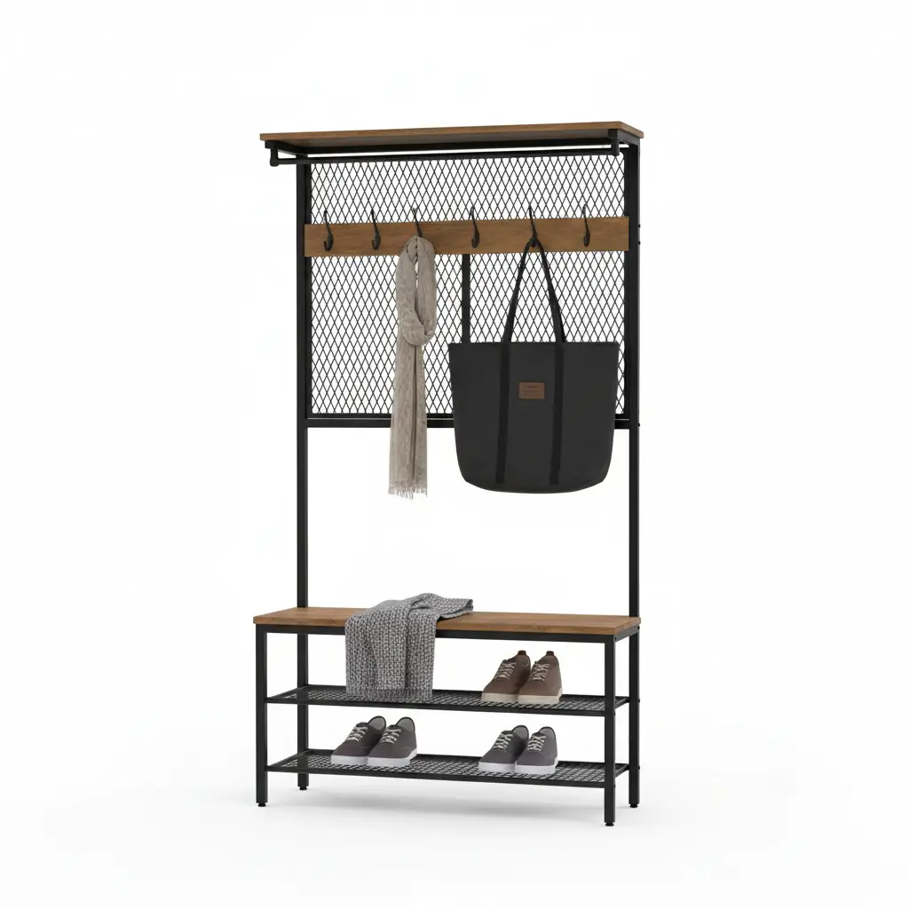
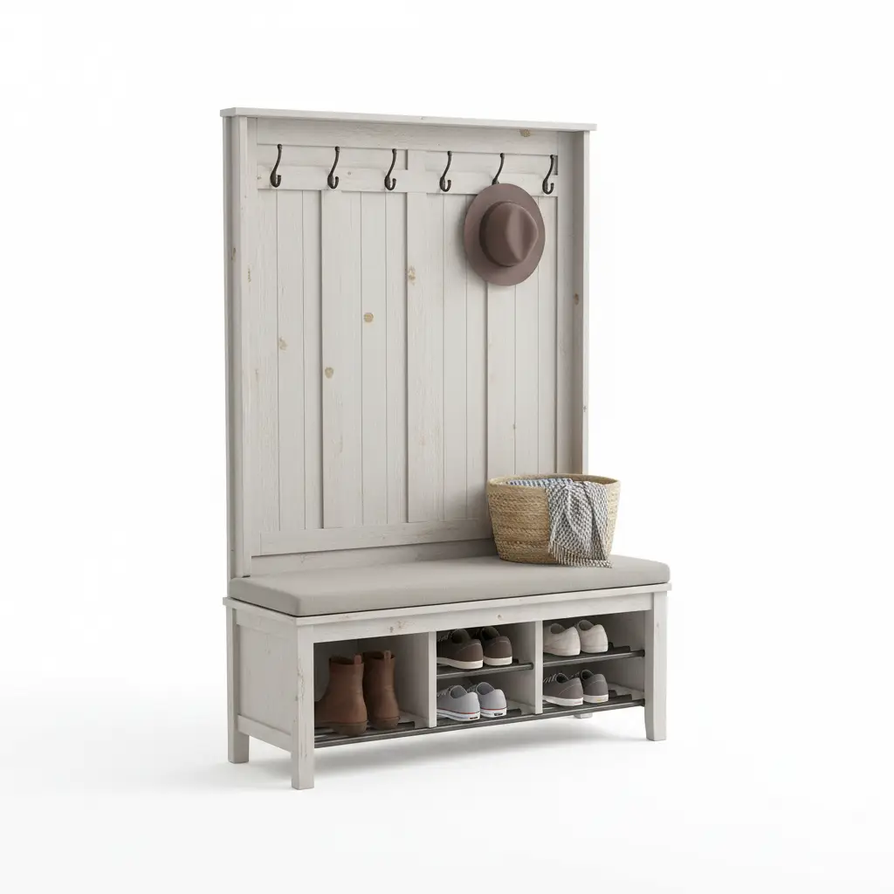
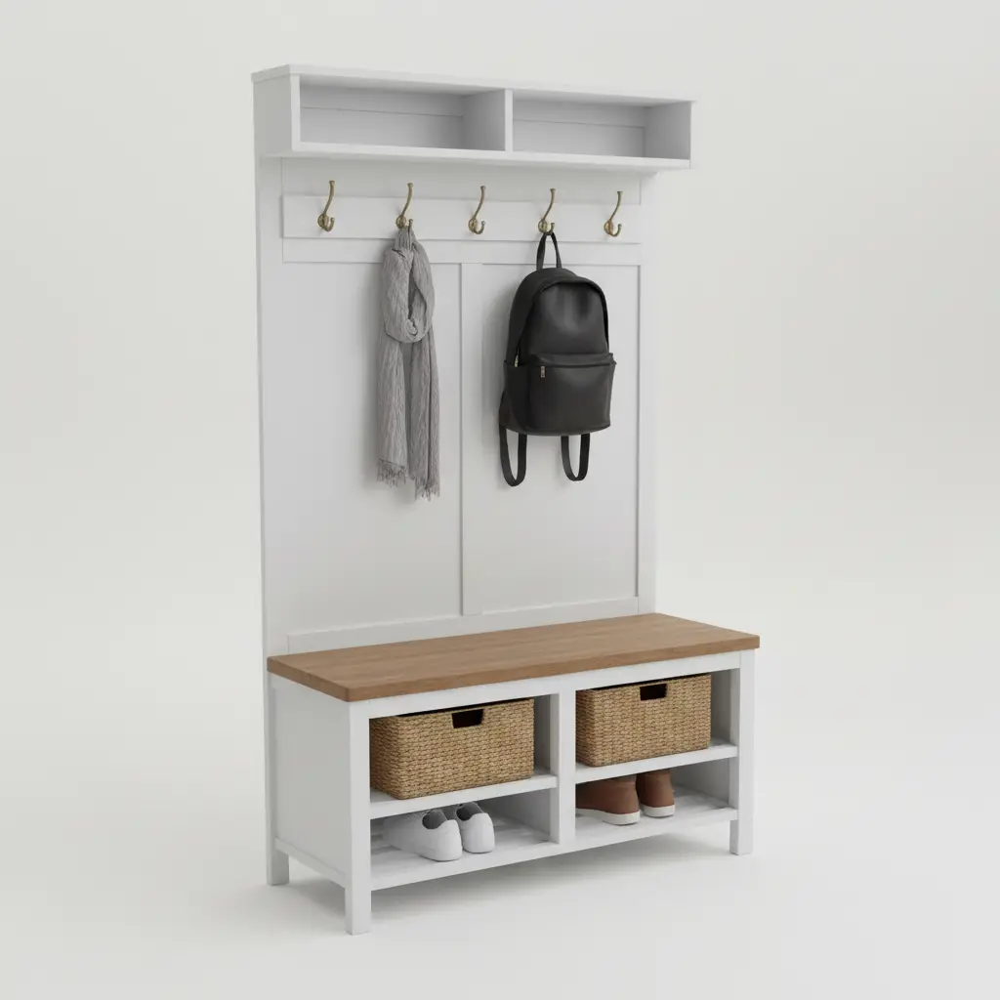

The entryway is the first thing you see when you walk through the door and the last thing you see when you leave. For many, it is a chaotic "drop zone" for mail, keys, shoes, and coats. Enter the **hall tree**—the undisputed champion of entryway organization. However, as you begin shopping for the perfect piece, you might find yourself submerged in a sea of industry jargon. What is the difference between a cubby and a hutch? Does a "mission style" hall tree differ from a "farmhouse" one? 

In this exhaustive guide, we will decode the complex world of hall tree terminology. Whether you are a first-time homeowner or a seasoned interior designer, understanding these terms is crucial to selecting a piece that is as functional as it is beautiful. By the end of this 2500-word deep dive, you will be an expert in hooks, benches, cubbies, and everything in between.

## The Anatomy of a Hall Tree: A Structural Breakdown

To understand the terminology, we must first look at the anatomy. A hall tree is rarely just one piece of wood; it is a multi-functional system designed to solve specific organizational problems.

### 1. The Bench (The Foundation)
The **bench** is the most recognizable component of a hall tree. It serves two primary purposes: a place to sit while putting on or taking off shoes, and a storage vessel.

*   **Flip-Top Bench:** This features a hinged seat that lifts to reveal a large storage compartment. It is ideal for hiding away seasonal items like scarves or heavy winter boots.
*   **Open-Shelf Bench:** Instead of a closed compartment, the area under the seat features open shelves, often used for immediate shoe access.
*   **Drawer Bench:** Some premium hall trees replace the flip-top with pull-out drawers, which offer a more organized way to store smaller items like dog leashes or umbrellas.

### 2. The Hooks (The Vertical Storage)
Without **hooks**, a hall tree is just a bench. The hooks are what provide the "tree" aspect of the furniture.

*   **Double-Prong Hooks:** These are shaped like a "V" or a "U," allowing you to hang a coat on the top prong and a bag or hat on the bottom.
*   **Hat Hooks:** Usually located at the very top of the unit, these have a longer projection to prevent hats from losing their shape.
*   **Weight Capacity:** This is a technical term you must watch for. High-quality hooks are usually made of zinc die-cast or wrought iron and should support at least 10–15 lbs each.

### 3. Cubbies and Shelving (The Organizers)
**Cubbies** are the small, square, or rectangular compartments that provide dedicated spaces for individual items.

*   **Upper Cubbies:** These are often used for bins or baskets containing "out-the-door" essentials like sunglasses or outgoing mail.
*   **Lower Cubbies:** Specifically designed for shoes. A standard hall tree might feature 4 to 12 lower cubbies.
*   **Adjustable Shelving:** Some modern hall trees allow you to move the internal dividers to accommodate taller boots or larger bags.

### 4. The Hutch or Back Panel
The **hutch** refers to the upper portion of the hall tree that sits atop the bench. The **back panel** is the vertical surface that connects the two. 

*   **Beadboard:** A style of back panel featuring narrow vertical wood planks separated by a small ridge (the "bead"). This is a staple of coastal and farmhouse designs.
*   **Wainscoting:** Similar to beadboard but often uses wider panels. It adds a touch of traditional elegance and protects your walls from scuffs.
*   **Mirrored Back:** Some hall trees include a full-length or half-length mirror integrated into the back panel, perfect for a last-minute appearance check.

## Style Terminology: Finding Your Aesthetic

When browsing for hall trees, you will encounter various style descriptors. Understanding these will help you match the piece to your existing home decor.

### Farmhouse vs. Industrial
**Farmhouse** hall trees often feature white or "distressed" wood finishes, beadboard back panels, and oil-rubbed bronze hardware. They evoke a sense of rustic comfort. In contrast, **Industrial** hall trees utilize a mix of raw wood and black metal frames. They are minimalist, sturdy, and often feature "X-frame" supports for added stability.

### Mid-Century Modern (MCM)
An MCM hall tree will have tapered "peg" legs, clean lines, and usually a warm acorn or walnut finish. These are generally more compact and focus on form as much as function.

### Traditional and Mission Style
**Traditional** pieces are characterized by crown molding at the top and decorative base molding at the bottom. **Mission style** is a subset of traditional design that emphasizes simple horizontal and vertical lines and heavy oak construction, often featuring "slat" designs rather than solid panels.

---

## Top 3 Hall Tree Recommendations for 2026

To help you apply this terminology, we have selected three top-tier products available on Amazon. Each represents a different style and set of features.

### 1. VASAGLE Industrial Hall Tree with Bench and Shoe Storage

The VASAGLE Industrial Hall Tree is the gold standard for those seeking a "mixed material" look. It perfectly illustrates the **Industrial style** terminology discussed earlier, featuring a matte black steel frame and rustic brown engineered wood.

**Key Features:**
*   **9 Removable Hooks:** Each hook has a high weight capacity, allowing for customization of the vertical storage space.
*   **Integrated Shoe Bench:** A sturdy bench that can hold up to 176 lbs, perfect for sitting while lacing up.
*   **Two Wire Shelves:** These provide excellent ventilation for shoes, preventing odors from lingering.

**Pros:**
*   Extremely easy assembly with numbered parts.
*   Slim profile (only 12.6 inches deep), making it ideal for narrow hallways.
*   Includes an anti-tip kit for safety.

**Cons:**
*   The wire shelves may not be suitable for high heels.
*   Engineered wood may not have the longevity of solid oak.

[Check Price on Amazon](https://www.amazon.com/s?k=VASAGLE+Hall+Tree+with+Bench&tag=hats0f8-20)

---

### 2. Bush Furniture Salinas Hall Tree with Shoe Storage Bench

If you are looking for **Mission style** or **Farmhouse** aesthetics, the Bush Furniture Salinas model is an excellent choice. It features the classic "tapered legs" and "decorative accents" that define traditional entryway furniture.

**Key Features:**
*   **Four Cubby Shelves:** The base features open cubbies specifically sized for shoes and baskets.
*   **Double-Prong Hooks:** Three large hooks provide six hanging points for coats and bags.
*   **Distressed Finish:** Available in several colors like Antique White or Cape Cod Gray.

**Pros:**
*   Very sturdy construction with a high-quality finish that resists scratches.
*   The bench is wide enough for two people to sit comfortably.
*   Matches other furniture in the Salinas collection for a cohesive look.

**Cons:**
*   Assembly is time-consuming (expect 2-3 hours).
*   The unit is quite heavy, requiring two people to move.

[Check Price on Amazon](https://www.amazon.com/s?k=Bush+Furniture+Salinas+Hall+Tree&tag=hats0f8-20)

---

### 3. Crosley Furniture Brennan Entryway Hall Tree

The Crosley Brennan is the epitome of **Traditional** design with a focus on "closed storage." It is a robust piece that functions almost like a built-in mudroom locker.

**Key Features:**
*   **Upper Shelf and Cubbies:** Provides extra space for hats or decorative items.
*   **Large Drawer Storage:** Instead of an open shoe rack, it features two large pull-out drawers to hide clutter.
*   **Solid Wood and Veneer:** A higher-end material choice compared to basic particle board.

**Pros:**
*   Elegant design that looks like custom cabinetry.
*   The drawers use full-extension glides for smooth operation.
*   Classic hardware that complements most traditional homes.

**Cons:**
*   Premium price point.
*   Requires a larger footprint; not suitable for tiny foyers.

[Check Price on Amazon](https://www.amazon.com/s?k=Crosley+Furniture+Brennan+Hall+Tree&tag=hats0f8-20)

---

## Technical Specifications: What to Look for in the Fine Print

When you are deep in the product descriptions, you will see several technical terms. Here is what they actually mean for your home.

### 1. Anti-Tip Kit (Safety First)
A hall tree is tall and, when loaded with heavy coats, can become top-heavy. An **anti-tip kit** consists of brackets and straps used to anchor the furniture to the wall studs. This is a non-negotiable feature if you have children or pets.

### 2. CARB Phase 2 Compliant
You might see this in the "Materials" section. It refers to the California Air Resources Board's standards for formaldehyde emissions in composite wood. Being **CARB Phase 2 compliant** means the product is safer for your indoor air quality.

### 3. Weight Capacity (Static vs. Dynamic)
*   **Static Weight Capacity:** The total weight the bench can hold when someone is sitting still.
*   **Dynamic Weight Capacity:** The weight the unit can handle during movement (less common for hall trees but important for the hooks).
Always look for a bench capacity of at least 200 lbs to ensure it can support an adult comfortably.

### 4. Foot Levelers
Entryway floors are often uneven, especially if they are tiled. **Foot levelers** are adjustable screw-in feet that allow you to balance the hall tree so it doesn't wobble.

## Hall Tree vs. Mudroom Locker: What's the Difference?

While the terms are often used interchangeably, there is a subtle distinction in the world of interior design.

*   **Hall Tree:** Generally a single, freestanding piece of furniture. It is designed to be aesthetically pleasing and fit into a hallway or foyer without looking like a utility item.
*   **Mudroom Locker:** Usually refers to a more "modular" or "built-in" look. Lockers are often wider and may feature vertical dividers that create individual "stalls" for each family member. If you have a dedicated mudroom, you might look for a [Modular Mudroom System](/posts/designing-mudroom-lockers-for-families-assigning-zones-and-managing-clutter), whereas a hall tree is better for a multi-purpose entryway.

## Choosing the Right Material: Solid Wood vs. Engineered Wood

The material of your hall tree dictates its price, durability, and weight.

### Solid Wood
*   **Pros:** Can be sanded and refinished; extremely durable; high resale value.
*   **Cons:** Expensive; heavy; can warp in high-humidity environments (like a foyer during a rainstorm).

### MDF (Medium Density Fiberboard)
*   **Pros:** Very affordable; smooth surface for paint; resistant to warping.
*   **Cons:** Cannot be easily repaired if water-damaged; contains adhesives.

### Metal and Wood Hybrids
*   **Pros:** The strongest construction; offers an industrial or modern aesthetic; usually the easiest to assemble.
*   **Cons:** Can feel "cold" or less traditional.

## Installation and Placement Tips

Once you have decoded the terminology and picked your product, placement is key.

1.  **The "Swing Zone":** Ensure the hall tree is placed far enough from the front door so that the door can open fully without hitting the bench.
2.  **The "Landing Strip":** Place the hall tree near a power outlet if you plan to use a charging station in one of the cubbies.
3.  **Wall Anchoring:** Even if the hall tree feels sturdy, always use the provided wall anchors. The weight of three heavy winter coats on the top hooks creates a significant leverage point that could pull the unit forward.

## Maintenance and Care

To keep your hall tree looking new, follow these simple steps:
*   **Hook Tightening:** Every six months, check the screws on the hooks. Constant use can cause them to loosen.
*   **Moisture Protection:** If you have an open shoe rack, place a small rubber tray underneath to catch melting snow or mud.
*   **Dusting:** Use a microfiber cloth to dust the upper cubbies and crown molding, which are notorious dust magnets.

## Conclusion: Mastering Your Entryway

Decoding hall tree terminology is the first step toward a more organized, stress-free home. By understanding the difference between a **flip-top bench** and an **open-shelf bench**, or recognizing the value of **beadboard** and **anti-tip kits**, you can make a purchasing decision that balances style with safety and utility.

A hall tree is more than just a piece of furniture; it is a system that manages the transition between the outside world and your private sanctuary. Whether you choose the industrial ruggedness of the **VASAGLE**, the mission-style elegance of the **Bush Furniture Salinas**, or the classic storage of the **Crosley Brennan**, you are investing in the long-term order of your home.

Don't let entryway chaos win. Use your new knowledge of hooks, cubbies, and benches to reclaim your foyer today. For more tips on maximizing small spaces, check out our guide on [Entryway Storage Solutions for Small Apartments](/posts/rental-friendly-entryway-solutions-freestanding-hall-trees-that-dont-require-anchoring).