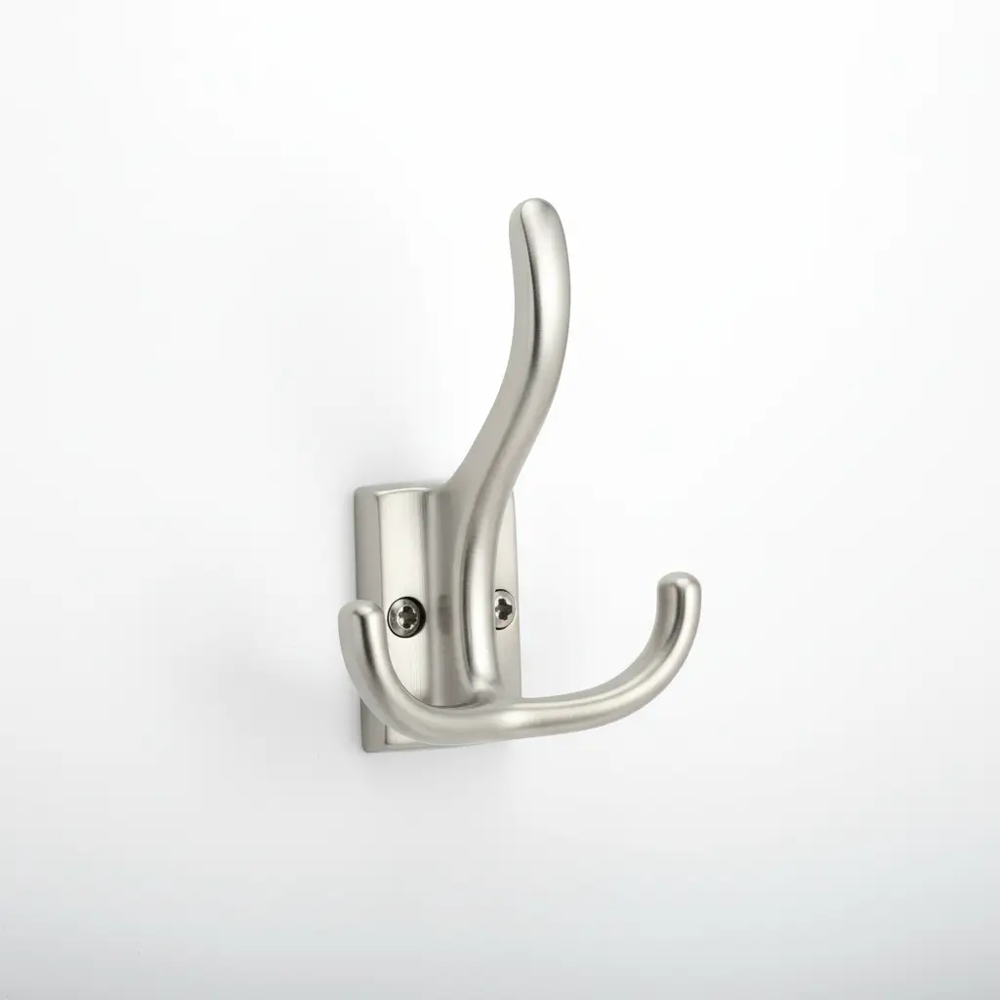
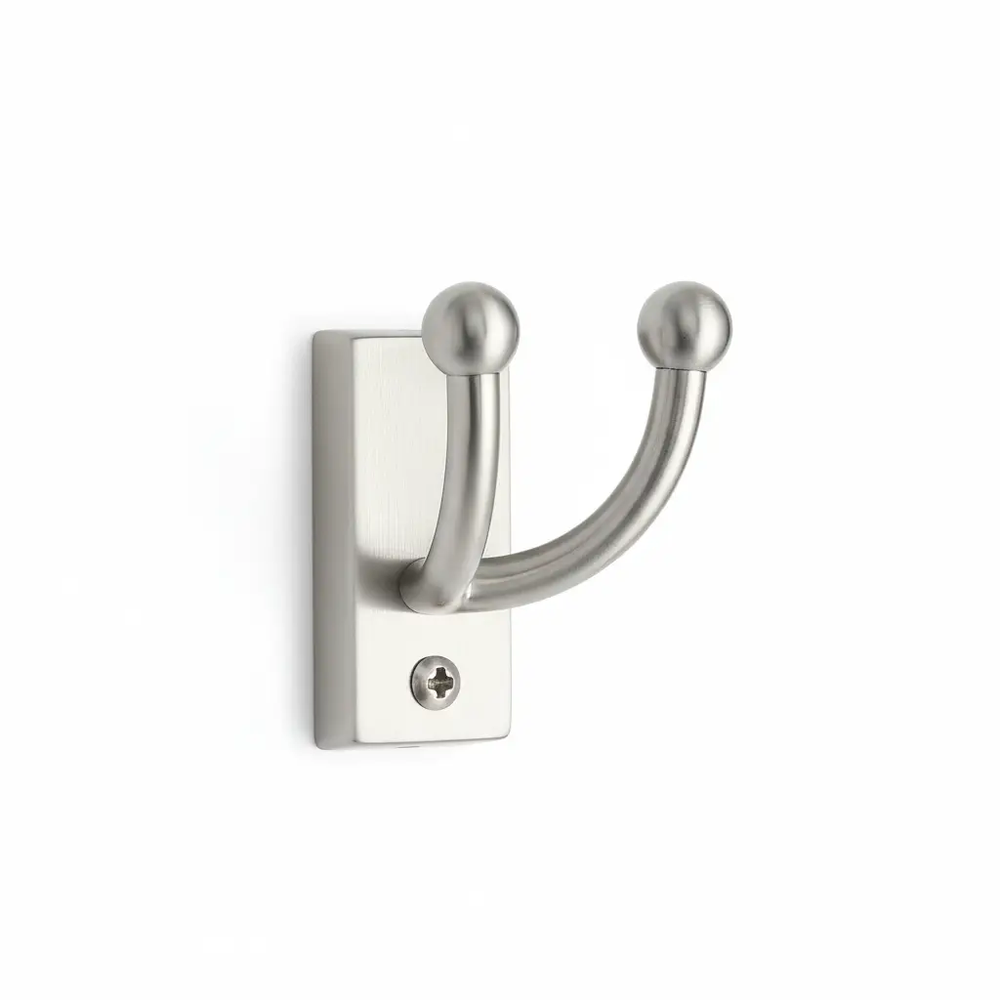

The entryway is the frontline of your home’s battle against clutter. It is the transition zone where the chaos of the outside world—rain-soaked coats, heavy school backpacks, dog leashes, and overflowing grocery bags—meets the sanctuary of your living space. At the heart of this transition zone stands the hall tree or the mudroom locker system. While we often obsess over the wood finish, the bench height, or the cubby dimensions, we frequently overlook the most critical functional component: **the hook**.

Selecting the right hardware is not merely an aesthetic choice; it is an engineering decision. A hook that snaps under the weight of a winter parka or a hook that is spaced too closely to its neighbor can render an expensive custom mudroom locker practically useless. In this deep dive, we will explore the nuances of selecting, installing, and maintaining the best hardware for your entryway storage solutions.

## The Engineering of the Entryway Hook

When we talk about hooks for a hall tree, we are discussing **load-bearing hardware**. Unlike a decorative hook in a bedroom used for a light scarf, mudroom hooks must endure significant vertical force and frequent "snag-and-pull" motions.

### Material Matters: What Are Your Hooks Made Of?
The longevity of your hardware depends heavily on its base material. Here are the most common materials used in high-quality entryway hooks:

1.  **Zinc Die-Cast:** This is the industry standard for most residential hardware. It is cost-effective, can be molded into intricate shapes, and accepts various finishes (like satin nickel or oil-rubbed bronze) exceptionally well.
2.  **Solid Brass:** The gold standard for durability and "heft." Solid brass is corrosion-resistant, making it ideal for mudrooms in humid climates or coastal areas.
3.  **Stainless Steel:** Perfect for modern or industrial designs. It offers superior strength and is virtually immune to rust, which is vital if you frequently hang wet raincoats.
4.  **Wrought Iron:** Often used for farmhouse or rustic aesthetics. While incredibly strong, genuine iron must be sealed to prevent rusting over time.

### Understanding Weight Capacity
A common mistake is assuming all hooks are created equal. Most "utility" hooks are rated for **35 to 50 pounds** when mounted into solid wood or a stud. However, the *leverage* of the hook matters. A "double prong" hook that extends three inches from the wall exerts more torque on the screws than a shallow single hook. 

For mudroom lockers intended for children’s backpacks (which can easily weigh 20+ lbs with books and laptops), you must ensure the hardware is **heavy-duty** and secured with screws long enough to penetrate at least 3/4 of an inch into the wood backing.

## Aesthetics Meets Function: Choosing Your Style

The hardware you choose acts as the "jewelry" of your furniture. It defines the style of the room as much as the paint color does.

### The Modern Minimalist
If your home features clean lines and a neutral palette, look for **Satin Nickel or Matte Black** hooks with geometric shapes. Single, straight-peg hooks offer a streamlined look but require more horizontal space to be effective.

### The Classic Farmhouse
The farmhouse look relies heavily on **Oil-Rubbed Bronze or Weathered Iron**. Double-prong hooks (often called "Coat and Hat Hooks") are the staple here. The top hook is designed for hats or lighter items, while the lower, sturdier prong handles the heavy coats.

### The Industrial Edge
For an industrial mudroom, consider hooks that mimic plumbing fixtures or those made from heavy-gauge blackened steel. These pair beautifully with reclaimed wood benches and [wire basket storage](/posts/organizing-with-wire-baskets).

## Top 3 Hardware Solutions for Hall Trees and Mudrooms

To help you narrow down your search, we have analyzed the top-performing hardware currently on the market. These selections focus on durability, ease of installation, and timeless design.

### 1. Franklin Brass Heavy Duty Coat and Hat Hook

The **Franklin Brass Heavy Duty Coat and Hat Hook** is the quintessential choice for anyone building or upgrading a mudroom. Its classic silhouette fits almost any decor style, from traditional to transitional. What sets this hook apart is its reinforced neck, designed specifically to prevent bending under the weight of heavy winter gear.

**Key Features:**
*   **Weight Capacity:** Up to 35 lbs when mounted to solid wood.
*   **Design:** Double prong (top for hats/scarves, bottom for heavy coats).
*   **Dimensions:** Approximately 5 inches in height, providing ample separation between items.

**Pros:**
*   Extremely affordable for the quality provided.
*   Available in multiple finishes including Oil-Rubbed Bronze, Satin Nickel, and White.
*   Includes matching mounting screws.

**Cons:**
*   The included screws can be soft; pre-drilling pilot holes is mandatory to avoid stripping the heads.

[Check Price on Amazon for Franklin Brass Hooks](https://www.amazon.com/s?k=Franklin+Brass+Heavy+Duty+Coat+and+Hat+Hook&tag=hats0f8-20)

---

### 2. Liberty Hardware Pilltop Double Coat Hook

If safety and fabric care are your priorities, the **Liberty Hardware Pilltop Double Coat Hook** is an exceptional choice. The "pilltop" design features rounded ends on each prong. This prevents the "hook poke" that often leaves permanent indentations or tears in delicate coat linings or knitted sweaters.

**Key Features:**
*   **Safety-First Design:** No sharp edges, making it ideal for households with young children.
*   **Material:** Zinc die-cast for long-lasting durability.
*   **Style:** Casual and versatile, perfect for a [custom DIY hall tree](/posts/diy-hall-tree-plans).

**Pros:**
*   The rounded ends make it very easy to slide items on and off.
*   Excellent finish consistency across large batches.
*   Very sturdy feel with no "wobble" once installed.

**Cons:**
*   The wider "pill" ends may not fit through very small hanging loops on some jackets.

[Check Price on Amazon for Liberty Hardware Pilltop Hooks](https://www.amazon.com/s?k=Liberty+Hardware+Pilltop+Double+Coat+Hook&tag=hats0f8-20)

---

### 3. Amazon Basics Wall Mounted Farmhouse Hook

For those tackling a large-scale mudroom project with 10 or more lockers, the **Amazon Basics Wall Mounted Farmhouse Hook** offers the best value without sacrificing the "heavy-duty" requirement. These hooks feature a wider mounting base, which distributes the load more effectively across the wood surface, reducing the risk of the hook pulling out over time.

**Key Features:**
*   **Bulk Value:** Often sold in multi-packs, significantly lowering the cost per unit.
*   **Aesthetic:** Bold, rustic design that looks great against white shiplap.
*   **Construction:** Solid metal construction with a matte finish.

**Pros:**
*   The wide base covers up old screw holes if you are replacing existing hardware.
*   The matte black finish is highly resistant to fingerprints and oil.
*   Very easy to install for beginners.

**Cons:**
*   The style is very specific to "Farmhouse" or "Industrial" and may not suit ultra-modern homes.

[Check Price on Amazon for Amazon Basics Farmhouse Hooks](https://www.amazon.com/s?k=Amazon+Basics+Wall+Mounted+Farmhouse+Hook&tag=hats0f8-20)

---

## Installation Masterclass: How to Mount Hooks Like a Pro

Even the most expensive hook will fail if it is poorly installed. Follow these steps to ensure your hall tree hardware stays put for decades.

### 1. Determining the Ideal Height
For a standard hall tree, hooks should be mounted between **48 and 60 inches** from the floor. 
*   **For Children:** Mount a secondary row of hooks at **36 to 42 inches**. This encourages independence and keeps their gear within reach.
*   **For Adults:** 60 inches is the sweet spot that allows long overcoats to hang without bunching on the bench.

### 2. Spacing for Airflow
One of the biggest mistakes in mudroom design is crowding the hooks. When coats are jammed together, they don't dry properly, leading to that "musty mudroom" smell.
*   **Minimum Spacing:** 6 inches apart.
*   **Ideal Spacing:** 10 to 12 inches apart.
*   **Locker Width:** If you are building individual lockers, aim for a width of at least 15 inches to allow a heavy coat to hang freely.

### 3. The Secret to Secure Mounting
Never trust drywall anchors in a high-traffic mudroom. If your hall tree doesn't have a solid wood back, you must ensure your hooks are screwed directly into the wall studs.
*   **Pilot Holes:** Always drill a pilot hole slightly smaller than the screw shank. This prevents the wood from splitting and makes the screw much easier to drive.
*   **Screw Length:** If mounting to a 3/4" thick wood panel, use 1" screws. This allows the screw to bite deep into the wood without poking through the back.
*   **Leveling:** Use a laser level or a long bubble level to ensure all hooks are perfectly aligned across the lockers. Even a 1/8-inch deviation will be visible to the naked eye.

## Maintenance and Longevity

Entryway hardware lives a hard life. It is exposed to salt from winter roads, moisture from rain, and the constant friction of metal zippers.

### Cleaning Your Hardware
Avoid harsh chemical cleaners, especially on plated finishes like Satin Nickel or Bronze. A simple wipe with a **damp microfiber cloth** is usually sufficient. For stubborn grime, use a drop of mild dish soap.

### Tightening the Screws
Over time, the constant "tugging" on hooks can cause screws to loosen slightly. Make it a habit to check your hooks once a year. If a screw hole becomes stripped, you can fix it by inserting a few toothpicks dipped in wood glue into the hole, letting it dry, and then re-driving the screw.

## Matching Hardware with Other Entryway Elements

To achieve a cohesive look, your hooks should "talk" to the rest of the room. 
*   **Benches:** If your [entryway bench](/posts/choosing-the-right-entryway-bench) has metal legs, try to match the hook finish to the leg finish.
*   **Lighting:** The overhead pendant or wall sconces should ideally share the same metal family (e.g., all brass or all black).
*   **Baskets:** If you use [wicker baskets](/posts/wicker-vs-plastic-bins), the hardware provides a nice structural contrast. If you use metal baskets, ensure the "sheen" matches the hooks.

## Conclusion: Small Details, Big Impact

It is easy to get lost in the "big picture" of home renovation—the flooring, the cabinetry, the layout. But as any seasoned organizer will tell you, the success of a room lies in the details. A well-chosen hook is a silent partner in your daily routine. It catches your bag when you’re tired, holds your coat when you’re cold, and keeps your home looking tidy.

By investing in high-quality materials like those from **Franklin Brass** or **Liberty Hardware**, and following proper installation techniques, you transform a simple piece of furniture into a high-performance storage machine. Don't settle for flimsy hardware; give your hall tree the strength it deserves.

For more tips on optimizing your home's transition zones, check out our guide on [Maximizing Small Entryways](/posts/maximizing-small-entryways) or explore our deep dive into [Mudroom Floor Durability](/posts/best-flooring-for-mudrooms).