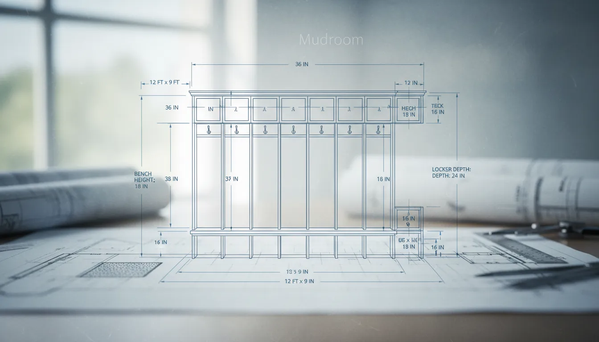
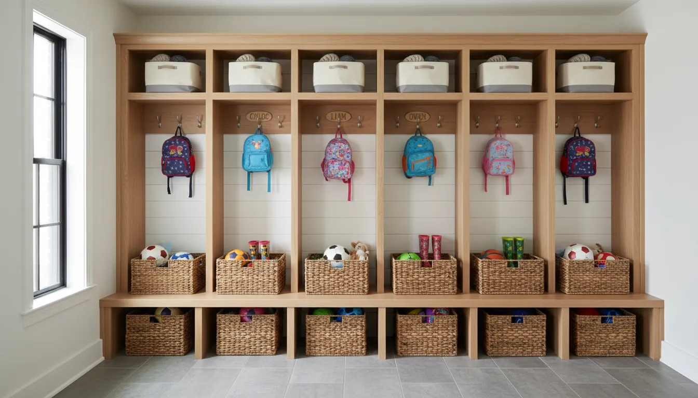
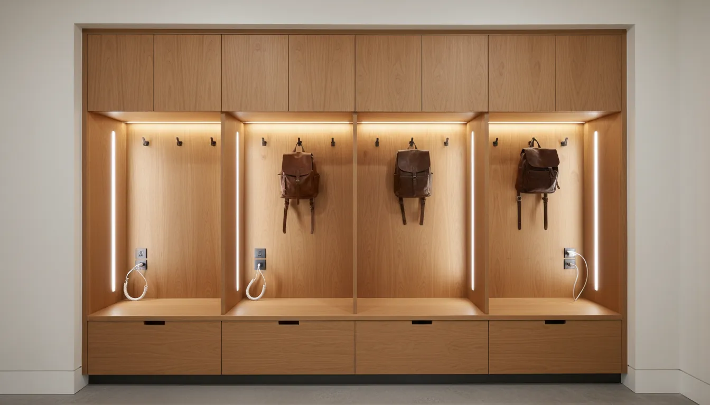

# Designing Mudroom Lockers for Families: Assigning Zones and Managing Clutter

The entryway of a family home is rarely a place of serenity. It is the transitional threshold between the outside world and the domestic sanctuary, acting as the primary collection point for the detritus of daily life. Backpacks, muddy boots, sports equipment, and an endless rotation of outerwear tend to accumulate with alarming speed. Without a structured system, this "drop zone" becomes a chaotic bottleneck that elevates stress levels the moment you walk through the door.

The most effective architectural solution to this perennial problem is the implementation of mudroom lockers. Unlike a simple coat rack or a generic closet, a locker system provides designated, vertical territory for each family member. It transforms the abstract concept of "cleaning up" into a rigid, intuitive system of spatial assignment. By designing lockers that cater to specific family needs, you not only improve the aesthetic appeal of your home but also streamline the morning rush and the evening return.

This guide explores the strategic design of mudroom lockers, focusing on structural anatomy, the psychology of zoning, and the management of clutter through intelligent storage solutions.

## The Strategic Importance of the Transitional Entryway

Architecturally, the mudroom serves as a decontamination zone. It is where the wet, the dirty, and the chaotic are stripped away before entering the main living areas. However, for families, it serves a secondary, equally critical function: it is the command center of logistics.

When an entryway lacks defined structure, items migrate. Keys end up on the kitchen island, coats drape over dining chairs, and shoes create tripping hazards in hallways. A locker system arrests this migration by creating a gravitational pull for personal belongings. The psychological benefit of a locker is ownership. When a child or partner has a specific, immutable space labeled as their own, the cognitive load of organizing their belongings is significantly reduced. They do not need to decide where to put their bag; the architecture decides for them.

Effective design requires moving beyond the basic concept of "storage" to the more nuanced concept of "flow." How do people move through the space? What are they carrying? What is the first thing they drop, and what is the last thing they grab? Answering these questions is the prerequisite to laying out a functional locker system.

## Analyzing Your Family’s Storage Requirements

Before drawing floor plans or purchasing lumber, a thorough audit of your family's lifestyle is necessary. The dimensions and features of your lockers should be dictated by what they must hold, not merely by the wall space available.

### Calculating Capacity Based on Lifestyle

Consider the specific inventory of your household. A family heavily involved in ice hockey requires vastly different spatial configurations than a family of avid hikers or urban commuters. 

Evaluate the bulk of your winter gear. Heavy parkas require deeper locker dimensions and stronger hardware than light rain jackets. If your family cycles, you may need helmet storage. If you have infants or toddlers, the lower sections of the lockers must be accessible for them to foster independence, while potentially hazardous items need to be stored in upper cabinets.

Furthermore, anticipate growth. The storage needs of a five-year-old are minimal compared to the storage needs of a teenager with a varsity sports bag and a musical instrument. Designing with generous dimensions now prevents the system from becoming obsolete in three years.

### Assessing the Physical Space

The location of the mudroom dictates the layout. Narrow hallways may require a linear run of shallow lockers, while a dedicated room allows for L-shaped or U-shaped configurations.

Standard depth for a functional locker system is typically between 15 and 24 inches. A depth of 15 inches is sufficient for hooks and shoe shelves, but 18 to 24 inches is preferred if you intend to include a seated bench area. This allows a person to sit comfortably without their knees protruding excessively into the walkway.

Vertical space is often underutilized. Standard ceilings allow for lockers to extend upward to 8 or 9 feet. Utilizing the full height of the room draws the eye upward, making the space feel larger, while providing critical storage for off-season items that do not need to be accessed daily.

## The Anatomy of the Perfect Family Locker

A successful mudroom locker is composed of four distinct zones: the upper cubby, the main compartment, the integrated bench, and the lower shoe storage. Each section plays a specific role in clutter management.

### The Upper Cubby: Long-Term Storage

The uppermost section of the locker should be reserved for items that are accessed infrequently or are seasonal in nature. This is the ideal location for winter hats in July, beach towels in December, or surplus supplies like sunscreen and bug spray.

For a cleaner aesthetic, this section is best fitted with closed cabinetry or sized perfectly to accommodate opaque baskets. Leaving this area open can result in visual clutter, as the items stored here are rarely uniform in shape or color. If you have high ceilings, installing a rolling library ladder can add a touch of classic elegance while making these upper reaches accessible.

### The Main Compartment: Daily Use and Accessibility

The middle section is the workhorse of the locker. This is where coats, backpacks, and purses live. The defining feature here is the hardware.

Double hooks are generally more efficient than single hooks, effectively doubling the hanging capacity. For families, consider staggering the height of the hooks. Place substantial, heavy-duty hooks at the adult level (approximately 60-65 inches from the floor) and secondary hooks at a child-friendly height (36-42 inches). This dual-height system allows children to hang their own backpacks and jackets, fostering a habit of tidiness from a young age.

For those interested in maximizing utility in compact areas, you might look into [creative entryway solutions for small spaces](/posts/small-entryway-storage-ideas) to see how verticality can be leveraged further.

### The Integrated Bench: Seating and Function

The bench is the pivot point of the mudroom. It provides a necessary station for putting on and taking off footwear. Without a bench, family members are likely to track mud into the house to find a place to sit, or they will balance precariously against the wall, scuffing the paint.

The bench surface should be durable—hardwood sealed with a high-traffic polyurethane or a stone slab are excellent choices. Upholstered cushions add comfort and texture but ensure the fabric is a high-performance, stain-resistant outdoor material.

### The Lower Cubby: Shoe Management

Beneath the bench lies the primary defense against floor clutter. This area should be divided to correspond with the lockers above. Open shelving is often preferred here over drawers, as it allows damp shoes to air out and makes it easy to kick shoes into place without using hands.

If you reside in a climate with heavy snow or rain, consider installing a removable tray or lining the bottom of these cubbies with rubber matting to protect the cabinetry from water damage.

## Assigning Zones for Maximum Efficiency

The "locker" concept is built on the premise of individual ownership. To make this work, you must assign zones explicitly. This prevents the inevitable encroachment of one family member’s belongings into another’s space.

### Creating Dedicated Spaces for Children

Children require visual and physical accessibility. If a hook is too high or a drawer is too heavy, they will not use it. 

Designate the lockers closest to the door for the children. This minimizes the distance they have to travel with muddy boots. Inside their zone, prioritize open storage. Children are more likely to toss a hat into a visible wire basket than to open a cabinet door, place the item on a shelf, and close the door. 

Use color-coding or personalized nameplates to demarcate their territory. This psychological trick reinforces ownership. When a locker is labeled "Sophie," Sophie is far less likely to leave her lacrosse stick in the middle of the floor.

### Adult Zones and Vertical Utilization

Adult lockers should focus on the management of "out-the-door" essentials. This includes keys, wallets, sunglasses, and charging devices. While children need large hooks for backpacks, adults often need smaller, specific organization for accessories.

Consider installing a narrow shelf or a small drawer within the main compartment of the adult lockers to serve as a landing pad for these small items. Integrating electrical outlets or USB ports inside the locker allows phones and smartwatches to be charged overnight in the entryway, preventing them from cluttering the kitchen counters or bedside tables.

### Accommodating Guests and Pets

If space permits, reserve one locker or a section of the mudroom for communal use. This "guest locker" keeps visitors' coats separate from the family's chaos. Alternatively, this space can be dedicated to the family pet. Leashes, waste bags, treats, and towels for wiping muddy paws can be stored here, keeping pet paraphernalia contained in a single, sanitary location.

## Selecting Materials and Finishes for Durability

A mudroom is a high-traffic, high-impact zone. It faces moisture, dirt, grit, and the blunt force of heavy bags. Delicate materials have no place here.

### Wood, MDF, and Moisture Resistance

Solid plywood is the superior choice for the structural carcass of the lockers due to its strength and resistance to warping. While Medium Density Fiberboard (MDF) is a common, cost-effective choice for painted cabinetry, it is highly susceptible to water damage. If you choose MDF, it is imperative that the baseboards and any sections touching the floor are made of a water-resistant material like PVC trim or solid wood, or are elevated on legs.

For the finish, opt for a high-quality enamel paint. Matte finishes, while trendy, are difficult to clean and show scuffs easily. A satin or semi-gloss finish is much more forgiving and can be wiped down with a damp cloth.

### Hardware Selection: Hooks and Handles

The hardware is the primary interface of the locker. It must be robust. Avoid cheap, decorative zinc hooks that can snap under the weight of a loaded backpack. Look for cast iron, solid brass, or heavy-gauge steel.

When selecting pulls for drawers or cabinets, choose designs that do not snag on clothing. Cup pulls or sleek bar pulls are often safer and more functional than knobs in a tight space where people are putting on coats.

## Managing Clutter: Organizational Accessories and Routines

Even the most beautifully designed locker system will fail without proper organizational accessories and adherence to a system. The goal is to contain the small items that create visual noise.

### The Role of Baskets and Bins

Uniformity creates calm. Using matching baskets in the upper and lower cubbies unifies the look of the mudroom and hides the mismatch of contents. 

For the upper shelves, woven baskets or fabric bins are excellent for storing soft items like gloves and scarves. They are lightweight, making them easy to lift down. Ensure the baskets have handles so they can be pulled out easily.

For lower shelves or areas that might see moisture, consider wire baskets or plastic bins that can be easily cleaned.

**Recommended Product:**
<https://www.amazon.com/s?k=storage+baskets+for+shelves&tag=hats0f8-20>

### Implementing the Seasonal Rotation System

A mudroom locker cannot hold everything a person owns simultaneously. To maintain order, you must practice seasonal rotation.

When spring arrives, heavy winter coats, snow pants, and thick boots must be removed from the lockers and moved to long-term storage (such as a basement cedar closet or under-bed storage). They are replaced by rain jackets, umbrellas, and light windbreakers. This rotation keeps the lockers from becoming overstuffed and ensures that only relevant items are occupying prime real estate.

To protect the floors and the bottom of your lockers during the wet months, utilizing specific boot trays is essential. They contain the meltwater from snow and prevent it from seeping into the joinery of your cabinetry.

**Recommended Product:**
<https://www.amazon.com/s?k=rubber+boot+tray&tag=hats0f8-20>

### Establishing the "Reset" Routine

Architecture supports behavior, but it does not replace it. Establishing a "Sunday Reset" routine is vital. Once a week, clear out the clutter that doesn't belong. Remove school papers from backpacks, throw away trash found in coat pockets, and return migrated items to their proper rooms.

The "Touch It Once" rule is also effective here: when you enter the house, the coat goes immediately on the hook, not on the bench to be hung up later. High-quality, accessible hooks make this habit easier to form.

**Recommended Product:**
<https://www.amazon.com/s?k=heavy+duty+coat+hooks&tag=hats0f8-20>

## Lighting and Tech Integration

Lighting is often an afterthought in mudroom design, yet it is crucial for functionality. A single overhead fixture often casts shadows exactly where you need to see—inside the lockers.

Consider integrating LED strip lighting or puck lights into the top of the main locker compartments. Motion-sensor lights are particularly effective; they illuminate the space instantly when a locker door is opened or when someone enters the room, eliminating the need to fumble for switches with full hands.

Furthermore, ventilation should not be ignored. Damp coats and shoes can create musty odors. If you are building closed lockers (with doors), consider using louvered doors or drilling ventilation holes in the back panel to encourage airflow.

For those looking to integrate these systems into a broader home design, you can read more about [seamless home storage integration](/posts/integrated-home-storage-solutions).

## Conclusion

Designing mudroom lockers for a family is an investment in time management and mental clarity. By moving beyond generic storage and creating a zoned, personalized system, you address the root causes of entryway clutter.

The success of the project lies in the details: the correct depth for seating, the strategic height of hooks for children, the durability of the materials, and the discipline of seasonal rotation. When these elements converge, the mudroom ceases to be a chaotic dumping ground and becomes a sophisticated machine for living—a space that welcomes you home with order and calm.

Whether you are commissioning a custom joiner or embarking on a DIY build, remember that the ultimate goal is not just to store things, but to smooth the transitions of your daily life. A well-designed locker is a silent butler, ready to take your coat and hand you your bag, day after day.