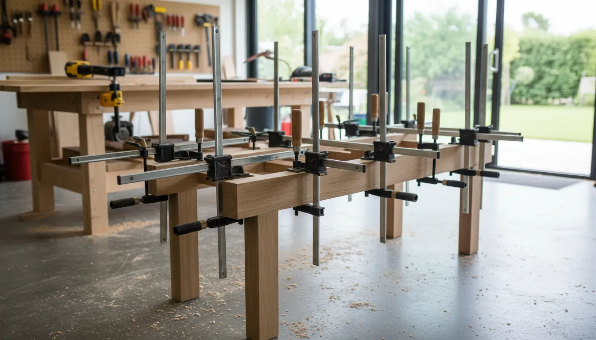
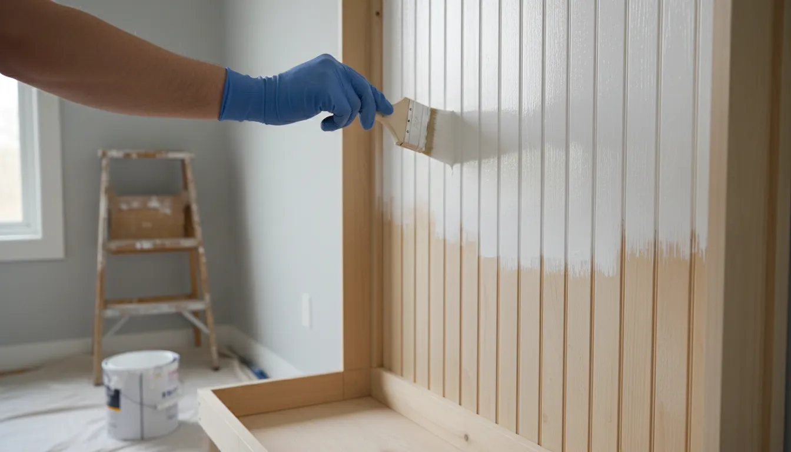
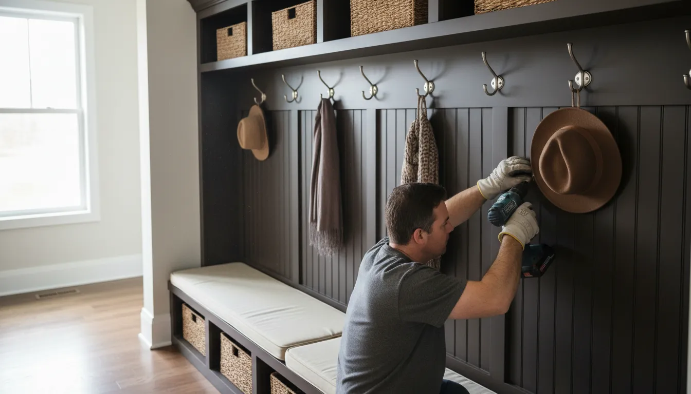

# DIY Hall Tree Build: Step-by-Step Guide for the Beginner Woodworker

The entryway is the first impression your home makes, yet it often becomes a catch-all for coats, backpacks, shoes, and mail. This clutter can create immediate visual stress the moment you walk through the door. A hall tree serves as the ultimate remedy for this chaotic transition zone, combining seating, storage, and hanging space into a single, cohesive unit. While furniture stores often charge exorbitant prices for solid wood pieces—or sell flimsy particleboard kits that barely last a season—building your own hall tree is a surprisingly accessible project for the beginner woodworker.

Undertaking a DIY hall tree build allows for complete customization. You are not limited by standard dimensions or generic finishes. Instead, you can design a piece that fits perfectly between your door frame and the wall, matches your existing trim, and accommodates the specific volume of gear your family generates. This guide provides a comprehensive, detailed roadmap to constructing a sturdy, professional-looking hall tree, covering everything from material selection to the final coat of paint.

## Phase 1: Planning and Design Considerations

Before purchasing a single piece of lumber, meticulous planning is required. A successful build begins with accurate measurements and a clear design vision. The "measure twice, cut once" adage applies not just to sawing wood, but to the entire planning process.

### Measuring Your Space

Begin by determining the maximum width, depth, and height your entryway can accommodate. Use a tape measure to check the width at three points: the floor (accounting for baseboards), the middle of the wall, and near the ceiling. Walls are rarely perfectly plumb, and you must design for the narrowest measurement to ensure a fit.

Depth is a critical factor often overlooked. Standard bench depth ranges from 16 to 20 inches. Anything deeper may encroach on the walkway, making the entry feel cramped. Ensure there is enough clearance for the front door to swing fully open without hitting the bench.

Regarding height, consider your ceiling clearance. A floor-to-ceiling built-in look is elegant, but leaving a gap at the top can make installation significantly easier, especially if you build the unit in a garage and move it inside later. If you plan to incorporate [overhead storage solutions](/posts/maximizing-vertical-storage), ensure the top shelf is accessible.

### Choosing Your Style and Functionality

Functionality should drive the design. Ask yourself what items currently clutter your floor. If shoes are the primary issue, a bench with an open bottom or a flip-top lid is essential. If you have long coats, ensure the hooks are mounted high enough to prevent hemlines from dragging on the bench.

Aesthetically, the hall tree should complement your home's architecture. A farmhouse style might utilize shiplap backing and rustic hooks, while a modern design would favor clean lines, smooth plywood backing, and hidden hardware. For inspiration on blending this piece with other furniture, consider reading our guide on [harmonizing entryway decor](/posts/cohesive-entryway-design-tips).

## Phase 2: Tools and Materials Checklist

Success in woodworking relies heavily on having the right tools for the job. You do not need a professional workshop, but a specific set of power tools will ensure straight cuts and strong joints.

### Essential Power Tools

1.  **Circular Saw or Miter Saw**: A miter saw is preferable for quick, accurate crosscuts on dimensional lumber (2x4s, 1x4s). A circular saw is necessary if you need to rip large sheets of plywood, although many hardware stores will perform these cuts for you.
2.  **Drill and Impact Driver**: You will need a drill for pilot holes and an impact driver for driving screws efficiently.
3.  **Pocket Hole Jig**: This is the secret weapon for beginner woodworkers. It allows you to create strong, hidden joints without complex joinery techniques like mortise and tenon.
4.  **Orbital Sander**: Essential for smoothing surfaces and preparing the wood for paint or stain.

If you are looking to upgrade your toolkit for this project, a high-quality pocket hole jig is an investment that pays for itself immediately in build quality.

[Shop Kreg Pocket Hole Jig Systems on Amazon](https://www.amazon.com/s?k=Kreg+Pocket+Hole+Jig&tag=hats0f8-20)

### Lumber Selection

The choice of wood depends on whether you plan to paint or stain the finished piece.
*   **For Painting**: Poplar and high-grade pine are excellent choices. They are cost-effective and take paint well. Birch plywood is the standard for large panels like the bench sides or backing because it has a smooth veneer.
*   **For Staining**: You may want to invest in Oak, Maple, or Walnut. These hardwoods are more expensive and harder to cut, but they offer a beautiful natural grain.

**Standard Materials List (Adjust based on dimensions):**
*   3/4-inch Birch Plywood (for the bench box and shelves)
*   1/4-inch Plywood or Beadboard paneling (for the back)
*   1x4 and 1x3 boards (for face frames and trim)
*   1x2 boards (for shelf edging)
*   2x4 lumber (for the internal structural base, if needed)

### Hardware and Consumables
*   1 1/4-inch and 2 1/2-inch pocket hole screws.
*   Wood glue (a crucial bonding agent).
*   120 and 220 grit sandpaper.
*   Wood filler for covering screw heads and gaps.
*   Primer and Paint (semi-gloss or satin is recommended for durability).
*   Heavy-duty coat hooks.

## Phase 3: Constructing the Bench Base

The foundation of your hall tree is the bench. It must be robust enough to support the weight of multiple adults sitting to put on shoes.

### Step 1: Cutting the Panels

Using your cut list, cut the plywood for the bench top, bottom, and sides. Accuracy here is vital. If your sides are not identical in height, the bench will rock or sit unevenly. If you are using a circular saw, clamp a straight edge to the plywood to guide your saw for perfectly straight cuts.

### Step 2: Pocket Hole Assembly

Set your pocket hole jig to the thickness of your material (likely 3/4 inch). Drill pocket holes along the edges of the bottom panel and any internal dividers you plan to add for cubbies.

Apply a bead of wood glue to the edges before securing them with screws. The glue provides the long-term bond, while the screws act as clamps to hold the wood in place while the glue dries. When assembling the box, use corner clamps to ensure 90-degree angles. If the box is not square, the rest of the build will suffer.

### Step 3: Adding the Face Frame

Plywood edges are unsightly. To give your bench a professional, substantial look, attach a face frame made from 1x2 or 1x3 solid wood boards. Measure the opening of your bench box and cut the frame pieces to fit. Attach these using glue and finish nails (or pocket holes from the inside if you want to avoid nail holes on the front). The face frame adds significant rigidity to the structure and hides the plywood layers.

## Phase 4: Vertical Structure and Backing

Once the bench is complete, you move upward. This section connects the bench to the top shelf and provides the surface for mounting hooks.

### Vertical Supports

You have two main structural options here. You can build two tall towers on either side of the bench (creating a built-in look) or simply attach vertical supports to the back of the bench. For a standard hall tree, cut two side panels from 3/4-inch plywood that extend from the bench top to your desired total height.

Attach these panels to the bench using pocket holes. It is critical that these are plumb (perfectly vertical). Use a level to check before driving your final screws.

### The Back Panel

The back panel ties the entire structure together and prevents it from "racking" (leaning side to side).
*   **Beadboard**: This offers a classic, cottage-style texture.
*   **Shiplap**: Horizontal planks provide a modern farmhouse aesthetic.
*   **Smooth Plywood**: For a sleek, contemporary look.

Cut your back panel to size and attach it to the back of the bench and the vertical supports using glue and staples or small nails. If you are using individual shiplap boards, ensure they are level as you work your way up.

For those interested in integrating more complex storage, such as hidden compartments, review our article on [advanced DIY storage hacks](/posts/advanced-diy-storage-hacks) before finalizing your back panel design.

## Phase 5: The Upper Shelf and Trim Work

The top of the hall tree usually features a shelf for baskets, hats, or decorative items.

### Constructing the Top Box

Similar to the bench, build a simple box or a single shelf spanning the width of the unit. If the span is wider than 30 inches, consider adding a middle divider or support to prevent the shelf from sagging over time. Secure this top unit to the vertical side panels.

### Adding Crown Molding and Trim

Trim work is what separates a "homemade" project from "custom furniture."
1.  **Baseboard**: Wrap the bottom of the bench in baseboard molding that matches your room's existing trim. This makes the unit look built-in.
2.  **Crown Molding**: Add crown molding to the very top. Cutting crown molding requires specific compound angles on a miter saw, which can be tricky. Alternatively, you can use a simple 1x2 or cove molding for a cleaner, easier finish.
3.  **Batten Strips**: If you used a smooth plywood back but want texture, you can glue and nail vertical 1x2 strips over the panel to create a board-and-batten look.

## Phase 6: Sanding and Finishing

Never underestimate the power of sanding. It is the difference between a rough, amateurish feel and a smooth, factory-like finish.

### Preparation

Start with 120-grit sandpaper to remove any rough edges, glue squeeze-out, or mill marks. Follow up with 220-grit for a smooth finish. Pay special attention to the sharp corners; slightly rounding them over (easing the edges) makes the piece more comfortable to touch and prevents paint from chipping easily.

Use wood filler to cover all nail holes and any visible pocket holes. Overfill the holes slightly, as the filler shrinks when drying. Once dry, sand flush.

[Shop DeWalt Random Orbit Sanders on Amazon](https://www.amazon.com/s?k=DeWalt+Orbital+Sander&tag=hats0f8-20)

### Priming and Painting

If you are painting, primer is non-negotiable, especially on raw wood and plywood edges. A high-quality bonding primer seals the wood and ensures the topcoat adheres evenly.
1.  **Prime**: Apply one coat of primer. Lightly sand with 220-grit sandpaper once dry to knock down any raised grain.
2.  **Paint**: Apply two to three coats of a high-quality enamel or cabinet paint. These paints cure harder than standard wall paint, providing necessary resistance against scuffs from shoes and bags.

For the smoothest finish, consider using a paint sprayer rather than a brush and roller. Sprayers eliminate brush strokes and get into the corners of the cubbies and beadboard grooves effortlessly.

[Shop Wagner Paint Sprayers on Amazon](https://www.amazon.com/s?k=Wagner+Paint+Sprayer&tag=hats0f8-20)

## Phase 7: Installation and Hardware

Moving a completed hall tree can be difficult due to its weight and size. It is often best to assemble the main components in your workspace and perform the final assembly in the entryway.

### Securing to the Wall

**Safety Warning**: Hall trees are tall and heavy. They must be anchored to the wall to prevent tipping, especially if children will be climbing on the bench. Locate the wall studs behind the unit. Drive 3-inch cabinet screws through the back rail of the hall tree directly into the studs. Do not rely on drywall anchors for a piece of this magnitude.

### Installing Hooks and Handles

The placement of hooks is a balance of capacity and visual spacing. Staggering hooks (one high, one low) can maximize storage, but a single straight row offers a cleaner look. Double-prong hooks are efficient for holding both a heavy coat and a scarf or bag.

Pre-drill pilot holes for your hardware screws to prevent the wood from splitting. If you built a bench with a hinged lid or drawers, install your handles and pulls now.

## Troubleshooting Common Beginner Mistakes

Even with the best plans, issues can arise. Here is how to handle common setbacks:

*   **The Unit Isn't Square**: If you discover the unit is slightly out of square during assembly, you can often force it into alignment when attaching the back panel. The back panel acts as a large brace. Clamp the frame into the correct square position before nailing on the back.
*   **Gaps in Joints**: If your cuts were slightly off, you might see gaps in your face frame joints. Do not panic. A mixture of sawdust and wood glue (or a good stainable wood filler) can hide these imperfections before painting.
*   **Rough Plywood Edges**: Even after sanding, plywood edges can look rough when painted. To fix this, apply a thin layer of drywall spackle or wood filler over the edge, let it dry, and sand it smooth. This creates a solid surface that looks like solid wood when painted.

## Conclusion: reclaiming Your Entryway

Building a DIY hall tree is a rite of passage for many amateur woodworkers. It combines structural framing, panel work, trim carpentry, and finishing into one satisfying project. The result is more than just a piece of furniture; it is a custom organization system tailored to your lifestyle.

By taking the time to plan, selecting the right materials, and executing the build with patience, you create a focal point for your home that offers immediate utility. No longer will shoes trip you up at the door or coats pile up on the nearest chair. Your entryway will transform from a point of chaos into a welcoming, organized space that sets a tone of calm for the rest of your home. Whether you choose a rustic farmhouse aesthetic or a sleek modern finish, the skills you learn on this build will serve you well in every future renovation project.