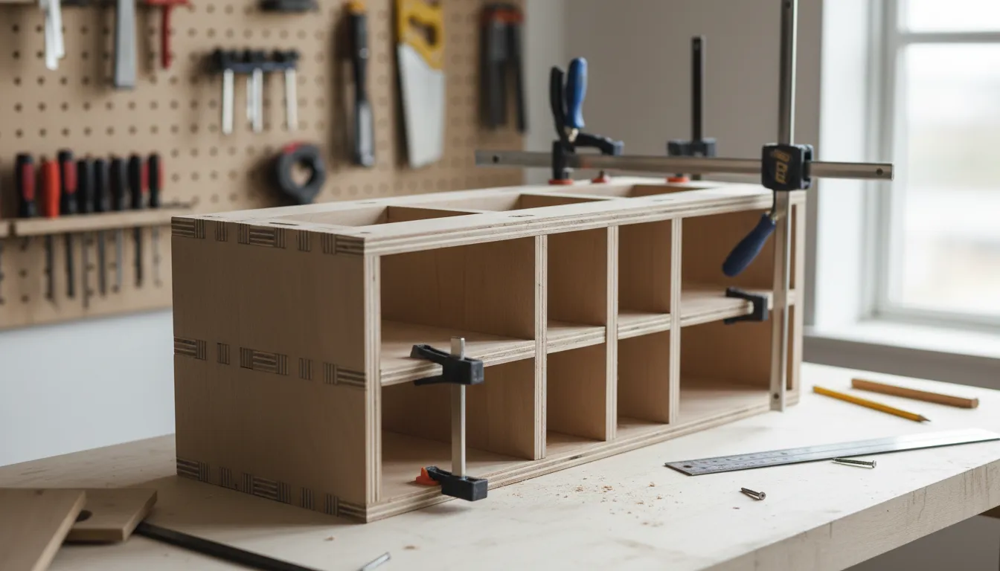
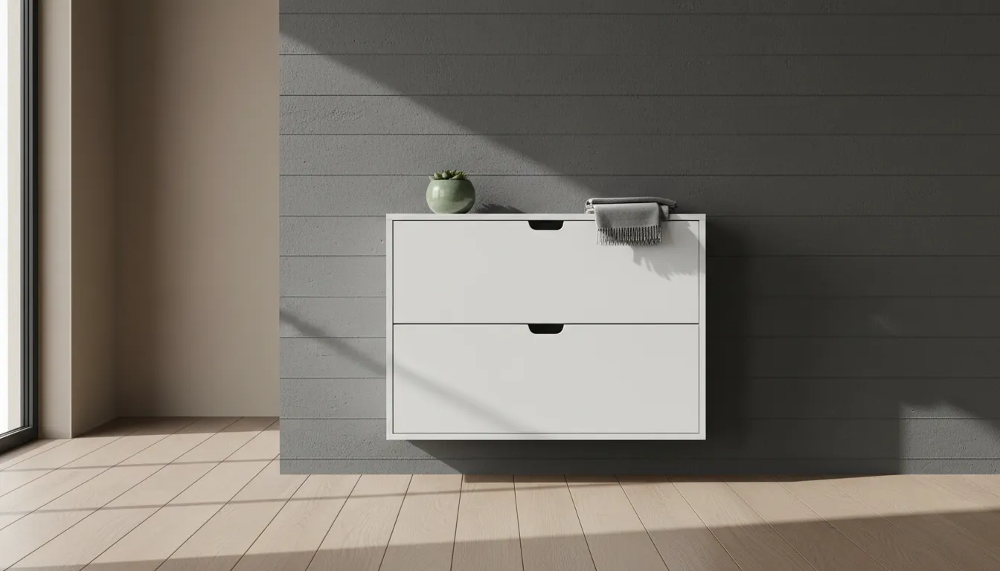
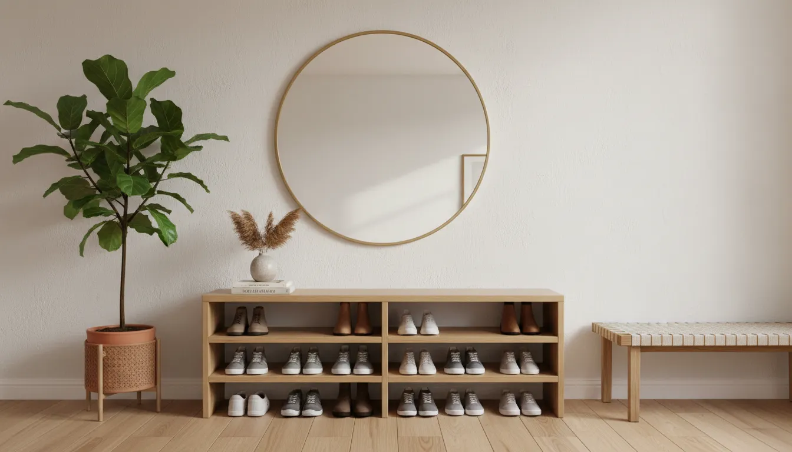

# DIY Smart Shoe Storage: Weekend Projects for a Custom Entryway Look

The entryway is the handshake of the home. It is the first interaction a guest has with your living space and the final checkpoint before you step out into the world. Despite its importance, this transitional zone often falls victim to the accumulation of daily debris, specifically the perennial clutter of footwear. While retail options abound, mass-produced shoe racks often lack the precise dimensions required for unique architectural quirks or the aesthetic refinement necessary to elevate a home’s design language.

Implementing DIY smart shoe storage is not merely about organizing boots and sneakers; it is an architectural intervention that maximizes square footage while introducing bespoke elements to your interior design. By taking a weekend to construct a custom solution, you gain control over materials, finish, and functionality, ensuring that every inch of your entryway serves a purpose. This guide explores high-impact, weekend-achievable projects ranging from multifunctional benches to sophisticated tilt-out cabinets, all designed to bring order and elegance to your foyer.

## The Principles of "Smart" Entryway Storage

Before gathering lumber and power tools, it is essential to define what makes storage "smart." In the context of modern interior design, smart storage relies on three pillars: concealment, verticality, and multifunctionality.

### Concealment and Visual Quiet
Visual noise contributes to a sense of chaos. Smart storage minimizes this by hiding the visual complexity of mismatched shoes behind uniform facades. Whether through cabinet doors, tilt-out bins, or uniform baskets, the goal is to create a serene surface that betrays nothing of the utility behind it.

### Verticality and Footprint
Floor space is premium real estate in an entryway. Traditional racks often sprawl horizontally, consuming space needed for traffic flow. Smart DIY projects capitalize on vertical wall space, utilizing height rather than depth. This approach is critical for narrow hallways and urban apartments where the foyer is virtually non-existent.

### Multifunctionality
A standalone shoe rack is a single-use object. A smart storage unit, however, doubles as a bench for putting on shoes, a console table for keys and mail, or a decorative focal point. By integrating multiple functions into one structure, you reduce the need for additional furniture, keeping the area open and airy.

## Project 1: The Floating Industrial Copper Rack

For those who favor minimalism and industrial chic, a floating copper pipe shoe rack offers a lightweight, airy aesthetic. Unlike bulky wooden cabinets, this design keeps the floor visible, which tricks the eye into perceiving the room as larger than it is. This project is ideal for narrow hallways where cabinet depth would impede movement.

### Materials and Preparation
This project utilizes standard plumbing components. You will need roughly 10 feet of 1/2-inch copper piping (adjust based on wall width), copper elbow joints, tee fittings, and flanges for wall mounting. The beauty of copper lies in its living finish; it will develop a patina over time, though you can seal it with lacquer to maintain its bright, polished look.

### The Construction Process
Begin by measuring the available wall width. The rack essentially consists of two horizontal rails protruding from the wall. The lower rail supports the heel, while the upper rail supports the toe box (or vice versa, depending on the angle you prefer).

Cut the copper piping to your desired lengths using a pipe cutter. Assemble the frame on the floor first to ensure symmetry. Using strong adhesive specifically for metal—or soldering if you possess the skill set—connect the pipes to the elbows and tees. The flanges serve as the anchor points to the wall.

### Installation and Styling
Secure the flanges to the wall using heavy-duty drywall anchors or, preferably, by screwing directly into studs. Because this rack exposes the shoes, it works best when curated. Place your most aesthetically pleasing footwear here—leather boots or clean sneakers.

For those looking to add a layer of utility above the rack without building a full cabinet, consider installing a simple shelf for decorative items. Using sturdy hardware is non-negotiable here.

To ensure your floating elements are secure and aesthetically pleasing, you might utilize high-quality supports. We recommend robust hardware for any shelving added above the rack.
[Check out Heavy Duty Hairpin Legs on Amazon](https://www.amazon.com/s?k=Heavy+Duty+Hairpin+Legs&tag=hats0f8-20)

## Project 2: The Custom Built-In Bench with Cubbies

A bench is the quintessential entryway furniture piece. It invites you to sit and remove your shoes comfortably, signaling a transition from the rush of the outdoors to the relaxation of the indoors. Building a custom bench allows you to tailor the dimensions to fit an alcove perfectly, giving the appearance of expensive built-in joinery.

### Structural Integrity and Material Selection
Because this unit must support human weight, material choice is paramount. 3/4-inch birch plywood is the standard for high-quality cabinetry. It paints beautifully and offers superior stability compared to solid pine boards, which may warp.

Begin by determining the dimensions. Standard bench height is between 18 and 20 inches. The depth should be at least 15 inches to accommodate larger shoe sizes and provide a comfortable seat.

### The Box Construction
Construct a simple rectangular box as the frame. Inside, install vertical dividers to create individual cubbies. To make the storage "smart," customize the heights of these cubbies. Leave one section taller for boots and divide others horizontally for sneakers and flats.

Use pocket hole joinery for a clean look where screws are hidden from sight. If you are retrofitting this into an existing nook, remove the baseboards first so the bench sits flush against the wall. You can reattach the baseboards to the front of the bench later for a seamless built-in look. For more on maximizing difficult spaces, read our guide on [organizing awkward alcoves](/posts/organizing-awkward-alcoves-and-nooks).

### Finishing Touches
Sand the entire piece progressively, starting with 120 grit and finishing with 220 grit. Apply a high-quality primer followed by durable enamel paint. Enamel resists scuffs and is easy to clean—a necessity for furniture that interacts with dirty footwear.

Top the bench with a custom cushion upholstered in a performance fabric. This adds texture and color, softening the hard lines of the wood.

## Project 3: The Slim Tilt-Out Shoe Cabinet

Perhaps the most sophisticated of all DIY shoe storage solutions is the tilt-out cabinet. This design is deceptively slim, often protruding less than 10 inches from the wall, yet it can swallow dozens of pairs of shoes. The mechanism tilts the drawers forward at an angle, allowing shoes to be stored vertically.

### The Mechanism
The secret to this project is the hardware. You do not need to engineer the pivot points yourself; specialized plastic or metal hinges are available that mount to the side of the cabinet and the drawer front.

To execute this, you will need the specific hinge kit before you make a single cut, as the hardware dictates the internal dimensions of the drawer box.
[Check out Shoe Cabinet Hinges on Amazon](https://www.amazon.com/s?k=Shoe+Cabinet+Hinges&tag=hats0f8-20)

### Building the Carcass
The exterior cabinet is a simple, shallow box. Since the shoes are stored vertically, the depth of the cabinet can be as little as 9 inches. This is a game-changer for hallways where a standard 15-inch deep console table would block traffic.

Cut your plywood panels for the sides, top, and bottom. Ensure the cabinet is anchored securely to the wall at the top, as the act of pulling the drawers open creates a tipping hazard.

### Creating the Drawers
The drawers in a tilt-out cabinet are not traditional drawers; they are essentially L-shaped troughs attached to the hinge mechanism. Construct these from lighter-weight material like 1/2-inch plywood to reduce strain on the hinges.

### Aesthetic Customization
The front panels of the tilt-out drawers offer a canvas for design. For a modern, textured look, apply cane webbing or fluted molding to the drawer fronts. Cane webbing provides ventilation—crucial for shoe storage to prevent odors—while adding a warm, organic element to the entryway.

Paint the cabinet in a moody charcoal or a deep forest green to make it a statement piece. Add sleek brass hardware to complete the high-end look.

## Project 4: The Hidden Rolling Under-Stair Drawers

If your home features a staircase near the entry, the triangular space beneath it is often wasted or enclosed as a chaotic closet. A "smart" DIY approach involves cutting into this void to install deep, rolling drawers that pull out to reveal tiered shoe storage.

### Assessing Structural Load
**Warning:** Before cutting into any wall, you must determine if it is load-bearing. The space directly under the stairs is usually framing, but the vertical wall supporting the high side of the stairs may be structural. Consult a structural engineer if you are unsure.

### The Drawer Construction
These drawers are essentially large, tall boxes on heavy-duty casters. They utilize the full depth of the space under the stairs (often 3 feet or more). Inside these large drawers, build varying levels of shelving.

Install heavy-duty drawer slides if you want the drawers to float, or simply use high-quality unidirectional casters on the bottom if you want them to roll directly on the floor.

### The Facade
Attach a front panel to the drawer that matches your staircase trim. When closed, the drawers should disappear, looking like a paneled wall under the stairs. Use push-to-open hardware to eliminate the need for handles, enhancing the illusion of a solid wall.

## Integrating Smart Technology

To truly earn the title of "smart" storage, consider integrating technology that enhances preservation and usability. Footwear, particularly leather and athletic shoes, is susceptible to humidity and bacterial growth.

### Automated Lighting
Dark cabinets lead to forgotten shoes. Installing LED strip lighting with a motion sensor ensures that the moment you open a cabinet door or tilt out a bin, the interior is flooded with light. This makes selecting shoes in the dark mornings easier and adds a touch of luxury typically found in high-end closet systems.

You can easily retrofit existing cabinets or your new DIY builds with adhesive-backed lighting solutions.
[Check out Motion Sensor LED Strip Lights on Amazon](https://www.amazon.com/s?k=Motion+Sensor+LED+Strip+Lights&tag=hats0f8-20)

### Climate Control
For enclosed cabinets, airflow is critical. If you are building the tilt-out cabinet or the bench, drill discreet ventilation holes in the back panel or install a small, quiet USB-powered fan to circulate air. This prevents mold growth on leather soles and keeps the entryway smelling fresh.

## Styling Your Entryway Storage

Once the sawdust has settled and the paint has dried, the final step is integration. Your storage solution should not look like an afterthought; it should appear as an intentional component of the home's architecture.

### The "Landing Strip" Concept
Utilize the top surface of your shoe cabinet or the wall above your bench to create a functional "landing strip." This is a designated spot for keys, wallets, and mail. Place a decorative tray on the surface to corral these small items. This prevents the clutter from spreading and reinforces the organization of the space.

### Mirror Placement
Hang a large mirror above your shoe storage. A mirror serves a dual purpose: it allows for a final outfit check before leaving, and it reflects light, making a typically small, dim entryway feel expansive. Round mirrors offer a nice contrast to the rectangular geometry of shoe cabinets.

### Greenery and Texture
Soften the hard lines of your DIY project with organic elements. A tall potted plant beside a bench or a small succulent on a floating shelf breathes life into the space. If your storage is open (like the copper rack), consider the visual weight of the shoes themselves. Balance heavy winter boots on the bottom with lighter sneakers on top.

For further inspiration on maintaining a cohesive look throughout your home, consider reading about [integrating storage into decor](/posts/integrating-storage-into-decor).

## Maintenance and Organization Habits

Building the storage is only half the battle; maintaining the system requires discipline. To keep your new custom entryway functioning perfectly, adopt a seasonal rotation strategy.

### The Seasonal Swap
Do not attempt to store every pair of shoes you own in the entryway. This space should be reserved for "high-rotation" footwear. Twice a year, swap out the contents. In spring, move heavy boots to deep storage (closets, under-bed bins) and bring forward sandals and light runners. In autumn, reverse the process.

### The "One In, One Out" Rule
Entryways have finite volume. To prevent your new storage solution from overflowing, adopt a one-in, one-out policy. If you buy a new pair of sneakers that lives in the entryway, an old pair must be donated, discarded, or moved to long-term storage.

## Conclusion

Transforming your entryway with DIY smart shoe storage is an investment that yields high returns in both functionality and aesthetics. By moving away from flimsy, temporary racks and committing to a weekend of construction, you create a permanent solution that respects the architecture of your home.

Whether you opt for the robust simplicity of a built-in bench, the sleek mechanism of a tilt-out cabinet, or the industrial edge of a copper rack, the result is the same: a curated, organized entry that welcomes you home with order rather than chaos. These projects bridge the gap between necessary utility and beautiful design, proving that storage can be as striking as it is practical.