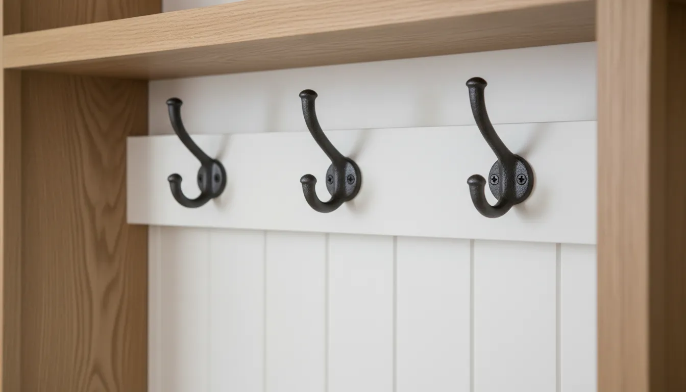
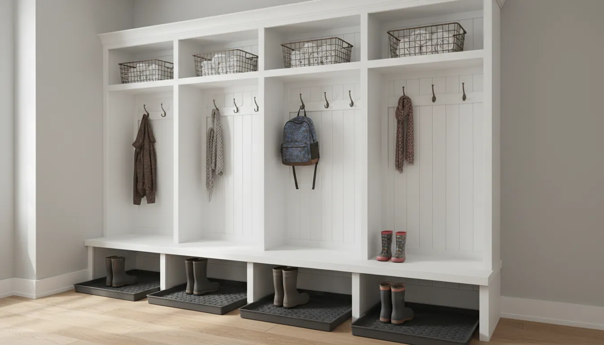
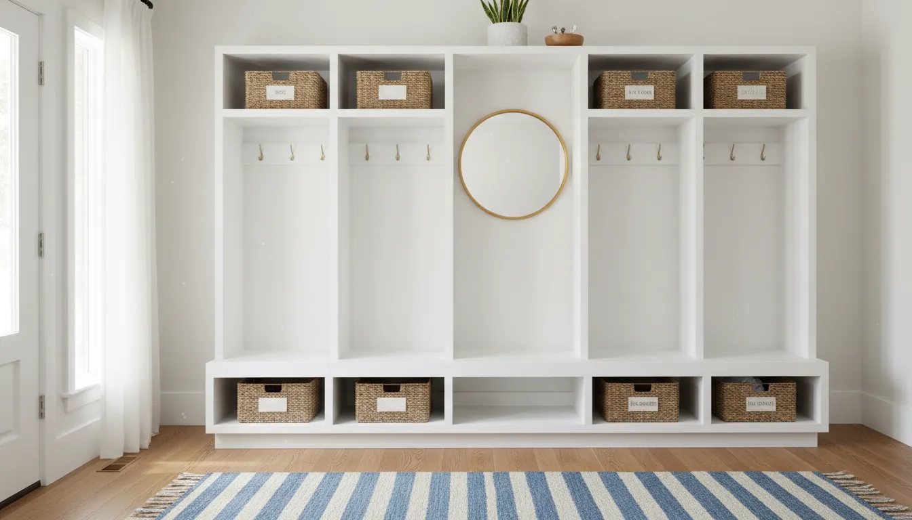

# Entryway Locker Systems: Heavy-Duty Shoe Storage for Active Families

The front door is the threshold between the outside world and your personal sanctuary. However, for active families, this threshold often resembles an obstacle course rather than a welcoming entry. Between muddy soccer cleats, oversized winter boots, heavy backpacks, and the daily accumulation of mail and keys, the entryway is the highest traffic zone in the home. It is also the most prone to chaos.

Standard shoe racks and flimsy coat stands rarely survive the rigors of family life. They buckle under the weight of wet winter gear or topple over when a backpack is hastily thrown onto a hook. The solution lies in a more robust architectural approach: the entryway locker system. Borrowing from the utility of athletic and academic mudrooms, residential locker systems offer heavy-duty durability combined with the aesthetic appeal of fine furniture.

This comprehensive guide explores the mechanics, materials, and design strategies behind implementing a heavy-duty locker system. We will specifically focus on optimizing these units for high-volume shoe storage, ensuring that your entryway remains a functional, organized, and beautiful introduction to your home.

## The Psychology of the "Drop Zone"

Before diving into carpentry and materials, it is essential to understand why traditional storage often fails active families. The issue is usually not a lack of space, but a lack of designated structure. When a family member walks through the door, the brain looks for the path of least resistance to unload their burden.

If a coat hanger requires a precise balancing act, the coat ends up on the chair. If a shoe rack is already overflowing or difficult to access, the boots stay on the rug. Locker systems solve this through "zoning." By assigning a specific vertical column to each family member, you create ownership and accountability. The structure itself invites organization.

A robust locker system serves as a containment strategy. It creates a visual boundary for the mess. The psychological benefit of walking into a clear hallway cannot be overstated; it sets the tone for the rest of the evening, shifting the mindset from chaotic survival to relaxed comfort.

## Anatomy of a Heavy-Duty Locker System

A true heavy-duty system is defined by its ability to withstand weight, moisture, and impact. Unlike decorative hall trees, these systems are built with structural integrity in mind.

### The Bench Seat
The foundation of the locker system is the bench. For active families, this is not merely a shelf; it is a changing station. It must support the weight of an adult sitting down to tie heavy work boots or a child jumping up to reach a hook. 

Ideally, the bench height should be between 18 and 20 inches from the floor. This provides ergonomic comfort for putting on footwear. The depth should be at least 15 inches to accommodate sitting without feeling precarious, though 18 inches is preferred for deeper storage underneath.

### The Upper Storage
Above the hooks, open shelving or closed cabinetry provides a home for off-season rotation. This is where items that are not needed daily—such as bike helmets in winter or heavy wool scarves in summer—reside. Utilizing the full vertical height of the room maximizes storage density without increasing the footprint.

### The Hook Section
The vertical space between the bench and the upper storage is the prime real estate for jackets and bags. Heavy-duty double hooks are non-negotiable here. A single hook often fails to hold a heavy winter coat and a fully loaded school backpack simultaneously. We recommend staggered hook heights: higher hooks for adults and long coats, and lower hooks accessible to children to encourage independence.

## The Core Challenge: Heavy-Duty Shoe Storage

The most critical component for active families is the shoe storage. This is where the battle against clutter is won or lost. Unlike a bedroom closet housing dress shoes, an entryway system must accommodate muck boots, cleats, running shoes, and wet galoshes.

### Cubbies vs. Drawers vs. Open Shelves
There are three primary configurations for lower shoe storage, each with distinct advantages.

**1. Individual Cubbies**
The grid system is popular for a reason. It prevents the "pile-up" effect where shoes are tossed on top of one another.
*   **Pros:** easy visual inventory; forces pairs to be kept together.
*   **Cons:** Fixed dimensions can be limiting for tall boots.
*   **Best For:** Sneakers, flats, and low-profile shoes.

**2. Large Open Cavities**
This involves leaving the space beneath the bench largely open, perhaps divided only by the vertical supports of the lockers.
*   **Pros:** Accommodates tall boots, snow gear, and oversized items effortlessly. Easy to clean.
*   **Cons:** Can look messy if shoes are not aligned; potential for items to get kicked to the back.
*   **Best For:** Winter boots, Wellingtons, and work boots.

**3. Pull-Out Drawers**
Heavy-duty drawers on ball-bearing slides offer a clean look by hiding the contents entirely.
*   **Pros:** complete concealment of clutter; protects shoes from dust.
*   **Cons:** Traps moisture and odors (dangerous for athletic gear); requires hardware maintenance.
*   **Best For:** Off-season storage or strictly dry shoes.

For a versatile solution that handles the volume of an active family, consider this robust furniture option that balances open storage with structural strength:
[https://www.amazon.com/s?k=Sauder+Coat+Rack+With+Shoe+Storage&tag=hats0f8-20](https://www.amazon.com/s?k=Sauder+Coat+Rack+With+Shoe+Storage&tag=hats0f8-20)

## Material Selection for Durability

When selecting or building a locker system, the material dictates the longevity. Particleboard may suffice for a guest room closet, but it will swell and crumble in a wet mudroom environment.

### Solid Wood and Plywood
For built-ins, furniture-grade plywood (such as birch or maple) is superior to solid wood for the carcass construction because it is dimensionally stable and does not warp with humidity changes. However, face frames and trim should be solid hardwood to withstand dings and dents from backpacks and shoes.

### Metal and Industrial Components
For a more rugged, industrial aesthetic, metal lockers are virtually indestructible. They are impervious to water and easy to clean. However, they can be noisy and may lack the warmth of residential furniture. A hybrid approach—wood framing with metal grate shelves—offers excellent airflow for drying wet shoes while maintaining a homey look.

### Moisture-Resistant Laminates
High-pressure laminates (HPL) and thermal-fused melamine are excellent choices for the interior of shoe cubbies. They are scratch-resistant and can be wiped down with a damp cloth, making mud removal simple. If you are building a custom unit, consider lining the shoe shelves with a rubberized mat or a laminate sheet to protect the wood beneath.

For those seeking a balance of industrial strength and home aesthetics without a custom build, modular metal systems can be a great alternative:
[https://www.amazon.com/s?k=Metal+Entryway+Lockers+Cabinet&tag=hats0f8-20](https://www.amazon.com/s?k=Metal+Entryway+Lockers+Cabinet&tag=hats0f8-20)

## Design Strategies for the Active Family

Functionality must precede form in a high-traffic entryway. Here are specific design strategies to handle the load of an active lifestyle.

### Ventilation is Key
Active families generate odors. Wet wool, sweaty cleats, and damp canvas shoes need airflow to dry and prevent mildew.
*   **Locker Doors:** If you choose enclosed lockers, use louvered doors or doors with metal mesh inserts. This allows air to circulate while obscuring the contents.
*   **Shoe Shelves:** Avoid solid shelves for wet shoes. Slatted wood or metal racks allow water to drip through to a tray below and air to circulate around the sole.

### The "Mud Management" Layer
If you live in a climate with snow or significant rainfall, your locker system needs to integrate with your floor protection.
*   **Floating Lockers:** Consider mounting the locker system to the wall 6 to 8 inches off the floor. This allows you to run a mop underneath easily and place a continuous boot tray along the floor for the wettest items.
*   **Waterproof Base:** If the unit sits on the floor, ensure the base molding is made of PVC or painted with high-gloss exterior-grade paint to resist water damage from mopping.

### Managing Vertical Space
Maximize the height of your ceilings. If you have 9-foot ceilings, do not stop the lockers at 7 feet. Build up. The highest shelves are perfect for items used infrequently. Use a library ladder or a sturdy step stool tucked into a custom slot to access these areas.

You can read more about maximizing vertical areas in our guide to [small space storage solutions](/posts/maximizing-vertical-storage-in-small-entryways).

## Modular vs. Custom Built-Ins

Homeowners often face the dilemma of choosing between custom carpentry and modular retail systems.

**Custom Built-Ins:**
*   **Pros:** Perfectly sized to your niche; maximizes every inch of space; increases home resale value; limitless finish options.
*   **Cons:** Expensive; permanent (cannot take it with you when you move); requires a contractor or advanced DIY skills.

**Modular Systems:**
*   **Pros:** Cost-effective; flexible configuration; quick installation; portable.
*   **Cons:** May leave awkward gaps at the sides or top; generally lower weight capacity than custom built-ins.

If you choose the modular route, look for "commercial grade" or "institutional" descriptions to ensure the hardware can handle daily abuse.

## Accessory Integration for Total Organization

A locker shell is only as good as the accessories that organize the contents.

**Baskets and Bins**
Open shelves quickly become messy. Woven baskets, wire bins, or felt boxes act as drawers for open shelving. They are essential for corralling "loose" items like gloves, sunscreen, sunglasses, and keys. Assign a specific color or style of basket to each family member to maintain the zone defense strategy.

**Boot Trays**
Never place wet boots directly on wood shelving. Use rigid plastic or copper boot trays. These capture melting snow and mud, protecting the furniture. Look for trays with raised ridges that keep the boot soles out of the standing water.

**Charging Stations**
Modern families need to charge devices. Integrating a charging station into one of the locker cubbies ensures that phones and tablets are dropped at the door rather than brought to the dinner table. This requires planning for electrical outlets behind the unit during installation.

To keep the smaller items contained within your locker shelves, durable wire baskets are a must-have accessory:
[https://www.amazon.com/s?k=Industrial+Wire+Storage+Baskets&tag=hats0f8-20](https://www.amazon.com/s?k=Industrial+Wire+Storage+Baskets&tag=hats0f8-20)

## Installation Considerations

Safety is paramount when installing large storage units. A fully loaded locker system can weigh several hundred pounds.

1.  **Wall Anchoring:** Regardless of whether the unit is freestanding or built-in, it *must* be anchored to the wall studs. This prevents tipping, a crucial safety measure for families with small children who may be tempted to climb the shelves.
2.  **Baseboard Heaters and Vents:** Check your entryway for obstructions. You cannot block a heating vent with a solid locker base. You may need to build a vented toe-kick or reroute the ductwork.
3.  **Door Swing:** Ensure that the locker doors (if applicable) and the entryway door do not collide. There should be enough clearance for traffic flow even when a locker door is open.

## Maintenance and Care

To keep your heavy-duty system looking pristine, establish a maintenance routine.

*   **Seasonal Switch:** Twice a year, empty the lockers completely. Move winter gear to the attic and bring down summer gear, or vice versa. This prevents the unit from becoming a black hole of forgotten items.
*   **Wood Care:** If you have a stained wood bench, apply a paste wax or furniture polish quarterly to protect the finish from moisture and abrasion.
*   **Odor Control:** Place a small charcoal bag or cedar block in each shoe cubby to absorb moisture and neutralize odors naturally.

For more insights on maintaining wood furniture in high-traffic areas, check out our article on [preserving entryway furniture](/posts/maintaining-wood-furniture-in-high-traffic-zones).

## Conclusion

An entryway locker system is more than just furniture; it is a lifestyle tool for active families. By moving vertical and implementing dedicated zones, you reclaim your floor space and your sanity. Whether you opt for a sleek metal modular unit or a custom craftsman-style built-in, the key lies in selecting heavy-duty materials capable of handling the weight of winter gear and the volume of athletic footwear.

Investing in a proper storage system transforms the "drop zone" from a source of stress into a streamlined engine of family efficiency. It ensures that when you walk through the door, you are greeted by order, design, and the comfort of being home.