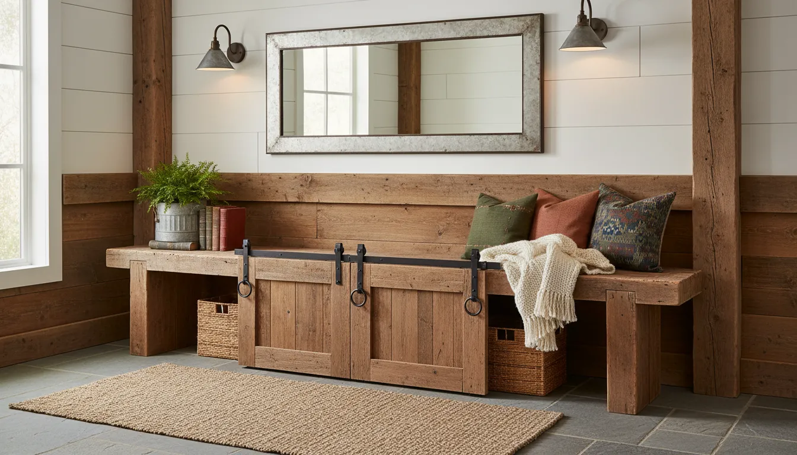
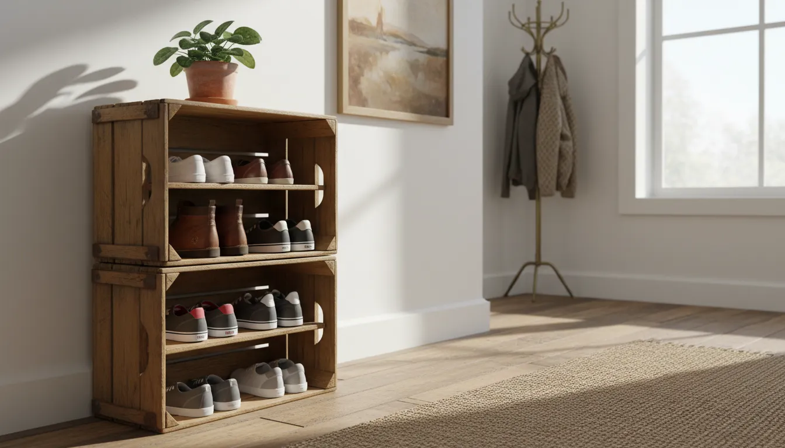
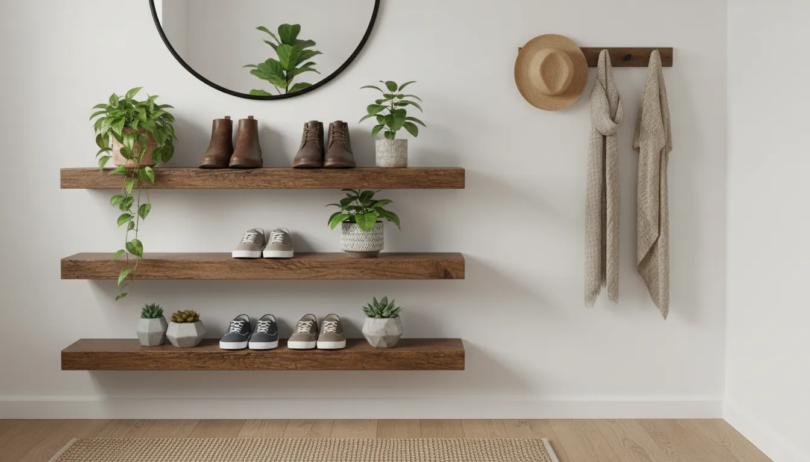

# Farmhouse Style Shoe Storage: Rustic Entryway Organization Ideas

The entryway is the handshake of the home. It is the first space guests experience upon arrival and the last thing you see before facing the world. Yet, functionally, it often becomes a chaotic drop zone for footwear, causing clutter that disrupts the serenity of the household. Bridging the gap between high-traffic utility and serene aesthetics is where the farmhouse style excels.

Farmhouse design is not merely a trend; it is a celebration of practicality, warmth, and unpretentious beauty. Rooted in the utilitarian needs of rural living, this design philosophy emphasizes durable materials, weathered textures, and accessible organization. When applied to shoe storage, farmhouse principles transform piles of sneakers and muddy boots into a curated vignette that welcomes you home.

This comprehensive guide explores the nuances of farmhouse style shoe storage, offering rustic entryway organization ideas that cater to spaces ranging from expansive mudrooms to compact foyers. We will examine furniture selection, material integration, and styling techniques to help you reclaim your floor space without sacrificing character.

## The Foundations of Farmhouse Aesthetics

Before selecting specific storage pieces, it is essential to understand the material palette that defines the farmhouse look. Unlike minimalist modernism which relies on sleek synthetics, or traditional design which favors polished mahogany, farmhouse style leans into the imperfect.

### Key Materials and Textures
*   **Reclaimed Wood:** The soul of rustic decor. Look for timber with visible knots, grain variations, and distressed finishes that tell a story.
*   **Galvanized Metal and Iron:** Industrial accents in matte black or aged bronze provide necessary contrast to warm wood tones, adding a sense of structural durability.
*   **Woven Natural Fibers:** Seagrass, water hyacinth, and wicker add softness and hide clutter, acting as a textural bridge between hard furniture and soft textiles.
*   **Neutral Palettes:** Whites, creams, grays, and natural wood tones form the backdrop, allowing the textures of the storage units to stand out.

By adhering to these material guidelines, any shoe storage solution you implement will feel cohesive and intentional rather than purely utilitarian.

## The Classic Hall Tree: An All-in-One Solution

For entryways with sufficient wall space, the hall tree is the quintessential farmhouse storage unit. It creates an instant mudroom feel, even in homes that lack a dedicated utility room. A well-designed hall tree combines a bench for seating, hooks for outerwear, and, crucially, lower compartments for footwear.

### Selecting the Right Hall Tree
When shopping for a farmhouse hall tree, prioritize designs that feature beadboard backing or shiplap detailing. These architectural elements immediately evoke the rural aesthetic. The base should offer substantial storage. Open cubbies are excellent for frequently worn shoes, allowing for airflow and easy access. However, if visual clutter is a concern, look for models with a flip-top bench or lower drawers.

For a blend of industrial and rustic styles, consider a unit that utilizes a metal frame with thick, wooden board accents. This "modern farmhouse" approach often feels lighter visually, making it suitable for narrower hallways where a solid wood cabinet might feel imposing.

For a robust option that anchors the space, consider the [Bush Furniture Hall Tree with Shoe Storage Bench](https://www.amazon.com/s?k=Bush+Furniture+Hall+Tree+with+Shoe+Storage+Bench&tag=hats0f8-20). Its sturdy construction and vintage finish align perfectly with rustic interiors.

## Bench Storage: Low-Profile and Practical

If a full-height hall tree overwhelms your space, a standalone storage bench is an elegant alternative. This piece serves a dual purpose: it provides a designated spot to sit while putting on or taking off shoes, and it houses the footwear itself.

### Open Shelving vs. Concealed Compartments
There are two primary schools of thought regarding bench storage: open and closed.

**Open shelving benches** typically feature two tiers of racks beneath the seat. This is ideal for households with children or for those who prioritize speed. Seeing the shoes ensures they are put away rather than kicked off near the door. To maintain a farmhouse look, choose a bench made of reclaimed pine or oak. If the shoe clutter becomes unsightly, you can slide low-profile wicker baskets onto the shelves to create "drawers."

**Concealed storage benches** utilize drop-down doors or sliding barn doors. The sliding barn door mechanism is a particularly potent design element in farmhouse decor. It adds a kinetic, mechanical interest to the piece while effectively hiding muddy boots or brightly colored athletic shoes that might clash with your neutral color palette.

## Creative Use of Baskets and Bins

Farmhouse style is synonymous with the "contained chaos" approach to organization. Footwear does not always need to be lined up in military precision; sometimes, it simply needs to be off the floor. This is where high-quality baskets and bins become indispensable.

### Woven Baskets for Texture
Large, sturdy baskets made from rattan or thick wicker can be placed under a simple console table or a floating bench. This allows you to categorize footwear by owner or by type (e.g., one basket for sandals, one for sneakers). The natural fibers of the baskets warm up the space and soften the hard lines of wooden furniture.

### Wire and Metal Bins
For a more industrial farmhouse vibe, utilize vintage-style locker baskets or galvanized metal bins. These are particularly durable and easy to clean, making them excellent choices for wet or muddy footwear. However, because they are often see-through, they work best for tidier items or when placed on lower shelves where the contents aren't at eye level.

Labeling these bins with small chalkboard tags or metal bookplates adds a charming, schoolhouse detail that enhances the organizational system.

## The Tilt-Out Shoe Cabinet: Modern Function, Rustic Form

One of the most significant innovations in entryway organization is the tilt-out shoe cabinet. These units are remarkably slim, often extending less than 12 inches from the wall, yet they can store a surprising volume of footwear vertically.

While many tilt-out cabinets lean towards modern design, manufacturers have adapted this mechanism for the farmhouse aesthetic. Look for cabinets finished in distressed white, sage green, or natural wood grain with antique brass cup pulls.

The beauty of the tilt-out cabinet is that it completely conceals the shoes. When closed, it resembles a sophisticated console table. You can style the top surface with a lamp, a vase of dried eucalyptus, or a vintage mirror, effectively disguising the unit's utilitarian purpose.

For a seamless integration into your decor, try the [Baxton Studio Simms Shoe Cabinet](https://www.amazon.com/s?k=Baxton+Studio+Simms+Shoe+Cabinet&tag=hats0f8-20), which offers the wood-tone aesthetic and clean lines necessary for a modern farmhouse entryway.

## Vertical Solutions: Ladders and Wall Racks

In tight entryways where floor space is at a premium, vertical storage is the only viable option. Fortunately, farmhouse decor embraces verticality through the use of ladders and wall-mounted racks.

### The Blanket Ladder Adaptation
A vintage wooden ladder leaning against the wall is a classic farmhouse trope usually reserved for blankets. However, it can be easily repurposed for high-heeled shoes (hanging by the heel) or by adding S-hooks to hang children’s shoes and sandals. This turns storage into a display, so it is best reserved for your most attractive footwear.

### Wall-Mounted Coat and Shoe Racks
Consider installing a heavy-duty wooden board with industrial iron pipe flanges and elbows to create floating shoe rails. This DIY-friendly approach allows you to customize the length and spacing of the racks to fit your specific wall. The combination of black iron pipe and stained wood is a hallmark of industrial farmhouse design.

Alternatively, vertical cubby systems mounted to the wall can keep the floor entirely clear, making vacuuming and cleaning the entryway significantly easier.

## Repurposed Vintage Finds

Authenticity is central to the farmhouse appeal. Instead of buying new furniture, consider repurposing vintage agricultural or industrial items for shoe storage. This not only saves money but creates a unique focal point that cannot be replicated.

*   **Apple Crates:** Stack vintage wooden crates on their sides to create modular shelving. Secure them together with screws for stability. The stamped logos and weathered wood provide instant character.
*   **Old Lockers:** A set of vintage metal school or gym lockers is a fantastic solution for hiding shoes and coats. They are narrow, durable, and magnetic, allowing for further customization.
*   **Chicken Nesting Boxes:** While unconventional, cleaned and sealed metal nesting boxes make for excellent wall-mounted shoe cubbies. They are the perfect size for a pair of shoes and bring a genuine "farm" element to the house.

## Mudroom Lockers and Built-Ins

If you are renovating or building a custom entryway, built-in cabinetry offers the highest return on investment regarding organization. Farmhouse built-ins often feature a "locker" style design.

### Essential Elements of Farmhouse Built-Ins
1.  **Shiplap Backing:** Installing horizontal wood paneling behind the hooks protects the drywall and adds texture.
2.  **Bench Seating with Drawers:** Deep drawers under the bench are superior to open cubbies for long-term storage or for hiding unsightly items.
3.  **Upper Cubbies:** Utilize the space near the ceiling for off-season footwear storage, using uniform baskets to maintain a clean look.
4.  **Trim and Molding:** Simple, flat-stock trim characterizes the farmhouse look. Avoid ornate crown molding in favor of square, substantial craftsmanship.

## Mixing Metals and Woods

A common mistake in farmhouse decor is matching everything too perfectly. The style thrives on a curated mix. If your floors are dark oak, consider a painted white shoe bench to create contrast. If your light fixtures are oil-rubbed bronze, brushed nickel hardware on your shoe cabinet can add a layer of depth, provided the tones harmonize.

For a rugged, mixed-material look that balances wood and metal effectively, the [VASAGLE Industrial Shoe Bench](https://www.amazon.com/s?k=VASAGLE+Industrial+Shoe+Bench&tag=hats0f8-20) is an excellent choice. It combines a rustic brown surface with a rigid metal frame, embodying the industrial side of farmhouse design.

## Handling Wet and Dirty Footwear

Farmhouse style is rooted in country living, which implies mud, rain, and snow. Your storage solution must address the practical reality of dirty boots. Wood furniture can be damaged by standing water, and fabric baskets will absorb moisture and odors.

### Boot Trays
A simple plastic boot tray is functional but rarely attractive. To maintain your aesthetic, look for galvanized metal boot trays or copper trays. You can also fill a standard deep tray with smooth river stones. The stones allow water to drain away from the soles of the boots, facilitating drying, while bringing a natural, spa-like element to the entryway.

For more on maintaining a pristine look in high-traffic areas, read our guide on [Entryway Cleaning and Maintenance](/posts/entryway-cleaning-and-maintenance).

## Small Entryway Strategies

Not every home has a sprawling mudroom. In apartments or smaller homes, the "entryway" might be a mere strip of wall behind the front door.

### The "Landing Strip" Concept
In these spaces, prioritize slim profiles. A narrow console table with a clear glass top or open legs prevents the hallway from feeling crowded. Underneath, place two large, matching wicker baskets for shoes. This keeps the floor visual clear while providing volume storage.

### Floating Shelves
Install sturdy floating shelves at varying heights. Place shoes on the lower shelves and decor on the upper ones. Using reclaimed wood for these shelves ties the vertical storage into the farmhouse theme without requiring a footprint on the floor.

## Styling Your Shoe Storage

Ideally, your shoe storage should not look like storage; it should look like furniture. Once the organizational structures are in place, styling is what brings the "farmhouse" look to life.

*   **Soft Textiles:** Throw pillows on a storage bench soften the hard lines of wood and metal. Choose fabrics like ticking stripe, buffalo check, or heavy linen.
*   **Greenery:** A potted fern, a wreath of magnolia leaves, or a vase of cotton stems adds life to the area. Greenery contrasts beautifully with the warm browns and cool grays of farmhouse furniture.
*   **Lighting:** If your shoe storage is a hall tree or a large cabinet, consider adding a sconce above it. Barn-style gooseneck lights or caged industrial bulbs enhance the rustic atmosphere.
*   **Mirrors:** A large, round mirror with a wood or metal frame hung above a shoe cabinet reflects light, making a small entryway feel larger and brighter.

For more inspiration on decorating the surrounding area, explore our article on [Rustic Wall Decor for Entryways](/posts/rustic-wall-decor-entryways).

## Maintaining the Organization System

The most beautiful farmhouse entryway will fail if the organizational system is too complex to maintain. The key to rustic organization is simplicity.

1.  **The "One In, One Out" Rule:** Entryway storage is prime real estate. It should store the shoes you wear currently. Off-season footwear should be moved to bedroom closets or basement storage.
2.  **Designated Zones:** Assign specific cubbies or baskets to family members. This accountability prevents one person's collection from taking over the entire unit.
3.  **Routine Audits:** Once a month, clear out the accumulation of dirt, gravel, and unclaimed items. Vacuum the inside of cubbies and wipe down wooden surfaces with a wood-safe cleaner.

## Conclusion

Farmhouse style shoe storage offers the perfect marriage of form and function. It acknowledges that life can be messy but provides a framework to contain that mess with dignity and style. Whether you opt for a grand hall tree, a sleek tilt-out cabinet, or a collection of vintage crates, the goal remains the same: to create a welcoming, organized entry that sets a peaceful tone for the rest of your home.

By choosing materials like reclaimed wood and galvanized metal, and by implementing smart organizational systems like baskets and built-ins, you can transform your entryway from a cluttered drop zone into a rustic retreat. The charm of farmhouse design lies in its ability to make the practical beautiful, turning the mundane act of storing shoes into a design statement.