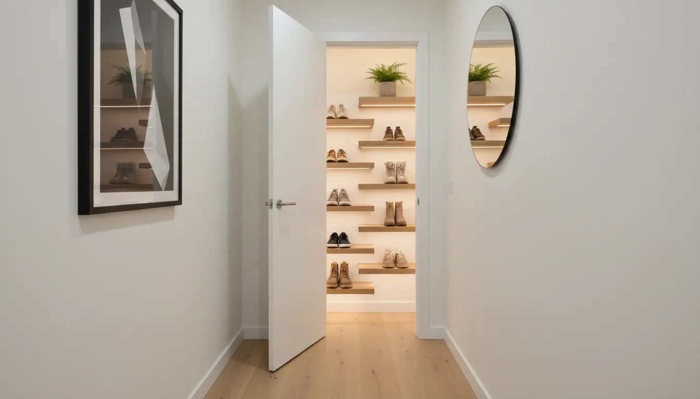
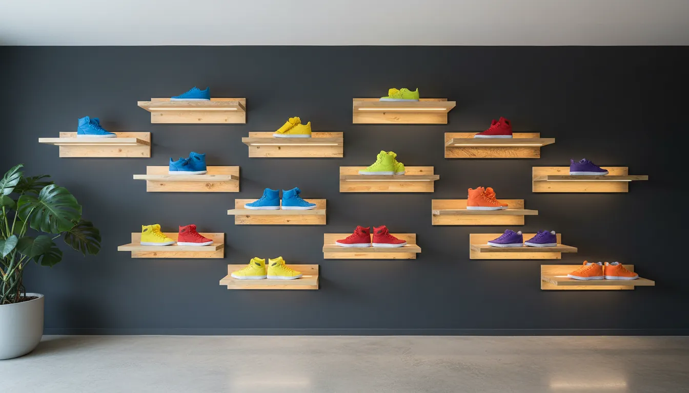
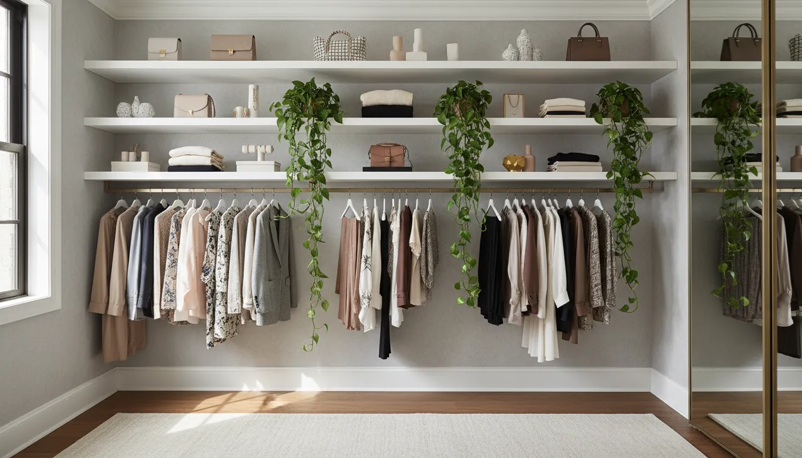

# Floating Shoe Shelves: Modern and Space-Saving Smart Shoe Storage

The modern entryway is more than just a transitional space; it is the first impression of a home and the strategic command center for your daily departure. However, it is also the primary battleground for clutter. Footwear, by its very nature, tends to accumulate near the door, creating tripping hazards and visual disarray. Traditional shoe racks often exacerbate the problem by consuming valuable floor space and creating a bulky, heavy aesthetic. Enter the floating shoe shelf: a sophisticated, gravity-defying solution that merges utilitarian storage with contemporary interior design.

Floating shoe shelves represent a paradigm shift in home organization. By utilizing vertical wall space rather than floor area, homeowners can reclaim square footage while turning their footwear collection into a curated display. This comprehensive guide explores the aesthetic and functional benefits of floating shoe storage, offers detailed installation advice, and provides styling strategies to elevate your home decor.

## The Architectural Advantage of Vertical Storage

In the realm of interior design, floor space is a premium commodity. Standard shoe cabinets, benches, and racks occupy a significant footprint, often making narrow hallways and compact apartments feel claustrophobic. This is particularly problematic in urban living environments where every square inch matters.

Floating shelves solve this spatial dilemma through verticality. By lifting storage off the ground, you maintain the continuity of the flooring, which tricks the eye into perceiving the room as larger and more open. This is a fundamental principle of minimalist design: visible floor area equates to perceived spaciousness.

### The Illusion of Airiness

Furniture that sits flush against the floor can feel heavy and imposing. Floating shelves, conversely, introduce "negative space" beneath the storage area. This airiness allows light to travel more freely, preventing shadows from pooling in corners and making the cleaning process significantly easier. There are no legs to navigate around with a vacuum cleaner, and dust bunnies have nowhere to hide.

Furthermore, floating shelves allow for customizable configurations. Unlike a fixed unit with predetermined dimensions, individual wall-mounted shelves can be arranged to fit specific architectural quirks. You can stagger them in a stepped pattern, arrange them in a rigid grid, or place them in a single vertical column behind a door.

## Material Selection: Harmonizing with Your Decor

Selecting the right material for your floating shelves is critical for ensuring they complement your existing interior design. The market offers a variety of finishes, each catering to a different aesthetic sensibility.

### The Invisible Display: Acrylic and Lucite

For the sneaker enthusiast or the ultra-modernist, clear acrylic shelves are the gold standard. Often marketed as "levitating" displays, these transparent mounts disappear against the wall, allowing the shoe itself to be the focal point. This is particularly popular in "hypebeast" culture, where limited-edition sneakers are treated as art pieces rather than mere apparel.

When using acrylic, the hardware is usually concealed, creating a seamless look. This material works exceptionally well on bold, dark-colored walls where the contrast of the shoe pops, or on white walls for a crisp, laboratory-clean aesthetic.

Looking for a sleek, invisible look for your sneaker collection? Consider these options:
[Shop Acrylic Floating Shoe Shelves on Amazon](https://www.amazon.com/s?k=acrylic+floating+shoe+shelves&tag=hats0f8-20)

### Warmth and Texture: Natural Wood

Wood brings an element of organic warmth to a space, softening the hard lines of modern architecture. Thick, solid wood slabs in oak, walnut, or pine add texture and visual weight. These are ideal for Scandinavian, farmhouse, or mid-century modern interiors.

When choosing wood shelves for shoes, durability is key. Footwear can be heavy, especially boots or chunky platforms. Ensure the wood is sealed properly to prevent moisture damage from wet soles or staining from street grime.

### Industrial Edge: Metal and Steel

For a more industrial or urban loft vibe, folded metal shelves offer a slim profile with incredible strength. Powder-coated steel in matte black or white provides a striking graphical element. Metal shelves are often thinner than their wooden counterparts, creating a sharper, more precise look. They are also incredibly easy to clean and impervious to water damage.

## Strategic Placement: Maximizing Dead Space

One of the greatest advantages of floating shoe shelves is their ability to utilize "dead space"—areas of the home that are too small for traditional furniture but large enough for wall-mounted solutions.

### The Narrow Hallway Solution

In many homes, the entryway is a long, narrow corridor. Placing a standard shoe rack here can impede traffic flow. Floating shelves, specifically those designed for shoes, can be installed at a higher elevation or in a staggered pattern that allows for shoulder clearance while walking past.

If the hallway is extremely narrow, consider shelves that angle the shoes downward or store them parallel to the wall (toe-to-heel) rather than perpendicular. This reduces the projection from the wall, keeping the walkway clear. For more ideas on managing tight spaces, read our guide on [small entryway ideas](/posts/small-entryway-storage-solutions).

### The "Behind the Door" Nook

The space behind an interior door is often wasted. Provided there is a doorstop to prevent the door handle from hitting the shoes, this is a prime location for a vertical column of floating shelves. It keeps the visual clutter hidden when the door is open but remains easily accessible.

### Walk-In Closet Boutique

Transform a standard walk-in closet into a high-end boutique by dedicating a wall to floating shoe shelves. Instead of burying shoes in floor-level cubbies, display them at eye level. This not only makes selecting footwear easier but also elevates the experience of getting dressed. Grouping shoes by color or style on floating shelves can turn a chaotic closet into a serene dressing room. For broader closet strategies, explore our [closet organization tips](/posts/closet-organization-strategies).

## Installation Guide: Securing Your Investment

The success of a floating shelf project hinges entirely on the quality of the installation. Unlike picture frames, shoe shelves must support significant, recurring weight. A pair of heavy work boots can weigh several pounds, and the leverage exerted on the wall mount is substantial.

### Finding the Studs

Ideally, floating shelves should be anchored directly into wall studs. This provides the most secure hold and prevents the shelves from ripping out of the drywall over time. Use a magnetic or electronic stud finder to locate the framing behind your drywall.

If the placement of the studs does not align with your design vision, you must use high-quality toggle bolts or heavy-duty drywall anchors. Do not rely on standard plastic plugs provided with cheaper shelving kits; they rarely hold up to the leverage of a loaded shelf.

### Leveling and Spacing

Precision is paramount. Even a slight tilt can cause shoes to slide off or make the installation look amateurish.
1.  **Mark your layout:** Use painter's tape to map out the shelf locations on the wall before drilling.
2.  **Use a level:** Ensure every shelf is perfectly horizontal.
3.  **Calculate vertical spacing:** Measure the height of your tallest shoes (usually high-tops or heels) and add at least 2 to 3 inches of clearance for easy retrieval. A gap of 8 to 10 inches is standard for sneakers, while boots will require significantly more.

### Tools Required
*   Stud finder
*   Power drill and drill bits
*   Spirit level (torpedo level or 2-foot level)
*   Hammer
*   Tape measure
*   Pencil
*   High-quality wall anchors (if not hitting studs)

For a robust and rustic aesthetic, explore wooden options here:
[Shop Wooden Floating Shelves on Amazon](https://www.amazon.com/s?k=rustic+wood+floating+shelves+heavy+duty&tag=hats0f8-20)

## Design Configurations and Layouts

How you arrange the shelves on the wall dictates the visual impact of the storage.

### The Grid
The grid layout is orderly, symmetrical, and calming. It involves aligning shelves in perfect rows and columns. This works best in large, open spaces where the wall acts as a dedicated display feature.

### The Staggered Step
This layout creates a dynamic, moving aesthetic. By offsetting each shelf, you create a visual rhythm that draws the eye upward. This is excellent for narrow walls or corners, as it breaks up the vertical rigidity.

### The Floor-to-Ceiling Column
This configuration maximizes vertical density. By stacking shelves from the baseboard to the crown molding, you can store 10 to 15 pairs of shoes in a footprint no wider than a single pair. This is the ultimate space-saving hack for studio apartments.

## The Sneakerhead Culture Shift: Shoes as Decor

The rise of floating shoe shelves correlates directly with the explosion of sneaker culture. For collectors, footwear is not merely functional; it is an asset class and a form of expression. Limited releases from brands like Nike, Jordan, and Yeezy are designed with intricate details that deserve to be seen.

Traditional shoe racks hide the profile of the shoe, often showing only the heel or the toe. Floating shelves, particularly those designed to hold the shoe parallel to the wall, display the "swoosh" or the side profile, which is often the most designed element of the sneaker.

Installing LED lighting strips under each shelf can further enhance this display, turning a storage wall into a lit gallery. This integration of storage and ambient lighting adds a layer of sophistication to bedrooms and man caves alike.

## Maintenance and Care for Open Storage

While floating shelves offer aesthetic superiority, they do require a different maintenance approach than closed cabinets.

### Dust Management
Open shelving attracts dust. However, because shoe shelves usually hold items that are used frequently, the accumulation is often less than on decorative bookshelves. Regular dusting with a microfiber cloth is essential. For acrylic shelves, use a specialized plastic cleaner to prevent micro-scratches and clouding.

### Odor Control
Unlike closed cabinets which can trap odors, open shelves allow for air circulation. This is generally beneficial for the shoes, allowing them to air out after use. However, it does mean that heavily used athletic shoes should perhaps be cleaned or deodorized before being placed on a display shelf in a living area.

### Weight Limits
Be mindful of the weight capacity of your specific shelves. Overloading a shelf designed for sneakers with heavy work boots can cause the shelf to sag or the bracket to pull away from the wall. Always check the manufacturer's load rating.

If you prefer the strength and sleekness of metal, check out these solutions:
[Shop Metal Wall Mounted Shoe Racks on Amazon](https://www.amazon.com/s?k=metal+wall+mounted+shoe+rack&tag=hats0f8-20)

## DIY vs. Professional Installation

Installing floating shelves is a very accessible project for the average DIY enthusiast. The tools required are basic, and the skills needed are fundamental measuring and drilling.

However, if you are planning an elaborate wall-to-wall installation, or if your walls are made of difficult materials like plaster and lathe, brick, or concrete, it may be worth hiring a handyman. Professional installation ensures that the weight distribution is handled correctly, protecting both your wall and your expensive footwear collection.

### Custom DIY Solutions
For those with woodworking skills, building custom floating shelves allows for perfect sizing. Using "blind shelf supports" (steel rods that are drilled into the studs and inserted into the wood shelf), you can achieve a truly seamless look that commercial products sometimes lack.

## Styling Your Shoe Wall

Once your shelves are installed, the fun begins: styling. A shoe wall should not look like a retail stockroom; it should look curated.

1.  **Color Blocking:** Arrange your shoes by color. A gradient from white to black, or a rainbow spectrum, creates a powerful visual impact that turns the clutter of different styles into a cohesive art installation.
2.  **Rotate the Collection:** If you have more shoes than shelves, rotate them seasonally. Keep boots on display in winter and swap them for loafers or clean sneakers in the summer. This keeps the decor fresh and ensures you are only displaying what you are currently wearing.
3.  **Mix in Decor:** You don't have to fill every single shelf with shoes. Intersperse a small succulent, a framed photo, or a decorative object on a few shelves to break up the repetition and integrate the storage into the room's broader design theme.

## Conclusion: Elevating the Everyday

Floating shoe shelves are more than a trend; they are a response to the shrinking footprint of modern living and the growing desire for personalized home aesthetics. They challenge the notion that storage must be hidden, bulky, or purely functional. By elevating your footwear off the floor, you not only reclaim valuable square footage but also celebrate the items that carry you through your life.

Whether you are a sneaker collector showcasing your prized possessions or a minimalist seeking a cleaner entryway, the transition to wall-mounted storage is a smart, stylish upgrade. It requires planning and precise installation, but the result is a home that feels larger, more organized, and uniquely yours.

As you consider updating your entryway or closet, remember that the best storage solutions are those that serve your lifestyle while respecting your space. Floating shelves offer that perfect balance of form and function, proving that even your shoes deserve a pedestal.