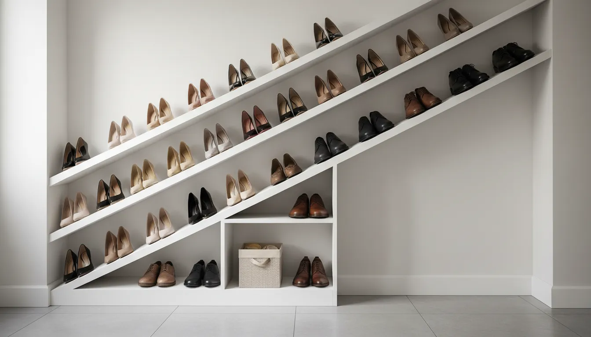
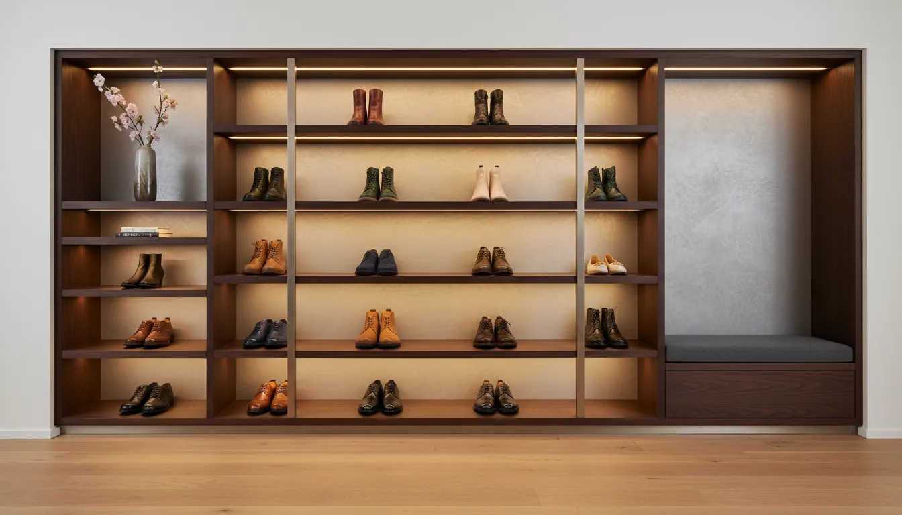
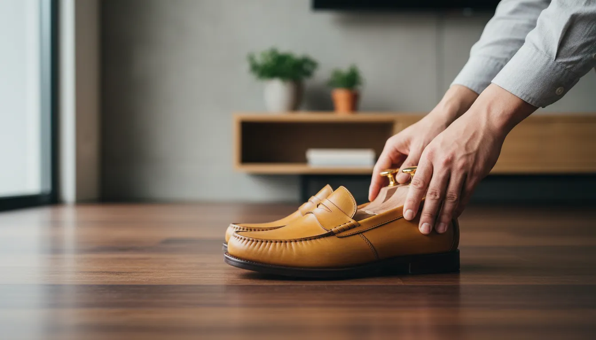

# High-Heel and Dress Shoe Storage: Protecting Expensive Footwear in the Entryway

The entryway is the transitional threshold of the home, a space that sets the tone for the rest of your interior while performing a vital functional role. For fashion enthusiasts and professionals who invest in high-quality footwear, the entryway presents a unique dilemma. While it is the most logical place to remove shoes upon entering, it is frequently ill-equipped to handle the specific storage needs of luxury items such as Italian leather dress shoes or designer high heels.

Leaving a pair of muddy sneakers on a rubber mat is one thing; abandoning a pair of Louboutins or handcrafted Oxfords to the same fate is essentially neglecting an investment. High-end footwear requires distinct structural support, protection from environmental factors, and a storage method that preserves material integrity.

This comprehensive guide explores the intersection of interior design and wardrobe preservation. We will delve into sophisticated storage solutions designed specifically for heels and dress shoes, ensuring your entryway remains elegant while your footwear remains pristine.

## The Unique Vulnerabilities of Luxury Footwear

Before selecting furniture or installation hardware, it is crucial to understand why standard shoe racks often fail expensive footwear. High heels and dress shoes possess architectural and material characteristics that demand specialized care.

### The Physics of the High Heel
High heels, particularly stilettos and kitten heels, have a center of gravity that differs significantly from flats. When placed on standard wire racks, the heels often slip through the gaps, leading to scuffs on the heel shaft or, worse, snapping the structural shank. On flat shelves, they can easily topple over if the surface is slick, causing friction damage to delicate suede or satin finishes.

Furthermore, the counter—the back part of the shoe that cups the heel—is prone to crushing if shoes are piled on top of one another. Proper storage must account for the verticality of the heel and the stability of the sole.

### Leather Memory and Dress Shoes
Men’s dress shoes and leather loafers are living materials. Leather has "memory," meaning it retains the shape it is forced into. If a dress shoe is compressed in a tight cubby or left to curl upward without support, deep creases will form across the vamp (the top part of the shoe). Over time, these creases can crack, permanently ruining the aesthetic of the shoe.

Additionally, leather is highly susceptible to environmental changes. The entryway is often the area of the home with the most fluctuating temperature and humidity levels due to the opening and closing of the front door. This exposure can lead to the drying out of leather or the growth of mold if air circulation is restricted.

## Assessing Your Entryway for Specialized Storage

The first step in protecting your footwear is analyzing the spatial capabilities of your entryway. Unlike a walk-in closet, the foyer is a high-traffic zone that requires a balance between accessibility and concealment.

### The Narrow Hallway Challenge
Many urban homes feature narrow corridors where floor space is at a premium. In these instances, depth is the enemy. Standard shoe cabinets often protrude too far, obstructing the walkway. For high heels and dress shoes, however, you cannot simply reduce the depth without compromising the fit.

The solution lies in verticality and angle. By utilizing tip-out drawers or slanted shelving, you can accommodate the length of a size 12 Oxford or the height of a 4-inch heel within a cabinet that is only 10 to 12 inches deep.

### Utilization of Vertical Space
If floor space is restricted, look upward. Floor-to-ceiling cabinetry offers the ability to categorize footwear by frequency of use. The shoes worn daily can reside at waist height, while special-occasion heels or seasonal boots can be stored on higher shelves.

[Maximizing vertical wall space](/posts/maximizing-vertical-wall-space-entryway) is not just a storage tactic; it is a design opportunity. High-end shelving can transform a collection of beautiful shoes into a gallery-like display, provided they are kept dust-free.

## Specialized Storage Solutions for High Heels

Storing heels requires a departure from the traditional flat shelf. To maintain the structural integrity of the shoe and ensure the entryway looks organized rather than chaotic, consider these tailored approaches.

### Tension Rods and Heel Rails
One of the most effective ways to store high heels is by hanging them by the heel itself. This can be achieved using tension rods installed inside a cabinet or architectural molding mounted directly to the wall.

When the heel hooks over a rail, gravity pulls the sole of the shoe flush against the wall or backing board. This keeps the shoe upright and stable. This method is particularly beneficial for stilettos, as it prevents the delicate tips from bearing weight or rubbing against abrasive surfaces.

### Slanted Shelving with Heel Stops
For those who prefer their shoes to sit flat, slanted shelving is superior to horizontal shelving. A shelf angled between 15 and 30 degrees allows for better visibility of the shoe collection.

Crucially, these shelves must be equipped with a "heel stop" or a lip at the front edge. For heels, the heel of the shoe hooks over the back edge of the shelf (if the shelf is shallow) or the toe rests against the front lip (if the shelf is deep). This angle reduces the footprint of the shoe, allowing you to fit more pairs into a vertical stack.

### Acrylic Risers and Dividers
To prevent a "domino effect" where one pair of falling shoes knocks over several others, compartmentalization is key. Acrylic dividers on open shelving provide invisible boundaries that keep each pair distinct.

For maximizing space on deep shelves, acrylic risers allow you to place one shoe in front of the other, with the rear shoe elevated. This is a common merchandising technique in luxury boutiques that can be adapted for the home entryway to ensure every pair remains visible and accessible.

For those looking to implement this boutique style, transparent storage aids are essential.

**Recommended Product:**
[Amazon Search: Acrylic Shoe Risers and Dividers](https://www.amazon.com/s?k=acrylic+shoe+risers+and+dividers&tag=hats0f8-20)

## Protecting Dress Shoes and Loafers

While heels present stability challenges, dress shoes present material challenges. The primary goal when storing leather footwear in the entryway is preserving the leather's finish and the shoe's shape.

### The Absolute Necessity of Shoe Trees
If you invest in expensive dress shoes, shoe trees are not optional accessories; they are mandatory maintenance tools. When a shoe is removed after a day of wear, the leather is warm and slightly damp from perspiration. As it cools and dries, it will contract. Without internal support, the leather will shrink into the creases formed during walking.

Cedar shoe trees absorb moisture, neutralize odors, and exert gentle pressure to smooth out the lining and leather. In an entryway storage context, ensure your shelving has enough height to accommodate shoes with trees inserted, as they can slightly elevate the vamp.

**Recommended Product:**
[Amazon Search: Aromatic Cedar Shoe Trees](https://www.amazon.com/s?k=aromatic+cedar+shoe+trees&tag=hats0f8-20)

### Breathability vs. Protection
A common mistake is storing fine leather shoes in airtight plastic boxes. Leather needs to breathe. If sealed in plastic, trapped humidity can lead to mold and mildew, which can destroy the leather grain.

If you prefer enclosed storage to protect against dust, opt for boxes with ventilation holes or drop-front fabric organizers that allow air exchange. Alternatively, storing shoes in a wooden cabinet with louvered doors provides the perfect balance of concealment, physical protection, and airflow.

## The Cabinet vs. The Open Rack Debate

When designing your entryway, you must decide between open display storage and closed cabinetry. This decision affects both the aesthetics of your home and the longevity of your shoes.

### The Case for Closed Cabinetry
For expensive footwear, closed cabinetry is generally superior for three reasons:

1.  **UV Protection:** Sunlight is a silent destroyer of footwear. Prolonged exposure to UV rays will fade the vibrant dyes of suede and dry out leather, causing it to become brittle. An enclosed cabinet blocks light completely.
2.  **Dust Mitigation:** Entryways are dusty due to the influx of outdoor air. Dust settling on velvet or satin heels can be incredibly difficult to remove without damaging the fabric.
3.  **Visual Calm:** A collection of shoes, no matter how expensive, can look cluttered if the colors and styles are visually "loud." Hiding them behind doors maintains a minimalist, serene entryway.

### The Case for Open Display
Open shelving is practical for "daily drivers"—the shoes you wear most frequently. It encourages you to put shoes away immediately rather than leaving them on the floor.

If you choose open shelving for high-end shoes, ensure the entryway does not receive direct sunlight, or apply UV-protective film to nearby windows. Open shelving requires a higher commitment to dusting and organization, as every item is part of the room's decor.

## Innovative Entryway Furniture for Footwear

Modern furniture design has evolved to address the specific needs of shoe storage, moving beyond the utilitarian wire rack into the realm of fine furniture.

### The Bench with Hidden Complexity
A simple bench is a staple of entryway design, providing a place to sit while putting on shoes. However, for luxury storage, look for benches with specialized internal compartments.

High-end storage benches now feature vertical pull-out drawers (similar to a spice rack) specifically designed for heels, preventing them from being crushed. Others feature lift-top compartments lined with felt or velvet, perfect for storing delicate evening shoes that are not worn daily but need to be accessible for a night out.

### Slim Tip-Out Cabinets
As mentioned regarding narrow hallways, tip-out cabinets are a marvel of engineering. The shoes are stored vertically rather than horizontally. This design is particularly effective for dress shoes and flats. However, be cautious with high heels; ensure the compartment is tall enough to accommodate the heel height without forcing the shoe into an awkward angle.

If you are looking for a sleek, modern solution that hides the clutter of footwear entirely, these cabinets are often the best choice for tight spaces.

**Recommended Product:**
[Amazon Search: Slim Tip-Out Shoe Cabinet](https://www.amazon.com/s?k=slim+tip-out+shoe+cabinet&tag=hats0f8-20)

## Organization Systems and Categorization

Having the right furniture is only half the battle; how you organize the shoes within that furniture dictates the efficiency of your entryway.

### The Rotation Strategy
It is impractical to keep an entire shoe collection in the entryway. Implement a seasonal rotation system. Only the shoes relevant to the current weather and your current rotation of outfits should be in the "prime real estate" of the entryway.

Off-season expensive footwear should be cleaned, stuffed with acid-free tissue paper or shoe trees, and stored in a climate-controlled closet elsewhere in the home. This prevents overcrowding in the entryway, which is the leading cause of accidental damage (scuffs and crushing).

### The "Landing Strip" Concept
Designate a specific "landing strip" for wet or dirty shoes. Never place a damp shoe directly into a closed cabinet or next to a pristine pair of satin heels.

This can be a bottom shelf equipped with a waterproof tray filled with river rocks (to allow drainage) or a dedicated absorbent mat. Once the shoes are dry and cleaned, they can be migrated to their permanent storage spot on the upper shelves.

## Maintenance at the Door: The Pre-Storage Ritual

Protecting expensive footwear is as much about behavior as it is about storage. Establishing a protocol for when you walk in the door will extend the life of your shoes significantly.

### The Inspection
Before placing shoes in storage, perform a quick 10-second inspection. Check the heels for mud and the soles for grit. Small stones lodged in the tread can damage the shelf surface and eventually track dirt onto other shoes.

### Deodorizing and Drying
Never store shoes immediately if you have worn them for a full day. Allow them to air out for at least an hour. If your entryway cabinet is enclosed, consider placing small sachets of activated charcoal or cedar shavings on the shelves to actively manage moisture and odors within the cabinet.

## DIY Customizations for the Perfect Fit

Stock furniture rarely fits every collection perfectly. Customizing your entryway storage ensures your specific footwear is accommodated safely.

### Adjusting Shelf Heights
Most luxury cabinets come with adjustable shelving. Take the time to measure your tallest boots and your highest heels. Arrange the shelves so there is roughly two inches of clearance above the tallest shoe. This prevents the "scrape" that occurs when trying to pull a tight-fitting shoe off a shelf.

### Adding Soft Liners
Standard shelves are often made of melamine, wood, or metal. While durable, these surfaces can be abrasive to the soft leather soles of high-end Italian footwear.

Line your shelves with felt, velvet, or a soft cork liner. This adds a touch of luxury to the user experience and provides a soft landing for the shoes, preventing scratches on the soles and reducing noise when placing them down.

For more ideas on how to customize your space effectively, read our guide on [small entryway makeovers](/posts/small-entryway-makeovers-big-impact).

## Conclusion: Preserving Your Investment

The shoes you choose to wear are an expression of your personal style and, frequently, a significant financial investment. Relegating high-heels and dress shoes to a pile on the floor or a cramped, inadequate rack is a disservice to the craftsmanship of the footwear.

By selecting storage solutions that respect the structural needs of the shoe—whether through heel-friendly rails, breathable cabinets, or proper spacing—you transform your entryway from a cluttered drop-zone into a sophisticated gallery. This not only protects your footwear for years to come but also ensures that your home makes an impeccable first impression the moment you walk through the door.

Prioritize structure, protection, and accessibility, and your entryway will serve as the perfect guardian for your most prized footwear.