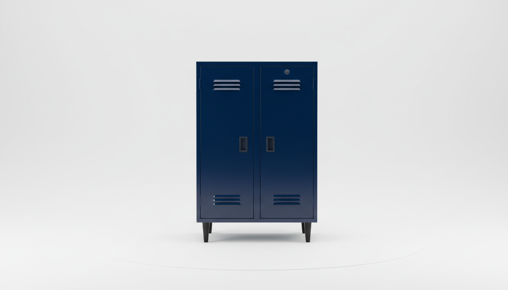

# How Much Do Quality Mudroom Lockers Cost? A Comprehensive Price Breakdown

The sound of a front door opening is usually followed by a distinctive, chaotic symphony: the thud of backpacks hitting the floor, the clatter of cleats, and the rustle of coats being shed like reptilian skin, often left right where they fell. For many of us, the entryway isn't just a threshold; it is a battleground of clutter.

The dream, fueled by glossy architectural digests and perfectly curated Pinterest boards, is the "mudroom locker." It is a dedicated, compartmentalized sanctuary for our outdoor lives. But when one decides to transition from the chaos of a coat pile to the serenity of joinery, a significant question arises, one that is often obscured by beautiful photography: What does this actually cost?

Pricing in the world of cabinetry and furniture is rarely transparent. It is a sliding scale that moves from three figures into five with alarming speed, dictated by materials, customization, and labor. To understand the true cost of a quality mudroom locker system, we must peel back the layers of construction, examine the market tiers, and identify where value meets aesthetic.

This is your comprehensive financial and functional breakdown of the modern mudroom.

The Anatomy of the Cost: Materials and Mechanics

Before we discuss dollar amounts, we must understand what we are paying for. A locker is essentially a vertical box, but the integrity of that box determines whether it lasts for six months or sixty years.

The Substrate Spectrum
At the base level, cost is driven by the wood—or the lack thereof.
   Particle Board/MDF: The most common material for affordable, flat-pack furniture. It is cost-effective and uniform, but it dislikes moisture—a cruel irony for a "mud" room.
   Plywood: The standard for quality cabinetry. It is stronger, lighter, and more resistant to warping than particle board.
   Solid Hardwood: The gold standard. Maple, oak, or cherry. This is where costs skyrocket, used primarily for face frames, doors, and trim in high-end custom work.

Hardware and Joinery
The second driver of cost is how the piece is held together. Cam-locks and dowels (typical in boxed furniture) are inexpensive and easy to ship. Dovetail joints, dados, and heavy-duty soft-close hinges represent the upper echelon of craftsmanship. When you pay a premium, you are often paying for the hardware you don’t see—the glides that don't stick and the hinges that don't sag.

Tier 1: The "Ready-to-Assemble" Solution ($200 - $600)

For the vast majority of homeowners, the entry point into organized living is the freestanding hall tree. These are the pieces that arrive in flat boxes, requiring an afternoon with an Allen wrench and a bit of patience.

While architectural snobs might turn their noses up at "flat-pack," the reality is that manufacturing technology has improved drastically. In this price bracket, you are looking for smart design that maximizes utility. You aren't paying for a carpenter's time; you are paying for efficient engineering.

However, even within this tier, there is a divergence between pure utility and aesthetic effort.

The Utilitarian Heavyweight
If your primary goal is to maximize cubic inches of storage per dollar spent, you are looking for width and depth. You need a piece that mimics the dimensions of a built-in without the permanence.

This brings us to the Prepac Wide Hall Tree with Shoe Storage.

I have analyzed this unit extensively because it solves the "width problem" that plagues most budget furniture. Many hall trees are too narrow, handling perhaps two coats comfortably. The Prepac aims to dominate the wall. At 60 inches wide, it offers a significant footprint that rivals custom cabinetry.

What makes this unit a fascinating study in cost-efficiency is its compartmentalization. It features 24 shoe cubbies. In the world of custom carpentry, building 24 individual cubbies is a labor-intensive nightmare that drives prices up. Here, through clever mass manufacturing, you get high-density storage at a fraction of the bespoke cost.

The material is a laminated composite wood, which is standard for the price, but the sheer volume of organization it provides is the value proposition. It is a piece designed for the active family—the ones with soccer cleats, running shoes, and winter boots that need immediate homes. It doesn't pretend to be an antique; it promises to be a machine for living.

> ### Prepac Wide Hall Tree with Shoe Storage
> Best 'locker-style' option with maximum shoe storage capacity (24 cubbies).
> [**Explore Verified Product on Amazon**](https://www.amazon.com/dp/B001KW0BBU/?tag=thesmartgadjet-20)

Tier 2: The "Furniture-Look" Mid-Range ($600 - $1,200)

Moving up the ladder, we leave behind the purely utilitarian and enter the realm of design integration. In this price bracket, homeowners are looking for pieces that feel less like "storage units" and more like intentional furniture. We start seeing better finishes, architectural details like crown molding or tapered legs, and hardware that feels substantial to the touch.

The cost increase here justifies the addition of style. You are paying for the veneer, the beveled mirror, and the distressing that gives a piece character.

The Farmhouse Aesthetic
The "Modern Farmhouse" movement shifted the mudroom from a dirty utility space to a focal point of the home. The demand for beadboard, antique finishes, and warm hardware is immense.

Entering this space is the Bush Furniture Salinas Hall Tree with Storage Bench.

This piece sits comfortably in the mid-range because it successfully mimics the look of a curated antique. The design language here is distinct—tapered legs, curved base rails, and decorative wood accents inspired by Mission styling. It moves away from the "gym locker" look and toward a piece that belongs in a cozy foyer.

From a value perspective, the Salinas stands out because of its hardware and finish quality. The metal drop pull hardware adds a tactile element of quality that plastic handles cannot replicate. While it still utilizes engineered wood to keep the price accessible, the "Antique White" or "Vintage Black" finishes are applied with a depth that resists the flat, plasticky look of cheaper alternatives. It’s a piece designed to be seen, not just used.

> ### Bush Furniture Salinas Hall Tree with Shoe Storage Bench
> Best for a traditional, built-in furniture look that adds character to any entryway.
> [**Check Price & Availability on Amazon**](https://www.amazon.com/dp/B07GL3M36N/?tag=thesmartgadjet-20)

The Coastal Connection
Similar to the Farmhouse style, the "Coastal" aesthetic relies heavily on texture—specifically, the shadow lines of beadboard and the weathered look of salt-air exposure.

The Crosley Furniture Seaside Hall Tree captures this specific architectural niche.

Crosley is a brand that understands the "heirloom aesthetic." The Seaside Hall Tree is priced for the mid-market, yet it incorporates details that usually require a contractor. The primary value driver here is the beadboard backing. In a custom build, installing beadboard is an extra material and labor cost; here, it is integral to the design.

The unit creates a sense of height and airiness. It utilizes a distressed finish that is forgiving of the inevitable dings and scratches a mudroom will sustain—a smart feature for a high-traffic item. It bridges the gap between a storage locker and a decorative piece of hallway furniture, offering full-length storage alongside the bench seating. It feels substantial, grounding the space without requiring it to be bolted to the studs for structural integrity (though safety anchoring is always recommended).

> ### Crosley Furniture Seaside Hall Tree
> Elegant coastal design with built-in bench and shoe storage.
> [**View Verified Reviews on Amazon**](https://www.amazon.com/dp/B00P29UKSS/?tag=thesmartgadjet-20)

Tier 3: The Semi-Custom & Modular Systems ($1,500 - $4,500)

If the freestanding units don't fill your space wall-to-wall, or if your ceiling height demands something taller, you enter the world of semi-custom modular systems.

This is the "IKEA Hack" territory, or the realm of brands like California Closets or The Container Store. You are not buying a single box; you are buying components—base cabinets, tall lockers, filler strips, and crown molding—that are assembled on-site to fit your specific dimensions.

The Cost Breakdown:
   Design Fees: often included in the product price, but you pay for it in the markup.
   Installation: In this tier, you might be paying a handyman or a specialized installer $500 to $1,000 to level the cabinets and scribe the trim to your uneven walls.
   Finish Quality: You generally get higher-grade thermofoils or painted MDF doors that look and feel like painted wood.

The advantage here is scalability. You can buy three locker sections today and add overhead storage next year. The disadvantage is the complexity of assembly and the rapid jump in price once you start adding bells and whistles like soft-close drawers or pull-out shoe racks.

Tier 4: True Custom Architectural Joinery ($5,000 - $15,000+)

This is the summit. This is the "Dream Home" mudroom.

At this level, you are not buying a product; you are hiring a trade. A finish carpenter or cabinet maker visits your home, measures your walls with lasers, and builds cabinetry that is integrated seamlessly into your architecture.

Why is the price disparity so massive?

1.  Labor: You are paying for skilled hours. Scribing a cabinet to fit a wall that bows by half an inch takes time. Building drawers with dovetail joinery takes time. Spraying a conversion varnish finish that feels like silk takes time.
2.  Materials: We are talking about cabinet-grade maple plywood boxes and solid wood doors. No particle board.
3.  Integration: These lockers go floor-to-ceiling. They have baseboards that match your house, and crown molding that wraps seamlessly around the room. They cover vents and accommodate electrical outlets.

The Linear Foot Rule:
Custom cabinetry is often priced by the linear foot. For mudroom lockers, expect to pay $800 to $1,500 per linear foot. A 10-foot run of lockers could easily cost $12,000 before you even buy the hooks.

The Hidden Costs of the Mudroom

Regardless of which tier you choose—from the efficient Prepac to a custom build—there are hidden variables that every homeowner forgets to budget for. These can increase the project cost by 20-30%.

1. The "Basket Tax"
Open cubbies look beautiful in catalogs, but in real life, they are chaotic voids. To make them functional, you need baskets or bins. A high-quality woven basket that fits a standard cubby costs between $30 and $60. If your locker system has 12 cubbies, you just added $500 to the project.

2. The Hardware Upgrade
Even on mid-range furniture like the Bush or Crosley units, you might decide the stock hooks aren't robust enough for heavy winter coats. upgrading to solid brass or iron hooks can cost $15 to $30 per hook. It’s a small detail that elevates the look, but it adds up.

3. Shipping and Delivery
Tier 1 and 2 products usually ship free or for a nominal fee via ground carriers. However, Tier 3 and 4 options often require freight delivery. "Threshold delivery" (dumping it in your driveway) might be free, but "White Glove" (bringing it inside and taking away the trash) can cost $200+.

4. Wall Repair and Paint
If you are removing old closet doors or shelving to make room for a hall tree, you will have wall damage. Patching drywall and matching paint is either a weekend of your time or a bill from a painter.

Return on Investment: Is It Worth It?

When we analyze the cost of home improvements, we often look for ROI (Return on Investment) in terms of resale value.

Tier 1 & 2 (Freestanding): These do not add appraisal value to your home because they are considered "chattel" (personal property). You take them with you when you move. However, they add staging value. A tidy entryway sells a house faster than a cluttered one.

Tier 3 & 4 (Built-in): These are fixtures. They appraise with the home. A well-executed custom mudroom is a high-desire feature for family buyers. While you may not get a dollar-for-dollar return (you rarely do with renovations), the "wow factor" can be the tipping point in a competitive market.

The "Sanity" ROI
But the true ROI of a mudroom locker isn't monetary. It’s psychological.
There is a tangible value in reducing the friction of leaving the house. If a $400 hall tree saves you five minutes of hunting for shoes every morning, that is 30 hours of time saved per year. If it stops the daily argument about backpacks on the floor, the emotional dividend is incalculable.

The Verdict: Choosing Your Lane

So, how much does a mudroom locker cost?

   $300 - $500: You are buying efficiency. You get the organization you need with materials that require care but get the job done. The Prepac fits here perfectly.
   $600 - $1,200: You are buying style and presence. You want the storage, but you also want the entryway to look furnished and welcoming. The Bush Salinas and Crosley Seaside dominate this lane.
   $2,000+: You are entering the world of modification and semi-custom work.
   $10,000+: You are investing in permanent architecture.

The secret is that organization is not dependent on price. A five-figure custom locker can be just as cluttered as a $50 coat rack if the system doesn't match the habits of the people using it.

Start with the habits. Count the shoes. Measure the backpacks. Then, choose the vessel that fits your budget. Whether it’s the flat-pack marvel or the custom joinery, the luxury of a clear floor is accessible at every price point.

Expert FAQ

Q: What is the ideal depth for a mudroom locker?
A: Standard depth is typically between 15 and 18 inches. However, if you want to hang coats on a rod (like a closet) rather than on hooks, you need a depth of at least 24 inches to allow the hangers to sit perpendicular to the wall. Most hall trees use hooks, allowing for a slimmer 15-18 inch profile which is better for narrow hallways.

Q: Can I make a freestanding hall tree look like a built-in?
A: Absolutely. This is a favorite trick of interior designers. If you purchase a unit like the Bush Salinas or Crosley Seaside, you can place it against the wall, remove the baseboards behind it so it sits flush, and then add trim molding around the top and sides to bridge the gap to the wall. A coat of matching paint on the trim completes the illusion.

Q: How much weight can a typical hall tree bench support?
A: This varies by construction. A standard particle board or MDF bench usually supports 200-250 lbs. Units with reinforced metal frames or solid wood elements can often support 300+ lbs. Always check the specific "weight capacity" in the manufacturer's manual—never assume.

Q: Is it better to have open cubbies or closed doors?
A: This depends on your personality type. "Visual organizers" need to see things to remember them; they prefer open cubbies. "Minimalists" prefer to hide the clutter behind doors. For mudrooms, a mix is usually best: open hooks for wet coats (airflow is crucial for drying) and closed drawers or baskets for small, messy items like gloves and chargers.

Q: How do I prevent moisture damage on affordable hall trees?
A: Water is the enemy of composite wood. Place a high-quality, absorbent runner rug in front of the unit to catch dripping water from coats. You can also use plastic boot trays inside the lower cubbies to ensure wet soles never touch the wood surface directly.

Q: Do I need to anchor these units to the wall?
A: Yes. Non-negotiable. Even if the unit feels heavy and stable, the act of hanging heavy coats on the top hooks shifts the center of gravity forward. If a child climbs on the bench to reach a hook, the tipping risk is real. Always use the anti-tip hardware included, or buy a heavy-duty toggle strap kit.

Q: How much should I budget for installation if I can’t DIY?
A: For a "flat-pack" piece of furniture (Tier 1 or 2), expect to pay a handyman or assembly service (like TaskRabbit) between $80 and $150 per unit. It usually takes a pro about 60-90 minutes to assemble a complex hall tree.

