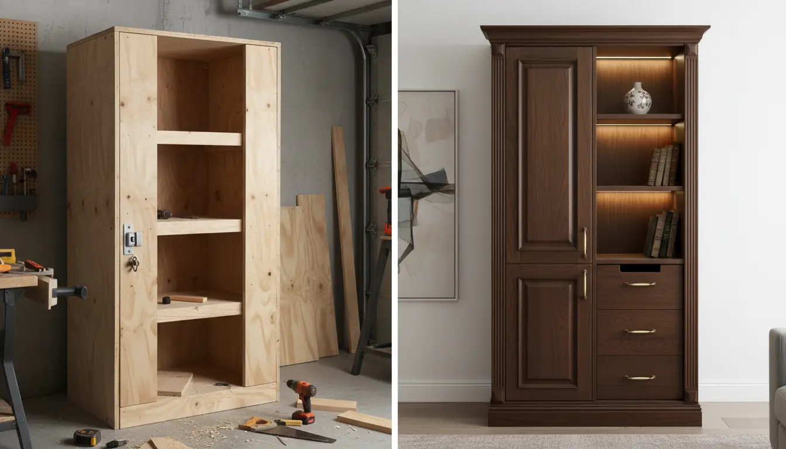
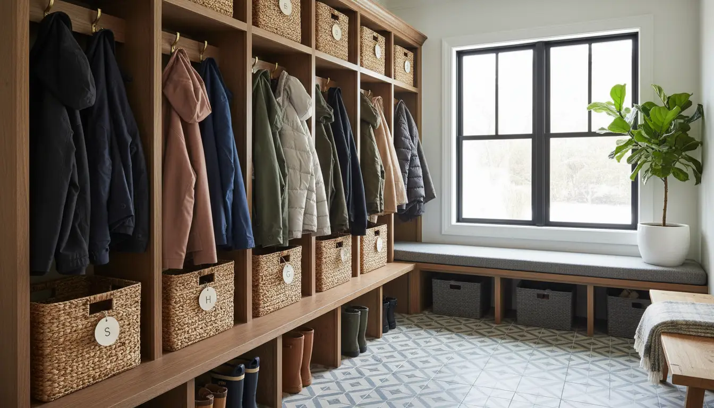

---
title: "How Much Do Quality Mudroom Lockers Cost? A Comprehensive Price Breakdown"
slug: "how-much-do-quality-mudroom-lockers-cost-a-comprehensive-price-breakdown"
pubDate: "2026-01-28"
description: Discover the real cost of mudroom lockers, from DIY kits to custom cabinetry. We break down materials, labor, and hidden fees to help you budget effectively.
author: "Content Bot"
image:
  url: "../../images/blog/how-much-do-quality-mudroom-lockers-cost-a-comprehensive-price-breakdown.webp"
  alt: "A luxurious, navy blue custom mudroom locker system with shiplap backing, oak bench seating, and brass hardware in a bright entryway."
tags: 
  - Mudroom Ideas
  - Home Renovation
  - Cost Guide
  - Interior Design
  - Storage Solutions
category: "Home Improvement"
keywords:
  - mudroom locker cost
  - custom mudroom cabinetry price
  - DIY mudroom lockers
  - entryway storage solutions
  - built-in mudroom cost
canonical: "https://www.entrywaystorage.com/posts/how-much-do-quality-mudroom-lockers-cost-a-comprehensive-price-breakdown"
---

The modern home has evolved, and with it, the demand for organized, functional entryways has skyrocketed. Gone are the days when a simple coat rack and a rubber mat sufficed. Today, the mudroom is the command center of the home—the "drop zone" where the chaos of the outside world is contained before it spills into the living room. At the heart of this organization lies the mudroom locker system.

Whether you are dreaming of individual cubbies for the kids, a dedicated spot for muddy boots, or an elegant wall of joinery that rivals a high-end library, one question inevitably arises: **How much do quality mudroom lockers cost?**

The answer, as with most home improvement projects, is rarely a single number. It is a spectrum. Depending on your choice of materials, the complexity of the design, and who installs it, a mudroom project can range from a few hundred dollars for a savvy DIY hack to over $10,000 for bespoke, architectural millwork.

In this comprehensive guide, we will peel back the layers of pricing. We will explore the costs associated with DIY solutions, pre-fabricated units, and fully custom cabinetry. We will also dive into the hidden factors that drive prices up—like hardware, finishes, and electrical work—so you can budget with confidence and create the **entryway storage solutions** your home deserves.

## The Price Spectrum: At a Glance

Before we dive into the nitty-gritty details of wood species and labor rates, it is helpful to establish a baseline. When homeowners search for the **mudroom locker cost**, they usually fall into one of three categories.

> **The Golden Rule of Renovation:** Fast, Cheap, or Good—you can usually only pick two.

Here is a quick breakdown of what you can expect to pay for a standard 6-to-8-foot wide locker setup:

1.  **The Budget/DIY Tier ($300 – $1,000):** This usually involves purchasing flat-pack furniture (like IKEA bookcases) and "hacking" them with trim to look built-in, or using basic lumber to build a simple frame yourself.
2.  **The Mid-Range/Semi-Custom Tier ($1,200 – $4,000):** This category includes high-quality modular systems, pre-assembled cabinets from kitchen suppliers, or hiring a handyman to install simpler carpentry.
3.  **The High-End/Custom Tier ($5,000 – $12,000+):** This is the realm of professional cabinet makers. It involves custom design, premium hardwoods, professional spray finishes, and intricate details like crown molding and soft-close hardware.

Understanding where your budget sits on this spectrum is the first step toward a successful project. However, the sticker price is only half the story. To truly understand the value, we must look at what influences these numbers.

## Factors Influencing the Custom Mudroom Cabinetry Price

Why does one quote come in at $2,500 and another at $8,000 for what looks like the same design? The devil is in the details. Several core variables will dictate the final price tag of your project.

### 1. Material Selection: MDF vs. Plywood vs. Solid Wood
The skeleton of your lockers makes up a significant portion of the material cost.

*   **MDF (Medium Density Fiberboard):** This is the most common material for painted cabinetry. It is smooth, stable, and affordable. However, it is heavy and susceptible to water damage if not sealed properly.
*   **Cabinet-Grade Plywood:** Stronger and lighter than MDF, plywood is the standard for high-quality cabinet carcasses. It holds screws better and resists moisture more effectively. Expect to pay a 20-30% premium over MDF.
*   **Solid Wood:** Rarely used for the box construction due to cost and warping issues, solid wood (Maple, Oak, Walnut) is typically reserved for face frames, doors, and bench tops. A solid white oak bench seat alone can cost upwards of $400 for the lumber.

### 2. Size and Scope
It sounds obvious, but the sheer volume of the project drives the cost.
*   **Linear Footage:** Cabinet makers often charge by the linear foot. A 10-foot wall will cost significantly more than a 5-foot nook.
*   **Height:** Standard cabinets go to 8 feet. If you have 9 or 10-foot ceilings and want the lockers to go "floor to ceiling" with stacked upper cabinets, you are effectively adding a second layer of cabinetry, increasing labor and materials by 30-50%.
*   **Depth:** Standard locker depth is 15-18 inches. Deep lockers (24 inches) require more material and often custom-sized slides or supports.

### 3. Doors and Drawers
Open cubbies are the cheapest option. As soon as you add functionality, the price jumps.
*   **Drawers:** A single drawer requires the drawer box (material), the drawer front (material + finish), and the slides (hardware). Adding a bank of drawers to the base of your lockers can add $500-$1,000 to the project.
*   **Doors:** Shaker style, raised panel, or slab? Inset doors (which sit flush inside the frame) require extreme precision and expensive hinges, often increasing the cost by 15-20% compared to overlay doors.

### 4. Hardware and Accessories
Never underestimate the cost of "jewelry" for your cabinets.
*   **Hooks:** You might need 10-15 hooks. At $5 for cheap ones or $25 for heavy-duty architectural hooks, this line item varies.
*   **Pulls and Knobs:** Quality brass or matte black hardware can run $10-$30 per piece.
*   **Slides and Hinges:** Soft-close Blum hardware is the industry standard for quality, but it costs significantly more than generic big-box store hinges.

For those looking to upgrade their current setup without a full renovation, adding high-quality hardware is a great first step.

**Recommended Product:** If you are building a DIY setup or upgrading an existing one, durable hooks are essential.
[**View on Amazon: Heavy Duty Coat Hooks**](https://www.amazon.com/s?k=heavy+duty+coat+hooks+matte+black&tag=hats0f8-20)

## Option 1: The DIY and Budget-Friendly Route

For the handy homeowner or the budget-conscious, the **DIY mudroom lockers** route is attractive. This approach typically keeps costs between **$300 and $1,000**.

### The IKEA Hack
The most popular method in this tier is the "IKEA Hack." This involves buying Billy bookcases or Pax wardrobe units and anchoring them to the wall. To make them look custom, homeowners add baseboards, crown molding, and filler strips to close the gaps between the unit and the wall.
*   **Cost of Units:** ~$100 - $200 per unit.
*   **Trim/Lumber:** ~$150.
*   **Paint/Primer:** ~$50.
*   **Total:** ~$500 - $800 for a typical 3-locker setup.

### Scratch-Built with Construction Lumber
Using 2x4s and sanded plywood from a local hardware store is the cheapest method but requires the most labor. You will need a table saw, a Kreg jig (for pocket holes), and a lot of patience. The finish will likely be rustic unless you spend considerable time sanding and filling.

**Pros:**
*   Lowest financial investment.
*   Satisfaction of building it yourself.
*   Completely customizable dimensions.

**Cons:**
*   Time-consuming (expect 2-3 full weekends).
*   Requires tool ownership or rental.
*   Finish quality depends entirely on your skill level.
*   Durability may be lower than professional cabinetry.

If you aren't ready to build from scratch but need immediate organization, a freestanding hall tree is a zero-labor alternative that mimics the locker look.

**Recommended Product:** A sturdy hall tree can provide immediate relief for entryway clutter.
[**View on Amazon: Hall Tree with Bench and Shoe Storage**](https://www.amazon.com/s?k=hall+tree+with+bench+and+shoe+storage&tag=hats0f8-20)

## Option 2: Pre-Fabricated and Semi-Custom Units

Moving up the ladder, we find the "middle ground." This is ideal for homeowners who want a polished look without the custom price tag, typically costing between **$1,200 and $4,000**.

### Modular Systems
Companies like Pottery Barn, Wayfair, and specialized closet companies (like California Closets or The Container Store) offer modular systems. You pick the pieces (bench, locker, upper cabinet), and they ship them to you.
*   **Quality:** Generally better than IKEA (often using particle board with high-quality veneers or some solid wood components).
*   **Installation:** Some require assembly; others come pre-assembled and just need to be screwed together and anchored.

### Semi-Custom Kitchen Cabinets
Another clever hack is using utility cabinets from kitchen cabinet retailers (like Lowe's, Home Depot, or RTA cabinet sites). You can buy tall pantry cabinets for the lockers and short refrigerator cabinets for the upper storage.
*   **Pros:** Factory finish (very durable), wide range of door styles.
*   **Cons:** You are limited to standard widths (18", 24", 30", 36"). If your wall is 97 inches wide, you will have to use extensive filler strips to make standard cabinets fit.

### The Hybrid Approach
You can also hire a handyman or carpenter to install pre-fabricated units and add the trim for you. This combines the speed of buying off-the-shelf with the look of a built-in.
*   **Material Cost:** $1,500
*   **Labor Cost:** $500 - $1,000
*   **Total:** ~$2,500

## Option 3: Fully Custom Carpentry (The "Dream" Mudroom)

When you see those breathtaking mudrooms on Pinterest or in architectural magazines—the ones with integrated lighting, perfectly color-matched finishes, and seamless floor-to-ceiling integration—you are looking at fully custom work. The **custom mudroom cabinetry price** generally lands between **$5,000 and $12,000+**.

### Why Is It So Expensive?
You are paying for skilled labor and time. A custom project involves:
1.  **Design and Consultation:** Measurements, 3D renderings, and material sourcing.
2.  **Shop Fabrication:** The cabinets are built off-site in a professional woodshop using high-grade joinery (dovetails, dadoes).
3.  **The Finish:** This is the biggest differentiator. A professional shop sprays a catalytic varnish or lacquer that is hard as nails and silky smooth. You cannot achieve this finish with a brush and roller at home.
4.  **Installation:** Scribing the cabinets to fit your uneven walls and floors perfectly.

### Pricing Breakdown for Custom Work
*   **Materials:** $1,500 - $3,000 (Plywood, solid wood bench, extensive trim).
*   **Hardware:** $300 - $600.
*   **Shop Labor (Build):** $2,000 - $4,000.
*   **Finishing (Paint/Stain):** $1,500 - $2,500.
*   **Installation:** $1,000 - $1,500.

### Custom Add-Ons That Spike the Price
*   **Shiplap or Beadboard Backing:** Adding detail to the back of the lockers adds material and painting labor.
*   **Oak/Walnut Accents:** Stained wood contrasts beautifully with painted cabinets but requires more expensive lumber and a separate finishing process.
*   **Integrated Lighting:** LED strip lighting in the cubbies or toe-kicks requires electrical rough-ins and specialized channels.
*   **Mesh or Glass Inserts:** Adding decorative wire mesh to cabinet doors adds cost for the material and the installation.

## Hidden Costs You Might Forget

Regardless of which tier you choose, projects rarely stick strictly to the cabinet costs. When budgeting, ensure you have a contingency fund (usually 10-15%) for these often-overlooked expenses.

### 1. Demolition and Prep
Before the new lockers go in, the old stuff must come out. Do you have existing baseboards? They need to be carefully removed. Is there an old closet requiring demolition? Removing drywall, framing, and disposing of debris can cost **$300 - $800** in labor and dumpster fees.

### 2. Electrical Work
If your new lockers will cover an existing outlet, it must be moved. According to code, you cannot simply bury a junction box behind a cabinet. An electrician will need to move the outlet to the toe-kick or inside a locker.
*   **Cost:** **$150 - $300** per moved outlet.

### 3. Flooring Gaps
If you tear out an old closet to build lockers, you might find the flooring doesn't extend into that space. You will either need to patch the flooring (difficult) or build the lockers with a floor platform to cover the subfloor.

### 4. Organization Accessories
The lockers are just the shell; you need bins to contain the clutter. Baskets for hats, gloves, and scarves are essential for the functionality of the mudroom. High-quality woven baskets can cost $30-$50 each. If you have 4 lockers with upper and lower storage, that's 8 baskets.

**Recommended Product:** To keep your new lockers pristine, sturdy baskets are a non-negotiable add-on.
[**View on Amazon: Woven Storage Baskets for Mudroom**](https://www.amazon.com/s?k=woven+storage+baskets+for+mudroom&tag=hats0f8-20)

## Return on Investment: Is It Worth It?

When staring at a $5,000 estimate, it is natural to hesitate. Is a mudroom worth that much?

### Resale Value
In real estate, "storage sells." A designated, built-in mudroom is a highly desirable feature for families. While you may not get a dollar-for-dollar return (few renovations offer 100% ROI), it significantly increases the *marketability* of your home. A well-designed mudroom signals to buyers that the home is organized and functional.

### The "Sanity" Value
Beyond finances, there is the quality of life ROI. How much is it worth to not trip over shoes every time you walk in the door? How much time is saved in the morning when kids know exactly where their backpacks are? For many parents, the reduction in daily stress and the organization of the "drop zone" makes the investment priceless.

## A Step-by-Step Guide to Estimating Your Project

To get a realistic idea of what *your* specific project will cost, follow these steps:

1.  **Measure the Space:** Get the width, height, and depth.
2.  **Determine Your Must-Haves:** Do you need a bench? Do you need doors to hide the mess, or are open hooks okay?
3.  **Choose Your Tier:** Be honest about your budget and DIY capabilities.
4.  **Count the Bays:** A standard locker bay is 24 inches wide. Divide your total width by 24 to see how many "units" you are building.
5.  **Apply the Multiplier:**
    *   *DIY:* $150 per linear foot.
    *   *Semi-Custom:* $300-$500 per linear foot.
    *   *Fully Custom:* $800-$1,200 per linear foot.

## Frequently Asked Questions about Mudroom Costs

**Q: Can I put mudroom lockers in a narrow hallway?**
A: Yes, but you will need to adjust the depth. Standard lockers are 15-18 inches deep. In a hallway, you might need to reduce this to 12 inches and use side-mounted hooks rather than back-mounted ones to accommodate coat width. Custom carpentry is usually required for this to ensure enough walking clearance.

**Q: Is it cheaper to paint or stain the wood?**
A: Generally, painting is slightly cheaper or comparable to staining, depending on the wood species used. Paint grade wood (Poplar, MDF) is cheaper than stain grade wood (Oak, Walnut). However, the *labor* for a high-quality painted finish (sanding between coats, priming) is intensive.

**Q: How can I save money on a custom design?**
A: To lower the **custom mudroom cabinetry price**, consider:
*   Open cubbies instead of doors (saves on hardware and door fabrication).
*   Paint it yourself (have the carpenter build and install unfinished).
*   Use a laminate countertop for the bench instead of solid wood or stone.

## Conclusion

So, how much do quality mudroom lockers cost? The answer lies in your specific needs and how much "sweat equity" you are willing to invest. You can achieve a functional, organized entry for **under $800** with creativity and elbow grease. Alternatively, you can invest **$5,000 to $10,000** for a stunning, architectural feature that adds lasting value to your home.

Regardless of the budget, the goal remains the same: reclaiming your entryway from the clutter. By understanding the breakdown of materials, labor, and finishes, you can make an informed decision that balances your bank account with your design dreams.

Ready to start your project? Grab your tape measure, determine your budget tier, and take the first step toward a more organized home today.

