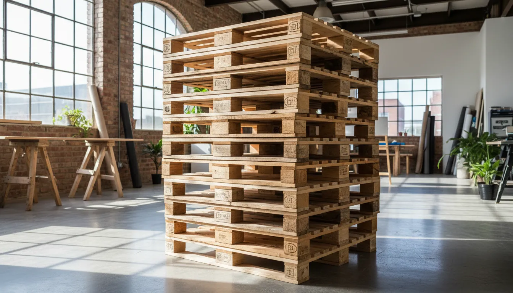
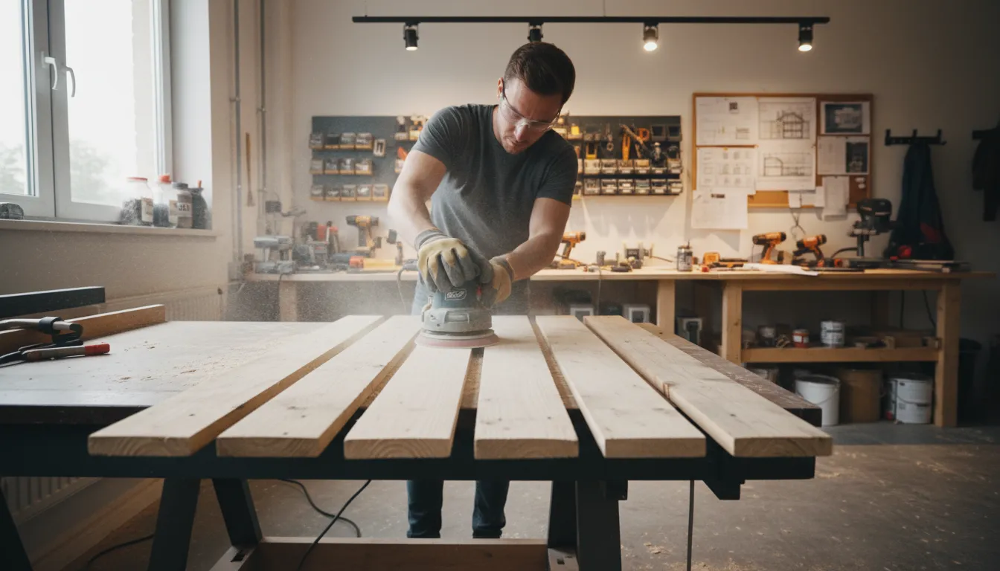
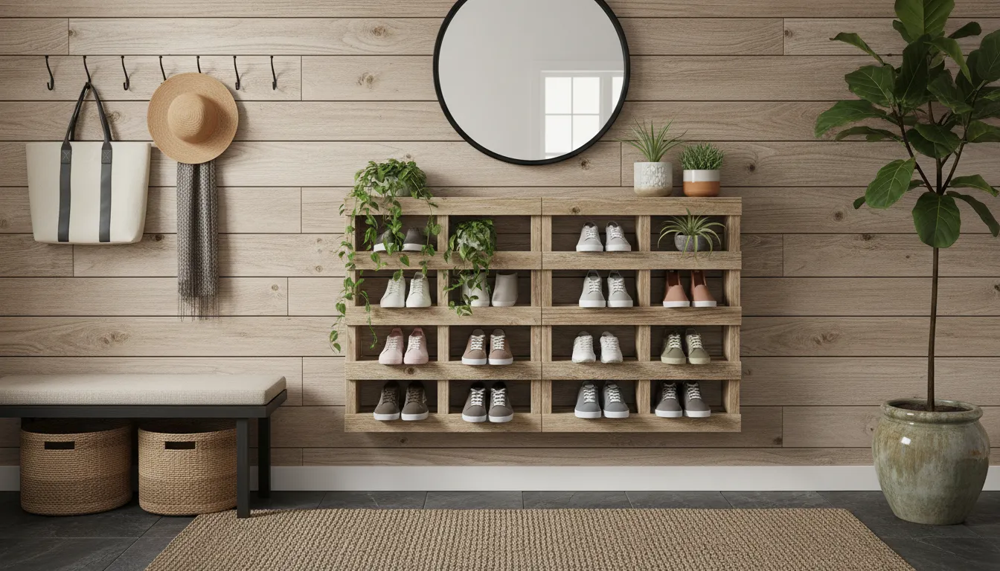

# How to Build a Simple Pallet Shoe Storage Rack for Your Mudroom Entryway

The mudroom is often the most trafficked area of the home, acting as the primary threshold between the outdoors and your sanctuary. Consequently, it is also the area most prone to clutter. A pile of disorganized shoes can instantly create a sense of chaos the moment you walk through the door. While there are countless retail options for shoe organization, few offer the character, durability, and cost-effectiveness of a DIY project using reclaimed materials.

Building a shoe storage rack from shipping pallets is not merely a budget-friendly decision; it is a design choice that adds rustic warmth and texture to your entryway. Pallet wood, often oak or yellow pine, possesses a weathered charm that new lumber cannot easily replicate. Furthermore, upcycling creates a sustainable lifecycle for materials that might otherwise end up in a landfill.

In this comprehensive guide, we will walk through the entire process of constructing a simple yet robust pallet shoe rack. From sourcing safe wood to the final application of sealant, you will learn the techniques necessary to create a professional-quality piece of furniture that organizes your footwear and enhances your home decor.

## The Appeal of Pallet Wood in Modern Interiors

Before diving into construction, it is worth understanding why pallet furniture has transitioned from a niche hobby to a staple of modern farmhouse and industrial interior design. The primary appeal lies in the wood's provenance. Every scrape, nail hole, and stamp on a pallet tells a story of its journey. When sanded and finished, these imperfections become aesthetic features known as patina.

However, working with pallets requires specific knowledge regarding safety and preparation. Unlike dimensional lumber bought from a hardware store, pallets are industrial byproducts. This guide ensures you navigate the selection process safely, resulting in a piece of furniture that is safe for indoor use and sturdy enough to hold heavy winter boots.

## Phase 1: Sourcing and Selecting Safe Pallets

The most critical step in this project occurs before you pick up a hammer. Not all pallets are created equal, and some are chemically treated to prevent pests during international shipping. Bringing chemically treated wood into your home can pose health risks, so knowing how to read pallet stamps is mandatory.

### Decoding the Stamps

Look for the IPPC stamp on the side of the pallet. You will see a two-letter country code, a unique number, and a treatment code. You must look for the code **HT** (Heat Treated).
*   **HT (Heat Treated):** The wood has been heated to a core temperature of 56°C for 30 minutes. This is safe for DIY projects.
*   **DB (Debarked):** The bark has been removed. This is often found alongside HT and is safe.
*   **MB (Methyl Bromide):** This is a toxic fumigant. **Never use MB pallets** for indoor furniture or burning.
*   **Colored Pallets:** Avoid blue, red, or orange painted pallets, as these are typically rental pallets belonging to pool systems and may have transported harsh chemicals.

### Structural Integrity

Once you have identified a safe HT pallet, inspect the physical condition. For a shoe rack, you want slats that are relatively straight and free of large, structural cracks. A little warping adds character, but too much will make assembly difficult. Ensure the stringers (the thick beams) are solid, as these will form the backbone of your rack.

## Phase 2: Essential Tools and Materials

To achieve a polished result, you need the right equipment. While pallet projects are inherently rustic, using proper tools ensures the difference between "shabby chic" and just "shabby."

**Tools Required:**
*   Reciprocating saw or circular saw (for cutting the pallet to size)
*   Pry bar and hammer (for removing unnecessary slats)
*   Measuring tape and carpenter’s square
*   Drill with bits and screwdriver head
*   Orbital sander (essential for smoothing rough grain)
*   Safety gear: Dust mask (N95), safety goggles, and work gloves

**Materials:**
*   1 or 2 Heat Treated (HT) wooden pallets
*   2.5-inch wood screws
*   Sandpaper discs (60, 120, and 220 grit)
*   Wood stain or paint
*   Polyurethane sealer (water-based is recommended for low odor)

If you do not already own a sander, investing in a quality orbital sander is highly recommended for this project. Pallet wood is rough, and hand-sanding is incredibly labor-intensive. A power sander will save you hours of effort and yield a much smoother finish that prevents snags on your socks and shoes.

[Find a high-quality Orbital Sander here](https://www.amazon.com/s?k=orbital+sander&tag=hats0f8-20)

## Phase 3: Preparation and Disinfection

Before cutting, the pallet must be cleaned. These platforms have spent their lives on warehouse floors and shipping trucks.

1.  **Scrub Down:** Use a solution of warm water, dish soap, and a splash of bleach. Scrub the wood vigorously with a stiff-bristle brush to remove dirt, grease, and grime.
2.  **Rinse and Dry:** Hose off the soap residue and let the pallet dry completely in the sun. This may take 24 to 48 hours depending on humidity. Do not sand wet wood; it will clog your sandpaper and ruin the grain.
3.  **Nail Management:** inspect the wood for protruding nails. Hammer them flush or remove them if they pose a safety hazard. If you like the industrial look, leaving the nail heads visible is fine, provided they aren't sharp.

## Phase 4: The Build Process

There are several ways to configure a shoe rack, but for a mudroom entryway, a tiered vertical rack is often the most space-efficient. We will construct a rack that utilizes the bottom stringers of the pallet to create "pockets" for the shoes.

### Step 1: Measuring and Cutting

Decide on the height of your shoe rack. A standard shipping pallet is typically 48 inches long. By cutting the pallet horizontally, you can create multiple tiers.

*   **The Bottom Tier:** Measure approximately 12-14 inches from the bottom edge of the pallet, just above the second deck board (slat). Cut through the three thick stringers using your circular saw or reciprocating saw.
*   **The Top Tier:** Repeat this process for the top section of the pallet.
*   **The Middle:** The remaining middle section can be dismantled to provide extra slats for shelving bottoms.

### Step 2: Creating the Shelves

When you cut the pallet sections, you are essentially left with a front face and the thick stringers, but usually no bottom to hold the shoes.

1.  Take the spare slats you harvested from the middle section.
2.  Measure the depth of your rack (the distance from the front slats to the back of the stringer).
3.  Cut the spare slats to fit this depth.
4.  Attach these small pieces to the bottom of the stringers on your cut sections using wood screws. This creates a solid floor for each "pocket" where the shoes will sit.

### Step 3: Sanding for Smoothness

This is the most time-consuming but rewarding phase. You must sand the wood thoroughly to prevent splinters.

*   **Heavy Removal (60 Grit):** Start with 60-grit paper to strip away the darkest outer layer, deep stains, and rough patches. Round over all sharp edges and corners.
*   **Smoothing (120 Grit):** Switch to 120-grit to remove the scratches left by the coarse paper. The wood grain should start to look distinct and feel smoother.
*   **Finishing (220 Grit):** Finally, use 220-grit for a furniture-grade finish. Run your hand over the surfaces (carefully) to ensure there are no snag points.

### Step 4: Assembly

If you want a stacked unit, you will need to join your sections. You can stack the two sections you created (one on top of the other) and secure them with vertical brace pieces (using spare wood) on the sides. Alternatively, you can mount these sections directly to the wall as floating shelves, which makes cleaning the floor underneath much easier.

For a freestanding unit, use 2.5-inch screws to attach vertical supports on the left and right sides, connecting the lower and upper shelves. Pre-drill your holes to prevent the dry pallet wood from splitting.

## Phase 5: Finishing and Aesthetics

Now that the structure is built, you must protect it. Mudrooms are high-moisture environments. Wet boots, mud, and humidity can cause untreated wood to rot or warp.

### Staining

If you prefer a darker look or want to match existing furniture, apply a wood stain. Pallet wood is often pine, which absorbs stain unevenly. Using a pre-stain wood conditioner can help achieve a uniform color. Apply the stain with a rag or brush, wiping away excess after a few minutes.

[Browse high-rated Interior Wood Stains](https://www.amazon.com/s?k=interior+wood+stain&tag=hats0f8-20)

### Sealing

Regardless of whether you stain the wood or leave it natural, sealing is non-negotiable for a shoe rack.

1.  **Select a Sealer:** A water-based polyurethane is ideal. It dries quickly, has low fumes, and won't yellow the wood over time like oil-based products might.
2.  **Application:** Apply a thin coat using a synthetic brush. Let it dry according to the manufacturer's instructions.
3.  **Light Sanding:** Lightly sand with 220-grit paper between coats to remove dust nibs.
4.  **Repeat:** Apply at least three coats. This builds a durable shell that allows you to wipe away mud and water without damaging the wood.

## Phase 6: Installation and Safety

Pallet wood is heavy. A finished shoe rack can weigh upwards of 30-40 pounds before you even add shoes. If you have children or pets, securing the furniture is paramount to prevent tipping.

If you have built a freestanding rack, place it in your desired spot in the mudroom. Use a stud finder to locate the wall studs behind the rack. Secure the rack to the wall using L-brackets or furniture safety straps. If you chose the floating shelf design, ensure you are screwing directly into studs or using heavy-duty toggle bolts capable of supporting the weight.

[Shop for Furniture Wall Anchors and Straps](https://www.amazon.com/s?k=furniture+wall+anchors&tag=hats0f8-20)

## Styling Your Entryway

Once your rack is installed, the fun part begins: integration. A pallet shoe rack pairs beautifully with other rustic or industrial elements. Consider adding vintage metal hooks above the rack for coats and scarves. A durable jute or sisal rug placed in front of the rack can help catch dirt before shoes are stored.

If you have built a bench-style rack (low profile), you might add a cushion on top for seating. However, ensure the structure is reinforced to hold human weight. For vertical racks, the top shelf can be used for decorative elements like a small succulent plant, a tray for keys, or a basket for mail.

For more ideas on managing household items, you might find our guide on [decluttering specifically for small spaces](/posts/creative-storage-solutions-small-spaces) helpful when organizing the rest of your entryway.

## Maintenance and Care

To keep your pallet shoe rack looking its best, routine maintenance is required.

*   **Moisture Management:** While the polyurethane protects the wood, standing water is never good. If you place soaking wet snow boots on the rack, consider using a boot tray on the specific shelf or wiping up excess water once the boots drip-dry.
*   **Cleaning:** Dust the rack regularly with a microfiber cloth. For muddy spots, use a damp cloth with mild soap. Avoid harsh chemical cleaners that can strip the sealant.
*   **Resealing:** Depending on traffic and wear, you may need to apply a fresh coat of sealer every two to three years to maintain water resistance.

## Conclusion

Building a simple pallet shoe storage rack for your mudroom entryway is more than just a weekend DIY project; it is an exercise in creativity and sustainability. By transforming a discarded shipping platform into a functional piece of furniture, you solve a common storage problem while adding a unique, personalized touch to your home.

The process—from hunting for the perfect pallet to applying the final coat of varnish—allows you to engage with your home environment intimately. The result is a sturdy, stylish organizer that greets you every day, keeping your floors clear and your entryway welcoming. With the right tools and a bit of patience, you can achieve a professional result that stands the test of time.