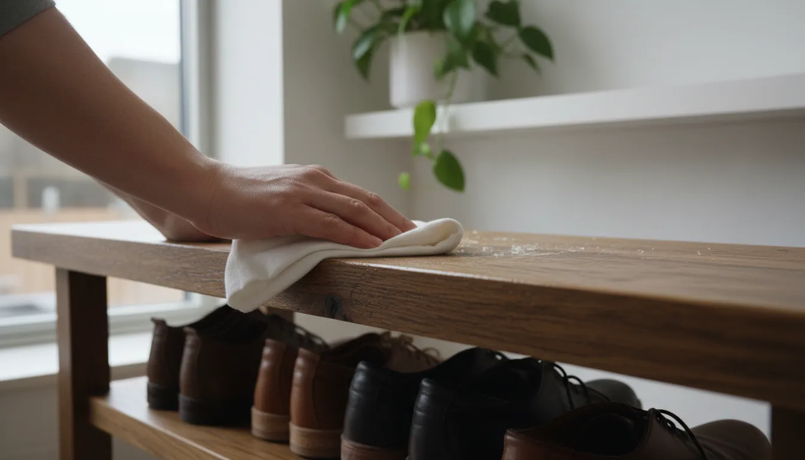
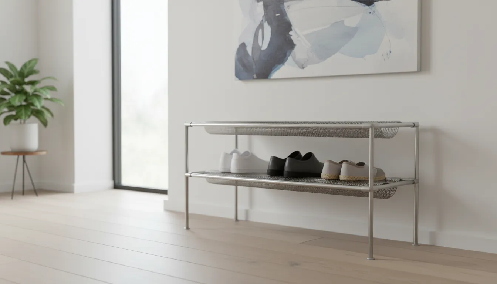
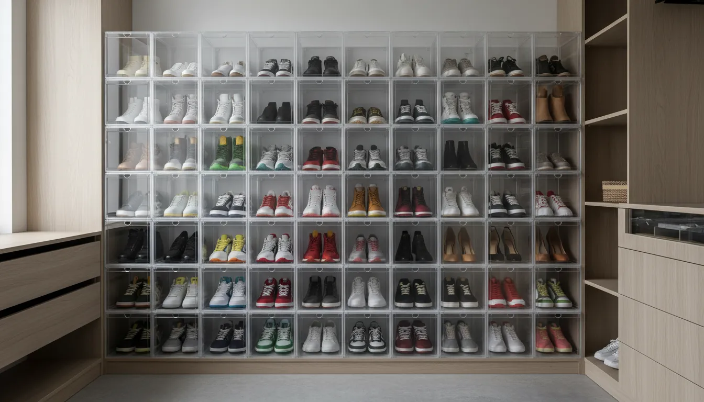

# How to Clean and Maintain Different Entryway Shoe Storage Materials (Wood, Metal, Plastic)

The entryway is the handshake of your home. It is the first space guests encounter and the last thing you see before facing the world. Yet, functionally, it is often the most abused area of the house. Your shoe storage unit, in particular, serves as the primary defense against the elements, catching mud, road salt, rain, and grit that would otherwise track across your floors.

Over time, this relentless exposure to moisture and debris can degrade even the highest quality furniture. A wooden bench may succumb to water rings and warping; a metal rack might develop unsightly rust; and plastic organizers can become cloudy or brittle. Preserving the aesthetic appeal and structural integrity of your entryway furniture requires more than a casual dusting. It demands a material-specific maintenance strategy.

This comprehensive guide will explore the nuances of cleaning and maintaining the three most common materials found in entryway shoe storage: wood, metal, and plastic. by understanding the specific needs of these materials, you can extend the lifespan of your furniture and keep your foyer looking impeccable.

## The Organic Standard: Maintaining Wood Shoe Storage

Wood remains the most popular choice for entryway furniture due to its warmth, durability, and timeless aesthetic. Whether you have a solid oak bench, a bamboo rack, or a painted MDF cabinet, wood requires a delicate balance of hydration and protection. Unlike other materials, wood is porous and hygroscopic, meaning it absorbs and releases moisture from the air. This characteristic makes it susceptible to warping, cracking, and staining if not properly maintained.

### Routine Cleaning for Wood Surfaces

The primary enemy of wood finishes is grit. microscopic particles of dirt and sand, often brought in on shoe soles, act like sandpaper when dragged across a wooden surface.

1.  **Dust Frequently**: Use a microfiber cloth or a soft feather duster to remove surface dust at least once a week. Avoid using rough rags or paper towels, which can leave micro-scratches on high-gloss finishes.
2.  **The Damp Cloth Technique**: For routine cleaning, chemicals are rarely necessary. Dip a soft, lint-free cloth into warm water mixed with a drop of mild dish soap. Wring the cloth out until it is barely damp—never dripping. Wipe the surface gently, following the grain of the wood.
3.  **Immediate Drying**: Follow immediately with a clean, dry cloth. Moisture left sitting on wood can penetrate the finish, leading to cloudiness or swelling, particularly in composite woods or veneers.

### Deep Cleaning and Conditioning

Over time, wood can lose its luster. Every three to six months, depending on the humidity levels in your home, you should condition the wood to prevent it from drying out and cracking.

For finished wood (varnish, polyurethane, or lacquer), avoid silicone-based sprays. These products create a temporary shine but build up a sticky residue over time that attracts more dust. Instead, opt for a high-quality carnauba wax or a specialized furniture oil.

For unfinished or oil-finished woods (like teak or some bamboo organizers), the wood needs to be "fed." Apply a generous amount of drying oil, such as Tung oil or Danish oil, let it sit for the manufacturer's recommended time, and buff off the excess.

If you are dealing with minor scratches or water rings, consider investing in a comprehensive repair kit.

[Check out wood furniture repair kits on Amazon](https://www.amazon.com/s?k=wood+furniture+repair+kit&tag=hats0f8-20)

### Protecting Wood from Moisture and Salt

In the entryway, the specific threat is water and road salt. If you live in a climate with snowy winters, the salt used to melt ice can be devastating to wood finishes. Salt forms white, crusty stains that eat away at varnish and dry out the wood fibers.

If salt water drips onto your wooden shoe rack:
*   **Neutralize the Salt**: Mix one cup of warm water with one tablespoon of white vinegar.
*   **Gentle Application**: Dampen a cloth with the solution and gently wipe the salt stain. The acidity of the vinegar neutralizes the alkalinity of the salt.
*   **Rinse and Dry**: Wipe with a fresh damp cloth to remove the vinegar residue, then dry thoroughly.

## The Industrial Edge: Caring for Metal Storage Racks

Metal shoe racks are prized for their durability and industrial-chic aesthetic. They handle weight well and are generally more resistant to immediate water damage than wood. However, metal has its own nemesis: oxidation. Whether it is rust on iron or tarnish on copper and brass, metal requires vigilance to maintain its shine and structural strength.

### Identifying Your Metal

Before cleaning, identify the type of metal you are working with, as this dictates the cleaning agents you can use.

*   **Stainless Steel**: Common in modern entryways. It is resistant to rust but prone to fingerprints and smudges.
*   **Powder-Coated Steel**: This metal is sprayed with a dry powder and cured under heat, creating a hard skin. It is very durable but can rust if the coating is chipped.
*   **Chrome**: A plating used for a high-shine, mirror-like finish. It is durable but can peel if cleaned with abrasives.
*   **Wrought Iron**: Often used in rustic or farmhouse designs. It has a textured surface that can trap dust and is highly susceptible to rust if the seal is broken.

### Routine Cleaning Protocols

For most metal shoe racks, a solution of warm water and mild detergent is sufficient. Using a soft sponge, wipe down the rails and shelves. For intricate wrought iron designs, use a soft-bristled nylon brush (an old toothbrush works well) to dislodge dust from crevices.

**Crucial Warning**: Never use steel wool or scouring pads on chrome or stainless steel. These will create permanent scratches that ruin the finish and create entry points for rust.

### Battling Rust and Oxidation

If you notice orange or reddish-brown spots developing, you must act immediately. Rust spreads beneath the surface of paint and plating, compromising the integrity of the rack.

1.  **Mechanical Removal**: For surface rust on iron, use a wire brush or sandpaper to gently scour the affected area until you see bare metal.
2.  **Chemical Removal**: For chrome or stainless steel, mechanical removal is too harsh. Use a commercial rust remover or a paste made of baking soda and water. Apply the paste, let it sit for an hour, and scrub gently with a plastic scouring pad.
3.  **Sealing**: Once the rust is removed and the area is dry, you must seal the metal. For painted metals, use a touch-up paint. For raw iron, apply a coat of clear metal wax or lacquer.

To keep your metal furniture looking pristine, consider using a specialized polish that leaves a protective barrier against moisture.

[Find top-rated metal polish and sealants on Amazon](https://www.amazon.com/s?k=metal+polish+and+sealant&tag=hats0f8-20)

### Dealing with Mud and Clay

Mud that dries on metal racks can be stubborn. Resist the urge to chip it off with a hard tool, which might scratch the finish. Instead, rehydrate the mud by laying a wet paper towel over it for ten minutes. Once softened, it should wipe away easily. Follow up with a dry cloth to ensure no water remains in the joints or screw holes, which are prime locations for rust to begin.

## The Modern Utility: Cleaning Plastic and Acrylic

Plastic and acrylic (often referred to by trade names like Plexiglass or Lucite) are increasingly popular for shoe storage due to their transparency, allowing you to see your shoe collection, and their resistance to moisture. However, plastic is softer than glass and highly susceptible to scratching and chemical damage.

### The "No Ammonia" Rule

The most common mistake people make with acrylic shoe boxes or shelves is cleaning them with standard glass cleaner. Many glass cleaners contain ammonia. Ammonia attacks the molecular structure of acrylic, causing it to become cloudy and eventually develop a network of tiny micro-cracks known as "crazing." Once crazing occurs, it is irreversible.

**Always use:**
*   A specialized plastic cleaner.
*   Mild dish soap and lukewarm water.
*   A mixture of vinegar and water (for hard water spots).

### Scratches and Static

Plastic attracts dust via static electricity. Wiping it with a dry paper towel often generates more static, instantly attracting dust back to the surface. Furthermore, paper towels are abrasive enough to leave swirl marks on clear acrylic.

To clean acrylic shoe boxes:
1.  **Blow Off Debris**: If there is visible grit, blow it off or use a can of compressed air. Wiping grit across plastic guarantees scratches.
2.  **Microfiber Only**: Use a high-GSM microfiber cloth. These hold dust particles within the fibers rather than dragging them across the surface.
3.  **Anti-Static Cleaners**: Use a cleaner designed to neutralize static charge.

If your plastic storage has developed a haze or fine scratches, it can often be restored. Plastic polishes act as very fine abrasives that buff out imperfections and restore optical clarity.

[Explore plastic polishing kits on Amazon](https://www.amazon.com/s?k=plastic+acrylic+polish+kit&tag=hats0f8-20)

### Preventing Discoloration

White plastic and clear resin can yellow over time when exposed to UV light (sunlight) or excessive heat. This is a chemical change within the plastic polymers. To prevent this, position plastic shoe storage away from direct sunlight or heavy heat sources like radiators. If yellowing has already occurred on white plastic, a "retro-brighting" technique involving hydrogen peroxide and UV light can sometimes reverse the effect, though this is an advanced process. For clear acrylics, yellowing is usually permanent, highlighting the importance of placement.

## Composite and Mixed Material Units

Many entryway solutions utilize a combination of materials—a metal frame with wooden shelves, or a wooden bench with plastic bins. These require a compartmentalized approach to cleaning.

### Handling Melamine and Laminate

Melamine (particle board covered in a plasticized coating) is common in budget-friendly storage. It is durable but hates water. The weak point of melamine is the edge banding. If water seeps into the seams where the coating ends, the particle board underneath will swell like a sponge.

*   **Cleaning**: Spray your cleaner onto the cloth, never directly onto the furniture. This prevents liquid from pooling in the corners or seams.
*   **Stain Removal**: For ink or scuffs on laminate, a melamine foam sponge (Magic Eraser) is effective, but use it lightly as it is abrasive and can eventually dull the finish.

### Fabric Elements

If your shoe storage doubles as a bench, you likely have an upholstered cushion. Fabric in the entryway absorbs odors and traps dust.
*   **Vacuum Weekly**: Use the upholstery attachment on your vacuum to remove dust and allergens.
*   **Scotchgard**: Apply a fabric protector spray to repel water and oil-based stains.
*   **Slipcovers**: Consider a removable, washable cover for the cushion. This allows for deep cleaning in the washing machine, which is far more effective than spot cleaning.

For more ideas on how to style these mixed-material units, read our guide on [Small Space Entryway Solutions](/posts/small-space-entryway-solutions).

## Preventive Maintenance: The First Line of Defense

While cleaning is reactive, preservation is proactive. By controlling the environment of your entryway, you reduce the frequency and intensity of the cleaning required.

### The Two-Mat System

The best way to keep your shoe storage clean is to stop dirt before it reaches the unit. Implement a two-mat system:
1.  **Scraper Mat**: Placed outside the door. This mat should have a coarse texture (like coir or rubber bristles) to scrape heavy mud and snow off soles.
2.  **Absorber Mat**: Placed immediately inside the door. This mat traps remaining moisture and fine dust.

### Shoe Preparation

Encourage a "shoes off" policy, but also encourage "shoes dry." Placing soaking wet boots directly onto a wooden shelf is a recipe for disaster. Utilize boot trays placed on the floor for wet footwear. Only move shoes to the main storage rack once they are dry. If you are dealing with a large family, consider assigning specific [Entryway Organization Zones](/posts/entryway-organization-zones) to keep wet and dry items separate.

### Climate Control

Wood expands in high humidity and shrinks in low humidity. Rapid changes cause cracking. Metal corrodes in damp environments. While you cannot control the weather, you can mitigate its effects.
*   **Dehumidifiers**: In damp basements or mudrooms, a dehumidifier can prevent metal rust and mold growth on wood.
*   **Humidifiers**: In dry winters, a humidifier helps prevent wood from splitting.

## Conclusion

The lifespan of your entryway shoe storage is directly correlated to the care it receives. By treating wood with nourishing oils, protecting metal from oxidation, and cleaning plastic with non-abrasive agents, you preserve not just the utility of the furniture, but the beauty of your home's entrance.

Maintenance is an investment. A few minutes spent wiping down a metal rack or polishing a wooden bench saves you the cost and hassle of premature replacement. Furthermore, a clean, well-maintained entryway sets a tone of order and tranquility for the rest of the home. Whether your style is rustic oak, sleek chrome, or minimalist acrylic, the right care regimen ensures your storage solution stands the test of time, welcoming you home day after day.

For further inspiration on upgrading your foyer setup, browse our article on [Modern Entryway Decor Trends](/posts/modern-entryway-decor-trends).