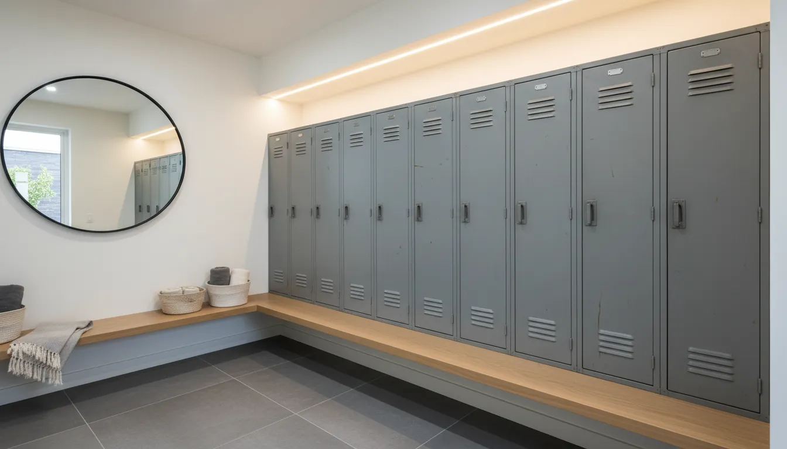
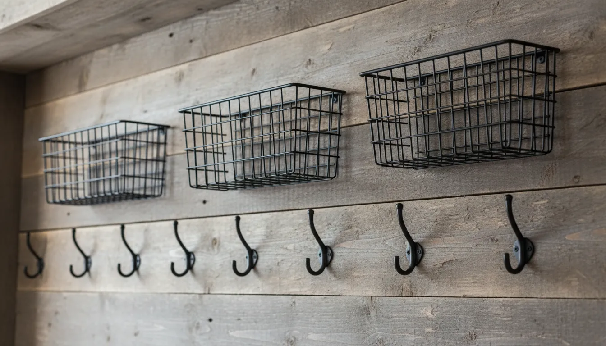
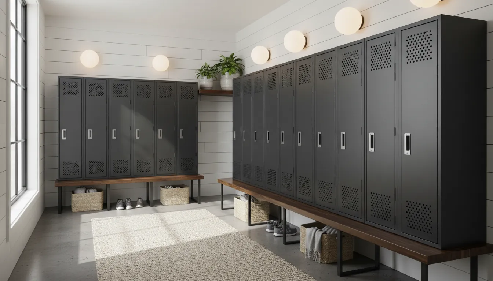

# Industrial Chic Mudroom Lockers: Metal, Wood, and Functionality

The entryway is the handshake of the home. It is the first space to greet you after a long day and the last space you see before facing the world. Yet, in many households, this critical transition zone—often relegated to a cramped mudroom or a hallway corner—succumbs to chaos. Piles of shoes, mounds of coats, and an assortment of bags can quickly turn a welcoming entrance into a stress-inducing obstacle course. The solution lies not just in organization, but in a design philosophy that embraces durability and raw beauty: Industrial Chic.

Industrial design is rooted in the concept of utilitarianism. It celebrates the unfinished, the raw, and the robust. When applied to mudroom lockers, this aesthetic offers a unique marriage of form and function. By combining the cool resilience of metal with the organic warmth of wood, homeowners can create a storage solution that withstands the rigors of daily life while making a bold stylistic statement.

This comprehensive guide explores the world of industrial chic mudroom lockers. We will delve into the interplay of materials, the architectural considerations of layout, and the practicalities of sourcing and styling these robust storage systems to elevate your home organization.

## The Essence of Industrial Chic in the Mudroom

To understand why industrial lockers are particularly suited for mudrooms, one must first appreciate the origins of the aesthetic. Born from the conversion of old factories and warehouses into residential lofts, industrial chic exposes what others hide. It is about structural integrity—exposed beams, brickwork, and ductwork.

In a mudroom context, this translates to furniture that does not need to be handled with kid gloves. Mudrooms are high-traffic zones. They face wet umbrellas, muddy boots, heavy backpacks, and sports equipment. Delicate painted finishes or intricate carpentry often chip and fade under this assault. Industrial materials, conversely, are designed for abuse.

A metal locker, originally designed for factories, gymnasiums, or schools, possesses an inherent toughness. Scratches add patina rather than ruining the finish. When paired with heavy-duty wood elements, the result is a "working" aesthetic that feels authentic. It suggests that the home is lived in, functional, and unpretentious, yet undeniably curated.

For those looking to overhaul their entire entrance strategy, understanding the flow of the home is crucial. You might consider reading our guide on [Maximizing Small Entryway Layouts](/posts/maximizing-small-entryway-layouts) to better understand how to position these substantial pieces.

## The Marriage of Materials: Metal and Wood

The success of the industrial chic look relies heavily on the juxtaposition of contrasting materials. A room filled entirely with metal can feel cold, sterile, and institutional—more like a high school corridor than a welcoming home. Conversely, an all-wood mudroom often veers into farmhouse or traditional territory. The magic happens in the middle.

### Cold Steel and Iron

Metal is the backbone of the industrial locker system. Whether you are repurposing vintage vintage lockers or purchasing new reproductions, the material offers several functional advantages:

1.  **Durability**: Steel does not warp with humidity, a common issue in mudrooms where damp coats are stored.
2.  **Ventilation**: Many industrial lockers feature louvered doors or mesh fronts. This is critical for air circulation, preventing musty odors from developing on wet outerwear or athletic gear.
3.  **Cleanability**: Metal surfaces are non-porous. Mud splatters and dirt can be wiped away with a simple damp cloth, unlike porous woods that might stain.

Visually, metal introduces a sleek, vertical line to the room. The color palette typically revolves around raw steel, matte blacks, gunmetal greys, or even distressed colors like vintage navy or olive green.

### Warm Timber and Reclaimed Wood

To counterbalance the visual "temperature" of the metal, wood is essential. In an industrial chic mudroom, wood is rarely polished to a high sheen. Instead, it is often reclaimed, rough-hewn, or finished with matte stains that highlight the grain and imperfections.

Wood is typically integrated in three ways:

*   **The Bench**: A thick slab of oak, pine, or walnut running beneath or through the lockers provides a place to sit while putting on shoes. The tactile experience of sitting on wood is far superior to cold metal.
*   **The Surround**: Enasing a bank of metal lockers in a wooden frame creates a built-in look that feels permanent and architectural.
*   **The Accents**: Wooden crates inside the lockers or a shelf running above them tie the room together.

The interplay creates a tactile richness. The smoothness of the steel against the roughness of the timber creates a sophisticated, layered environment.

## Functional Design: Why Lockers Work

Beyond aesthetics, the locker format addresses specific organizational psychology. Open shelving, while popular, demands that the items on the shelves be tidy. If you toss a messy pile of scarves and gloves onto an open shelf, the room looks cluttered.

Lockers provide **concealed storage**. You can close the door on the chaos. This is particularly valuable for families with children. Each family member can be assigned a locker (or a "zone"), containing their specific mess behind a uniform façade.

### Zoning and Internal Organization

To truly maximize the utility of industrial lockers, the interior must be configured intelligently. A standard full-height locker can be a black hole if not modified.

*   **Upper Shelf**: For items not used daily, such as off-season hats or helmet storage.
*   **Double Hooks**: Industrial-strength hooks are vital for heavy winter coats and backpacks.
*   **Lower Cubbies**: If the locker extends to the floor, the bottom section is ideal for boots. However, raising the lockers on a plinth or integrating them above a bench allows for shoe storage underneath, keeping the locker floor clean.

For those seeking a ready-made solution that embodies this aesthetic without the need for custom fabrication, there are excellent retail options available.

[Shop Industrial Metal Storage Lockers on Amazon](https://www.amazon.com/s?k=industrial+metal+storage+locker+cabinet&tag=hats0f8-20)

## Sourcing Your Lockers: Vintage, Retail, or DIY?

Achieving this look depends on your budget, your patience, and your appetite for renovation. There are three primary paths to acquiring industrial chic lockers.

### 1. The Vintage Hunt

For the purist, nothing beats the authenticity of true vintage lockers salvaged from closed factories or schools. These pieces carry history in their dents and layers of paint.

*   **Where to look**: Architectural salvage yards, estate sales, antique fairs, and online marketplaces.
*   **What to watch for**: inspect for structural rust (surface rust is fine, holes are not). Ensure the hinges are functional, as repairing vintage hinges can be difficult. Be wary of lead paint on older units; if you plan to strip or sand them, test the paint first.
*   **Restoration**: A clear coat of metal sealer over a rusty, stripped locker preserves the patina without the mess.

### 2. Modern Retail Solutions

Recognizing the popularity of the style, many furniture manufacturers now produce "vintage-style" metal lockers. These offer the look of the old with the functionality of the new. They often come with soft-close hinges, adjustable shelving, and standard dimensions that fit modern ceiling heights.

This route is ideal for those who want a clean, safe product immediately without the need for restoration labor.

### 3. The DIY Hybrid

The most custom approach involves building a wooden framework and inserting metal components or doors. This allows you to tailor the dimensions exactly to your mudroom niche. You might build a plywood carcass and face it with custom metal doors ordered from a fabricator, or use metal mesh inserts in wooden door frames to simulate the look.

For a simpler approach that combines these elements in a freestanding unit, consider a hall tree that utilizes metal framing and wood accents.

[Shop Industrial Wood and Metal Hall Trees on Amazon](https://www.amazon.com/s?k=industrial+wood+metal+hall+tree&tag=hats0f8-20)

## Layout and Space Planning

Integrating lockers into a mudroom requires careful spatial planning. Unlike a coat rack, lockers are substantial visual blocks.

### Depth and Traffic Flow

Standard lockers are typically 12 to 18 inches deep. However, if you are building a surround or including a bench, the total depth may extend to 20 or 24 inches. It is imperative to maintain a walkway of at least 36 inches—ideally 42 inches—to prevent the mudroom from feeling claustrophobic.

### Vertical Utilization

Industrial design favors height. Take advantage of vertical space by choosing lockers that are tall and narrow. If your ceilings are high, consider adding open wooden shelving or wire baskets above the lockers to draw the eye up and maximize storage volume.

### The Bench Integration

The most popular configuration for mudrooms is the "Locker-Bench-Locker" sandwich or the "Floating Bench" design.
*   **The Sandwich**: Tall lockers on either side of a central seating area. This breaks up the wall of metal and creates a focal point.
*   **The Under-Mount**: Wall-mounted half-lockers installed above a long bench. This keeps the floor clear for shoes and makes the room feel larger.

For more ideas on organizing the items that don't fit in lockers, see our article on [Creative Shoe Storage Solutions](/posts/creative-shoe-storage-solutions).

## Styling the Industrial Mudroom

Once the lockers are in place, the styling determines whether the space feels like a locker room or a chic entryway. The goal is to soften the hard edges while reinforcing the industrial theme.

### Lighting Considerations

Lighting is the jewelry of the room. In an industrial setting, avoid recessed can lights as the primary source. Instead, opt for fixtures that expose the mechanics of lighting.
*   **Cage Lights**: Wire cages protecting Edison bulbs are quintessential industrial chic.
*   **Gooseneck Sconces**: Barn-style lights mounted above the lockers illuminate the contents and provide ambient glow.
*   **Pendants**: If you have the ceiling height, large metal dome pendants in matte black, brass, or copper add drama.

### Flooring and Walls

The backdrop for your lockers matters.
*   **Flooring**: Concrete floors (stained or polished) are the ultimate industrial pairing. However, slate tile, brick pavers, or wood-look porcelain tile in a herringbone pattern offer durability and style.
*   **Walls**: Exposed brick is the gold standard. If that isn't an option, subway tile with dark grout, shiplap painted in moody dark tones, or even a concrete-effect plaster can set the scene.

### Hardware and Accessories

The devil is in the details. Swap out standard hardware for pieces with weight and character. Look for iron pulls, leather tabs, or galvanized steel labels. Numbering the lockers (stenciled paint or brass plates) adds a delightful vintage institutional touch that helps with organization.

Wire baskets are indispensable for corraling loose items within or above the lockers. They maintain visibility while containing clutter.

[Shop Industrial Wire Storage Baskets on Amazon](https://www.amazon.com/s?k=industrial+wire+storage+baskets&tag=hats0f8-20)

## Maintenance and Longevity

While industrial materials are tough, they are not invincible. Proper care ensures your mudroom remains chic rather than just shabby.

### Protecting Metal

If you are using raw steel or vintage items, rust is the enemy. Indoors, humidity is generally lower, but wet coats can introduce moisture.
*   **Waxing**: Paste wax applied to raw steel prevents oxidation and gives a subtle luster.
*   **Clear Coat**: A matte polyurethane spray can seal vintage paint to prevent flaking.
*   **Cleaning**: Avoid abrasive cleaners that can scratch the finish. Mild soap and water are usually sufficient.

### Caring for Wood

The wooden bench will see heavy traffic.
*   **Sealing**: Ensure the wood is sealed with a high-traffic polyurethane or a penetrating oil finish. This prevents water stains from wet clothes or dripping umbrellas.
*   **Scratch Repair**: The beauty of rustic wood is that scratches often blend in. However, keeping a stain marker handy for deep gouges keeps the piece looking maintained.

## Integrating Lockers into Different Home Styles

One might assume industrial lockers only work in lofts or modern homes. However, they are surprisingly versatile.

*   **Modern Farmhouse**: This is the most common pairing. The metal lockers provide a hard edge to the white shiplap and warm woods typical of farmhouse style. Opt for lockers in softer greys or whites, or stick to galvanized metal.
*   **Eclectic/Bohemian**: Mix colorful vintage lockers (think teal or mustard) with patterned rugs and plants. The industrial form grounds the eclectic decor.
*   **Scandi-Industrial**: Focus on minimalism. White or light grey lockers, blonde wood benches, and zero clutter. The lines remain clean and functional.

## Conclusion

Industrial chic mudroom lockers represent more than just a storage trend; they are a commitment to practical living. By embracing materials that improve with age and designing for the reality of a busy household, you create an entryway that serves you.

The combination of cold metal and warm wood creates a sophisticated balance, transforming a utilitarian drop zone into a design highlight of the home. Whether you hunt down rusted treasures to restore or invest in modern metal cabinetry, the result is a space that is organized, durable, and undeniably stylish. Your entryway sets the tone for your entire home—make it strong, make it functional, and make it chic.