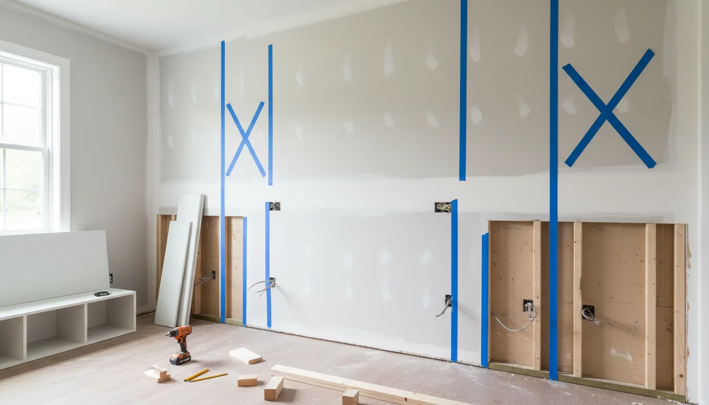
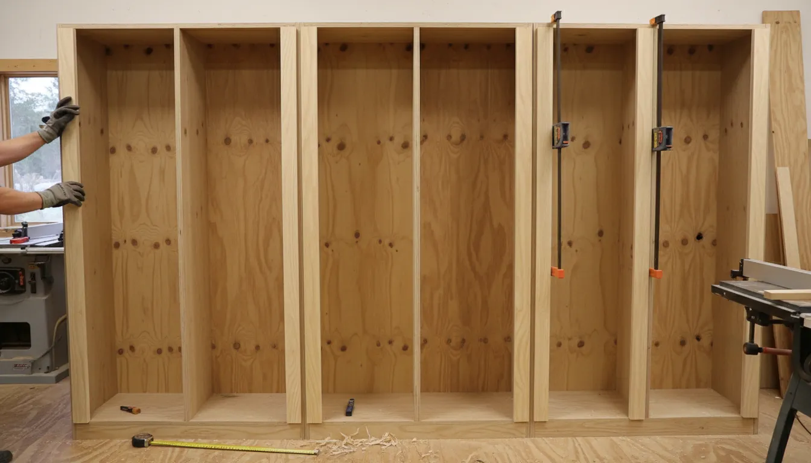
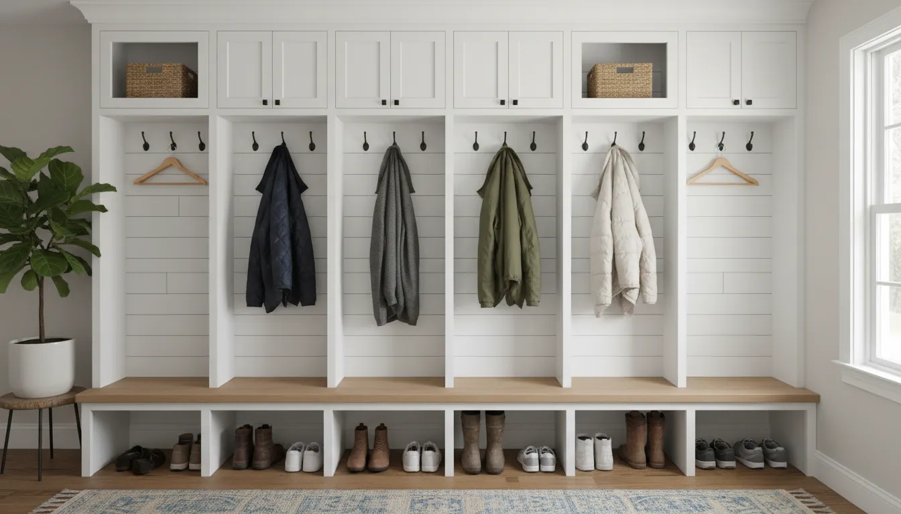

# Installation Deep Dive: Building Built-In Mudroom Lockers for a Seamless Look

The entryway is often the most trafficked area of the home, acting as the primary transition zone between the outside world and your personal sanctuary. Unfortunately, without a designated system, it quickly becomes a landing strip for chaos—piles of shoes, scattered backpacks, and coats draped over banisters. While buying a freestanding hall tree is a quick fix, nothing elevates a home quite like **DIY mudroom lockers** that look like they were part of the original architectural blueprints.

Building custom cabinetry might seem daunting, but with the right planning and patience, achieving a high-end, **built-in entryway storage** system is entirely within reach for the intermediate DIYer. This guide is a comprehensive deep dive into creating that coveted "seamless look," where the storage unit blends perfectly with your walls, molding, and ceiling.

We will walk through the entire process, from demolition and framing to the final touches of trim work that separate a novice build from professional-grade craftsmanship.

## Phase 1: Planning and Design

Before you buy a single sheet of plywood, you must live in the planning phase. A seamless look relies heavily on symmetry and proportion.

### Assessing Your Space
Measure your space at the floor, the middle of the wall, and the ceiling. Walls are rarely perfectly plumb, and floors are rarely perfectly level. Identifying the narrowest point of your width and the lowest point of your ceiling height is crucial for sizing your cabinet carcass.

You also need to decide on the configuration. The classic **custom mudroom design** usually consists of three distinct sections:
1.  **The Base:** A bench with storage underneath (drawers or open cubbies for shoes).
2.  **The Locker Body:** Vertical dividers creating individual stalls for hanging coats.
3.  **The Upper Storage:** Cubbies or cabinets above the lockers for seasonal items or baskets.

### Materials: Plywood vs. MDF
For a painted built-in, **MDF (Medium Density Fiberboard)** and **Cabinet-Grade Plywood** (Birch or Maple) are the top contenders.
*   **Plywood** is lighter, stronger, and holds screws better. It is ideal for the bench seat and the main structural box.
*   **MDF** is ultra-smooth, paints beautifully, and is often cheaper. It is excellent for vertical dividers, upper shelves, and face frames, provided it won't be exposed to standing water (like wet boots).

For the most durable **mudroom bench plans**, I recommend using 3/4-inch birch plywood for the carcass and bench, and solid wood (like Poplar) for the face frames to withstand dings and dents.

### Essential Tools for Success
To get professional results, you need tools that ensure precision. A table saw is ideal for ripping long sheets, but a circular saw with a straight-edge guide works well too. However, the secret weapon for joinery in a project like this is a pocket hole jig.

If you want hidden joints that are incredibly strong and easy to assemble, you cannot skip this tool.

[**Kreg Pocket Hole Jig Kit**](https://www.amazon.com/s?k=kreg+pocket+hole+jig+kit&tag=hats0f8-20)
*For creating tight, hidden joints without complex carpentry skills, this jig is the industry standard for DIYers and pros alike. It allows you to build the cabinet face frames and carcass quickly and securely.*

## Phase 2: Demolition and Site Prep

You cannot simply push a cabinet against a wall and call it "built-in." To achieve that seamless integration, you must remove existing obstacles.

1.  **Remove Baseboards and Crown Molding:** Carefully score the caulk line with a utility knife to prevent peeling paint. Pry the trim off gently. You may be able to reuse it, but often it’s easier to buy new trim to wrap around the new unit.
2.  **Locate and Mark Studs:** Use a stud finder and mark every stud along the wall with blue painter's tape. You will need to anchor the unit securely to the wall framing to prevent tipping.
3.  **Check for Electrical:** If there are outlets where the lockers will go, you must plan to either move them or extend the box through the back panel of your lockers.

## Phase 3: Building the Base Platform

The foundation of your built-ins is the "toe kick" platform. Never set your cabinet carcass directly on the floor; floors are uneven, and you want to lift the wood away from potential water spills.

### Constructing the Toe Kick
Build a ladder frame using 2x4 lumber. The depth of this frame should be approximately 3 inches shallower than your bench depth (standard bench depth is 18-20 inches) to create a recessed toe kick. This mimics kitchen cabinetry and prevents you from stubbing your toes.

**The most critical step:** Leveling the platform.
Place the frame in position and use a long level. Find the highest point of the floor and shim the rest of the frame until it is perfectly level in all directions. Screw the leveled frame into the wall studs and the floor.

If you skip leveling here, your vertical dividers will be crooked, your doors won't shut right, and the entire project will suffer.

## Phase 4: Constructing the Carcass (The Body)

With a level base, you can now begin **how to build mudroom lockers** vertically.

### The Bench Seat
Cut your bench seat from 3/4-inch plywood. If you want a wood-tone bench seat (stained oak or walnut), now is the time to cut and fit that piece, but keep it removable or protected until painting is done. If the bench will be painted, standard plywood with a solid wood nose piece is sufficient.

### Vertical Dividers
Cut your vertical panels. A standard locker width is between 18 and 24 inches. Anything narrower feels cramped for a winter coat.
1.  **Pocket Holes:** Drill pocket holes along the top and bottom edges of your vertical panels.
2.  **Assembly:** Attach the dividers to the bench seat and a top stretcher piece.
3.  **Backing:** While 1/4-inch backing board is optional if your drywall is smooth, adding a 1/4-inch plywood backer creates a much more finished, high-end furniture look and squares up the unit.

**Pro Tip:** If your walls are very bowed, cut your side panels 1 inch deeper than necessary and "scribe" them to the wall. Scribing involves running a compass along the wall to transfer the wall's irregularities onto your board, then cutting along that line with a jigsaw for a perfect fit.

## Phase 5: The Face Frame – The Secret to the "Seamless Look"

This is the step that separates "shelves in a garage" from "custom cabinetry." A **face frame** is a frame of solid wood (usually 1x2 or 1x3 Poplar) attached to the front exposed edges of your plywood.

### Why Face Frames Matter
Plywood edges are ugly. They show layers and voids. By attaching a face frame, you:
1.  Hide the raw plywood edges.
2.  Add structural rigidity.
3.  Create a surface to mount hinges and hardware.
4.  Make the unit look substantial and thick.

Attach your face frames using wood glue and finish nails (or pocket screws from the back if accessible). Ensure the joints between the rails (horizontal) and stiles (vertical) are flush. Sand these joints thoroughly until they feel like one continuous piece of wood.

## Phase 6: The Upper Cubbies and Header

Above the main locker section, install a horizontal shelf. From this shelf to the ceiling, you have two options:
1.  **Open Cubbies:** Great for baskets.
2.  **Closed Cabinets:** Ideal for hiding mess.

If your ceiling is 8 feet, you likely have space for generous upper storage. If you have 9 or 10-foot ceilings, you may need to build a separate upper box or install a "soffit" (a framed box hidden by drywall or trim) to close the gap so the lockers don't look awkwardly tall.

To achieve the **seamless built-in look**, you generally want the unit to terminate at the ceiling (or a soffit) and be wrapped in crown molding.

## Phase 7: Trim and Molding Integration

Now, we marry the cabinet to the house.

### Baseboards
Install new baseboards along the front of the toe kick. Miter the corners so the baseboard wraps around the side of the cabinet and connects back to the wall baseboard. This visual trick makes the cabinet look like it grew out of the floor.

### Crown Molding
Install crown molding along the top of the unit. Just like the baseboard, wrap this around to meet the wall. If your unit goes floor-to-ceiling, the crown molding should continue seamlessly from the rest of the room across the top of the lockers.

### Filling the Gaps
Even with scribing, there may be small gaps between the cabinet and the wall.
*   **Small gaps (< 1/8 inch):** Use a high-quality, paintable acrylic latex caulk. Run a bead, smooth it with a wet finger, and let it dry.
*   **Large gaps:** Use a piece of scribe molding or quarter-round trim to cover the gap.

## Phase 8: Hardware and Accessories

Before painting, dry-fit your hardware. For a mudroom, you need hardware that can withstand heavy backpacks and wet coats. Standard decorative hooks often snap under the weight of a heavy winter parka.

Look for double-prong hooks or heavy-duty architectural hooks. Matte black or aged brass are popular choices that hide scratches well.

[**Matte Black Heavy Duty Coat Hooks**](https://www.amazon.com/s?k=matte+black+double+coat+hooks+heavy+duty&tag=hats0f8-20)
*These hooks provide the structural integrity needed for heavy winter gear while offering a sleek, modern contrast to painted cabinetry.*

## Phase 9: Finishing - Paint and Polish

The difference between a good project and a great one is the finish.

1.  **Sand:** Sand everything to 120 grit, then 220 grit.
2.  **Prime:** Use a high-quality stain-blocking primer. If you used raw wood and MDF, a shellac-based primer is excellent for sealing the porous edges of the MDF.
3.  **Paint:** Use an enamel-based paint meant for cabinetry/trim. These cure harder than standard wall latex and won't remain "tacky." A semi-gloss or satin finish is easiest to wipe down.

**Application:** For the smoothest finish, a paint sprayer is best. However, a high-density foam roller and a high-quality angled sash brush can yield excellent results if you use a paint additive (like Floetrol) to help level out brush strokes.

## Phase 10: Organization and Styling

Once the paint has cured (give it at least 48 hours before heavy use), it's time to install the hooks permanently and add your storage solutions.

To keep the upper cubbies from looking cluttered, utilize matching baskets. This hides the visual noise of gloves, scarves, and hats while adding texture to the build. Natural fibers like water hyacinth or seagrass add warmth to painted wood.

[**Natural Woven Hyacinth Storage Baskets**](https://www.amazon.com/s?k=natural+woven+hyacinth+storage+baskets+for+shelves&tag=hats0f8-20)
*Perfectly sized for upper cubbies, these baskets hide the clutter of seasonal accessories and add a warm, organic texture to your built-ins.*

## Conclusion

Building **built-in mudroom lockers** is a significant project, but the payoff is immense. You gain functional organization that streamlines your daily routine, and you add permanent value to your home with a custom architectural feature.

By focusing on the details—leveling the base, using face frames for a chunky look, and integrating the trim with the existing room—you can achieve a result that looks like it cost thousands of dollars in contractor fees.

Ready to tackle more home organization projects? Check out our guide on [Maximizing Small Entryways](/posts/maximizing-small-entryways-creative-solutions) or learn about [Choosing the Right Wood for DIY Furniture](/posts/choosing-the-right-wood-for-diy-entryway-furniture).

Remember, the goal isn't just storage; it's creating a space that welcomes you home with order and style. Happy building!