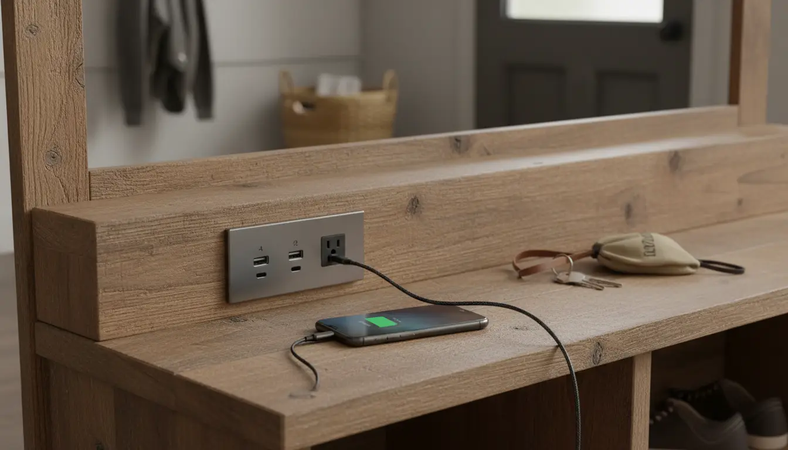
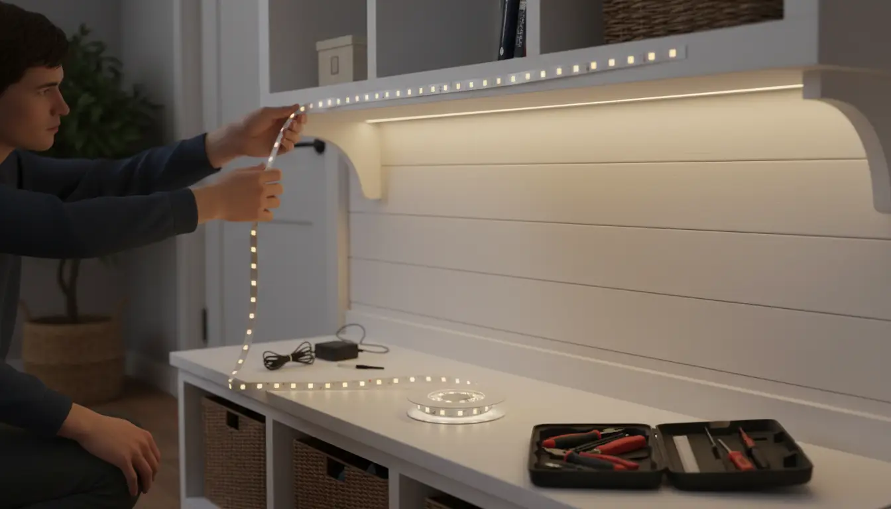

---
title: "Integrated Technology: Hall Trees with Charging Stations and Smart Features"
slug: "integrated-technology-hall-trees-with-charging-stations-and-smart-features"
pubDate: "2026-01-28"
description: "Discover how hall trees with charging stations and smart features transform entryways. Explore top tech-integrated storage solutions for a modern home."
author: "Content Bot"
image:
  url: "../../images/blog/integrated-technology-hall-trees-with-charging-stations-and-smart-features.webp"
  alt: "A modern entryway featuring a sleek hall tree with built-in USB ports charging a smartphone, surrounded by neatly organized coats and shoes"
tags: 
  - smart furniture
  - entryway organization
  - hall trees
  - home technology
  - interior design
category: "Modern Entryway Design"
keywords:
  - Hall trees with charging stations
  - smart entryway furniture
  - modern mudroom tech
  - USB charging hall tree
  - entryway organizers with outlets
  - smart home furniture
  - tech-integrated storage
canonical: "https://www.entrywaystorage.com/posts/integrated-technology-hall-trees-with-charging-stations-and-smart-features"
---

# Integrated Technology: Hall Trees with Charging Stations and Smart Features

The entryway is the handshake of the home—it's the first thing you see when you walk in and the last thing you see before you leave. Historically, the hall tree has been a humble servant of this space, dedicated to catching coats, corralling muddy boots, and storing umbrellas. However, as our lives have become increasingly digital, the demands on our "drop zones" have evolved. We no longer just shed layers of clothing; we shed technology. We drop keys, yes, but also smartphones, smartwatches, wireless earbuds, and tablets.

Enter the era of **smart entryway furniture**. The traditional hall tree is undergoing a renaissance, merging classic carpentry with modern circuitry. **Hall trees with charging stations**, integrated lighting, and smart organization features are no longer futuristic concepts—they are becoming essential components of the organized modern home.

In this comprehensive guide, we will explore the intersection of furniture and technology. We will dive deep into why your entryway needs a tech upgrade, the specific features to look for, how to style these modern pieces, and even how to retrofit your existing furniture to join the smart home revolution.

## The Evolution of the Drop Zone

To understand why **tech-integrated storage** is surging in popularity, we have to look at our daily habits. The concept of the "landing strip" or "drop zone" is crucial in home organization. It is the designated spot where incoming items are processed.

In the past, this was purely analog. Today, the drop zone is a charging hub. "Low battery anxiety" is a real phenomenon, and the entryway represents the critical moment of transition. If you don't plug your phone in when you get home, you might forget it until the next morning. If your earbuds aren't charged by the door, you grab them dead on your way to work.

A standard console table often becomes a tangled mess of white cables, power bricks, and extension cords snakes across the floor. This clutter contradicts the very purpose of an entryway organizer, which is to create a sense of calm and order. **Hall trees with charging stations** solve this by hiding the ugly infrastructure of technology while keeping the utility front and center.

## Why Your Entryway Needs a Tech Upgrade

Integrating technology into your hall tree isn't just about gadgetry; it's about seamless living. Here are the core benefits of upgrading to **smart entryway furniture**:

### 1. Centralized Power Management
Scatter-charging is the enemy of efficiency. When you charge your watch in the kitchen, your phone in the bedroom, and your headphones in the living room, you are bound to leave the house without one of them. A **USB charging hall tree** creates a centralized depot. You know exactly where your devices are, and you know they are being charged.

### 2. Elimination of Visual Clutter
The modern aesthetic leans toward minimalism and clean lines. Nothing ruins a beautiful foyer faster than a surge protector sitting on a hardwood floor. Tech-integrated hall trees feature internal routing for cables. The power source is often embedded into the shelf or the back panel, allowing you to plug in a single cord to the wall outlet behind the unit, powering multiple devices invisibly.

### 3. Smart Home Synergy
As we move toward fully integrated smart homes, furniture is playing a larger role. Imagine a hall tree with motion-sensor lighting that guides your path when you enter late at night, or a designated drawer with a smart lock for securing car keys (protecting against relay attacks on keyless entry cars).

## Key Features to Look For

When shopping for **hall trees with charging stations**, not all tech is created equal. You need to assess the specifications to ensure they meet your device requirements.

### Built-in USB Ports and AC Outlets
This is the standard feature for modern units. Look for a mix of inputs.
*   **USB-A:** The standard rectangular port, still necessary for many older cables.
*   **USB-C:** The newer, oval-shaped port which allows for much faster charging (Power Delivery). If you have a newer iPhone or Android, a hall tree with USB-C integration is highly recommended.
*   **Standard AC Outlets:** Essential for plugging in laptops or non-USB devices (like a boot dryer in the winter).

**Expert Tip:** Check the amperage of the USB ports. A 1A port will charge a phone very slowly. Look for 2.4A or higher for efficient charging.

### Wireless Charging Pads (Qi Charging)
For the ultimate in streamlined design, look for hall trees with built-in Qi wireless charging pads embedded in the shelf surface. This allows you to simply drop your phone on a designated spot on the wood (or glass insert) to begin charging. This eliminates the need for loose cables entirely, creating the cleanest possible look.

### Integrated Lighting
Lighting serves both aesthetic and functional purposes.
*   **Task Lighting:** LED strips under the upper cubbies allow you to see what you are grabbing.
*   **Ambient Lighting:** Soft, warm light can turn the hall tree into a decorative focal point.
*   **Motion Activation:** This is a top-tier feature. Sensors detect when the front door opens or when you walk by, illuminating the bench so you can sit down to take off your shoes without fumbling for a light switch.

### Cable Management Channels
A hall tree might have outlets, but if it doesn't have a place to route the excess cord, you still have clutter. Look for grommets (holes in the back panel) and channels behind the legs or backboard that allow you to snake the main power cord down to the wall outlet invisibly.

If you are looking for a furniture piece that seamlessly blends rustic charm with modern utility, you can find excellent options online.

**Product Recommendation:** For those seeking a robust solution that combines industrial aesthetics with power accessibility, consider looking for a dedicated tech-ready hall tree.
[**Shop Hall Trees with Built-in Charging Stations on Amazon**](https://www.amazon.com/s?k=Hall+tree+with+built-in+charging+station&tag=hats0f8-20)

## Top Styles of Modern "Smart" Hall Trees

One of the misconceptions about **tech-integrated storage** is that it has to look like a spaceship or a server rack. Fortunately, furniture designers have gotten very good at hiding technology inside traditional aesthetics.

### The Modern Industrial Hybrid
This is currently the most popular style for tech-enabled entryways. It typically features a metal frame (which makes running magnetic cable clips easy) and wood-tone shelves. The power strips are often mounted on the side of the bench or the main vertical supports. The industrial look forgives the presence of a few black cables, blending them into the dark metal frame.

### The Farmhouse Disguise
For those who love the [modern farmhouse look](/posts/modern-farmhouse-hall-tree-ideas), technology can seem out of place. However, manufacturers are creating white, distressed wood hall trees with flip-top benches. Inside the storage bench, you might find a routing hole for a power strip, allowing you to charge devices hidden away inside the bench. This is excellent for keeping tablets or school laptops charged but out of sight.

### The Minimalist Floating Unit
For smaller apartments, wall-mounted "floating" hall trees are gaining traction. These often consist of a shelf with hooks and a floating bench. The "smart" aspect here usually involves recessed lighting under the shelf and hidden wireless charging pads on the top surface. Because there are no legs, cable management is trickier and usually involves running a channel through the wall or using paintable cord covers.

## DIY: How to Add Tech to Your Existing Hall Tree

Perhaps you already have a beautiful antique hall tree or a sturdy piece you built yourself. You don't need to buy new furniture to get **integrated technology**. You can retrofit your existing entryway storage with a few smart modifications.

### Step 1: Strategic Power Strip Mounting
The easiest upgrade is mounting a high-quality power strip. Do not just leave it on the floor.
*   **Location:** Mount it to the *underside* of the bench or the side of the unit that faces the wall. Use heavy-duty double-sided mounting tape or screws.
*   **Orientation:** Ensure the plugs face a direction that accommodates large power bricks.

### Step 2: Cable Management
This is what separates a hack from a professional-looking project.
*   **Grommets:** If you are comfortable with a drill, use a hole saw bit to drill a hole in the back panel of your cubby. Insert a plastic or metal desk grommet. This allows you to pass charging cables through to the back of the unit.
*   **Clips:** Use adhesive cable clips along the back edge of the hall tree legs to run the main power cord down to the wall.

### Step 3: Adding Smart Lighting
Lighting changes the mood of the entryway entirely. You don't need to wire into the house's electricity.
*   **LED Strips:** Purchase a smart LED light strip. Peel and stick it to the underside of the top shelf or behind the coat hooks for a backlit effect.
*   **Smart Plugs:** Plug the LED strip into a smart plug. Now you can schedule your hall tree lights to turn on at sunset or control them via voice assistants like Alexa or Google Home.

**Product Recommendation:** To achieve that high-end, motion-activated look without hiring an electrician, rechargeable or plug-in motion sensor strips are ideal.
[**Shop Smart Motion Sensor LED Light Strips on Amazon**](https://www.amazon.com/s?k=Smart+led+motion+sensor+light+strip+for+furniture&tag=hats0f8-20)

## Setting Up the Ultimate Command Center

Once you have your **entryway organizers with outlets**, the way you organize the space dictates its success. A hall tree with a plug is useless if it's covered in junk mail. You need to zone your technology.

### The "In-Out" Workflow
Establish a strict workflow for your family.
1.  **Arrive:** Shoes off, coat on hook.
2.  **Tech Drop:** Phone goes on the charger immediately.
3.  **Sort:** Mail goes to the recycling or the "action" pile (not on the charging pad).

### Designating Zones
If you have a multi-person household, arguments over chargers are inevitable.
*   **Color Coding:** Use different colored cables for different family members.
*   **Shelf Assignment:** The top shelf is for Dad's tablet; the bench cubby is for the kids' school Chromebooks.
*   **The Wearable Hook:** Install small hooks specifically for smartwatches or fitness trackers near the charging port.

### Managing the Accessories
Cables have a habit of falling behind furniture when unplugged. Use weighted cable organizers or magnetic cable dots on the surface of your hall tree shelf. This keeps the connector right where you need it, preventing the "fishing for the cord" dance every time you come home.

**Product Recommendation:** To keep multiple devices organized on the shelf of your hall tree without them stacking on top of each other, a dedicated charging organizer is essential.
[**Shop Industrial Hall Trees with Power Outlets on Amazon**](https://www.amazon.com/s?k=Industrial+hall+tree+with+power+outlet&tag=hats0f8-20)

## Safety and Maintenance Considerations

When combining electricity with piles of coats, scarves, and perhaps damp umbrellas, safety must be a priority. **Modern mudroom tech** is generally safe, but user error can cause issues.

### Ventilation and Heat
Batteries generate heat when charging. Do not charge phones or laptops inside a closed drawer or a tightly packed cubby surrounded by wool scarves. Ensure there is airflow around the device. If you are retrofitting a drawer for charging, you may need to drill ventilation holes in the back or bottom.

### Moisture Control
Entryways are wet zones. Wet raincoats and dripping umbrellas are the norm.
*   **Separation:** Ensure the charging station is located on a shelf *above* the shoe storage and *away* from where wet coats hang.
*   **GFCI:** If your entryway is particularly prone to moisture or is essentially a mudroom, ensure the wall outlet you are plugging the hall tree into is GFCI protected (like a bathroom outlet) to prevent shocks.

### Overloading Circuits
A standard hall tree charging station is fine for phones and tablets. However, be cautious about plugging in high-draw appliances like space heaters or heavy-duty vacuum cleaners into the hall tree's integrated outlet. These power strips are usually rated for electronics, not heavy appliances.

## The Future of Smart Furniture

We are only at the beginning of the **smart home furniture** trend. As we look forward to 2026 and beyond, what can we expect from high-tech hall trees?

### UV Sanitization
Post-pandemic awareness has driven innovation in hygiene. We are starting to see entryway furniture concepts with built-in UV-C light drawers. You drop your phone, keys, and mask into the drawer, close it, and a cycle of UV light kills bacteria and viruses on the surfaces of your high-touch items.

### Smart Mirrors
The mirror is a staple of the hall tree. Smart mirrors are evolving from luxury hotel items to consumer goods. Imagine a hall tree mirror that displays the weather, your calendar events for the day, and traffic conditions while you put on your coat. This turns the entryway into a true information hub.

### Voice Integration
"Alexa, where is my umbrella?" While the furniture itself might not track items yet, integration with Bluetooth trackers (like AirTags or Tiles) combined with voice assistants helps locate items left in the "drop zone." Future hall trees may have built-in speakers to act as intercoms or smart home controllers.

## Blending Tradition with Innovation

The introduction of technology into our furniture doesn't mean we have to sacrifice style or warmth. The goal of **integrated technology** in hall trees is to make the technology disappear until it is needed. It's about reducing the friction of daily life.

By choosing a hall tree with charging stations, or by cleverly upgrading your current setup, you solve the perennial problems of lost chargers, dead batteries, and cluttered counters. You create a home that welcomes you not just with a place to hang your hat, but with a power boost to reconnect you with your world.

Whether you opt for a sleek, modern unit with USB-C ports or a rustic farmhouse bench with a hidden power strip, the result is the same: an entryway that works as hard as you do.

## Frequently Asked Questions

**Q: Can I replace the power strip in a pre-built smart hall tree if it fails?**
A: In most cases, yes. While some are built-in, many manufacturers use standard sizes for their recessed power modules. You can usually unscrew the unit and replace it with a third-party desktop power grommet available at hardware stores or online.

**Q: Is it safe to leave chargers plugged in all the time in a hall tree?**
A: generally, yes. Modern chargers draw very little power when not connected to a device (phantom load). However, for maximum safety and energy efficiency, using a smart plug at the wall allowing you to turn off the entire hall tree's power during the night or when you are on vacation is a great idea.

**Q: How do I hide the cord running from the hall tree to the wall outlet?**
A: If the outlet isn't directly behind the unit, use paintable cord covers (raceways) that stick to the wall just above the baseboard. You can paint them the same color as your wall, making the cord virtually invisible.

By embracing these innovations, your entryway becomes more than just a hallway—it becomes the efficient, organized command center of your smart home.

