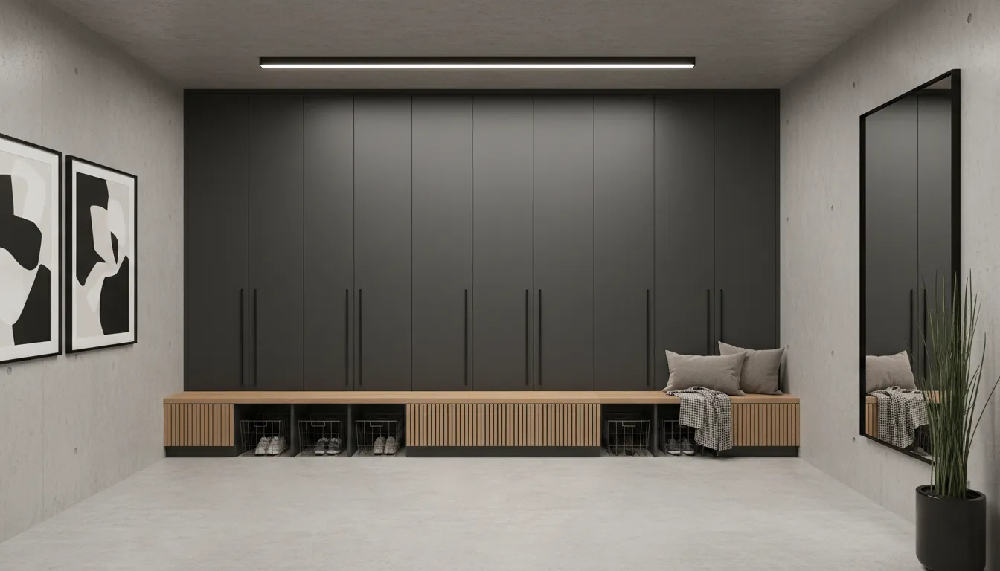
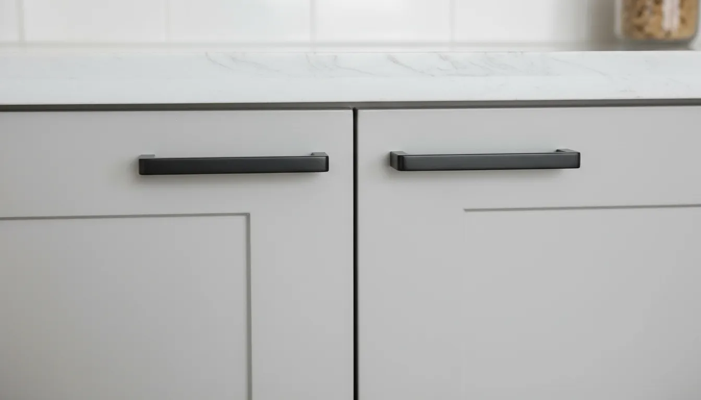

# Integrating Modern Mudroom Lockers into Minimalist Home Decor

The entryway is the handshake of the home. It is the first point of contact for guests and the transitional space where the chaotic energy of the outside world meets the sanctuary of your interior. In minimalist design, this transition is critical. The philosophy of minimalism prioritizes clarity, intentionality, and the elimination of excess, yet the entryway is naturally prone to the accumulation of coats, shoes, bags, and daily debris.

This creates a design paradox: how does one maintain a pristine, minimalist aesthetic in a space that requires heavy-duty utility? The answer lies in the strategic integration of modern mudroom lockers. Gone are the days when lockers were synonymous with clamorous metal hallways in high schools. Today, modern lockers are architectural elements—sleek, sophisticated storage solutions that conceal clutter while enhancing the visual lines of a room.

By integrating lockers that feature clean joinery, handleless facades, and cohesive material palettes, homeowners can achieve a space that is both highly functional and visually silent. This guide explores the nuances of selecting, designing, and styling modern mudroom lockers that complement, rather than disrupt, a minimalist home.

## The Intersection of Utility and Aesthetics

Minimalism is not merely about having fewer things; it is about assigning a specific place for everything so that the environment remains undisturbed. The "mudroom" concept often evokes images of open cubbies, visible coat hooks, and baskets overflowing with shoes. While functional, this visual noise violates minimalist principles.

Modern lockers solve this by introducing the concept of "concealed containment." The primary goal is to hide the complexity of daily life behind a uniform facade. When the doors are closed, the lockers should appear as a seamless extension of the wall or a deliberate piece of sculptural furniture.

To achieve this, one must move away from the traditional definition of a locker and embrace the concept of "entryway cabinetry." The distinction lies in the finish and the fit. A minimalist locker system prioritizes vertical lines that draw the eye upward, creating a sense of height and airiness, which is essential in often-cramped entryways.

## Defining the "Modern" Locker Look

When shopping for or designing lockers for a minimalist space, specificity is key. You are looking for design elements that reduce visual friction.

### Sleek Profiles and Handleless Design

The most significant evolution in modern cabinetry is the disappearance of hardware. In a minimalist mudroom, protruding handles can break the visual flow and catch on clothing in narrow corridors. Push-to-open mechanisms or integrated finger pulls are superior choices. They allow the locker doors to present as flat, uninterrupted planes of color or texture.

If hardware is necessary for accessibility, opt for edge pulls that mount to the top or side of the door, blending into the reveal. This maintains the geometric purity of the design.

### Materiality Matters: Beyond Industrial Metal

While metal lockers have their place in industrial lofts, a warm minimalist aesthetic often calls for organic materials. High-quality engineered wood with matte laminates, natural wood veneers like white oak or walnut, and even painted MDF can soften the utilitarian nature of the storage.

If you prefer the durability of metal, look for powder-coated finishes in matte textures. Glossy finishes tend to reflect light and images, creating visual busyness, whereas matte finishes absorb light, contributing to a sense of calm.

## Selecting the Right Locker for Minimalist Spaces

Choosing the right unit involves balancing spatial constraints with storage needs. In minimalist decor, the furniture should never overpower the room. It should feel like it belongs to the architecture.

### Free-Standing vs. Built-In Aesthetics

Custom built-ins are the gold standard for minimalism because they can be taken floor-to-ceiling, eliminating the "dust gap" above the unit which creates visual clutter. However, high-end free-standing units can achieve a similar effect if selected carefully.

When choosing a free-standing unit, look for sharp corners rather than rounded edges, and enclosed bases (toe kicks) rather than legs. Visible legs can sometimes make a piece look cluttered with shadows underneath. A solid base grounds the unit, making it feel substantial and permanent.

For those seeking a ready-made solution that fits this criteria, consider a sleek wardrobe cabinet that mimics the locker function without the industrial baggage.

**Recommended Product:**
[Systembuild Evolution Lory Utility Storage Cabinet](https://www.amazon.com/s?k=Systembuild+Evolution+Lory+Utility+Storage+Cabinet&tag=hats0f8-20)
*This unit offers the clean lines and concealed storage required for a minimalist entryway, providing ample space for coats and gear behind closed doors.*

### Spatial Considerations and Flow

In a minimalist home, negative space is as important as the furniture itself. Ensure that the placement of your lockers allows for unobstructed movement. A good rule of thumb is to maintain at least 36 to 48 inches of clearance in front of the lockers to allow doors to swing open comfortably without the user feeling cramped.

If your entryway is narrow, consider shallow-depth lockers (12 to 15 inches deep). While you may not be able to hang bulky coats perpendicular to the back wall, you can use front-facing valet rods inside the locker to maximize depth without encroaching on the hallway.

## Color Palettes and Finishes

Color creates atmosphere. In minimalism, the palette is usually restrained, relying on neutrals to create a cohesive backdrop.

### The Power of Monochromatic Schemes

One of the most effective ways to integrate lockers into a minimalist home is to color-match them to the surrounding walls. If your walls are a crisp white, white lockers will visually recede, reducing the perception of bulk. This technique, known as "camouflage design," is excellent for smaller homes where you want the storage to disappear.

Alternatively, you can treat the lockers as a feature wall. A bank of charcoal, navy, or black lockers against a light wall creates a striking, graphic contrast that serves as a focal point. This works well if the rest of the room is sparse; the lockers become the art.

### Matte vs. High Gloss

As mentioned regarding materials, the finish interacts with light. High gloss can feel clinical or retro-futuristic, which can be difficult to pull off in a warm minimalist home. A "super matte" or satin finish is generally more forgiving and sophisticated. It feels soft to the touch and diffuses light, contributing to the serene atmosphere characteristic of minimalist interiors.

## Interior Organization: Hiding the Chaos

The exterior of your lockers represents the minimalist ideal, but the interior must handle the maximalist reality of daily life. The success of a mudroom locker system relies entirely on its internal configuration. If opening the door reveals an avalanche of items, the sense of peace is broken.

### Zoning the Interior

Treat the interior of the locker as a microcosm of the home. It needs zones.

1.  **Upper Zone:** High shelves for seasonal items (winter hats in summer, beach bags in winter).
2.  **Middle Zone:** The active zone. This should include sturdy hooks for coats and bags. In a locker, use double hooks to maximize vertical hanging space.
3.  **Lower Zone:** The shoe zone. Avoid a pile of shoes at the bottom. Use slanted shoe shelves or wire racks to keep footwear organized and visible.

### The Necessity of Uniform Containers

To maintain order within the locker, utilize storage bins. However, mismatched bins create visual noise. Purchase a set of identical bins—opaque is best—to house loose items like gloves, mail, or dog leashes. When you open the locker, seeing a row of identical felt or acrylic bins reinforces the sense of order.

**Recommended Product:**
[StorageWorks Storage Bins with Lids](https://www.amazon.com/s?k=StorageWorks+Storage+Bins+with+Lids&tag=hats0f8-20)
*These neutral, structured bins are perfect for segmenting the interior of a locker, keeping loose items contained and maintaining a uniform aesthetic.*

## Stylizing the Surroundings

A bank of lockers can look stark if not properly integrated with the rest of the decor. The goal is to soften the rigidity of the lockers without adding clutter.

### Lighting the Way

Lighting is a crucial element in minimalist design. Avoid harsh overhead fixtures that cast deep shadows. Instead, consider integrated LED strip lighting.

*   **Toe-Kick Lighting:** A strip of warm LED light running along the base of the lockers creates a floating effect and serves as a gentle nightlight.
*   **Interior Lighting:** Motion-sensor lights inside the lockers add a touch of luxury and utility, making it easy to find items without turning on the main hall lights.

### Minimalist Seating Integration

A mudroom requires a place to sit while putting on shoes. In a locker configuration, you have two options: a built-in bench niche or a separate floating bench.

For a seamless look, a "locker bridge" configuration works well, where tall lockers flank a central bench with overhead storage connecting them. To keep this minimalist, ensure the bench seat material matches the lockers or introduces a subtle natural texture, like a slab of white oak.

If space permits only vertical lockers, place a simple, sculptural stool or bench adjacent to the unit. Avoid intricate upholstery; opt for leather, wood, or concrete. Read more about selecting the right seating in our guide to [small mudroom bench ideas](/posts/small-mudroom-bench-ideas).

### Rugs and Textures

Soften the hard lines of the cabinetry with a runner rug. A runner guides the eye down the hallway and adds acoustic dampening—an often overlooked aspect of minimalist design (which can sound echoey). Choose natural fibers like wool, jute, or sisal in neutral tones. The texture provides a counterpoint to the smooth finish of the lockers.

## DIY vs. Custom Cabinetry

Achieving the high-end look of modern lockers doesn't always require a custom joinery budget. With the "IKEA Hack" phenomenon, homeowners can create bespoke-looking storage using modular furniture foundations.

### Modifying Flat-Pack Furniture

The secret to making flat-pack wardrobes look like custom built-ins lies in the trim work. By building a base platform to raise the units and framing them with filler pieces and crown molding, you can achieve a flush, architectural finish.

Replacing standard doors with custom fronts from third-party manufacturers can also elevate the look instantly, allowing for colors and milled designs not available in standard retail lines.

However, the easiest upgrade is hardware. Even if you opt for a budget-friendly cabinet, installing heavy, high-quality hardware can completely change the tactile experience and visual weight of the piece.

**Recommended Product:**
[Probrico Flat Black Cabinet Pulls](https://www.amazon.com/s?k=Probrico+Flat+Black+Cabinet+Pulls&tag=hats0f8-20)
*Simple, matte black hardware provides a geometric contrast to light-colored lockers, adhering to modern minimalist design principles.*

## Maintaining the Minimalist Standard

Integrating lockers is the physical step; maintaining the minimalist environment is the behavioral step. Modern lockers are not black holes for junk. They require curation.

Adopt the "one in, one out" rule for coats and shoes kept in the entryway. Since space is finite within a locker, it forces a periodic edit of belongings. If the locker is full, something must be moved to long-term storage (like a bedroom closet or basement).

Furthermore, minimalist surfaces require cleanliness to look their best. Fingerprints on matte black lockers or scuffs on white laminates are highly visible. Keep a microfiber cloth handy and designate the entryway as a "reset zone"—before going to bed, ensure nothing is left outside the lockers.

## The Psychological Impact of Organized Entryways

Beyond the visual appeal, integrating modern lockers into a minimalist home offers profound psychological benefits. This is often referred to as "neuroarchitecture"—how our built environment affects our brain.

Clutter raises cortisol levels. Walking into a home and immediately seeing piles of shoes or toppling coats triggers a subtle stress response. Conversely, a clean, linear wall of lockers suggests control and order. It signals to the brain that the work day is over and rest can begin.

By effectively hiding the "machinery" of the household (backpacks, dog leashes, rain boots), you allow the architecture of the home to breathe. The eye can travel freely from the front door to the living space without interruption.

## Conclusion

Integrating modern mudroom lockers into minimalist home decor is an exercise in restraint and precision. It requires looking past the industrial heritage of the locker and seeing it as a canvas for architectural expression. Whether you choose custom built-ins with push-to-open doors or curated free-standing units with matte finishes, the goal remains the same: maximum utility with minimum visual impact.

By selecting the right materials, adhering to a cohesive color palette, and rigorously organizing the interior, you can transform your entryway from a clutter magnet into a serene portal that welcomes you home with grace. The modern locker is no longer just for storage; it is a cornerstone of the organized, minimalist lifestyle.

For more inspiration on optimizing your entryway, explore our article on [creating a functional drop zone](/posts/creating-a-functional-drop-zone) or browse our [entryway layout guides](/posts/entryway-layout-guides).