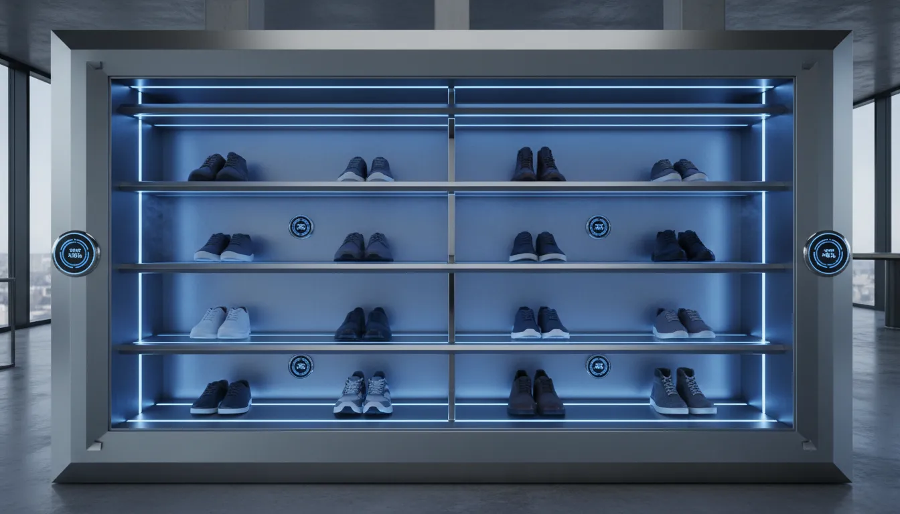
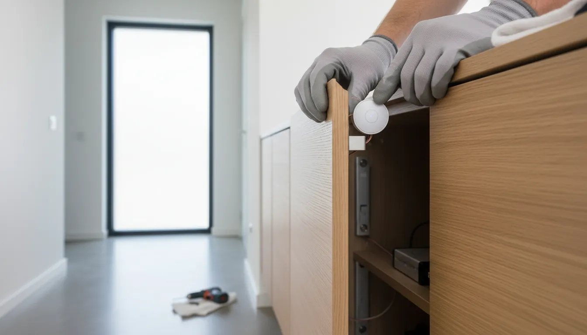
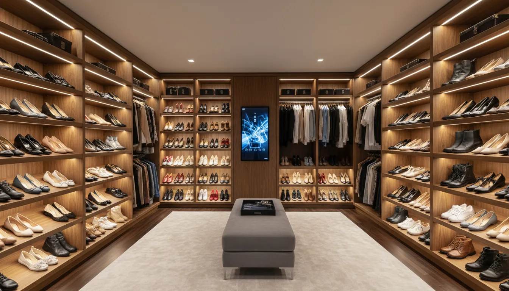

# Integrating Smart Shoe Storage with Home Automation Systems

The modern home is undergoing a quiet revolution. As we transition from unconnected appliances to fully integrated ecosystems, the expectation for convenience and efficiency has extended to every corner of the residence, including the humble entryway. For decades, shoe storage was viewed as a static necessity—a simple rack or cabinet designed solely to hold footwear. However, the convergence of interior design and smart technology has birthed a new category of home organization: smart shoe storage.

Integrating shoe storage with home automation systems offers more than just a futuristic aesthetic; it provides tangible benefits regarding hygiene, material preservation, and seamless lifestyle management. By connecting storage solutions to platforms like Apple HomeKit, Amazon Alexa, or Google Home, homeowners can automate maintenance routines and streamline their daily departures and arrivals. This guide explores the sophisticated mechanisms behind these systems and how to implement them effectively in a contemporary home.

## The Evolution of the Connected Entryway

The entryway serves as the transition zone between the chaotic external world and the sanctuary of the home. Historically, this area has been prone to clutter, often becoming a bottleneck of discarded footwear and accessories. [Modern entryway design](/posts/modern-minimalist-entryway-ideas) now demands a higher standard of organization, one that hides the mess while ensuring accessibility.

Smart technology transforms the entryway from a passive space into an active participant in your daily routine. Imagine a scenario where unlocking your front door triggers a sequence: the foyer lights dim to a warm welcome setting, the thermostat adjusts, and your shoe cabinet automatically unlocks or illuminates specific compartments based on the time of day or the weather forecast. This is the essence of the connected entryway—a system where furniture and architecture work in tandem to support the inhabitants.

## Defining Smart Shoe Storage Technology

To understand integration, one must first understand the hardware. "Smart" shoe storage refers to furniture or built-in units that utilize electricity and connectivity to perform functions beyond simple containment. These functions generally fall into three categories: preservation, accessibility, and inventory management.

### Active Preservation and Hygiene
High-quality footwear, particularly leather boots and athletic sneakers, requires specific environmental conditions to maintain its structural integrity. Smart storage units often incorporate:
*   **Dehumidification Modules:** These sensors detect excess moisture—common after wearing shoes in rain or snow—and activate low-heat drying fans to prevent mold growth and leather degradation.
*   **UV-C Sterilization:** Integrated ultraviolet lights activate on a timer when the cabinet is closed, neutralizing odor-causing bacteria and fungi without the use of chemical sprays.
*   **HEPA Filtration:** For allergy sufferers, internal air circulation systems trap dust and pollen brought in from the outdoors, preventing them from circulating through the home's HVAC system.

### Motorized Accessibility
For those with extensive collections or limited floor space, motorized solutions maximize vertical storage. Rotating racks, often referred to as "shoe carousels," can be concealed within deep closets. When integrated with automation, a user can summon a specific pair of shoes via a smartphone app or voice command, prompting the rack to rotate until the desired pair is at eye level.

## Core Integration Protocols

The true power of smart storage lies in its ability to communicate with the rest of the house. Most advanced storage hardware utilizes standard communication protocols such as Zigbee, Z-Wave, or Wi-Fi to interface with a central hub.

### Voice Assistant Integration
Integration with voice assistants transforms the user experience. By connecting a smart shoe cabinet to Amazon Alexa or Google Assistant, users can execute hands-free commands. For example, stating "Alexa, prepare for a run" could trigger a routine where the sneaker compartment opens, and the internal UV cycle pauses for safe retrieval.

For those looking to retrofit existing cabinets with smart functionality, creating a voice-controlled lighting system is a logical first step.

**Recommended Product:**
[Motion Sensor Cabinet Lights](https://www.amazon.com/s?k=smart+motion+sensor+cabinet+lights&tag=hats0f8-20)

### Automated Scenes and Triggers
Home automation relies on "scenes"—pre-programmed sets of actions that occur simultaneously. Integrating shoe storage into these scenes adds a layer of sophistication to home management.

*   **The "Arrival" Scene:** When a smart lock disengages after sunset, the shoe cabinet's interior ambient lighting fades on, guiding the homeowner where to place their footwear. If the weather station data indicates rain, the cabinet automatically queues a drying cycle for 30 minutes after closure.
*   **The "Vacation" Mode:** When the security system is armed for an extended period, the storage unit can enter a low-power preservation mode, maintaining optimal humidity levels to prevent leather from drying out or cracking during long-term storage.

## Creating a Climate-Controlled Environment for Footwear

Leather, suede, and high-performance synthetic materials are sensitive to environmental fluctuations. Integrating humidity sensors with your wider smart home ecosystem ensures your investment pieces are protected.

Using a smart hygrometer placed inside the shoe cabinet, you can set specific thresholds within your home automation hub (such as Samsung SmartThings or Home Assistant). If humidity rises above 50%, the system can trigger a smart plug connected to a specialized dehumidifier or an electric drying rod.

For serious collectors, dedicated electronic sanitizing cabinets are becoming a staple. These standalone units can be plugged into smart plugs to allow for remote scheduling, ensuring shoes are warm and sterilized right before a morning commute.

**Recommended Product:**
[Electronic Shoe Sanitizer Cabinet](https://www.amazon.com/s?k=electronic+shoe+sanitizer+cabinet&tag=hats0f8-20)

## Motorized Racks and Vertical Optimization

In urban environments where square footage is at a premium, vertical storage is essential. Traditional high shelves are often inaccessible, leading to "dead space" where shoes are stored and forgotten. Motorized vertical carousels solve this by bringing the storage to the user.

While fully custom automated closets can cost thousands, modular motorized racks are becoming available for the consumer market. These can be installed into standard wardrobes. The integration potential here is vast; imagine a closet interface on a tablet that allows you to scroll through your digital inventory. Selecting an image of a specific heel rotates the physical rack to present that shoe immediately.

This technology is particularly beneficial for accessibility, allowing individuals with limited mobility to access floor-to-ceiling storage without bending or climbing ladders.

**Recommended Product:**
[Motorized Rotating Shoe Rack](https://www.amazon.com/s?k=motorized+rotating+shoe+rack&tag=hats0f8-20)

## DIY Retrofitting: Making Standard Furniture Smart

Not every homeowner wishes to invest in entirely new furniture. Fortunately, retrofitting existing cabinetry with smart components is a viable and often cost-effective strategy. This approach allows for customization that matches the specific decor of the [entryway or mudroom](/posts/mudroom-bench-storage-ideas).

### Smart Lighting Implementation
The simplest upgrade involves lighting. Magnetic reed sensors (commonly used in window security) can be attached to cabinet doors. When wired to a smart controller, opening the cabinet door can trigger LED strips installed along the shelves. This not only adds a luxury boutique feel but also aids in locating specific items in dark entryways.

### Automated Ventilation
To replicate the preservation features of high-end units, DIY enthusiasts can install quiet computer cooling fans at the rear of a cabinet. By connecting these fans to a smart plug and a humidity sensor, you create a responsive air circulation system that prevents odor buildup.

## Security and Inventory Management

For sneaker enthusiasts and collectors of luxury footwear, shoe storage is not just about organization—it is about security. High-value collections require protection similar to jewelry or art.

Smart locks can be installed on shoe display cases, integrated into the home security perimeter. If a cabinet is forced open while the home is in "Away" mode, the system can trigger an alarm and send a push notification to the homeowner's phone.

Furthermore, RFID (Radio Frequency Identification) technology is beginning to permeate the home organization sector. By placing discrete RFID tags on shoe boxes or the shoes themselves, a smart reader within the cabinet can log inventory. This data allows the home automation system to track usage statistics, suggesting which pairs are worn most frequently or alerting the user if a pair has not been returned to its designated slot.

## Design Considerations for the Smart Entryway

When integrating technology, aesthetic cohesion remains paramount. Wires, hubs, and sensors should remain invisible to maintain a clean, sophisticated look.

### Cable Management
Planning for power is critical. Smart cabinets require electricity for motors, lights, and sensors. If you are renovating, install outlets inside the closet or directly behind the intended cabinet location. For existing spaces, use paintable cable raceways along baseboards to conceal power cords running to the unit.

### Material Interference
Be mindful of materials that block signals. Heavy metal cabinets may act as Faraday cages, blocking Wi-Fi or Zigbee signals from reaching sensors inside. Wood and glass are generally more friendly to wireless protocols. If metal storage is preferred for an industrial look, ensure that the communication hubs are placed in close proximity to the unit to maintain a strong connection.

### Aesthetic Integration
The technology should enhance, not overpower, the design. Use warm-temperature LEDs (2700K-3000K) for interior lighting to create an inviting glow rather than a harsh, clinical blue light. Ensure that any added hardware, such as smart locks or handles, matches the finish of the existing door hardware in the home.

## Future Trends in Automated Storage

The trajectory of smart home technology points toward increased predictive capabilities. Future shoe storage systems will likely utilize AI to learn user habits. The system might observe that you go to the gym every Tuesday at 6:00 PM and automatically present your running shoes and activate the ventilation system in your gym bag compartment in anticipation.

Integration with weather services will become more granular. Instead of just reacting to "rain," systems might adjust drying cycles based on the intensity of the downpour or the specific material composition of the shoes worn that day, assuming the inventory is digitized.

## Practical Steps for Implementation

To begin integrating smart shoe storage into your home, follow a logical progression:

1.  **Assess Needs:** Determine if your priority is preservation (climate control), capacity (motorized racks), or convenience (lighting and automation).
2.  **Choose an Ecosystem:** Ensure any device you purchase is compatible with your current hub (HomeKit, Alexa, SmartThings, Home Assistant).
3.  **Start Small:** Begin with smart lighting and humidity monitoring. These provide immediate value with low complexity.
4.  **Upgrade Hardware:** Consider investing in a standalone sanitizing cabinet or a motorized rack for your primary closet.
5.  **Program Scenes:** Use your smart home app to tie the storage functions to your daily routines (arrival, departure, sleep).

## Conclusion

The integration of smart shoe storage with home automation systems represents a significant leap forward in home organization. It moves beyond the passive storage of items to the active management of a lifestyle. By combining the utility of preservation technology with the convenience of automation, homeowners can protect their investments, streamline their mornings, and maintain a pristine entryway. Whether through a high-end custom installation or a clever DIY retrofit, the connected shoe cabinet is a functional, sophisticated addition to the modern intelligent home.