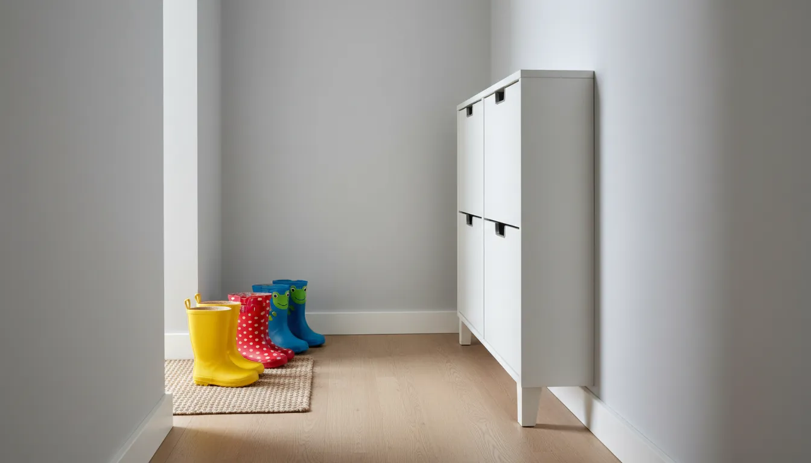
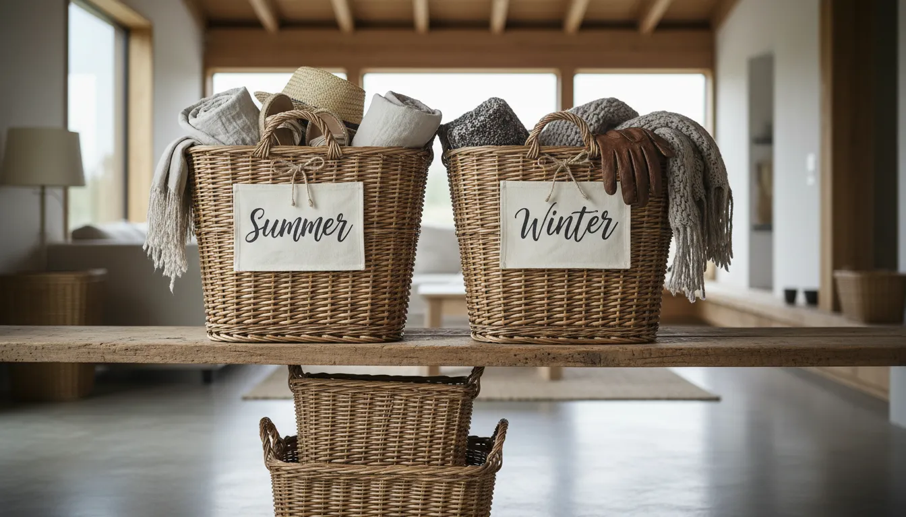

# Kids' Shoe Storage Solutions: Making Entryway Organization Fun and Accessible

The entryway is often referred to as the handshake of the home—it is the first impression guests receive and the final touchpoint before you leave for the day. However, for families with young children, this space frequently devolves into a chaotic obstacle course of discarded sneakers, muddy boots, and misplaced sandals. The struggle to maintain a pristine foyer while accommodating the frenetic energy of family life is a universal challenge, but it is not insurmountable.

Transforming a cluttered drop zone into a streamlined, functional area requires more than just buying a shoe rack. It demands a strategic approach that considers the psychology of children, the ergonomics of accessibility, and the aesthetics of modern home design. When storage solutions are designed with children's physical limitations and behavioral patterns in mind, the likelihood of compliance increases significantly.

This comprehensive guide explores the most effective kids' shoe storage solutions. We will delve into methods for making organization accessible, integrating systems that grow with your family, and selecting furniture that complements your interior décor while withstanding the rigors of daily use.

## The Psychology of Entryway Chaos

Before investing in furniture or storage systems, it is essential to understand why the pile-up occurs in the first place. Children do not leave their shoes in the middle of the hallway out of malice; they do so because it represents the path of least resistance. When a child rushes through the door, their primary goal is to transition to the next activity. If putting shoes away requires opening a heavy closet door, reaching a high shelf, or balancing footwear on a flimsy wire rack, they will likely bypass the step entirely.

The secret to sustainable organization lies in reducing friction. Successful storage solutions for children must be intuitive and physically accessible. If it is easier to put the shoe in the bin than on the floor, the bin will win. By aligning the environment with the child's natural tendencies, parents can shift from being enforcers of rules to facilitators of good habits.

## Accessibility First: Designing for Little Hands

The cornerstone of an effective kid-friendly entryway is height. Vertical storage that works for adults is often useless for a child under ten. To encourage independence, storage zones must be located at the child's eye level or below.

### The Low-Profile Open Cubby

Open shelving is superior to closed cabinetry for young children. The visual cue of an empty space invites the item to be placed there. Cubbies offer a dedicated "home" for each pair of shoes, teaching the concept of one-to-one correspondence.

When selecting a cubby system, opt for units that sit directly on the floor. This stability allows children to interact with the furniture without fear of tipping (though wall-anchoring is always recommended for safety). Assigning a specific cubby to each family member can also foster a sense of ownership. A child is more likely to keep "their" space tidy than a communal area.

### The "Dump Bin" Method

For toddlers and preschoolers, precision is a developmental skill that is still being refined. Expecting a three-year-old to align heels perfectly on a rack is a recipe for frustration. The "dump bin" method utilizes large, open baskets or sturdy bins placed at ground level.

This approach prioritizes containment over organization. The goal is simply to get the shoes off the traffic path. Wicker baskets, canvas totes, or clear plastic bins work exceptionally well here. This method is particularly effective for flip-flops, slippers, and casual play shoes that do not require structural support to maintain their shape.

## Creative Storage Solutions

Once you have established the principles of accessibility, the next step is selecting the hardware that fits your space. The market is saturated with options, but the best choices combine durability with multi-functionality.

### The Storage Bench: A Dual-Purpose Staple

A storage bench is arguably the most valuable piece of furniture for a family entryway. It solves two problems simultaneously: it provides a place to store shoes and a place to sit while putting them on or taking them off. This is crucial for children who may struggle with balance while managing laces or Velcro straps.

Look for benches with open compartments underneath or a lift-top lid. Open compartments are generally preferred for daily-use shoes, as lids require the child to stand up and move away from the bench to access the contents.

If you are looking for a versatile option that combines seating with ample storage capacity, consider this [Entryway Storage Bench](https://www.amazon.com/s?k=Entryway+Storage+Bench&tag=hats0f8-20). A sturdy bench anchors the space and signals that the entryway is a zone for pausing and transitioning, rather than just rushing through.

### Verticality and Hanging Organizers

In narrow hallways or apartments where floor space is at a premium, vertical storage is essential. However, traditional over-the-door organizers with clear pockets can look cluttered and visually noisy.

A more sophisticated approach involves wall-mounted tiered racks or slim, tip-out shoe cabinets. These cabinets are particularly effective because they hide the shoes completely when closed, maintaining a sleek look. Because they are often shallow (sometimes only 6-10 inches deep), they do not encroach on the walkway.

For a vertical solution that maximizes capacity without sacrificing aesthetics, a [Slim Tip-Out Shoe Cabinet](https://www.amazon.com/s?k=Slim+Tip-Out+Shoe+Cabinet&tag=hats0f8-20) is an excellent choice. These units can be mounted to the wall, keeping the floor clear for easy cleaning while keeping shoes hidden yet accessible.

## Making Organization Fun: Gamification and Aesthetics

Utility does not have to be boring. Integrating elements of fun and personalization can transform the chore of cleaning up into an engaging activity. This is where interior design meets behavioral psychology.

### Color Coding and Visual Cues

Children respond well to visual stimuli. Assigning a color to each child—blue for the eldest, red for the youngest, etc.—can simplify the sorting process. This can be achieved through colored bins, painted cubby interiors, or even colored mats on the floor designated for shoe placement.

For pre-literate children, use picture labels. A simple icon of a boot, a sneaker, or a sandal taped to the appropriate bin helps them categorize their footwear. This not only aids in organization but also supports early cognitive development regarding sorting and classification.

### The "Parking Lot" Concept

For families who prefer floor mats to furniture, the "Parking Lot" technique is highly effective. Use painter's tape or a custom rug to create designated "parking spots" for shoes. Tell the children they need to "park" their shoes in their garage. This playful narrative makes the act of alignment engaging.

If you are interested in exploring how to integrate these playful elements into a broader design scheme, read our guide on [Entryway Decor Ideas](/posts/entryway-decor-ideas-for-busy-families) to see how functional organization can merge with high-end style.

## Small Space Strategies

Urban living often means dealing with entryways that are little more than a patch of floor behind the door. In these scenarios, every square inch counts.

### Floating Shelves

Installing floating shelves low to the ground allows for shoe storage without the bulk of a cabinet. By keeping the floor visible beneath the lowest shelf, the room feels larger and airier. Ensure the shelves are deep enough to accommodate the length of the shoes but not so deep that they become a tripping hazard.

### Tension Rods in Nooks

If you have a small alcove or a closet near the entry, tension rods are a budget-friendly and adjustable solution. Installing two tension rods parallel to each other creates a custom shoe rack. The rear rod should be slightly higher than the front rod to catch the heel of the shoe, keeping it securely in place. This is particularly useful for maximizing the vertical space inside a closet without permanent installation.

## Seasonal Rotation: The Key to Long-Term Order

Even the best storage system will fail if it is overloaded. A common mistake parents make is keeping every pair of shoes the child owns in the entryway. The entryway should be reserved for "high-rotation" footwear only—usually two to three pairs per person.

### The Rotation System

Implement a seasonal rotation strategy. In the summer, heavy winter boots should be cleaned and moved to deep storage (a closet, basement, or under-bed storage). Conversely, flip-flops should be retired when the snow starts to fall.

Establish a "One In, One Out" rule. When a new pair of shoes enters the rotation, an old pair must be removed—either discarded, donated, or moved to long-term storage. This prevents the inevitable accumulation that leads to overflow.

### Handling "The Mud"

For families in climates with distinct seasons, mud and snow are significant enemies of clean floors. Standard shoe racks often lack the drainage necessary for wet boots. Rubber boot trays are essential. Look for trays with raised edges to contain melting snow. To elevate this look, fill the tray with smooth river stones. The stones allow water to drain away from the soles of the boots, speeding up drying time, and they look far more spa-like than a plastic mat.

## Mudrooms vs. Entryways: Tailoring the Approach

It is important to distinguish between a formal entryway and a mudroom. A mudroom is a dedicated utility space designed for mess, while an entryway is a transitional space.

If your home has a mudroom, you can afford to be more utilitarian. Heavy-duty wire racks, industrial hooks, and large lockers are appropriate. However, if your front door opens directly into the living room, your storage solutions need to be disguised as furniture.

For those attempting to create a mudroom function within a standard hallway, consider a "Hall Tree." These standalone units combine hooks, a bench, and shoe storage into one cohesive piece of furniture. A high-quality [Hall Tree with Shoe Storage](https://www.amazon.com/s?k=Hall+Tree+with+Shoe+Storage&tag=hats0f8-20) can act as a mini-mudroom, providing a centralized command center for backpacks, coats, and footwear without requiring renovation.

## DIY and Repurposing

You do not always need to purchase new furniture to solve shoe storage problems. Creative repurposing can yield unique and effective results.

### Wooden Crates

Vintage or new wooden crates can be stacked on their sides and secured together to create a rustic, modular shelving unit. This allows you to customize the height and width of the storage to fit your specific wall space.

### PVC Pipe Rack

For a modern, industrial look, large-diameter PVC pipes can be cut into lengths matching the depth of a shoe. Stacked and glued together in a honeycomb pattern, they create individual cubbies perfect for sneakers and sandals. This can be painted to match the wall color, making it disappear into the décor, or in bright colors to stand out as a design feature.

## Maintenance and Routine

The hardware is only 50% of the solution; the other 50% is habit formation.

### The "Landing Strip" Routine

Teach children the "Landing Strip" routine. Upon entering the house, the sequence should always be the same:
1.  Door closes.
2.  Items in hands (backpacks) go to the hook or bench.
3.  Shoes come off and go into the designated spot.
4.  Coat comes off.

Consistency is key. If parents model this behavior, children will eventually mimic it. It helps to have a "reset" time, perhaps on Sunday evenings, where the entryway is cleared of any items that don't belong (mail, toys, excess shoes) to start the week fresh.

### Dealing with Odors

Kids' shoes can become odorous, and an open storage system in the main entryway can inadvertently broadcast these smells.
*   **Charcoal Bags:** Place activated bamboo charcoal bags in the bottom of bins or cubbies to absorb moisture and odors naturally.
*   **Ventilation:** Ensure that whatever storage solution you choose allows for air circulation. Completely sealed cabinets can trap moisture, encouraging mold and bacteria growth.

## Product Recommendations & Material Durability

When shopping for kids' shoe storage, material choice matters as much as design.

**1. Plastic and Resin:**
*   *Pros:* Waterproof, easy to wipe down, lightweight.
*   *Cons:* Can look cheap, may crack under heavy weight.
*   *Best for:* Boot trays, internal bin organizers, muddy climates.

**2. Wood and MDF:**
*   *Pros:* Aesthetically pleasing, sturdy, looks like permanent furniture.
*   *Cons:* Vulnerable to water damage (warping/swelling) if wet boots are placed directly on the surface.
*   *Best for:* Benches, cubbies, dry climates.

**3. Metal:**
*   *Pros:* durable, industrial aesthetic, often breathable (mesh/wire).
*   *Cons:* Can rust if not powder-coated properly.
*   *Best for:* Wall-mounted racks, wire baskets.

For a deeper dive into organizing other areas of the home, check out our article on [Hidden Storage Solutions](/posts/hidden-storage-solutions-for-small-homes).

## Conclusion

Creating an organized entryway with children is a balancing act between form and function. It requires letting go of the idea of a magazine-perfect, empty hallway and embracing a "lived-in" but orderly aesthetic. By lowering the barrier to entry—literally and figuratively—and providing storage solutions that are accessible, intuitive, and attractive, you can tame the shoe chaos.

Remember that the goal is not just a clean floor; it is teaching your children valuable life skills about responsibility and respect for shared spaces. Whether you opt for a sleek tip-out cabinet, a rugged bench, or a system of colorful bins, the best solution is the one your family actually uses. Start small, assess your family's specific habits, and build a system that makes coming home a relief, not a chore. With the right tools and a little patience, your entryway can become a welcoming, clutter-free gateway to your home.