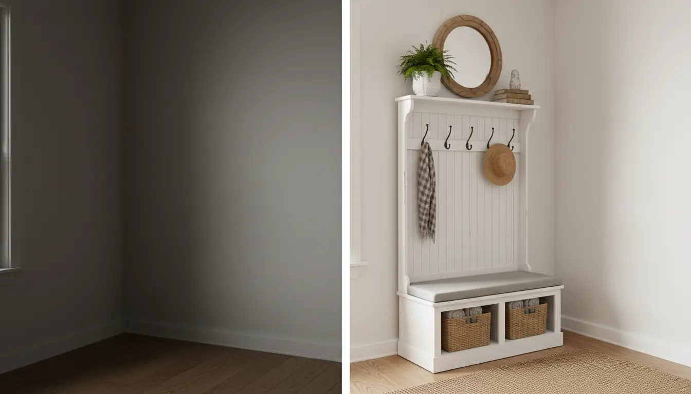
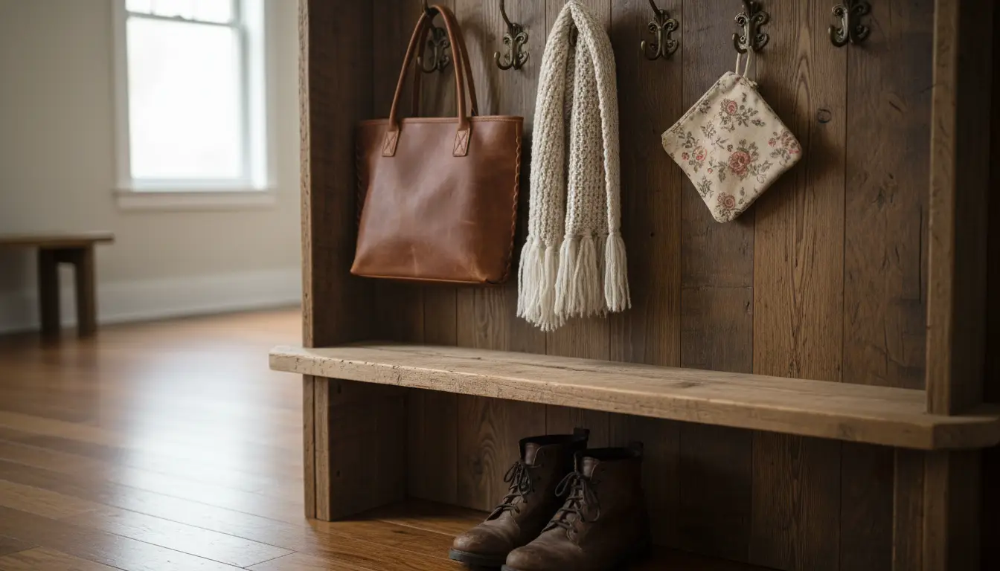
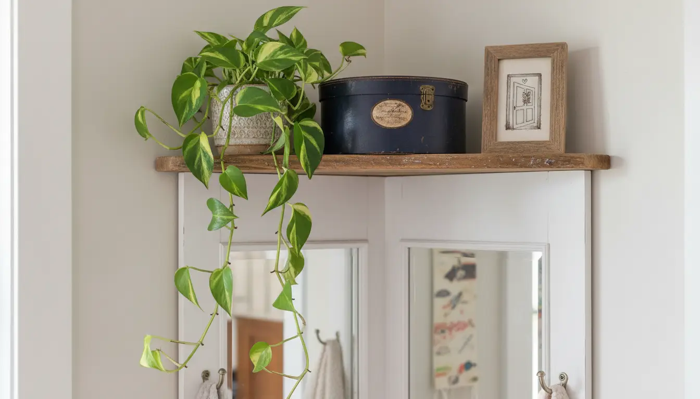

---
title: "Maximizing Style in Small Spaces: Corner Hall Tree Solutions"
slug: "maximizing-style-in-small-spaces-corner-hall-tree-solutions"
pubDate: "2026-01-28"
description: "Discover how to transform tight entryways with corner hall tree solutions. Expert tips on maximizing storage, style, and organization in small spaces."
author: "Content Bot"
image:
  url: "../../images/blog/maximizing-style-in-small-spaces-corner-hall-tree-solutions.webp"
  alt: "A beautifully styled rustic-industrial corner hall tree sitting in a small, sunlight-filled entryway with coats and woven baskets organized neatly."
tags: 
  - Small Space Living
  - Entryway Organization
  - Interior Design
category: "Entryway Furniture"
keywords:
  - corner hall tree
  - small entryway storage
  - space-saving furniture
  - corner mudroom bench
  - narrow hallway solutions
  - entryway organization ideas
  - corner coat rack
canonical: "https://www.entrywaystorage.com/posts/maximizing-style-in-small-spaces-corner-hall-tree-solutions"
---

# Maximizing Style in Small Spaces: Corner Hall Tree Solutions

The entryway is the handshake of your home. It is the first thing guests see when they arrive and the last thing you see when you leave. However, for those of us living in apartments, condos, or older homes with quirky layouts, the "foyer" is often nothing more than a patch of floor behind the front door. This lack of square footage leads to a common dilemma: the clutter catastrophe. Shoes pile up, coats are draped over dining chairs, and keys vanish into the abyss.

When you don't have the luxury of a sprawling mudroom, you have to get creative. Enter the unsung hero of **small entryway storage**: the **corner hall tree**.

While traditional hall trees demand a significant amount of flat wall space—a luxury often unavailable in narrow corridors—corner units are designed to conquer the "dead space" where two walls meet. In this comprehensive guide, we will explore how utilizing a **corner hall tree** can revolutionize your home organization, maximize your style, and turn a cramped corner into a functional command center.

## The Psychology of the Corner: Reclaiming Dead Space

In interior design, corners are notoriously underutilized. We often place a potted plant or a floor lamp in a corner and call it a day, largely because standard furniture is designed to sit flush against a flat wall. In a small home, ignoring corners is a waste of valuable real estate.

A **corner hall tree** changes the geometry of the room. By occupying the vertices of your entryway, it draws the eye outward to the perimeter, actually making the center of the room feel more spacious. This is the essence of **space-saving furniture**: it works harder so your floor plan doesn't have to.

### Why Go Vertical?
The fundamental rule of organizing small spaces is "build up, not out." A corner unit typically offers a small footprint (often extending only 20 to 30 inches along each wall) but can reach heights of 70 inches or more. This verticality allows you to stack storage:
*   **Top Tier:** Shelving for decor or bins containing off-season items.
*   **Middle Tier:** Hooks for coats, scarves, bags, and pet leashes.
*   **Bottom Tier:** A **corner mudroom bench** for seating and shoe storage underneath.

## Choosing the Right Style for Your Aesthetic

Just because a piece of furniture is functional doesn't mean it has to be utilitarian or ugly. Today's market offers a plethora of designs ranging from industrial chic to modern farmhouse. Choosing the right style is crucial for maintaining flow in a small space; you want the piece to blend in, not stick out like a sore thumb.

### 1. The Industrial Edge
For urban lofts or modern apartments, an industrial look works wonders. These units usually feature a combination of black metal frames and engineered wood with a rustic grain finish. The open-frame design of industrial furniture is particularly beneficial for **narrow hallway solutions** because it allows light to pass through, keeping the area feeling airy rather than boxy.

If you are looking to add a touch of rugged elegance to your foyer, consider a unit that combines sturdy hooks with a mesh shoe rack.

**Product Recommendation:**
If you want to achieve this look, check out this versatile option on Amazon. It perfectly balances the sturdiness of metal with the warmth of wood tones.
[Check Price for Industrial Corner Hall Trees](https://www.amazon.com/s?k=industrial+corner+hall+tree+wood+metal&tag=hats0f8-20)

### 2. The Modern Farmhouse
If your home leans towards cozy, traditional, or shabby chic, a white or cream-colored wooden unit is ideal. These often feature beadboard backing, crown molding, and closed storage options like bench lids or drawers. The lighter color reflects light, which is a classic trick to make small spaces appear larger.

### 3. The Minimalist Scandi
For the ultra-modern home, look for sleek lines, light bamboo or pine woods, and a lack of ornate detailing. A simple **corner coat rack** with a small integrated bench aligns with Scandinavian design principles: beauty in simplicity and high functionality.

## Measuring for Success: The Fit Factor

Before you click "Add to Cart," you must wield your tape measure with precision. Buying furniture for tight corners is less forgiving than buying a sofa for a large living room. Here is a step-by-step guide to ensuring the perfect fit.

### The Baseboard Obstacle
Most walls have baseboards. Most furniture has straight legs. If your **corner hall tree** doesn't have a cutout for baseboards (and most don't), there will be a gap between the unit and the wall. You have two options:
1.  **Accept the Gap:** It’s usually negligible, but ensure the unit is anchored to the wall for safety.
2.  **Leg Placement:** Look for units where the rear leg is inset, allowing the top of the unit to touch the wall.

### The Radius and Reach
Measure from the corner outward along both walls. If you have a door nearby, open it fully. measure the distance from the corner to the edge of the open door. Your hall tree **must** be smaller than this distance to prevent the door from banging into the furniture.

### Vertical Clearance
While height is great for storage, ensure you aren't blocking light switches, thermostats, or sconces. Also, check your ceiling height if you plan on storing items on the very top shelf.

## Organization Hacks for Your Corner Unit

Once you have your **corner mudroom bench** installed, the real work begins: organizing it. Without a system, a hall tree just becomes a vertical pile of clutter. Here are expert **entryway organization ideas** to keep your corner tidy.

### The "One In, One Out" Rule
In small spaces, you cannot store every coat you own in the entryway. Limit the hall tree to items currently in rotation. Heavy winter parkas should move to the bedroom closet in July; denim jackets should move out in December.

### Assigning Hooks
If you live with family or roommates, territory disputes are common. Assign specific hooks to specific people. Lower hooks are perfect for children to hang their own backpacks, fostering independence. Upper hooks are for adults or longer items like trench coats.

**Product Recommendation:**
For those who need to maximize hidden storage within their unit, utilizing the space under the bench is key. If your unit doesn't have built-in drawers, you need baskets that fit the specific triangular or trapezoidal dimensions of corner furniture.
[Find Woven Storage Baskets for Entryways](https://www.amazon.com/s?k=woven+storage+baskets+for+shelves&tag=hats0f8-20)

### Shoe Containment
The bottom of a corner tree can quickly become a shoe mountain. Because the space is often triangular, standard rectangular shoe racks might not fit perfectly.
*   **Tip:** Store shoes heel-to-toe to maximize width.
*   **Tip:** Use a boot tray during winter to protect the floor and the furniture legs from salt and moisture. For more on protecting your floors, read our guide on [Entryway Flooring Protection](/posts/entryway-flooring-protection-guide).

## Styling Your Corner: From Storage to Statement

A **corner hall tree** is functional, but it is also a piece of decor. Because it is in the entryway, it sets the tone for the rest of your home. Here is how to style it so it looks curated, not chaotic.

### Soften the Edges
Hall trees are full of hard lines and angles. Soften the look by adding textiles. A couple of throw pillows on the bench (if it’s large enough) or a textured throw blanket draped over the side can make the spot look inviting. If the bench is wood, consider a custom-made cushion to add comfort and color.

### Bring in the Greenery
Plants breathe life into small spaces. The top shelf of a hall tree is often too high for daily storage, making it the perfect home for a trailing plant like a Pothos or Philodendron. The vines cascading down the side of the unit add a beautiful organic element that contrasts with the structure of the furniture.

### Lighting Matters
Corners are often the darkest parts of a room. If your entryway lacks natural light, clip a small battery-operated sconce to the side of the unit, or weave a string of fairy lights through the top frame for a cozy, welcoming glow in the evenings.

### The Mirror Trick
Some corner hall trees come with built-in mirrors. If yours doesn't, consider hanging a small mirror on the wall adjacent to the unit. Mirrors bounce light around and allow for that critical "last looks" check before you leave the house.

**Product Recommendation:**
Sometimes, you don't need a heavy piece of furniture. If your space is incredibly tight (like a studio apartment), a simple, freestanding corner coat rack is the ultimate minimalist solution. It offers the functionality of hanging space without the visual bulk of a bench.
[Browse Minimalist Corner Coat Racks](https://www.amazon.com/s?k=minimalist+corner+coat+rack+stand&tag=hats0f8-20)

## The DIY vs. Pre-Made Debate

Should you buy a pre-made unit or attempt to build one?

### Buying Pre-Made
**Pros:**
*   Immediate solution.
*   Designed for structural integrity (weight balance is tricky with corner units).
*   Finish is durable and easy to clean.

**Cons:**
*   Fixed dimensions might not maximize every inch of your ceiling height.
*   Limited color options.

### Going DIY
For the handy homeowner, building a custom corner unit allows you to take the storage all the way to the ceiling. You can customize the molding to match your home’s architecture. However, corner joinery can be complex. Angles are rarely a perfect 90 degrees in older homes, leading to frustration during the build. Unless you are experienced with carpentry, a high-quality pre-made unit is usually the safer, more cost-effective bet. If you are interested in smaller DIY projects, check out our post on [DIY Wall Hooks for Small Spaces](/posts/diy-wall-hooks-small-spaces).

## Maintenance and Care

To ensure your **space-saving furniture** lasts for years, regular maintenance is required.

1.  **Anchor It:** This cannot be stressed enough. Corner units can be top-heavy, especially when loaded with winter coats. Always use the wall-anchoring hardware included with the product to prevent tipping.
2.  **Tighten Hardware:** Every few months, check the bolts and screws, especially if the unit is metal. Daily use can cause vibrations that loosen joints over time.
3.  **Moisture Management:** If you are hanging wet raincoats or snowy jackets, ensure they aren't resting directly against a particleboard back panel, which can swell and warp with moisture. Use a hanger to keep the wet fabric away from the wood, or dry the items elsewhere before hanging them in the corner.

## Conclusion: reclaiming Your Entryway

Living small doesn't mean you have to sacrifice organization or style. By identifying the underused potential of your corners, you can transform a chaotic entryway into a streamlined, functional space. A **corner hall tree** offers the perfect blend of utility and aesthetics, proving that you don't need a grand foyer to have a grand entrance.

Whether you opt for a rustic industrial rack or a sleek white farmhouse bench, the key is to measure twice, declutter often, and style with intention. Your entryway is the introduction to your life—make sure it tells a story of order and welcome.
