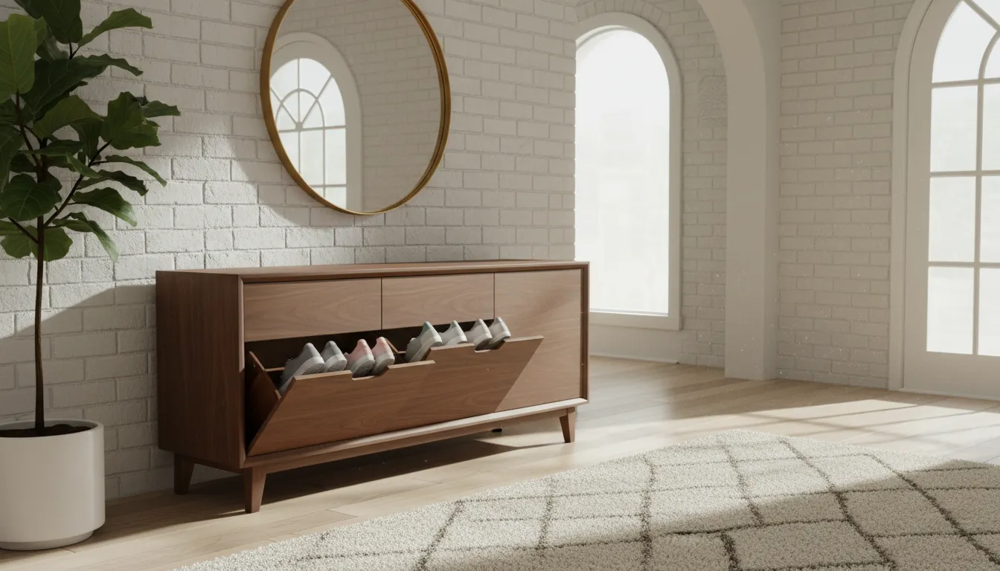
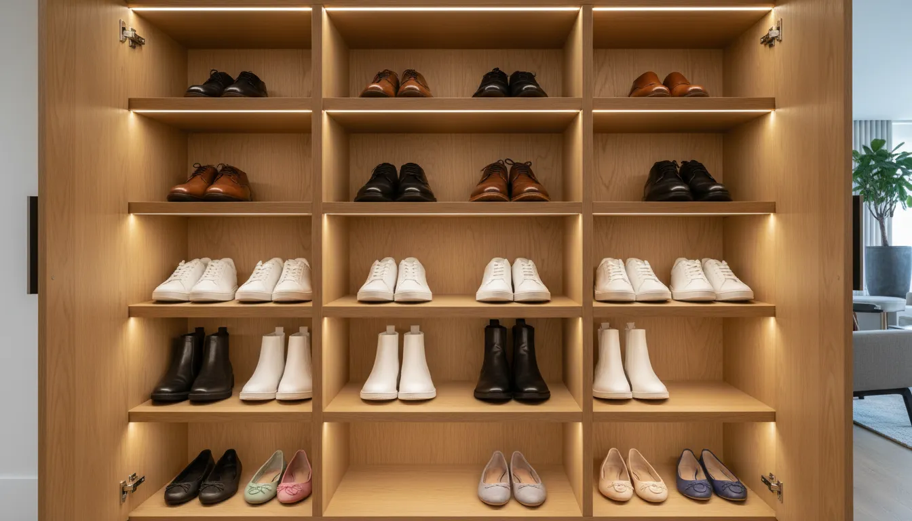

# Mid-Century Modern Smart Shoe Storage Solutions for Designer Entryways

The entryway is the architectural handshake of the home. It is the first point of contact for guests and the transitional space where the outside world is shed in favor of domestic comfort. However, this critical area often falls victim to the accumulation of daily clutter, specifically footwear. For the design-conscious homeowner, particularly those with an affinity for the clean lines and organic warmth of Mid-Century Modern (MCM) design, the challenge lies in balancing aesthetic integrity with high-volume utility.

In recent years, the concept of "smart" storage has evolved beyond digital connectivity. It now encompasses intelligent design engineering—furniture that maximizes capacity while minimizing spatial footprint, employing hidden mechanisms, modularity, and superior ventilation. When these intelligent features are wrapped in the timeless silhouette of mid-century architecture, the result is a piece of furniture that serves as both a functional necessity and a curatorial statement.

This comprehensive guide explores how to integrate smart shoe storage solutions into a mid-century modern entryway, ensuring your foyer remains a pristine example of design excellence.

## The Intersection of Mid-Century Aesthetics and Modern Utility

Mid-Century Modern design, originating roughly between the mid-1940s and late 1960s, is characterized by functionality, uncluttered and sleek lines, and a juxtaposition of contrasting materials. The movement was born from a desire to propel design into the future, making it ironically perfect for today’s "smart" home requirements.

The defining features of MCM furniture—tapered legs, floating cabinets, and the use of warm woods like teak, walnut, and rosewood—offer distinct advantages for entryway storage. Tapered legs raise the visual weight of the furniture, creating a sense of airiness that prevents small entryways from feeling cramped. This elevation is not merely stylistic; it allows for easy cleaning underneath, a practical consideration for high-traffic zones.

### Defining "Smart" in the Analog World

While the term "smart home" often implies internet connectivity, in the context of furniture design, "smart" refers to the intelligent utilization of space and physics. A standard bookshelf is passive storage; a smart shoe cabinet is active storage.

Smart features in high-end shoe storage include:
*   **Tilt-Out Mechanisms**: Drawers that pivot forward to store shoes vertically, reducing the cabinet depth by half compared to traditional shelving.
*   **Active Ventilation**: Designs that incorporate cane webbing, slats, or hidden rear ports to allow airflow, preventing moisture buildup and odors.
*   **Modularity**: Components that can be reconfigured to accommodate boots, heels, or sneakers as seasons change.
*   **Hidden Tech Integration**: Spaces designed to route cables for charging hidden electronics or integrated motion-sensor lighting.

## The Tilt-Out Cabinet: A Masterclass in Slim Efficiency

For urban apartments or homes with narrow hallways, the depth of a traditional credenza (usually 18 to 20 inches) can be prohibitive. The tilt-out shoe cabinet is the quintessential smart solution for these spaces, often protruding less than 10 inches from the wall while holding double the capacity of a standard rack.

To maintain the mid-century aesthetic, look for tilt-out cabinets finished in high-quality walnut veneers or solid oak. The hardware is equally critical; brushed brass or matte black minimalist handles maintain the period-correct look. The "smart" aspect is the internal engineering that allows a size 12 shoe to fit comfortably inside a cabinet that is barely deep enough to hold a coffee cup.

When selecting a tilt-out unit, prioritize units with adjustable internal dividers. This allows you to customize the "bucket" size for high-top sneakers or ankle boots, ensuring no space is wasted.

For a prime example of this mechanism wrapped in a retro aesthetic, consider this product recommendation:
[Mid Century Modern Shoe Cabinet with Flip Drawers](https://www.amazon.com/s?k=Mid+Century+Modern+Shoe+Cabinet+with+Flip+Drawers&tag=hats0f8-20)

## The Credenza Strategy: Disguising Utility as Art

In larger designer entryways, a full-sized credenza or sideboard offers the most substantial storage volume. The key to successful MCM design is to ensure the piece does not look like "shoe storage." It should appear as a sophisticated piece of dining or living room furniture that happens to reside in the foyer.

### Internal Configuration
Standard credenzas often lack the shelving density required for shoes. "Smart" adaptation involves retrofitting or purchasing units with high-density, adjustable shelving. Angled shelves are particularly effective, as they display the shoe for easy selection while utilizing the full depth of the cabinet.

### Ventilation Innovations
One of the sophisticated updates to the MCM credenza is the reintroduction of rattan and cane webbing. Originally popular in the 50s for its tropical flair and lightness, cane is naturally porous. A credenza with cane door fronts allows for constant passive airflow, which is essential for preserving the leather and fabrics of high-end footwear. It effectively hides the clutter while allowing the contents to breathe.

If you prefer solid wood doors, look for smart cabinetry with ventilated back panels. These are often routed slots that face the wall, invisible to the eye but functional for air circulation.

## The Bench: Hybrid Functionality

No entryway is complete without a place to sit while putting on or taking off shoes. The storage bench is a staple, but designer entryways require more than a simple open-cubby system, which often looks messy.

A mid-century modern storage bench should feature upholstery in period-appropriate fabrics such as bouclé, tweed, or distressed leather. The legs should be tapered and wooden, lifting the upholstered box off the floor.

### Smart Bench Features
*   **Hydraulic Hinge Lifts**: Soft-close lids that stay open safely while you retrieve items, preventing slammed fingers.
*   **Sliding Doors**: For benches with front access, sliding doors save space compared to swinging doors, which might hit the opposite wall in a narrow corridor.
*   **Vertical Dividers**: Smart interiors often include vertical slots for tall boots, preventing the shafts from creasing.

For those looking to combine seating with hidden organization, this piece offers an excellent balance:
[Mid Century Modern Storage Bench](https://www.amazon.com/s?k=Mid+Century+Modern+Storage+Bench&tag=hats0f8-20)

## Verticality and Floating Systems

Mid-century design often embraces the concept of "floating" elements to create visual lightness. Wall-mounted shoe storage is the ultimate expression of this philosophy. By anchoring the storage unit to the studs and removing the legs entirely, the floor remains visible, which tricks the eye into perceiving the room as larger than it is.

### The Modular Wall Grid
For a truly designer approach, consider a modular wall system. Inspired by the wall units of the 1960s (like the famous Cado manufacturing systems), these involve vertical rails attached to the wall, upon which various cabinets and shelves can be hung.

You can designate lower cabinets specifically for shoes, utilizing drop-down doors, while upper shelves display decorative objects. This integrates the shoe storage into a larger design feature, rather than isolating it as a utilitarian necessity.

## Integrating Technology: The "Smart" Upgrade

While the furniture itself relies on analog engineering, integrating modern technology can elevate the user experience to luxury standards.

1.  **Motion-Activated Lighting**: Installing magnetic, rechargeable LED strips inside the cabinet ensures that when a door is opened, the interior is illuminated. This is particularly useful in entryways, which may not have bright overhead lighting in the evening.
2.  **UV Sanitization**: Compact UV-C light modules can be mounted inside cabinet bays to kill bacteria and neutralize odors—a true "smart" feature for maintaining hygiene in the home.
3.  **Humidity Control**: For collectors of fine leather footwear, placing small, renewable dehumidifiers inside the cabinet protects against mold and material degradation.

## Curating the Entryway: Beyond the Cabinet

The storage unit acts as the anchor, but the designer look is achieved through the supporting elements. The surface of your shoe cabinet is a prime location for styling vignettes that distract from the unit's utilitarian purpose.

### The Mirror
A large mirror is non-negotiable in an entryway. In MCM design, look for organic, asymmetrical shapes (often called "pond" mirrors) or starburst designs. The mirror reflects light, opening up the space, and allows for a final check before leaving.

### Lighting
Lighting sets the mood. A Sputnik chandelier or a globe pendant light reinforces the mid-century vibe. If space permits, a table lamp on the storage unit with a ceramic or walnut base adds a layer of warm, welcoming light.

### Flora
Plants were a massive part of the mid-century interior landscape. A snake plant (Sansevieria) or a Monstera Deliciosa in a ceramic planter on or beside the shoe storage adds life and softens the strict architectural lines of the wooden furniture.

For a comprehensive storage solution that incorporates natural textures popular in the era:
[Rattan Shoe Storage Cabinet Mid Century](https://www.amazon.com/s?k=Rattan+Shoe+Storage+Cabinet+Mid+Century&tag=hats0f8-20)

## Material Matters: Selecting Wood and Finishes

The authenticity of the MCM look relies heavily on the materials. When sourcing smart storage, avoid high-gloss lacquers or rustic, farmhouse-style distressed woods.

*   **Walnut**: The gold standard. Rich, dark, and sophisticated. It hides scuffs well and pairs beautifully with brass hardware.
*   **Teak**: More honey-colored and iconic to the Scandinavian branch of mid-century design.
*   **Acorn/Oak**: Lighter options that work well in smaller, dimmer entryways to keep the space feeling bright.

**Pro-Tip**: If you are mixing wood tones (e.g., a walnut cabinet on oak floors), ensure the undertones match (warm with warm, cool with cool) or use a rug to create a visual buffer between the two wood species. For more on coordinating furniture, read our guide on [Matching Wood Tones in the Entryway](/posts/matching-wood-tones-in-the-entryway).

## Organization Hacks Inside the Unit

Even the smartest cabinet requires user discipline. To maximize the efficiency of your mid-century storage:

1.  **The Heel-to-Toe Method**: Place one shoe facing forward and the other backward. This often saves 1-2 inches of width per pair, allowing you to fit an extra pair on each shelf.
2.  **Risers**: If using a credenza with tall shelf gaps, use clear acrylic risers to stack flats or sandals without them touching.
3.  **Categorization**: designate the most accessible drawers or shelves for "daily drivers"—the shoes you wear 80% of the time. Seasonal or formal footwear should be relegated to the harder-to-reach areas or moved to long-term closet storage.

## Conclusion: The Harmony of Form and Function

The mid-century modern aesthetic has endured for decades not just because of its beauty, but because of its deep-rooted commitment to functionality. By selecting shoe storage solutions that honor this tradition—combining sleek walnut profiles and tapered legs with modern tilt-out engineering and ventilation—you transform a chaotic drop-zone into a serene, designer entryway.

Smart storage is not about hiding your life; it is about organizing it with such precision that the mechanics of living become invisible, leaving only the art of the home. Whether you opt for a slim vertical cabinet for a city loft or a sprawling cane-front credenza for a suburban foyer, the result is the same: an entryway that welcomes you home with order, style, and sophistication.

For further inspiration on organizing difficult spaces, explore our article on [Small Foyer Layout Ideas](/posts/small-foyer-layout-ideas).