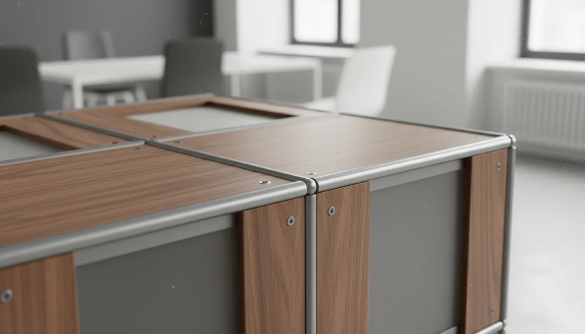
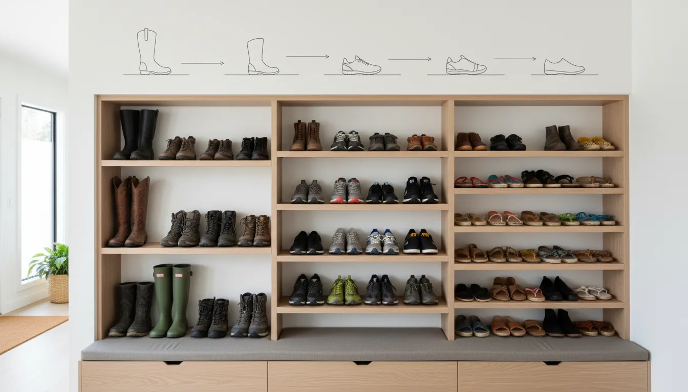
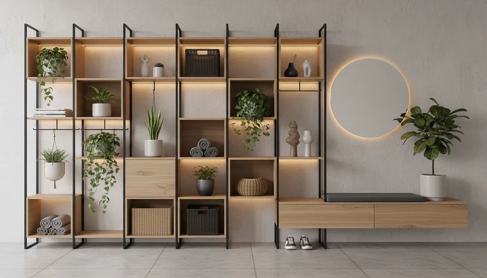

# Modular Shoe Storage Systems: Designing a Flexible Entryway Setup

The entryway is the handshake of the home. It is the first space that greets you upon arrival and the last thing you see before departing. Despite its prominence, this transitional zone often falls victim to the chaos of daily life. Piles of sneakers, scattered boots, and misplaced heels can quickly turn a welcoming foyer into a cluttered obstacle course. While traditional furniture offers static solutions, the modern home requires something more dynamic. Enter the modular shoe storage system—a design-forward approach to organization that prioritizes flexibility, scalability, and aesthetic cohesion.

Designing a functional entryway is not merely about buying a rack; it is about creating a system that adapts to the changing seasons, varying footwear collections, and the evolving needs of a household. Modular systems bridge the gap between custom built-ins and temporary, flimsy organizers. They offer the structural integrity of permanent furniture with the versatility of a custom setup.

This comprehensive guide explores the architectural and practical benefits of modular shoe storage. We will delve into how to assess your spatial requirements, select the right materials, and configure a layout that maximizes both vertical and horizontal space. By the end of this article, you will be equipped to design an entryway that is as resilient as it is beautiful.

## The Philosophy of Modular Design

To understand why modular systems are superior for entryways, one must understand the core philosophy of modular design. At its heart, modularity is about breaking a complex system into smaller, interchangeable parts. In the context of home organization, this means utilizing standardized units—cubes, shelves, drawers, and racks—that can be combined in infinite configurations.

Unlike a fixed cabinet, a modular system grows with you. If you move to a new home with a different floor plan, the system can be reconfigured to fit. If your shoe collection expands, or if a new family member moves in, you can simply add more modules rather than replacing the entire unit. This inherent sustainability makes modular storage a smart long-term investment.

### The Problem with Static Storage

Standard shoe racks generally suffer from rigid dimensions. A fixed three-tier rack might fit perfectly in your current apartment but look dwarfed and inadequate in a future home’s foyer. Furthermore, static furniture rarely utilizes vertical space efficiently. Most standard racks sit low to the ground, leaving three to four feet of wasted wall space above them.

Modular systems, conversely, encourage verticality. They allow homeowners to build upward, utilizing the "air rights" of a room to store seasonal items or less frequently worn footwear, keeping the floor clear for daily essentials.

## Assessing Your Entryway and Inventory

Before purchasing components, a strategic assessment of your physical space and your inventory is crucial. A successful design relies on accurate data regarding what needs to be stored and the dimensions of the area available.

### Calculating Footwear Volume

Begin by conducting a thorough audit of the household's footwear. Categorize the shoes into three distinct groups:

1.  **Daily Drivers**: Shoes worn several times a week (sneakers, work shoes, school shoes).
2.  **Seasonal**: Heavy winter boots or light summer sandals that are only relevant for part of the year.
3.  **Occasional**: Formal wear, specialized athletic gear, or guest slippers.

This audit dictates the layout of your modules. Daily drivers require open, easily accessible shelves at mid-height. Seasonal items can be stored in closed bins or on higher shelves. Occasional footwear can be relegated to the highest or lowest tiers.

### Measuring the Spatial Parameters

Measure your entryway with precision. Note the location of electrical outlets, light switches, and heating vents, as these will dictate where units can be placed. Pay special attention to:

*   **Depth**: Standard shoe storage requires a depth of at least 12 to 14 inches. If your hallway is narrow, look for slim-profile or tilt-out modular systems.
*   **Vertical Clearance**: Measure from the floor to the ceiling. High ceilings offer a prime opportunity for floor-to-ceiling shelving grids.
*   **Door Swing**: Ensure that the placement of the storage system does not interfere with the swing of the front door or any adjacent closet doors.

For those struggling with extremely tight quarters, consider reading our guide on [maximizing narrow hallway potential](/posts/maximizing-narrow-hallway-potential) to understand how depth perception impacts design.

## Types of Modular Shoe Storage Systems

The market offers a diverse array of modular architectures. Choosing the right type depends on your aesthetic preference and the specific durability requirements of your household.

### 1. Interlocking Cube Systems
Cube storage is perhaps the most recognizable form of modular furniture. These systems typically consist of square or rectangular cubbies that can be stacked and secured together. They are highly versatile; you can create a pyramid shape for an attic wall, a low bench configuration for under a window, or a tall tower for a narrow corner.

Cube systems are excellent for visual categorization. Each pair of shoes gets its own "home," which reduces piling and scuffing. For a cleaner look, fabric or wicker bins can be inserted into the cubes to hide visual clutter, a technique often used in [minimalist living room organization](/posts/minimalist-living-room-organization).

### 2. Wall-Mounted Track and Bracket Systems
For a more industrial or airy aesthetic, track systems are ideal. Vertical tracks are mounted to the wall studs, and brackets supporting shelves or shoe rails are clipped into the tracks. The height of the shelves is fully adjustable, allowing you to accommodate tall boots in winter and swap to tighter spacing for flats in summer without tools.

This style keeps the floor completely clear, which makes vacuuming easier and creates an illusion of more space—a critical tactic in smaller foyers.

### 3. Stackable Display Boxes
For the sneaker enthusiast or the collector, transparent, stackable drop-front boxes have become the gold standard. These rigid plastic or acrylic modules interlock vertically. The clear front allows for instant identification of footwear, turning the collection into a display piece rather than hidden clutter.

While less "furniture-like" than wood cabinetry, these systems offer the ultimate in modularity. You can build a wall of shoes as high or as wide as you like, one box at a time.

For those looking to start a collection of high-quality display modules, consider this top-rated option:
[https://www.amazon.com/s?k=drop+front+shoe+box+set&tag=hats0f8-20](https://www.amazon.com/s?k=drop+front+shoe+box+set&tag=hats0f8-20)

## Material Selection: Durability Meets Design

The entryway is a high-traffic zone subject to moisture, mud, and grit. The material of your modular system must withstand these elements while maintaining its appearance.

### Engineered Wood and Laminate
Most affordable modular systems are constructed from particleboard or MDF covered in a laminate finish. While cost-effective, these materials are susceptible to water damage. If wet boots are placed directly on a laminate shelf, the material can swell and warp over time.
*   **Pro Tip**: If choosing laminate, ensure the edges are sealed with high-quality PVC banding. Use plastic trays or mats inside the cubbies to catch water runoff.

### Metal and Wire
Metal systems, often powder-coated to prevent rust, are incredibly durable. They are impervious to moisture and easy to clean. Wire grids allow for airflow, which helps dry out damp shoes and prevents odors from becoming trapped. However, wire shelving can allow dirt from shoes on the top rack to fall into the shoes on the bottom rack. Solid liners are recommended for wire shelves.

For a robust, industrial-grade solution that can handle heavy winter gear, this heavy-duty option is highly recommended:
[https://www.amazon.com/s?k=heavy+duty+stackable+shoe+rack&tag=hats0f8-20](https://www.amazon.com/s?k=heavy+duty+stackable+shoe+rack&tag=hats0f8-20)

### Solid Wood
Solid wood offers unmatched beauty and longevity but comes with a higher price tag and weight. It adds warmth to the entryway and can be refinished if scratched. However, wood requires maintenance. It should be sealed with a polyurethane or wax finish to protect against moisture.

## Designing the Configuration: A Step-by-Step Guide

Once you have your measurements and materials selected, the design phase begins. This is where you balance the "Tetris" of storage with the principles of interior design.

### Step 1: Establish the "Drop Zone"
The entry is not just for shoes; it is a transition point for keys, mail, and bags. Integrate a flat surface module at waist height (approx. 30-36 inches). If your modular system allows, leave a gap in the vertical stacking to create a counter space. Alternatively, use the top of a low-profile shoe bench as a surface for a catch-all tray.

### Step 2: Incorporate Seating
Putting on shoes requires balance. Integrating a bench into your modular setup is a functional necessity for most households. Many modular systems offer reinforced low units specifically designed to double as seating. Place this section nearest to the door to encourage family members to sit and remove shoes immediately upon entry, rather than tracking dirt further into the home.

If your modular set doesn't include a dedicated bench, you can create a hybrid setup using a standalone bench with modular storage flanking it.
[https://www.amazon.com/s?k=modular+entryway+organizer+bench&tag=hats0f8-20](https://www.amazon.com/s?k=modular+entryway+organizer+bench&tag=hats0f8-20)

### Step 3: Vary the Heights
Avoid a monotonous grid. Configure your shelves to accommodate different shoe heights.
*   **Bottom Tier (18-20 inches)**: Reserve for tall boots.
*   **Middle Tiers (6-8 inches)**: Standard height for sneakers, loafers, and heels.
*   **Top Tiers**: Use for out-of-season storage bins or decorative elements.

### Step 4: Visual Weight and Balance
A wall of floor-to-ceiling storage can feel oppressive in a small hallway. To mitigate this, consider a stepped design. Build the modules higher in the corners and lower toward the center or the doorway. This "step-down" effect opens up the visual field and makes the room feel larger.

Incorporating open vs. closed storage is also vital for visual balance. Use closed doors or drawers for the lower third of the unit to hide the visual clutter of messy shoes. Use open shelving for the upper sections to display curated items or tidy bins. This anchors the unit visually while keeping the top looking airy.

## Installation Best Practices

Modular implies flexibility, but once installed, safety is paramount. Tall, narrow furniture is prone to tipping, especially when loaded with heavy items or in homes with children.

### Anchoring is Mandatory
Regardless of how stable a tower feels, it must be anchored to the wall. Locate the studs using a stud finder. Use L-brackets or furniture straps to secure the top of the highest modules to the wall. If you have baseboards that prevent the unit from sitting flush against the wall, you may need to shim the bottom or cut away a section of the baseboard for a built-in look.

### Leveling the Foundation
Floors are rarely perfectly level. If your base modules are uneven, the entire stack will lean, and doors (if equipped) will not close properly. Use a spirit level during the installation of the base layer. Most high-quality modular systems come with adjustable feet. Adjust these until the base is perfectly level before stacking subsequent layers.

### Connecting the Modules
Don't rely on gravity to hold stacked units together. Use the provided connecting hardware—usually dowels, mending plates, or binding screws. This unifies the individual boxes into a monolithic structure, increasing its overall load-bearing capacity and stability.

## Styling Your Entryway Storage

Functionality is the priority, but aesthetics determine how the space feels. A modular shoe system can be a stylish focal point if treated like a piece of curated furniture.

### Lighting the Way
Poor lighting makes finding shoes frustrating. If your modular system has overhangs, consider installing LED strip lights or puck lights under the shelves. Battery-operated, motion-sensor options are excellent for entryways, illuminating the shelves automatically when you reach for a pair of shoes.

### The Power of Baskets and Bins
Uniformity creates calm. If you have loose items like flip-flops, shoe polish, or laces, contain them in matching baskets that fit the module dimensions. Natural textures like seagrass or felt add warmth and contrast to the sleek lines of manufactured modular units.

### Decorative Integration
Do not fill every single cubby with shoes. Leave a few modules open—particularly at eye level—for decorative objects. A potted plant, a framed photo, or a small sculpture breaks up the repetition of the grid and personalizes the space. This integration transforms a "storage locker" look into a designed vignette.

## Maintenance and Seasonal Rotation

The beauty of a modular system lies in its adaptability, but maintaining an organized entryway requires a routine.

### The Seasonal Shift
Twice a year, perform a major rotation. In late spring, move heavy boots to the top, hard-to-reach modules (or to deep storage elsewhere) and bring sandals and running shoes to the prime "reach zone." Clean the empty shelves thoroughly before repopulating them. This prevents salt, sand, and mud from accumulating and damaging the finish.

### Odor Control
Shoe storage can become stale. Incorporate odor-absorbing elements into your design. Small sachets of cedar or charcoal bags can be tucked discreetly into the back of deep cubbies. If using closed cabinets, ensure the doors have louvers or ventilation gaps to promote air circulation.

## Troubleshooting Common Issues

**The "Too Deep" Dilemma**: Standard cabinets are often 12-15 inches deep, but some hallways are narrower.
*   *Solution*: Opt for modules that store shoes at an angle or vertically (tip-out drawers). This reduces the cabinet depth to as little as 6-8 inches while still accommodating adult-sized shoes.

**The "Visual Clutter" Overload**: Even organized shoes can look busy if there are too many colors and styles visible.
*   *Solution*: Implement a "one-in, one-out" rule for the entryway. Only keep currently used shoes in the modular system. Overflow should go to bedroom closets. Alternatively, install doors on the busiest sections of the modular unit.

**The "Growth" Spurt**: You’ve run out of space.
*   *Solution*: This is where modularity shines. Look for "bridge" units that can connect two towers over a door frame, utilizing the dead space above the doorway.

## Conclusion: Building for the Future

Designing a flexible entryway setup with modular shoe storage is an exercise in foresight. It requires looking beyond the immediate mess on the floor and envisioning a system that serves your lifestyle. By choosing components that can be reconfigured, expanded, and customized, you are investing in a solution that remains relevant regardless of how your footwear collection—or your family—changes.

The entryway sets the tone for the entire home. A disorganized pile of shoes signals chaos, while a structured, tailored system signals calm and order. Whether you opt for industrial wire grids, sleek acrylic boxes, or warm wood cubbies, the principles remain the same: assess your needs, maximize vertical space, and anchor your design in functionality. With the right modular system, you can reclaim your entryway, turning a high-traffic bottleneck into a seamless, welcoming transition into your sanctuary.

To further enhance your home's organization beyond the entryway, consider exploring our guide on [efficient garage storage layouts](/posts/efficient-garage-storage-layouts) for managing overflow and sports equipment.