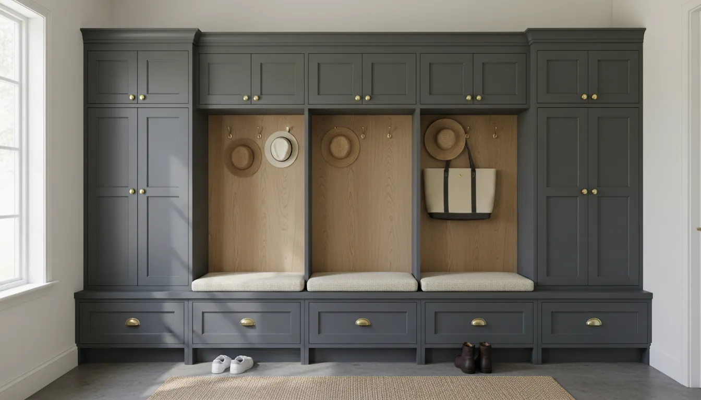
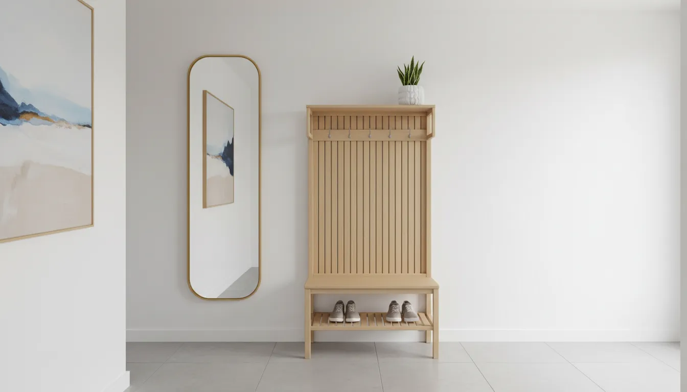
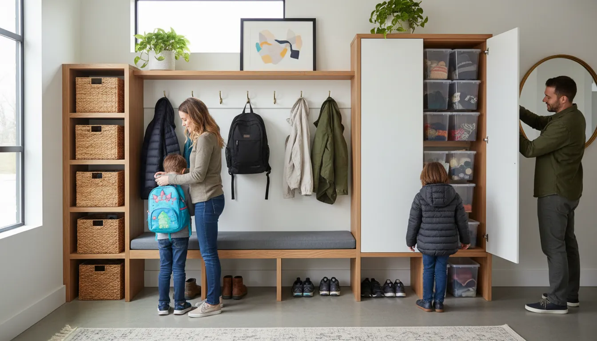

# Mudroom Lockers vs. Hall Trees: Which Entryway Storage Solution is Right for You?

The entryway is the handshake of the home. It is the first space that greets you after a long day and the last space you see before rushing out into the world. Despite its transitional nature, this area often falls victim to the accumulation of daily life: scattered shoes, piles of mail, wayward backpacks, and coats draped over banisters. This phenomenon, often referred to as "entryway drop zone clutter," can create a subconscious sense of chaos the moment you step through the door.

To combat this, homeowners and interior designers alike turn to dedicated storage furniture. While there are myriad options available, the debate typically narrows down to two heavyweights of home organization: the substantial, built-in mudroom locker and the versatile, freestanding hall tree.

Choosing between these two is not merely a matter of aesthetics; it is a decision that involves analyzing your available square footage, your family's lifestyle habits, your budget, and the architectural limitations of your home. In this comprehensive guide, we will dissect the functional and stylistic differences between mudroom lockers and hall trees to help you determine which vessel of organization will best serve your household.

## Defining the Contenders

Before diving into the comparative analysis, it is essential to establish exactly what characterizes these two distinct storage solutions. While they share a common goal—organizing your entrance—they achieve it through vastly different structural means.

### The Mudroom Locker System
Mudroom lockers are generally substantial, often floor-to-ceiling units that mimic the compartmentalized storage found in schools or athletic facilities, but with a refined, residential finish. They are frequently built-in or designed to look built-in, anchored permanently to the wall. The hallmark of a locker system is the "cubby" philosophy: a vertical section dedicated to a single family member, often featuring hooks for coats, a bench for putting on shoes, upper storage for off-season items, and frequently, doors to conceal the contents.

### The Hall Tree
The hall tree is a piece of freestanding furniture. Historically, it began as a simple stand for hats and coats, but modern iterations have evolved into comprehensive storage units that include a bench, hooks, and sometimes shelving or drawers. Unlike lockers, hall trees are portable. They do not require professional installation or permanent wall anchoring (though anchoring for safety is always recommended). They are the "plug-and-play" solution of the entryway world.

## The Mudroom Locker: A Deep Dive

Mudroom lockers are often considered the gold standard for large families or homes with a dedicated mudroom entrance (typically off the garage or side door). They offer a level of organization that is difficult to replicate with other furniture.

### The Pros of Mudroom Lockers

**1. Superior Concealment**
One of the primary advantages of a high-end locker system is the ability to hide clutter. Many locker designs incorporate cabinet doors or drawers. This means that bulky winter coats, brightly colored backpacks, and mud-caked boots can be tucked away behind closed doors. This creates a serene, minimalist visual aesthetic even if the interior of the locker is disorganized.

**2. Personalized Zones**
Lockers excel in creating accountability. By assigning a specific vertical bay to each family member, you create a designated "home" for their belongings. This is particularly effective for families with school-aged children. When a child knows exactly where their backpack and cleats belong, the likelihood of those items ending up on the kitchen island decreases significantly.

**3. Vertical Space Utilization**
Because mudroom lockers are often custom or semi-custom, they can be designed to reach the ceiling. This maximizes vertical storage, allowing you to utilize the often-wasted space near the top of the room for items that are rarely used, such as off-season decor, winter blankets, or camping gear.

**4. Increased Home Value**
Well-executed built-ins are generally viewed as an asset during a real estate transaction. A custom mudroom locker system is considered a permanent fixture and can add a sense of luxury and thoughtfulness to the home's design, potentially increasing resale value.

### The Cons of Mudroom Lockers

**1. Cost Prohibitive**
Custom cabinetry is expensive. Between materials and labor for installation, a full wall of mudroom lockers can easily run into the thousands of dollars. Even modular systems purchased from retailers require a significant investment compared to freestanding furniture.

**2. Permanence and Inflexibility**
Once installed, lockers are difficult to move. If you decide to reconfigure your home or if you move to a new house, you cannot take the investment with you. Furthermore, if your storage needs change drastically, altering the structure of built-in lockers is a renovation project, not a quick adjustment.

**3. Space Requirements**
Lockers are bulky. They require significant depth (usually 18 to 24 inches) and wall width. Installing lockers in a narrow hallway or a small foyer can make the space feel claustrophobic and impede traffic flow.

## The Hall Tree: A Deep Dive

The hall tree is the agile cousin of the locker system. It offers significant functionality without the commitment of construction, making it a favorite for apartments, condos, and homes with smaller entryways.

### The Pros of Hall Trees

**1. Versatility and Portability**
The greatest strength of the hall tree is its flexibility. It is a piece of furniture, not a fixture. If you rearrange your living room and want to move the hall tree to a different wall, you can do so in minutes. If you move to a new home, the hall tree comes with you.

**2. Budget-Friendly**
You can find high-quality hall trees at a fraction of the cost of built-in cabinetry. This allows homeowners to achieve organization on a budget, leaving funds available for other home improvement projects.

For those looking for a robust yet stylish option, consider this freestanding solution that mimics the look of built-ins:
[Check Price on Amazon: Industrial Hall Tree with Bench and Shoe Storage](https://www.amazon.com/s?k=Industrial+Hall+Tree+with+Bench+and+Shoe+Storage&tag=hats0f8-20)

**3. Compact Footprint**
Hall trees are generally designed to be slimmer and less obtrusive than lockers. Many models are designed specifically for corners or narrow hallways, offering hooks and a bench without protruding too far into the walking path. This makes them the ideal solution for [optimizing small entryways](/posts/optimizing-small-entryways-for-maximum-storage).

**4. Open and Airy Aesthetic**
Because they rarely feature full doors or heavy side panels, hall trees maintain an open visual line. This can prevent a small entryway from feeling closed in or dark. The open structure allows light to pass through and keeps the area feeling spacious.

### The Cons of Hall Trees

**1. Visual Clutter**
The "open" nature of a hall tree is a double-edged sword. Everything you store on it is visible. If you have mismatched coats, overflowing scarves, or cluttered shoe racks, the hall tree can look messy. It requires a certain level of discipline to keep it looking tidy.

**2. Limited Capacity**
A standard hall tree generally has fewer hooks and less weight capacity than a built-in locker system. It may struggle to hold the full winter arsenal of a family of five. It is best suited for "current rotation" items rather than bulk storage.

## Comparative Analysis: Head-to-Head

To help clarify the decision, let us compare these two solutions across five critical categories: Space, Cost, Installation, Durability, and Style.

### 1. Spatial Dynamics
The most immediate constraint in any home is space. Mudroom lockers demand a dedicated wall. Ideally, you need a recessed niche or a wide expanse of wall in a mudroom or large laundry room. Standard lockers are deep; if placed in a narrow corridor, they will encroach upon the walkway, creating a "pinch point" that makes the home feel smaller.

Hall trees, conversely, are spatially forgiving. They are available in various widths, from 24 inches to over 60 inches. Their depth is usually shallower, around 16 to 18 inches. If your entryway opens directly into a living area or is merely a hallway, a hall tree is almost always the superior choice for preserving flow.

### 2. The Financial Investment
There is no contest regarding initial outlay: hall trees are cheaper. A high-end hall tree might cost \$500 to \$1000, while a custom locker system starts in the thousands. However, one must consider the Return on Investment (ROI).

If this is your "forever home," the investment in lockers may pay dividends in daily satisfaction and long-term organization. If you are in a starter home or a rental, the hall tree is the financially prudent choice.

### 3. Installation and Complexity
Installing mudroom lockers is a project. It often involves finding studs, leveling heavy cabinets, installing trim or crown molding to close gaps, and painting. It is a [DIY project](/posts/diy-mudroom-bench-tutorial) for the advanced homeowner or a job for a contractor.

A hall tree requires assembly—typically an hour with a screwdriver and an Allen wrench. It is immediate gratification.

### 4. Durability and Longevity
Built-in lockers, when constructed from quality plywood or hardwoods, are incredibly durable. They are part of the house structure and can withstand years of heavy use.

Hall trees vary in quality. Many are made from particleboard or MDF (Medium Density Fiberboard). While sufficient for moderate use, they may not withstand the abuse of heavy school bags being thrown onto them daily for a decade. However, high-quality solid wood or metal hall trees are available and offer excellent durability.

For a durable option that blends metal and wood for longevity, this model is a strong contender:
[Check Price on Amazon: Solid Wood Entryway Hall Tree with Storage Bench](https://www.amazon.com/s?k=Solid+Wood+Entryway+Hall+Tree+with+Storage+Bench&tag=hats0f8-20)

### 5. Aesthetic Versatility
Lockers tend to lean towards a specific look: Farmhouse, Traditional, or Transitional. They are architectural in nature.

Hall trees are available in every conceivable style, from Mid-Century Modern to Industrial Pipe, Scandi-Minimalist to French Country. Because they are furniture, it is easier to find a piece that matches your existing decor without needing a custom build.

## Design Styles and Integration

Integrating storage into your home decor requires a keen eye for style. Here is how each option fares across popular design trends.

### Modern Farmhouse
This style practically invented the mudroom locker trend. Shiplap backings, wire baskets in cubbies, and matte black hooks are staples of this look. Both built-ins and rustic hall trees fit perfectly here.

### Industrial
Industrial design favors raw materials—metal, reclaimed wood, and exposed hardware. A custom locker system can be made industrial with metal mesh inserts in the doors, but hall trees naturally excel here. Many hall trees feature metal frames and distressed wood, fitting the industrial loft aesthetic effortlessly.

### Contemporary/Minimalist
Minimalism demands hidden storage. Therefore, a sleek, flat-front locker system with push-to-open doors (no handles) is the ultimate minimalist solution. It essentially becomes a wall. A hall tree, with its exposed coats, can disrupt the clean lines of a minimalist space unless it is kept rigorously empty.

### Traditional
Traditional homes benefit from the architectural weight of built-ins. Lockers with crown molding, raised panel doors, and rich wood stains or classic white paint complement the detailed trim work found in traditional architecture.

## The Hybrid Approach: The "Faux" Built-In

For those who desire the look of lockers but have the budget of a hall tree, there is a middle ground: the modular "faux" built-in.

This involves purchasing multiple matching tall hall trees or wardrobes (like the famous IKEA Pax or Billy hacks) and placing them side-by-side. By adding trim pieces to cover the gaps and installing baseboards across the bottom, savvy DIYers can create the illusion of custom lockers.

This approach offers the storage capacity of lockers with a cost closer to hall trees. It allows for modularity; you can buy three units for a wide wall or two for a narrower space.

If you are attempting a modular look, starting with a wide, substantial unit is key:
[Check Price on Amazon: White Wide Hall Tree with Shaker Style Panels](https://www.amazon.com/s?k=White+Wide+Hall+Tree+with+Shaker+Style+Panels&tag=hats0f8-20)

## Decision Matrix: How to Choose

If you are still on the fence, use this checklist to guide your decision.

**Choose Mudroom Lockers IF:**
*   You own your home and plan to stay for 5+ years.
*   You have a dedicated mudroom or a wide entryway wall (at least 5-6 feet).
*   You have a large family with significant storage needs (sports gear, multiple coats per person).
*   You prefer to hide clutter behind doors.
*   You have a renovation budget of \$2,000+.
*   You want to increase the architectural value of your home.

**Choose a Hall Tree IF:**
*   You are renting or plan to move soon.
*   Your entryway is narrow, small, or opens directly into the living room.
*   You need an immediate storage solution (buy today, organize tomorrow).
*   Your budget is under \$1,000.
*   You prefer an open, airy look and trust yourself to keep it tidy.
*   You want the flexibility to rearrange your furniture later.

## Maximizing Functionality Regardless of Choice

Whether you select the permanence of lockers or the flexibility of a hall tree, the success of the system depends on how you organize it.

### The "One In, One Out" Rule
Entryway storage is prime real estate. It should not be a graveyard for coats you have not worn since 2018. Implement a seasonal rotation. In summer, heavy parkas move to the attic or bedroom closets, making room for rain jackets and beach bags.

### Baskets and Bins are Essential
Both lockers and hall trees benefit from secondary organizers. Use baskets on overhead shelves to corral loose items like gloves, hats, and scarves. Assign a basket to each family member to prevent mix-ups.

### Hook Height Matters
If you have young children, ensure there are hooks at their level. If a child cannot reach the hook, the coat will end up on the floor. Many hall trees have standard hook heights, while custom lockers allow you to install hooks at varying levels as your children grow.

### Shoe Management
Shoes are the primary source of entryway clutter. Lockers often have open cubbies at the bottom. Hall trees usually have a bench with a shelf underneath. Consider adding a boot tray for wet weather to protect the wood of your furniture or the paint of your lockers.

## Conclusion

The battle between mudroom lockers and hall trees is not about declaring a universal winner, but about finding the champion for your specific lifestyle.

Mudroom lockers offer a luxurious, high-capacity, and architectural solution that tames the chaos of large families and messy gears through concealment and structure. They are an investment in the home itself. Hall trees offer a stylish, flexible, and accessible solution that adapts to the changing needs of modern life and smaller spaces. They champion the spirit of versatility.

By honestly assessing your space, your budget, and your tolerance for visual clutter, you can select the storage solution that transforms your entryway from a chaotic drop zone into a welcoming, organized threshold. After all, coming home should feel like a relief, not a chore.