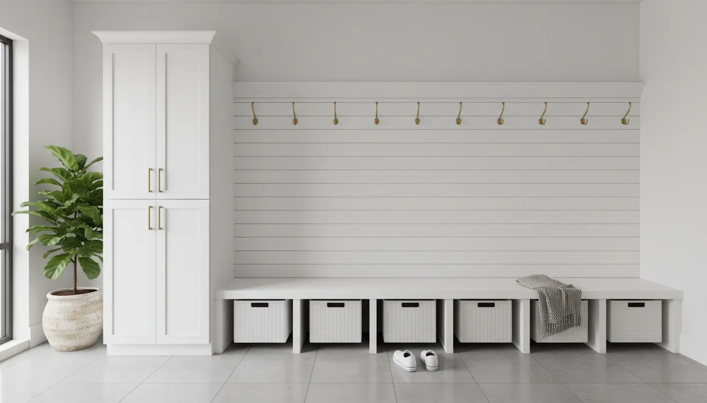
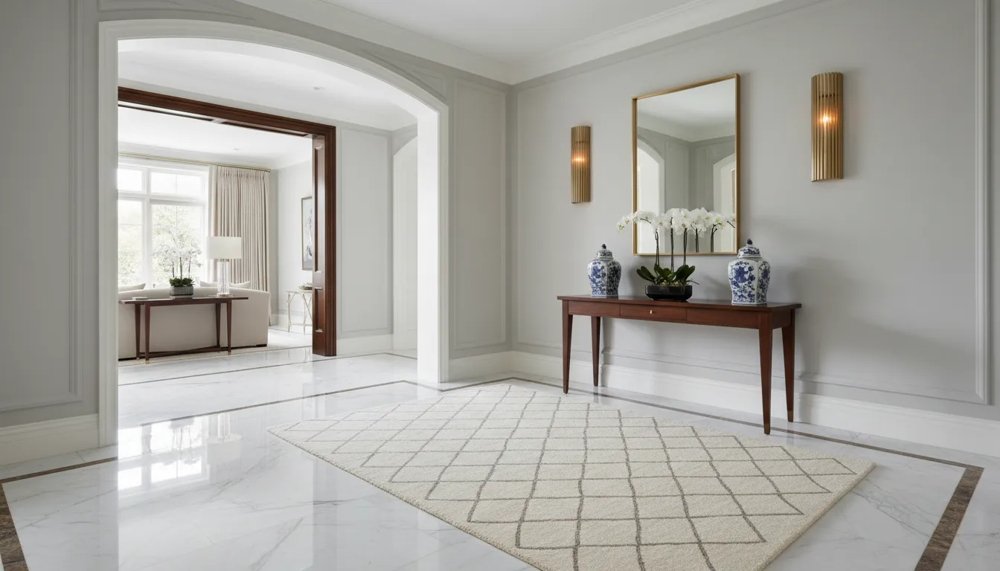
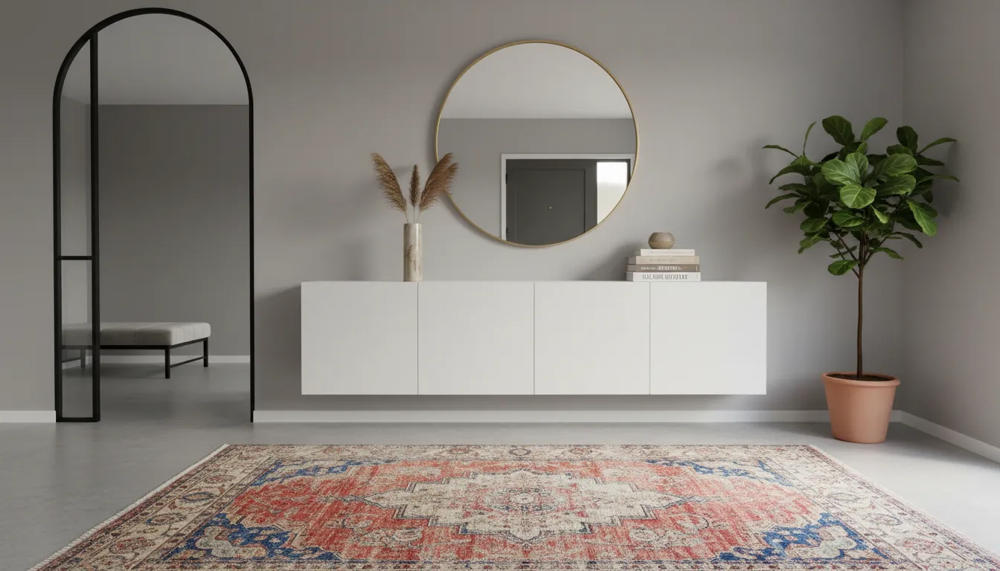

# Mudroom Shoe Storage vs. Formal Entryway: Choosing the Right Solution

The entrance of a home is a complex architectural feature. It serves as the handshake of your residence—the first impression guests receive—while simultaneously acting as the primary defense against the chaos of the outside world. This duality creates a design tension that many homeowners struggle to resolve: the conflict between the utilitarian mudroom and the aesthetic formal entryway.

Choosing between a robust mudroom shoe storage system and a refined, formal foyer is not merely a matter of taste; it is a fundamental decision about lifestyle, climate, and traffic flow. A miscalculation here results in either a beautiful space cluttered with muddy boots or a highly functional room that feels industrial and unwelcoming.

This comprehensive guide explores the nuances of both approaches, helping you diagnose your specific needs and implement a solution that brings order and beauty to your threshold.

## Defining the Contenders: Utility vs. Reception

Before selecting a storage strategy, one must understand the distinct architectural and functional purposes of these two spaces. While modern open-concept homes often blur these lines, the core philosophy of each remains distinct.

### The Mudroom: The Workhorse of the Home
A mudroom is designed for transition. Its primary function is containment. It is the zone where the wet, the dirty, and the bulky items from the outdoors are stripped away before entering the sanctuary of the living space. In a dedicated mudroom, function dictates form. The aesthetic is often rugged, durable, and capacity-focused.

The hallmark of a mudroom is visible accessibility. Open cubbies, hooks, and bench seating characterize this style because the user experience focuses on speed and volume. It is about getting the kids out the door in the morning and getting the groceries in at night without tripping over footwear.

### The Formal Entryway: The Art of Arrival
Conversely, the formal entryway, or foyer, is designed for reception. Its primary function is presentation. This space sets the tonal expectations for the rest of the home. It is characterized by airiness, curated decor, and minimal visual clutter. 

In a formal entryway, storage is generally secondary and almost always concealed. The presence of shoes is discouraged, or at the very least, hidden entirely from view. The furniture tends to be decorative—console tables, mirrors, and statement lighting—rather than purely functional.

## The Case for Mudroom Shoe Storage: Managing High Traffic

If your household includes children, pets, or outdoor enthusiasts, or if you reside in a climate with four distinct seasons, the mudroom approach is often a necessity rather than a choice. The volume of footwear generated by an active family cannot be accommodated by a slender console table.

### Cubbies and Lockers
The most efficient way to manage shoe volume in a mudroom setup is through vertical compartmentalization. Floor space is finite; wall space is abundant.

*   **Individual Lockers:** Assigning a specific vertical zone to each family member reduces cross-contamination of clutter. A locker system typically includes a lower cubby for shoes, a middle section for coats, and upper storage for off-season items.
*   **Open Shelving:** While less tidy than closed cabinetry, open shelving encourages usage. When children can easily slide their sneakers into a designated slot, compliance with organizational systems increases.

### The Importance of the Bench
A mudroom without seating is fundamentally flawed. The act of putting on and removing shoes requires stability. A robust bench with integrated storage underneath maximizes the footprint. This area is ideal for heavy boots that might not fit into standard shelves.

For those looking to retrofit an existing space into a functional mudroom, investing in a substantial storage bench is the first step. Look for units with reinforced lids or open lower tiers that allow damp soles to dry.

To start building a functional transition zone, consider robust furniture that can handle weight and wear.
[Check out this Entryway Bench With Shoe Storage on Amazon](https://www.amazon.com/s?k=Entryway+Bench+With+Shoe+Storage&tag=hats0f8-20)

### Flooring and Durability Considerations
In a mudroom scenario, the floor is part of the storage solution. It must withstand grit, moisture, and road salt. Durable materials like slate, porcelain tile, or sealed concrete are superior to hardwood. Furthermore, using boot trays (often copper or heavy-duty rubber) is essential to define the "wet zone" and protect the flooring integrity.

## The Elegance of the Formal Entryway: Curating the First Impression

For homes where the front door opens directly into the living room, or for households with lower foot traffic, the formal entryway approach preserves the visual flow of the interior design. The challenge here is not *capacity*, but *concealment*.

### The Console Table Strategy
The centerpiece of a formal entryway is typically a console table. To maintain a formal aesthetic while acknowledging the reality that people wear shoes, one must be strategic.

*   **Open Space Underneath:** A console with long legs keeps the space feeling open. However, placing a pair of high-quality, opaque woven baskets underneath provides a discreet place to tuck away guest slippers or the homeowner's current daily shoes.
*   **Drawers are Key:** Ensure your console has drawers to hide keys, mail, and sunglasses, preventing surface clutter that ruins the formal vibe.

### Hidden Storage Innovations
The formal entryway cannot support a pile of sneakers. Therefore, storage furniture must disguise itself as decor. 

*   **Tilt-Out Cabinets:** These are the secret weapon of the formal foyer. They appear to be shallow sideboards or consoles, but the drawers tilt outward to hold shoes vertically. This reduces the depth required for the furniture, keeping the walkway clear while hiding up to 12 pairs of shoes behind a sleek facade.
*   **Armoires:** If space permits, a closed armoire or tall cabinet can act as a coat and shoe closet. The key is that the doors remain solid—no glass—to mask the contents.

For a solution that blends seamlessly with upscale decor while hiding footwear, tilt-out mechanisms are superior.
[Explore Tilt Out Shoe Cabinets on Amazon](https://www.amazon.com/s?k=Tilt+Out+Shoe+Cabinet&tag=hats0f8-20)

## Assessing Your Architecture and Lifestyle

Choosing between these two paths requires a realistic assessment of your living situation. It is not enough to want a formal entryway; your architecture must support it.

### 1. The Architectural Layout
Does your home have a secondary entrance?
*   **Yes (Garage or Side Door):** This is the ideal scenario. You can treat the secondary entrance as a dedicated mudroom with heavy-duty storage, allowing the front door to remain a pristine, formal entryway.
*   **No (Single Entrance):** You are forced into a hybrid model. If your front door is the only way in, you cannot opt for a purely formal look without sacrificing functionality. You will need to incorporate mudroom features disguised with formal finishes.

### 2. Climate Factors
*   **Wet Climates (Pacific Northwest, Northeast):** A formal entryway with hardwood floors and no boot storage is a recipe for disaster. The "mudroom" philosophy must take precedence to protect your home’s structure.
*   **Dry Climates (Southwest):** You have more flexibility. Without the threat of mud and snow, you can prioritize aesthetics and use lighter, open storage solutions.

### 3. Family Demographics
Toddlers and teenagers are rarely compatible with the "minimalist formal foyer" concept. If you have children, open storage (like baskets or cubbies) is vastly more successful than storage requiring hangers or doors. Children generally follow the path of least resistance; make putting shoes away easier than leaving them on the floor.

## The Hybrid Solution: The "Hidden" Mudroom

For many, the reality lies between the two extremes. You may have one entrance that opens into a living space, yet you have the storage needs of a large family. This requires a "Hybrid Entryway."

The goal of the hybrid is to provide the volume of a mudroom with the finishings of a formal foyer.

### Built-in Cabinetry
The most effective way to achieve this is through custom or semi-custom built-ins. Floor-to-ceiling cabinetry painted in the same trim color as the rest of the room helps the storage recede visually. 
*   **The Look:** Crown molding and high-end hardware give the appearance of architectural paneling.
*   **The Function:** Inside, you have adjustable shelves for shoes, hooks for backpacks, and dedicated bins for accessories.

### The "landing Strip" Concept
In a hybrid setup, establish a strict "landing strip." This is a durable runner rug that directs traffic. It protects the floor and visually designates the area where shoes are permitted. Once off the rug, shoes must be off the feet.

This requires selecting a rug that looks sophisticated but washes easily.
[Find Washable Entryway Runner Rugs on Amazon](https://www.amazon.com/s?k=Washable+Entryway+Runner+Rug&tag=hats0f8-20)

### Decorative Baskets
Baskets are the bridge between formal and functional. Natural textures like seagrass, rattan, or wicker add warmth to a formal space while obscuring the colorful chaos of athletic shoes. In a hybrid entryway, place a row of uniform baskets beneath a floating bench. This mimics the utility of mudroom cubbies but looks like a design choice from a high-end catalog.

For more ideas on managing clutter in tight areas, read our guide on [maximizing vertical storage](/posts/maximizing-vertical-storage-small-spaces).

## Material Selection: Durability Meets Design

Whether you choose a mudroom, a formal entryway, or a hybrid, the materials you select determine the longevity of the project.

### Mudroom Materials
*   **Flooring:** Porcelain tile (wood-look or stone-look) is impervious to water and easy to sanitize. Slate provides excellent traction but requires sealing.
*   **Joinery:** Melamine or high-gloss paint finishes are preferred for cubbies as they are easy to wipe down and resist scuffs from rubber soles.

### Formal Entryway Materials
*   **Flooring:** Hardwood is standard, often laid in a pattern like herringbone to denote importance. If using stone, marble or limestone adds elegance but requires maintenance.
*   **Joinery:** Natural wood veneers, glass, and metals (brass, iron) dominate this style.

## Organizational Habits to Maintain the Look

Regardless of the furniture you buy, storage is a system, not just a product. Behavioral habits are the software that runs the hardware of your entryway.

### The "One In, One Out" Rule
Entryways often become graveyards for shoes that are rarely worn. Implement a strict policy: only "active" shoes live in the entryway. 
*   **Daily Rotation:** Slippers, one pair of work shoes, and one pair of gym shoes per person.
*   **Deep Storage:** Dress shoes, seasonal boots, and specialty footwear should be stored in bedroom closets, not the prime real estate of the entry.

### Seasonal Rotation
For the hybrid or formal entryway to function, you must embrace seasonal rotation. In April, the heavy winter boots must be moved to long-term storage (garage or basement) to make room for sandals and rain boots. This keeps the volume manageable and prevents the entryway from overflowing.

### The Sunday Reset
Designate a time each week—Sunday evening is ideal—to reset the space. Clear out the accumulation of mail, return stray shoes to bedrooms, and shake out the mats. No storage solution, no matter how expensive, is self-cleaning.

## Conclusion: Making the Final Decision

The choice between mudroom shoe storage and a formal entryway is ultimately a negotiation between your ideals and your reality. 

If you have a dedicated back entrance or a garage entry, you have the luxury of separating these functions. Create a rugged, high-capacity mudroom at the family entrance, and curate a stunning, minimalist formal foyer at the front door.

However, if you are working with a single entrance, the Hybrid approach is the most sustainable path. By utilizing tilt-out cabinets, enclosed floor-to-ceiling joinery, and strategic decor, you can mask the utility of a mudroom behind the mask of a formal entryway.

Do not force a formal aesthetic on a family that needs a mudroom; you will only end up with a messy formal room. Conversely, do not install industrial lockers in a refined foyer if you only own three pairs of shoes. Listen to the architecture of your home and the rhythm of your life, and the right solution will reveal itself.