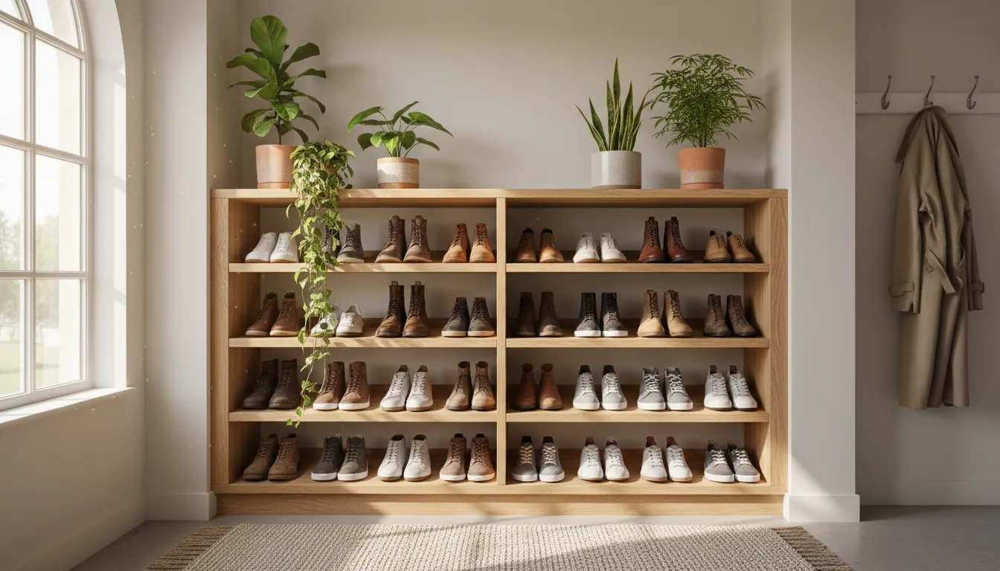
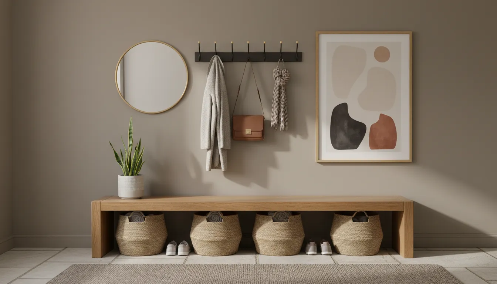

# Open vs. Closed Shoe Storage: Which is Best for Your Entryway Aesthetic?

The entryway is the handshake of the home. It is the transitional space that greets guests and welcomes you back after a long day. As the primary threshold between the public world and your private sanctuary, it sets the tone for the rest of your interior design. However, it is also a high-traffic utility zone that serves a critical function: the containment of shoes.

Footwear storage is often the Achilles' heel of entryway design. Without a deliberate strategy, piles of sneakers, boots, and heels can quickly create visual chaos, disrupting the serenity of your home environment. The fundamental dilemma facing homeowners and interior decorators alike is the choice between open and closed storage systems.

This is not merely a question of utility; it is a debate about philosophy, lifestyle, and aesthetic preference. Open storage celebrates the lived-in quality of a home, offering accessibility and an opportunity for curation. Closed storage, conversely, prioritizes visual silence, sleek lines, and the concealment of clutter. To determine which approach aligns best with your entryway aesthetic, we must delve deep into the mechanics, psychology, and design implications of both methods.

## The Psychology of the Entryway

Before selecting a piece of furniture, it is essential to understand the psychological impact of the entryway. In design theory, this space acts as a decompression zone. Ideally, it should facilitate a smooth transition from the chaotic energy of the outdoors to the calm of the indoors.

Clutter is a known stressor. Cognitive psychologists have established that visual disarray competes for our neural attention, increasing cortisol levels. Therefore, how you manage the accumulation of shoes directly influences your mood the moment you walk through the door.

However, "clutter" is subjective. For some, a row of neatly aligned, colorful sneakers is a collection to be admired—a reflection of personality. For others, anything less than a pristine, empty surface registers as mess. Your tolerance for visual noise and your daily habits will be the ultimate arbiters in the open versus closed debate.

## Open Shoe Storage: The Art of Curation

Open shoe storage refers to shelving units, racks, or benches where footwear remains visible. This category ranges from industrial metal racks to minimalist bamboo shelves and floating wall mounts. While often dismissed as the budget-friendly or temporary option, open storage has established itself as a legitimate stylistic choice in contemporary design, particularly within industrial, bohemian, and streetwear-centric aesthetics.

### The Aesthetic Case for Open Storage

Open storage forces a certain level of honesty. There is nowhere to hide. This can be a powerful design tool if you view your footwear as an extension of your decor. For fashion enthusiasts, a well-organized open rack serves as a gallery. High-top sneakers, designer heels, and well-worn leather boots can add texture, color, and personality to a neutral entryway.

In industrial lofts or modern farmhouses, open storage complements the architectural bones of the space. Metal piping, raw wood, and wire mesh align with a design language that celebrates mechanics and materials. It creates an atmosphere that feels casual, accessible, and grounded.

### The Functional Advantages

From a utilitarian perspective, open storage is superior in terms of ventilation. Shoes absorb moisture and odor during wear. Placing them immediately into a dark, enclosed cabinet can trap bacteria and inhibit drying. Open racks allow air to circulate freely around the footwear, extending the lifespan of the materials and maintaining a fresher environment.

Furthermore, open storage offers unparalleled accessibility. In a busy household with children or individuals constantly on the move, the barrier to entry is non-existent. There are no doors to open or drawers to pull; you simply kick off your shoes and place them on the rack. This ease of use often results in higher compliance among family members who might otherwise leave shoes strewn across the floor.

If you are looking for a robust solution that merges industrial aesthetics with durability, consider exploring heavy-duty metal options.

[Shop Industrial Shoe Racks on Amazon](https://www.amazon.com/s?k=industrial+shoe+rack&tag=hats0f8-20)

### The Downsides of Visibility

The primary drawback of open storage is visual noise. Unless you possess a highly curated collection of pristine footwear, the reality of open storage can be jarring. Muddy hiking boots, worn-out running shoes, and flip-flops rarely contribute positively to a sophisticated interior scheme.

Open storage also requires constant maintenance. The shoes themselves collect dust, as do the shelves. Without the protection of doors, the unit demands regular cleaning to prevent it from looking neglected. Additionally, this method offers no visual relief; if the rack is messy, the entire entryway feels messy.

## Closed Shoe Storage: The Architect of Calm

Closed shoe storage includes cabinets, tilt-out drawers, armoires, and benches with hinged lids. This approach aligns with the principles of minimalism and "visual silence." By concealing the utilitarian nature of the objects, closed storage allows the furniture piece itself to become the focal point, rather than its contents.

### The Aesthetic Case for Closed Storage

For those who prefer a polished, uncluttered look, closed storage is the undisputed champion. It allows you to maintain a consistent color palette and texture in your entryway without the interference of mismatched shoelaces and soles. A closed cabinet can mimic the elegance of a console table, providing a surface for styling vases, lamps, and catch-all trays while hiding the chaotic reality of daily life below.

This style is particularly effective in traditional, mid-century modern, and Scandinavian interiors. A sleek walnut cabinet or a white-lacquered tilt-out unit integrates seamlessly into the architecture of the room. It suggests that everything has a place, creating a sense of order and serenity essential for small spaces.

### The Functional Advantages

The greatest benefit of closed storage is protection—both for the shoes and the room's aesthetic. Shoes are shielded from sunlight, which can fade fabrics and crack leather over time. They are also protected from household dust and pet hair.

From a safety perspective, closed storage removes tripping hazards. By designating a specific, enclosed home for footwear, you clear the floor space, making the entryway safer and easier to navigate. Additionally, closed units often utilize vertical space more efficiently. Slim, tilt-out cabinets can hug the wall in narrow hallways where a deep open rack would protrude too far, obstructing the flow of traffic.

If you have a narrow hallway and need to maximize space while keeping a clean look, a tilt-out cabinet is often the gold standard for modern entryways.

[Shop Tilt-Out Shoe Cabinets on Amazon](https://www.amazon.com/s?k=tilt+out+shoe+cabinet&tag=hats0f8-20)

### The Downsides of Concealment

The "out of sight, out of mind" phenomenon is real. Shoes stored in closed cabinets are easier to forget, which can lead to hoarding unworn pairs. Furthermore, the lack of airflow can be problematic. If damp shoes are placed inside a closed cabinet, they can develop mold or unpleasant odors that permeate the wood or particleboard of the unit. High-quality closed storage often requires additional features like vented back panels or slatted doors to mitigate this issue.

Closed storage units are also typically more expensive and heavier than their open counterparts. They require assembly and, in the case of tall cabinets, must be anchored to the wall for safety, representing a more permanent commitment to a specific layout.

## Analyzing Your Entryway Constraints

Choosing between open and closed storage is not just a matter of taste; it is a matter of geometry and logistics. To make the right decision, you must audit your space and your lifestyle.

### 1. Spatial Dynamics
In a tight apartment hallway or a narrow foyer, every inch counts.
*   **Open Racks:** Often require more floor depth (12-14 inches) to accommodate the full length of a shoe. However, they feel visually lighter, which can prevent a small space from feeling claustrophobic.
*   **Closed Cabinets:** Tilt-out drawers are engineering marvels for small spaces, often requiring only 6-10 inches of depth. They utilize verticality, drawing the eye upward and leaving the floor clear.

For more ideas on managing tight quarters, you might find our guide on [Maximizing Vertical Space in Small Foyers](/posts/maximizing-vertical-space-in-small-foyers) particularly useful.

### 2. The Volume of Footwear
Be realistic about the number of shoes that live by the door.
*   **The Collector:** If you have 20+ pairs that need to stay in the entryway, a large open shelving unit is often the most space-efficient way to store high volumes.
*   **The Minimalist:** If you only keep 3-4 pairs in rotation, a small, discreet closed bench or floating cabinet is sufficient and maintains a cleaner look.

### 3. Household Demographics
*   **Children:** Kids are notoriously bad at opening doors, putting things away, and closing doors. Open baskets or low open shelves usually yield better success rates for family organization than complex cabinetry.
*   **Pets:** Puppies view open shoe racks as a buffet of chew toys. If you have pets that are prone to destruction, closed storage is mandatory for the preservation of your footwear.

## The Hybrid Approach: Best of Both Worlds

For many households, the binary choice between open and closed is too restrictive. The most successful entryway designs often employ a hybrid strategy that leverages the strengths of both systems.

### The Bench and Basket Method
A storage bench offers a seating area for putting on shoes—a functional necessity for many. Underneath the bench, you can utilize cubbies. To hide the visual clutter while maintaining accessibility, use woven baskets or fabric bins within the cubbies. This provides the "closed" look with the "open" ease of access.

### The Rotation System
Use a small, stylish open rack for "daily drivers"—the two or three pairs you wear constantly. Combine this with a larger, closed closet or cabinet (perhaps in a nearby mudroom or bedroom) for off-season storage. This keeps the entryway pristine without sacrificing daily convenience.

### The "Semi-Open" Slatted Design
Look for furniture with slatted wood doors or louvers. This style, often found in Mid-Century Modern or tropical aesthetics, provides the ventilation of open storage with the concealment of closed cabinetry. It filters the view of the contents, reducing visual noise without blocking airflow.

A versatile bench with hidden compartments can serve as the anchor of a hybrid system, providing seating and concealment simultaneously.

[Shop Storage Entryway Benches on Amazon](https://www.amazon.com/s?k=storage+entryway+bench&tag=hats0f8-20)

## Styling Your Choice: Integrating Storage into Decor

Once you have selected your mechanism, the challenge lies in integration. How do you make a shoe rack look like a deliberate design element rather than a utilitarian necessity?

### Styling Open Storage
*   **Uniformity is Key:** If the shoes are visible, try to group them by style or color. Placing all black boots on one shelf and white sneakers on another creates a sense of rhythm and intention.
*   **Breathing Room:** Do not overcrowd the shelves. Leave a few inches of space between pairs. Negative space implies luxury and order.
*   **Add Greenery:** Place a potted plant on the top shelf or beside the rack. The organic shape of leaves softens the rigid lines of shelves and draws the eye away from the shoes.
*   **Material Cohesion:** Match the material of the rack to other elements in the room. If you have a black metal mirror, a black metal shoe rack will feel cohesive.

### Styling Closed Storage
*   **The Surface Opportunity:** Treat the top of your shoe cabinet like a console table. Anchor it with a large round mirror or artwork. Add a tray for keys, a table lamp for ambient lighting, and a sculptural object.
*   **Hardware upgrades:** If you buy a flat-pack shoe cabinet, upgrade the knobs or pulls. Swapping generic hardware for brushed brass, leather pulls, or matte black handles can instantly elevate the piece to look custom-made.
*   **Lighting:** Consider adding an LED strip light underneath a floating cabinet. This creates a soft glow that enhances the modern aesthetic and serves as a nightlight.

## Material Matters: Durability and Aesthetics

The material of your storage unit dictates not just its look, but its longevity. The entryway is a high-impact zone, subject to wet umbrellas, muddy soles, and heavy bags.

**Wood and Engineered Wood:**
Solid wood (oak, teak, walnut) is durable and ages beautifully, fitting well with farmhouse, traditional, and mid-century styles. However, it is susceptible to water damage. If you choose wood, ensure it is sealed properly. Engineered wood (MDF) is common for painted cabinets but can swell if exposed to standing water from snowy boots.

**Metal:**
Powder-coated steel or iron is the champion of durability. It is impervious to water and easy to wipe down. Visually, it leans toward industrial, modern, or minimalist. Metal open racks often have a "lighter" visual footprint than chunky wooden ones.

**Bamboo:**
Bamboo is a sustainable, moisture-resistant option often used in spa-like or Scandi-style entryways. It is lightweight and naturally resists mold, making it an excellent choice for open shelving in humid climates.

**Plastic/Acrylic:**
Clear acrylic boxes are a trend in the sneakerhead community. They offer modular, stackable storage that turns shoes into a display. While visually striking and protective against dust, they can look clinical if not balanced with warmer textures like rugs or wood.

## Cleaning and Maintenance: The Unspoken Reality

Regardless of your choice, maintenance is unavoidable.

With **open storage**, you must commit to dusting the shelves weekly. You also need to be vigilant about the condition of the shoes themselves. A rack full of dirty shoes ruins the aesthetic. You may find yourself cleaning your shoes more often simply because they are on display.

With **closed storage**, the maintenance is internal. You must regularly wipe down the interior shelves to remove sand and dried mud. We recommend using shelf liners—easy to remove and wash—to protect the cabinet interior. You should also leave the cabinet doors open periodically (perhaps overnight) to ensure moisture evaporates fully.

## Conclusion: Making the Final Decision

The battle between open and closed shoe storage is ultimately a negotiation between your ideal self and your real self.

Choose **Open Storage** if:
*   You prioritize quick accessibility and airflow.
*   You have a curated collection of footwear you enjoy looking at.
*   You are working with a tight budget or an industrial aesthetic.
*   You are disciplined about keeping shelves tidy.

Choose **Closed Storage** if:
*   Visual calmness and minimalism are your top priorities.
*   You have pets or small children that interfere with open shelves.
*   You have a narrow space that benefits from slim, tilt-out designs.
*   You prefer to hide the wear and tear of daily footwear.

Your entryway sets the expectation for the rest of your home. Whether you choose the gallery-like display of open shelving or the architectural discretion of a closed cabinet, the goal remains the same: a clutter-free, welcoming transition that makes coming home a joy. By aligning your storage solution with your lifestyle habits and design preferences, you ensure that your entryway is not just a place to dump your shoes, but a sophisticated introduction to your sanctuary.

For further reading on organizing the rest of your home, explore our guide on [Seasonal Rotation Strategies for Closet Organization](/posts/seasonal-rotation-strategies-for-closet-organization).