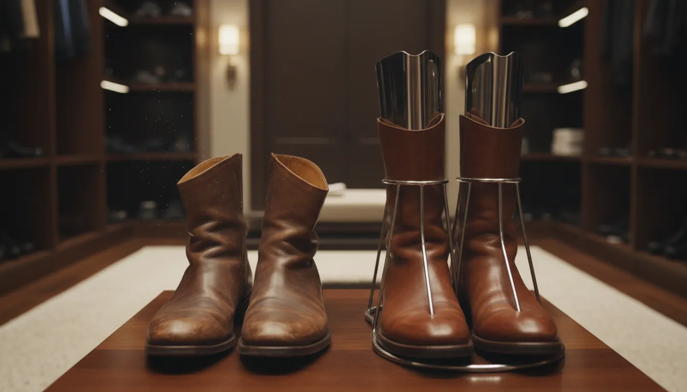
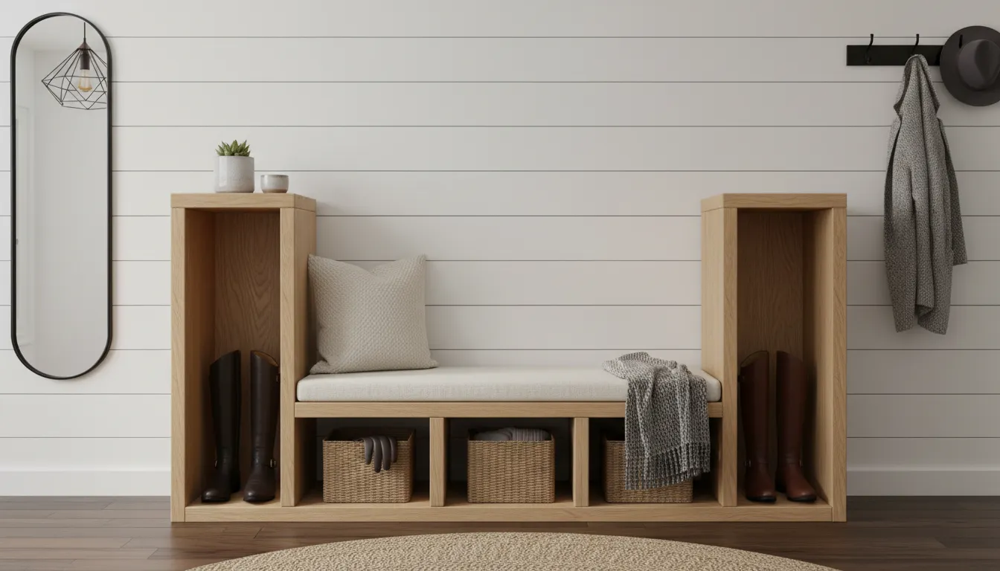
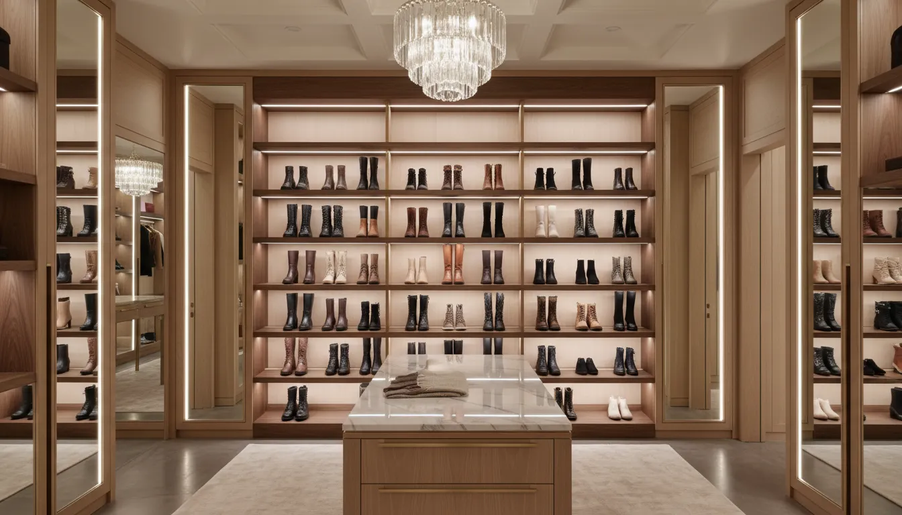

# Organizing Boots and Tall Footwear: Specialized Smart Shoe Storage Racks

For footwear enthusiasts and organization aficionados alike, tall boots present a unique challenge. Unlike sneakers or flats, which can be easily tucked into cubbies or stacked in clear boxes, boots require vertical clearance and structural support. Without proper storage, knee-high leather boots slouch, developing permanent creases and cracks that ruin the aesthetic and shorten the lifespan of the footwear. Furthermore, in the hallway or mudroom, a collection of toppling boots creates immediate visual clutter, disrupting the flow of your home entry.

The solution lies in moving beyond standard horizontal shelving. Specialized smart shoe storage racks designed specifically for tall footwear are essential for maintaining the integrity of your investment pieces while reclaiming floor space. This guide explores the most effective storage systems, from inverted rack technology to modular smart designs, ensuring your boots remain pristine and your home stays organized.

## The Structural Challenge of Tall Footwear

Before selecting a storage unit, it is critical to understand why standard shoe racks fail when it comes to boots. Most conventional shoe racks offer shelves with six to eight inches of vertical clearance. A standard riding boot or Wellington boot requires anywhere from 15 to 20 inches of vertical space. Consequently, homeowners are often forced to lay boots flat—which takes up considerable horizontal space—or fold the shafts over, which damages the material.

Leather is organic and porous; it needs to breathe, and it needs to hold its shape. When a boot shaft collapses, the leather fibers weaken at the fold point. Over time, this leads to flaking and cracking. Furthermore, the lack of air circulation inside the toe box of a collapsed boot creates a breeding ground for moisture and bacteria, particularly if the boots were worn in damp conditions.

Therefore, the criteria for a "smart" boot storage solution are threefold:
1.  **Vertical Accommodation:** It must support the full height of the shaft.
2.  **Shape Retention:** It must prevent the "slouch" effect.
3.  **Ventilation:** It must allow air to circulate through the interior of the footwear.

## Inverted Boot Racks: The Ergonomic Gold Standard

One of the most effective ways to store boots is essentially upside down. Inverted boot racks feature vertical dowels or shaped prongs that fit inside the boot, suspending it by the foot bed or supporting the shaft from the inside.

### The Benefits of Inversion
Gravity is often the enemy of tall footwear, but inverted racks use gravity to your advantage. By placing the boot upside down, the shaft hangs straight naturally, eliminating the need for stuffing or external shapers. This method also prevents dust from settling inside the footbed, which is a common issue with open-top storage in closets or mudrooms.

From a preservation standpoint, this is ideal for drying. If you have been walking in snow or rain, inverting the boot allows moisture to drain away from the delicate insoles and encourages rapid air drying, preventing mold growth.

### Material Selection
When choosing an inverted rack, consider the material carefully.
*   **Finished Wood:** Ideal for indoor closets and dressing rooms. Cedar is particularly beneficial as it naturally repels moths and absorbs excess moisture.
*   **Powder-Coated Metal:** Best for mudrooms and garages. It is durable, easy to clean, and resistant to rust, making it suitable for heavy-duty rain boots and work boots.

For a robust solution that can handle heavy winter gear, consider heavy-duty vertical organizers.

[Check out Vertical Boot Storage Racks on Amazon](https://www.amazon.com/s?k=vertical+boot+rack&tag=hats0f8-20)

## Hanging Solutions for Closet Organization

For those with limited floor space, the vertical volume of a closet is often underutilized. Hanging boot storage moves the footwear off the floor entirely, creating a streamlined look similar to a clothing rail.

### The Boot File System
A "boot file" or hanging rod system allows you to organize boots in a linear fashion. This typically involves using specialized hangers with clips or inserts that grip the boot shafts.

**Cautionary Note on Clips:** While hanging is space-efficient, one must be wary of tension clips. Strong metal clips can leave indentations on soft calfskin or suede. To mitigate this, look for hangers with rubberized tips or protective felt padding. Alternatively, use hanging shapers that hook onto the rail and expand inside the boot shaft, holding it by friction rather than compression.

This method is excellent for visual indexing. You can see every pair clearly, making morning selection effortless. For a cohesive aesthetic, organize by color or height—ankle boots on one side, transitioning to over-the-knee styles on the other.

If you are looking to redesign your entire closet system to accommodate these changes, you might find our guide on [entryway closet renovations](/posts/entryway-closet-makeover-ideas) helpful for structural inspiration.

## Floor-Standing Specialized Racks

In the entryway or foyer, the storage solution is as much a piece of furniture as it is a functional tool. Here, aesthetics play a pivotal role. A floor-standing rack designed for tall footwear often combines a bench or tabletop surface with specialized lower compartments.

### The Hybrid Bench
A hybrid bench is perhaps the most popular "smart" furniture choice for mixed-use spaces. These units typically feature a tall, open compartment on one side for boots and smaller cubbies on the other for shoes. The advantage here is the seating provided for putting on and taking off tight footwear.

When sourcing a floor-standing unit, measure the compartment height carefully. Ensure there is at least 18 inches of clearance for standard knee-high boots. Adjustable shelving is a feature to prioritize; it allows you to customize the rack as your footwear collection evolves.

## Smart and Modular Technology

The term "smart storage" has evolved to include modularity and mechanical assistance. While we may not yet have robotic boot butlers in every home, the engineering behind modern storage has advanced significantly.

### Rotating Carousel Racks
Borrowing from kitchen design, the "Lazy Susan" concept has been adapted for shoe storage. Vertical rotating towers are incredibly space-efficient. A cylinder just 24 inches in diameter can hold upwards of 20 pairs of shoes. For boots, specific tiers are spaced further apart. These spinning racks can be installed in a corner of a room or inside a deep closet, bringing the shoes to you rather than forcing you to dig into the back of a shelf.

### Expandable Tension Rod Systems
For renters or those who prefer non-permanent installations, floor-to-ceiling tension pole systems offer immense flexibility. These smart systems allow you to mount boot holders at any height along the central pole. You can create a "tree" of boots that utilizes the "dead space" behind a door or in a narrow alcove.

## Boot Shapers: The Essential Accessory

Regardless of the rack you choose, maintaining the shape of the boot shaft is non-negotiable for leather longevity. Even with upright storage, soft leather can buckle under its own weight.

### Types of Shapers
1.  **Inflatable Shapers:** These are lightweight and travel-friendly. They fill the void inside the boot but do not provide active stretching.
2.  **Spring-Loaded Plastic:** These provide tension to smooth out creases. They are excellent for restoring the shape of older boots.
3.  **Cedar Trees:** The premium option. Solid cedar boot trees are heavy, but they offer the trifecta of care: tension to prevent creases, moisture absorption, and aromatic deodorizing.

For those serious about preserving luxury footwear, investing in high-quality shapers is as important as the storage rack itself.

[Find Premium Boot Shapers on Amazon](https://www.amazon.com/s?k=cedar+boot+shapers&tag=hats0f8-20)

## Aesthetic Integration: Making Storage Look Good

Organization is not just about hiding things away; it is about curating your environment. If your boots are beautiful, why not display them?

### The Boutique Display Approach
If you have a collection of designer boots, consider open shelving with integrated lighting. LED strip lighting placed along the back or top of a shelf illuminates the leather, turning your storage into a showcase. This works particularly well in walk-in closets.

For a rustic or farmhouse aesthetic, wooden crates stacked on their sides can accommodate tall boots while adding texture to the room. However, ensure the wood is sanded and sealed to prevent snagging the material.

## Seasonal Rotation and Long-Term Storage

Unless you live in a climate that requires boots year-round, you will likely need a strategy for seasonal rotation. Leaving winter boots on the main rack during summer gathers dust and wastes prime real estate.

### Pre-Storage Preparation
Never store boots dirty. Salt from winter roads can eat away at leather and stitching if left for months.
1.  **Clean:** Wipe down the exterior with a damp cloth and appropriate cleaner.
2.  **Condition:** Apply a high-quality leather conditioner to keep the material supple.
3.  **Fill:** Insert boot shapers or acid-free tissue paper.
4.  **Box:** Place them in breathable fabric bags or their original boxes. Avoid plastic tubs for leather, as trapped humidity can cause mildew.

### Under-Bed and High-Shelf Solutions
For long-term storage, utilize areas that are less accessible. Under-bed rolling bins are excellent for tall boots as they can be laid flat (carefully, with support). If you are struggling with organizing the rest of your home to make space for seasonal items, read our insights on [whole-home storage flow](/posts/seamless-home-organization-flow).

## Dealing with Specific Boot Types

Not all boots require the same care. Tailoring your storage to the boot type ensures maximum efficiency.

### Rain and Snow Boots (Rubber/Synthetic)
*   **Storage Priority:** Drying and durability.
*   **Best Solution:** Inverted metal racks with a drip tray.
*   **Location:** Mudroom, garage, or porch.
*   **Avoid:** Heat sources. Storing rubber boots next to a radiator can cause the rubber to become brittle and crack.

### Riding and Fashion Boots (Leather/Suede)
*   **Storage Priority:** Shape retention and surface protection.
*   **Best Solution:** Upright storage with shapers, or hanging with padded clips.
*   **Location:** Climate-controlled closet or hallway.
*   **Avoid:** Direct sunlight, which fades suede and dries out leather.

### Over-the-Knee Boots
*   **Storage Priority:** Preventing shaft folding.
*   **Best Solution:** Hanging clips are often the only way to store these fully extended. Alternatively, lay them flat in long under-bed boxes. Folding them over is guaranteed to damage the material or zipper.

## DIY Customizations for Odd Spaces

Sometimes commercial products do not fit specific architectural quirks in your home. Customizing a smart rack can often be done with simple hardware store components.

**The Wall-Mounted Dowel System:** By mounting a series of large wooden dowels or pegs onto a backing board, you can create a custom inverted rack. Space the pegs according to your specific boot heights. This is a brilliant solution for narrow hallways where floor depth is limited.

**The Ladder Display:** An old wooden ladder leaned against a wall makes for a chic, rustic boot rack. The rungs provide a place to hang boots (using S-hooks) or drape them, provided the ladder is clean and smooth.

For those interested in building their own entryway solutions, having the right hardware is key.

[Explore Hardware for DIY Shoe Racks on Amazon](https://www.amazon.com/s?k=heavy+duty+wall+hooks+for+organization&tag=hats0f8-20)

## Conclusion: Investing in Longevity

Organizing tall footwear is about more than just tidying up; it is an investment in the longevity of your wardrobe. High-quality boots are expensive, designed to last for years—or even decades—if treated correctly. By implementing specialized smart storage racks, you protect the structural integrity of the leather, prevent unsightly creasing, and streamline your daily routine.

Whether you choose a sophisticated inverted rack for your mudroom, a sleek hanging system for your closet, or a custom-built display, the key is to respect the vertical nature of the footwear. Give your boots the space and support they need, and they will continue to elevate your style for years to come.