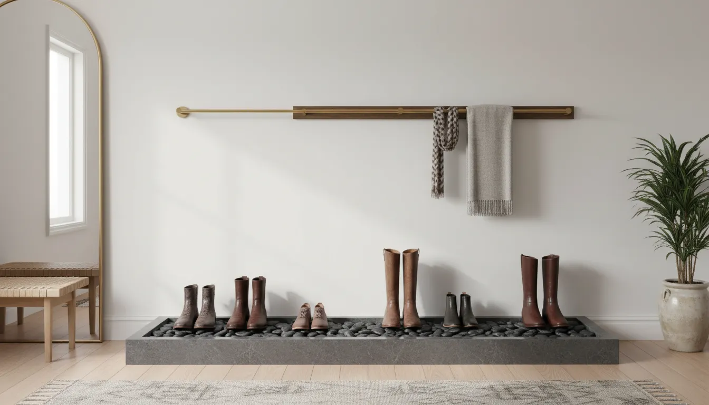
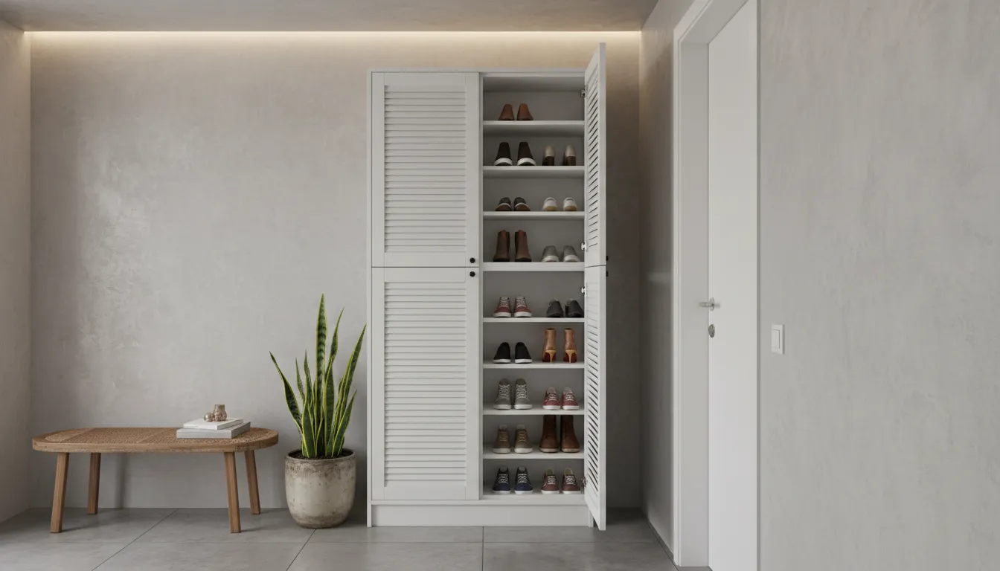

# Preventing Mold and Mildew: Maintaining Shoe Storage in Damp Entryways

The entryway is the transitional frontier of your home. It bridges the gap between the uncontrolled elements of the outdoors and the curated comfort of your interior living space. However, this position makes it uniquely vulnerable. In regions plagued by high humidity, frequent rainfall, or heavy snowfall, the entryway becomes a battleground against moisture. When moisture is left unchecked, it invites two of the most persistent and damaging adversaries of home maintenance: mold and mildew.

For shoe enthusiasts and organized homeowners alike, the presence of fungal growth is more than just an aesthetic nuisance; it is a direct threat to the longevity of expensive footwear and the structural integrity of storage furniture. Leather boots can rot, canvas sneakers can develop stubborn spots, and wooden storage racks can warp and decay. Furthermore, the spores released by these fungi pose potential respiratory health risks to your family.

Protecting your investment—both in your wardrobe and your home decor—requires a strategic approach to moisture management. It involves selecting the right materials, implementing rigorous maintenance routines, and understanding the atmospheric science of your home. This comprehensive guide will walk you through the essential steps to moisture-proof your shoe storage solutions and maintain a pristine, healthy entryway.

## Understanding the Microclimate of Your Entryway

Before implementing solutions, one must understand why the entryway is a hotspot for fungal growth. Mold requires three things to thrive: a food source (organic materials like leather, wood, or dirt), a temperate climate, and moisture. Your entryway likely provides all three in abundance.

Unlike a bathroom, which is designed with ventilation fans and water-resistant tiling to handle humidity, entryways are often afterthoughts regarding climate control. They are frequently subjected to rapid temperature fluctuations every time the door opens. In winter, cold air rushes in to meet warm interior air, causing condensation on surfaces. In summer, humidity can become trapped in stagnant corners where shoes are piled.

Furthermore, shoes are vectors for moisture. A pair of running shoes soaked in a summer storm or winter boots caked in melting snow introduce significant water content into the area. If these items are placed immediately into an enclosed storage unit, the water evaporates but remains trapped within the cabinet, creating a localized greenhouse effect that is perfect for mold incubation.

## Material Selection: Building a Defense

The foundation of a mold-resistant entryway lies in the furniture you choose. Not all [storage solutions](/posts/choosing-the-right-shoe-rack-material) are created equal when facing damp conditions.

### The Risks of Engineered Wood
Particleboard and medium-density fiberboard (MDF) are common materials for affordable entryway furniture. However, they are highly susceptible to moisture damage. These composite woods act like sponges; once moisture penetrates the veneer, the internal fibers swell, causing the laminate to peel and creating crevices where mold can take root deep inside the structure. In a damp entryway, MDF shelving is often a temporary solution that will eventually require replacement.

### Superior Material Choices
For damp environments, prioritize materials that are either naturally resistant to rot or are non-porous.

*   **Metal:** Powder-coated steel or wire racks are excellent choices. They are impervious to mold, easy to wipe down with antifungal cleaners, and generally promote better airflow than solid shelving.
*   **Solid Wood:** If you prefer the warmth of wood, opt for varieties known for their moisture resistance. Teak, cedar, and bamboo are exceptional options. Cedar, in particular, contains natural oils that repel pests and fungi while absorbing excess moisture from the air.
*   **Plastic and Resin:** High-quality industrial plastics are completely waterproof. While they may lack the elegance of wood, modern designs have made significant strides in aesthetic appeal. They can be scrubbed vigorously without damage.

For those seeking a balance of aesthetics and function, open-slat bamboo racks are highly recommended. They offer the organic look of wood while allowing maximum air circulation around the soles of the shoes.

[Amazon Product Recommendation: Bamboo Shoe Rack with Open Slats](https://www.amazon.com/s?k=bamboo+shoe+rack+open+slats&tag=hats0f8-20)

## The Pre-Storage Ritual: Managing Wet Footwear

The golden rule of mold prevention is simple: **Never store wet shoes.** Placing damp footwear directly into a closet or cabinet is the single most common cause of mildew outbreaks. You must establish a "staging area" for drying.

### The Drying Zone
Create a dedicated space where wet shoes can sit before they are organized. This does not have to be an eyesore. A shallow tray filled with river stones serves as an elegant, functional drying station. The water drips off the shoes and evaporates from the stones without pooling around the leather or fabric.

For families dealing with heavy rain or snow, consider investing in a dedicated electric boot dryer. These devices gently circulate warm air inside the footwear, drying them completely in a few hours. This not only prevents mold but also extends the life of the shoe by preventing the breakdown of glues and stitching caused by prolonged wetness.

### Cleaning Before Storage
Mold feeds on dirt and organic matter. Mud, grass clippings, and street grime left on the soles of shoes provide a nutrient-rich buffet for spores. A stiff bristle brush kept near the door allows family members to quickly remove debris before bringing shoes inside. For mudrooms, a heavy-duty coir doormat outside and a washable microfiber runner inside act as a dual-filtration system to reduce the organic load entering your storage area.

## Optimizing Airflow and Ventilation

Stagnant air is the best friend of mildew. In a damp entryway, maximizing airflow is critical to keeping relative humidity levels below the 55% threshold where mold begins to flourish.

### Open vs. Closed Storage
While closed cabinets hide clutter, they also block airflow. If your entryway is prone to dampness, open shelving is superior. It allows ambient air to circulate around each shoe, speeding up evaporation.

If you must use a closed cabinet for aesthetic reasons, consider modifying it. drilling small, discreet ventilation holes in the back panel can encourage cross-ventilation. Alternatively, choose cabinet doors with louvers or rattan inserts rather than solid wood panels.

### Mechanical Air Circulation
In severe cases, passive airflow may not be enough. If your entryway feels muggy, running a small fan on a low setting can disrupt the microclimate that mold requires. Ceiling fans in the hallway or small oscillating fans placed near the floor can make a significant difference.

## Controlling Humidity: Active Measures

Sometimes, the ambient humidity of the climate is simply too high, regardless of ventilation. In these instances, you need active moisture control agents.

### Dehumidifiers
For larger entryways or mudrooms, a compact electric dehumidifier is the most effective tool available. Modern units are quiet and can pull pints of water from the air daily. Keep the reservoir clean to prevent the machine itself from becoming a mold source.

### Desiccants and Moisture Absorbers
For smaller spaces, such as the interior of a shoe cabinet or a small closet, non-electric moisture absorbers are highly effective. Products containing calcium chloride crystals draw moisture from the air and trap it in a lower chamber.

Another natural and reusable option is activated charcoal. Bamboo charcoal bags are excellent for shoe storage because they absorb both moisture and odors simultaneously. They can be rejuvenated by placing them in direct sunlight once a month, making them a sustainable choice for long-term maintenance.

[Amazon Product Recommendation: Activated Charcoal Air Purifying Bags](https://www.amazon.com/s?k=activated+charcoal+air+purifying+bags&tag=hats0f8-20)

## Routine Cleaning and Maintenance

Even with the best preventative measures, a damp entryway requires regular cleaning to remain mold-free. This goes beyond sweeping the floor; it requires disinfecting the storage surfaces.

### The Monthly Deep Clean
Once a month, remove all shoes from your storage unit. Wipe down the shelves with a solution of equal parts white vinegar and water. Vinegar is a mild acid that is incredibly effective at killing mold spores on porous and non-porous surfaces alike. Unlike bleach, which often only bleaches the color of the mold without killing the root on porous surfaces like wood, vinegar penetrates to eliminate the colony.

Allow the shelves to dry completely—assisted by a fan if necessary—before returning the shoes. This is also an excellent opportunity to inspect the wall behind the storage unit for signs of dampness or paint bubbling.

### Treating the Shoes
Shoes that are stored seasonally need extra protection. Before putting winter boots away for the summer, ensure they are thoroughly cleaned and conditioned. Stuffing shoes with acid-free tissue paper or using cedar shoe trees helps maintain their shape and absorbs residual internal moisture.

Cedar shoe trees are particularly valuable in damp climates. The aromatic red cedar wood is naturally fungicidal and hygroscopic, meaning it actively pulls moisture out of the shoe lining while imparting a fresh scent that deters moths and other pests.

[Amazon Product Recommendation: Aromatic Cedar Shoe Trees](https://www.amazon.com/s?k=aromatic+cedar+shoe+trees&tag=hats0f8-20)

## Managing Specific Entryway Scenarios

Different home layouts present unique challenges when battling dampness. Tailoring your strategy to your specific architecture ensures better success.

### The Small Apartment Entryway
In compact apartments, the entryway often opens directly into the living space, leaving little room for elaborate drying stations. Here, verticality is key. Use wall-mounted wire racks that keep shoes off the floor where cold air settles. Because space is tight, moisture accumulation can happen quickly. Keep a small hygrometer (humidity gauge) on your shelf. If the humidity reads above 60%, it is time to deploy silica gel packs or turn on the AC.

For more ideas on managing tight spaces, explore our guide on [organizing small entryways](/posts/small-entryway-storage-hacks).

### The Garage Mudroom
Garage entryways are notoriously difficult to climate control. They are often uninsulated and subject to extreme temperature swings. In this environment, avoid fabric or wicker storage bins, which will absorb atmospheric moisture and become moldy. Stick to industrial wire shelving or heavy-duty plastic. Ensure the door leading from the garage to the house is well-sealed to prevent humid garage air from migrating into your indoor storage.

### The Historic Home
Older homes often suffer from poor insulation and rising damp. If your entryway features original hardwood floors, protect them with a waterproof rug pad under your runner. Do not place furniture flush against exterior walls; leaving a two-inch gap allows air to circulate behind the unit, preventing the "sweating" wall syndrome that rots the back of wooden cabinets.

## When Mold Strikes: Remediation Steps

If you discover mold growing on your shoes or shelving, immediate action is required to prevent the spores from spreading to the rest of your home.

1.  **Isolate:** Take the affected items outside immediately. Brushing or cleaning mold indoors releases spores into your HVAC system and living areas.
2.  **Assess:** Inspect the damage. Surface mold on leather can usually be cleaned. Deeply ingrained mold in padded fabric sneakers or particleboard furniture may render the item unsalvageable.
3.  **Treating Leather:** Mix one cup of rubbing alcohol with one cup of water. Wipe the leather gently with a soft cloth dipped in the solution. Follow up with a high-quality leather conditioner, as alcohol can be drying.
4.  **Treating Canvas:** Scrub with a mixture of baking soda, detergent, and warm water. Allow to air dry in direct sunlight, as UV rays are natural sterilizers.
5.  **Sanitize the Area:** Thoroughly vacuum the storage area with a HEPA-filter vacuum to capture spores, then wash the area with undiluted white vinegar.

## Aesthetic Integration: Function Meets Style

Fighting mold does not mean your entryway must look like a sterile laboratory. Many functional choices can enhance your [home organization](/posts/stylish-minimalist-entryway-ideas) aesthetic.

Consider using elevated furniture legs. Furniture that sits directly on the floor traps moisture underneath. raising your shoe cabinet on 4-6 inch legs creates a lighter visual profile and allows for essential airflow along the floorboards.

If you use baskets for storage, swap out solid fabric bins for natural seagrass or wire baskets. If choosing natural fibers, ensure they are sealed with a clear matte varnish to prevent the fibers themselves from absorbing water.

Houseplants can also play a role, but choose wisely. While some plants increase humidity, others, like Peace Lilies or Boston Ferns, can actually help absorb moisture from the air through their leaves. However, ensure you do not overwater them, as wet soil is a prime mold breeding ground.

## Identifying Structural Issues

Sometimes, persistent mold in an entryway shoe rack is a symptom of a larger structural failure. If you are constantly battling dampness despite using desiccants and fans, check for the following:

*   **Leaking Gutters:** If the gutter outside your front door is overflowing, water may be running down the exterior wall and penetrating the masonry.
*   **Poor Door Seals:** Gaps around the door frame allow humid air and rainwater to infiltrate.
*   **Rising Damp:** In ground-floor entryways, moisture from the earth can travel up through porous bricks or concrete. This usually leaves a "tide mark" of salt or discoloration on the wall near the floor.

Addressing these root causes is essential. No amount of cleaning will solve a moisture problem that is being constantly replenished by a structural leak.

## Conclusion

maintaining a mold-free shoe storage area in a damp entryway is an ongoing process of management rather than a one-time fix. It requires a shift in habits—from the discipline of drying shoes before storing them to the routine of monthly vinegar wipe-downs.

By investing in breathable materials like metal or slat wood, utilizing active moisture absorbers like charcoal or silica, and ensuring adequate ventilation, you can create a hostile environment for mold and a safe haven for your footwear.

Your entryway sets the tone for your entire home. By keeping it dry, fresh-smelling, and organized, you ensure that every arrival is a pleasant experience, free from the worry of dampness and decay. The effort invested in climate control today saves you the cost of replacing ruined shoes and furniture tomorrow, ensuring your home remains a sanctuary of health and order.