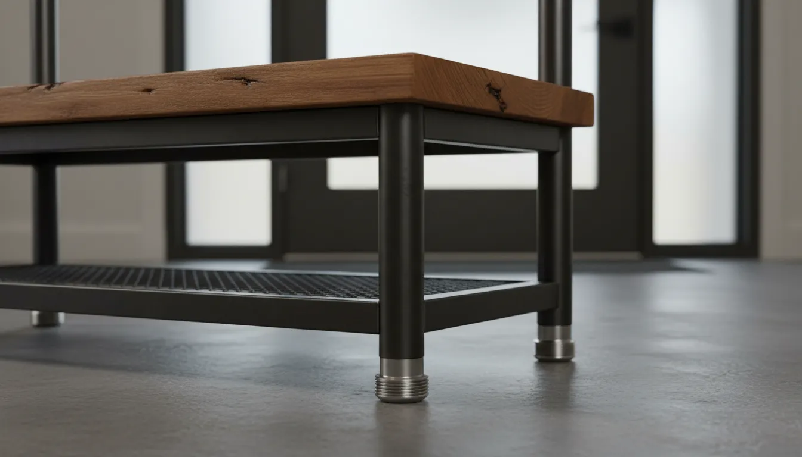
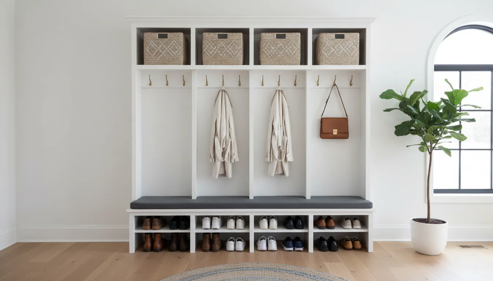
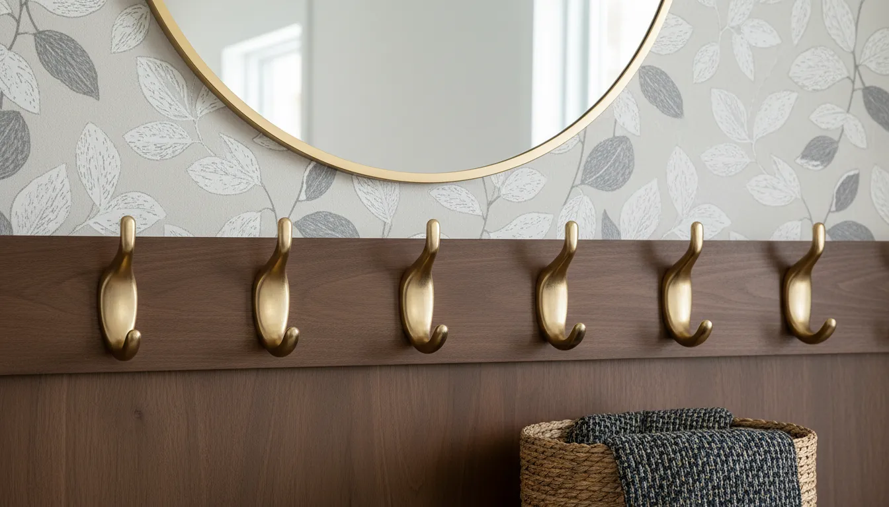

# Rental-Friendly Entryway Solutions: Freestanding Hall Trees That Don't Require Anchoring

The entryway is the handshake of the home. It is the first space guests encounter and the final checkpoint before you step out into the world. However, for those living in rental properties, apartments, or historic homes with delicate plaster walls, creating a functional mudroom often presents a significant logistical challenge. The standard advice for installing heavy furniture involves finding studs, drilling holes, and installing drywall anchors to prevent tipping. When your lease agreement strictly forbids wall damage, or when you simply wish to avoid the hassle of patching and painting upon moving out, you need a different approach.

Enter the freestanding hall tree. These all-in-one storage units combine the functionality of a coat rack, shoe bench, and storage shelving into a single piece of furniture. While many models require wall mounting for safety, a specific subset of high-stability designs allows renters to achieve a polished, organized look without picking up a power drill.

In this comprehensive guide, we will explore the mechanics of stability, design aesthetics suitable for temporary spaces, and how to maximize vertical storage safely. By choosing the right freestanding hall tree, you can transform a chaotic drop zone into a model of efficiency, all while protecting your security deposit.

## The Physics of Stability: What Makes a Hall Tree Safe Without Anchors?

Before investing in furniture that will not be secured to a wall, it is crucial to understand the structural dynamics that prevent tipping. Standard bookcases and wardrobes are often tall and shallow, creating a high center of gravity that makes them prone to toppling forward. For a hall tree to be truly freestanding and safe, it must possess specific engineering characteristics that counteract this risk.

### Lower Center of Gravity
The safest freestanding units carry the majority of their weight in the bottom third of the structure. A hall tree featuring a robust, heavy storage bench at the base provides a counterweight to the upper frame. When you sit on the bench or store heavy boots in the lower compartments, you further lower the center of gravity, essentially anchoring the unit to the floor through mass rather than hardware.

### Deep Footprints and Wide Bases
A narrow base is the enemy of stability. Hall trees designed to stand alone typically feature a deeper footprint—often between 16 to 20 inches deep—compared to wall-mounted units which may be as shallow as 12 inches. This additional depth increases the leverage required to tip the unit, making it significantly more stable during daily use.

### Trapezoidal and A-Frame Geometries
Geometric design plays a pivotal role in safety. A-frame structures, which are wider at the bottom and taper toward the top, are inherently stable. The wider stance at the floor level creates a pyramid effect, ensuring that the unit remains upright even when coats and bags are loaded onto the upper hooks.

## Selecting the Right Material for Stability

When shopping for rental-friendly furniture, material density is not just an aesthetic choice; it is a safety feature. Lightweight particle board units often lack the mass required to remain stable without wall straps.

### Solid Wood and Metal Combinations
The most reliable freestanding options often utilize a hybrid construction. A heavy steel frame provides rigidity and weight, while solid wood shelving adds the necessary mass to the base. Industrial-style hall trees are particularly effective in this regard, as the metal piping or square tubing is naturally heavy.

### Engineered Wood vs. Hardwood
While engineered wood is cost-effective, it is lighter than hardwood. If you opt for an engineered wood model, ensure it has a wide base or a box-style bench at the bottom. Hardwood units, though more expensive, are significantly heavier and less likely to shift when bumped.

## Top Design Configurations for Renters

There is no one-size-fits-all solution for entryways. The layout of your apartment, the width of your hallway, and your storage needs will dictate the best design. Here are the most stable configurations for non-permanent installation.

### 1. The Heavy-Duty Industrial Bench Unit
This is the gold standard for freestanding stability. These units typically feature a thick wooden bench seat supported by a metal frame that extends upward to hold coat hooks. The weight of the bench, combined with the storage of shoes underneath, creates a solid anchor point. Because the upper frame is usually open (rather than a solid wood back), the visual weight is light, but the physical stability is high.

For a robust option that balances modern aesthetics with structural integrity, consider looking into industrial designs that prioritize heavy steel frames.

**Recommended Product:**
[Industrial Hall Tree with Bench](https://www.amazon.com/s?k=Industrial+Hall+Tree+with+Bench&tag=hats0f8-20)

### 2. The Corner Hall Tree
Corner units are an excellent hack for renters. By fitting snugly into a corner, the unit is protected on two sides by walls, significantly reducing the likelihood of it being knocked over. Furthermore, corner units typically have a triangular or diamond-shaped base that is inherently stable. This design maximizes dead space in small apartments and provides a surprisingly large amount of storage depth.

**Recommended Product:**
[Corner Hall Tree Organizer](https://www.amazon.com/s?k=Corner+Hall+Tree+Organizer&tag=hats0f8-20)

### 3. The Solid Wood Slat Style
For those who prefer a warmer, more traditional look, solid wood slat designs offer a timeless appeal. These units often feature a lower storage chest with a hinged lid. The box construction of the base adds immense weight, making it nearly impossible to tip over during normal use. The slat back provides plenty of points for hooks without making the piece feel top-heavy.

**Recommended Product:**
[Solid Wood Entryway Coat Rack](https://www.amazon.com/s?k=Solid+Wood+Entryway+Coat+Rack&tag=hats0f8-20)

## Optimizing Vertical Storage in Small Spaces

In many rentals, floor space is at a premium. A freestanding hall tree allows you to utilize vertical space efficiently, but you must organize it correctly to maintain balance and aesthetics.

### strategic Weight Distribution
To ensure your freestanding unit remains safe, always load the heaviest items at the bottom.
*   **Bottom Tier:** Shoes, boots, and heavy bags should live in the cubbies or on the lower rack.
*   **Middle Tier:** The bench area is for sitting and placing temporary items like grocery bags.
*   **Upper Tier:** Coats, scarves, and light hats. Avoid hanging heavy backpacks on the very top hooks if the unit is not anchored; place them on the bench instead.

For more insights on managing tight quarters, read our guide on [Small Space Organization Ideas](/posts/small-space-organization-ideas).

### Visual Clutter vs. Curated Display
Since you cannot hide items behind built-in cabinet doors in most freestanding units, organization becomes part of the decor. Use uniform baskets or bins on overhead shelves to conceal smaller items like gloves and keys. This reduces visual noise and keeps the unit looking intentional rather than chaotic.

## Safety Measures Without Drilling

Even with a stable unit, safety is paramount, especially in households with pets or children. While you may not be able to drill into studs, there are non-invasive ways to enhance stability.

### Adjustable Leveling Feet
Most quality hall trees come with adjustable feet. In older rentals, floors are rarely perfectly level. A wobbly unit is a dangerous unit. Take the time to adjust each foot until the hall tree stands perfectly still. If your unit does not have leveling feet, use shims to stabilize the base.

### Museum Wax and Adhesive Anchors
If you are still concerned about stability but cannot drill, consider "museum wax" or heavy-duty adhesive anchors.
*   **Museum Wax:** A clear, putty-like substance used to secure artifacts in earthquake zones. Placing a small amount under the feet of the hall tree can prevent it from sliding or shifting.
*   **Adhesive Wall Straps:** several brands offer furniture straps that adhere to the wall using strong, removable adhesive strips rather than screws. While not as strong as a screw-in anchor, they provide a buffer against accidental bumps.

## Protecting Your Rental Floors

When installing heavy furniture, protecting the flooring is just as important as protecting the walls. Landlords will deduct from deposits for scratched hardwoods or dented laminates.

### Felt Pads and Rubber Grips
Always apply high-density felt pads to the bottom of the hall tree legs. This allows you to slide the unit away from the wall for cleaning without scratching the floor. For tile floors, rubber grips are superior as they prevent the unit from sliding when you sit down to put on shoes.

### The Area Rug Anchor
Placing the front legs (or the entire unit) of the hall tree on a durable entryway rug adds friction and stability. It also defines the "mudroom" zone visually, separating the entryway from the rest of the living space.

## Customizing Your Hall Tree for a High-End Look

Just because you are renting does not mean you must settle for generic furniture. There are several reversible modifications you can make to a freestanding hall tree to elevate its appearance.

### Hardware Swaps
The hooks and handles that come with flat-pack furniture are often basic. Swapping these out for vintage brass, matte black, or brushed nickel hardware can instantly make the piece look more expensive and customized to your taste. Keep the original hardware in a bag taped to the back of the unit so you can swap it back when you move.

### Temporary Wallpaper Backing
If your hall tree has a solid back panel, consider applying peel-and-stick wallpaper to it. This adds a pop of color or pattern that coordinates with your interior design. Because it is applied to the furniture and not the wall, you have total creative freedom without risking your lease agreement.

### Lighting Integration
Dark entryways are unwelcoming. Enhance your hall tree by attaching battery-operated, motion-sensor puck lights under the upper shelves or hook rails. This adds luxury and functionality, making it easier to find items in the dark without hardwiring electricity.

## The Modular Advantage: Moving Day

One of the greatest benefits of freestanding hall trees for renters is portability. Unlike built-in cabinetry, this is an investment you take with you.

### Ease of Disassembly
When choosing a unit, consider how easily it breaks down. Industrial pipe designs often unscrew into manageable sections. Wood units with cam-lock fasteners can be disassembled flat. Keep the assembly manual (or a PDF version) and the hex keys taped to the underside of the bench so you are prepared when the lease ends.

### Adaptability to Future Spaces
A freestanding hall tree is versatile. In your current apartment, it may serve as the main entryway storage. in your next home, it might function as a mudroom addition, a guest room wardrobe, or even bathroom storage. This adaptability makes it a smart financial investment for those in transitional living stages.

## Maintenance and Care for Long-Term Use

To ensure your hall tree withstands the rigors of daily use and multiple moves, regular maintenance is required.

### tightening Connections
Every few months, check the bolts and screws connecting the frame. The vibration from daily use—sitting on the bench, tossing coats on hooks—can loosen hardware over time, leading to a wobble. A quick tighten ensures the structural integrity remains intact.

### Moisture Management
Entryways see wet coats and muddy boots. If your hall tree is made of metal or engineered wood, ensure that wet items are not left to soak into the surfaces. Use trays for wet boots on the lower shelves and ensure coats are relatively dry before hanging them against a wooden backboard to prevent warping or swelling.

## Conclusion: Organizing Without Permanence

Living in a rental property should not preclude you from having a sophisticated, organized home. The entryway sets the tone for your entire living experience. By choosing a freestanding hall tree that prioritizes weight distribution, wide bases, and quality materials, you solve the storage dilemma without compromising your security deposit.

These units offer the perfect blend of form and function: they are robust enough to handle the daily traffic of a busy household yet portable enough to move with you to your next adventure. Whether you prefer the raw edge of industrial metal or the warmth of traditional wood, there is a no-drill solution that fits your aesthetic.

Take control of your entryway today. Measure your space, select a stable, freestanding unit, and enjoy the peace of mind that comes with a clutter-free home—no power tools required. For further inspiration on maximizing your rental, explore our suggestions on [Smart Entryway Lighting Solutions](/posts/smart-entryway-lighting-solutions) to complement your new furniture.