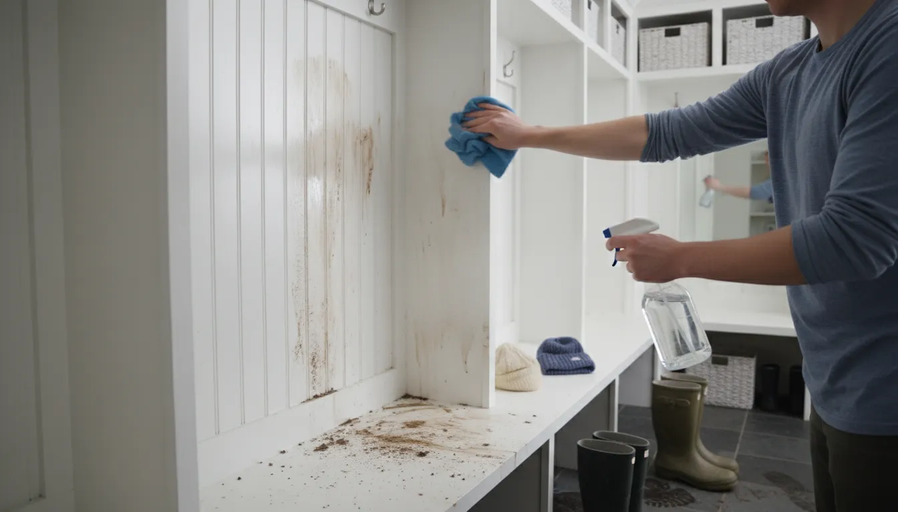
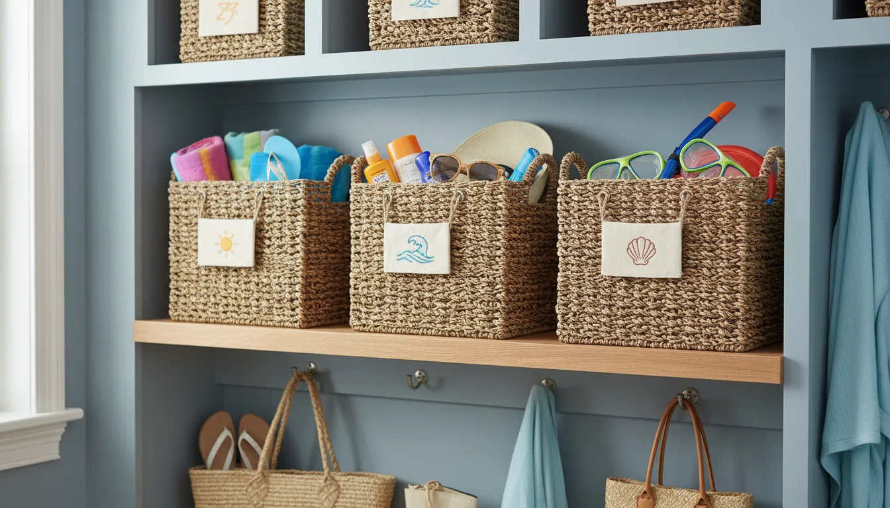
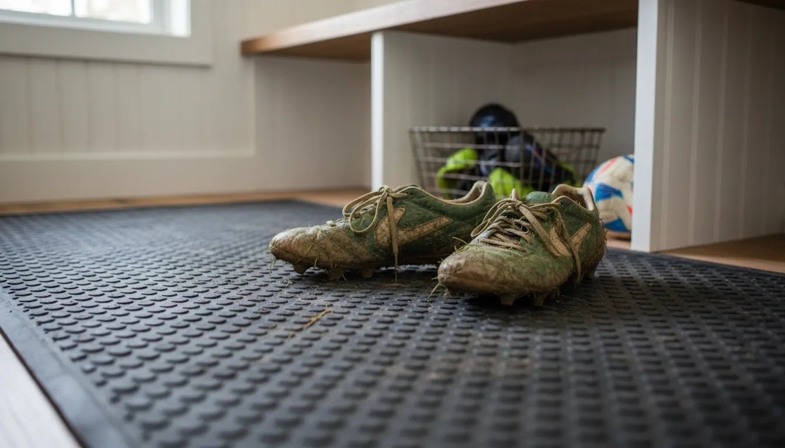

# Seasonal Swaps: How to Use Your Mudroom Lockers to Organize Winter and Summer Gear

The mudroom is the airlock of the home. It is the transitional space where the chaos of the outside world meets the sanctuary of your interior. However, without a solid system in place, that chaos often breaches the perimeter. As the seasons change, so does the gear that accompanies our daily lives. The transition from the bulky, wet burden of winter to the sandy, active sprawl of summer can be a logistical nightmare if you aren’t prepared.

If you are fortunate enough to have **mudroom lockers**, you already possess the ultimate tool for **entryway organization**. These built-in or freestanding units are more than just furniture; they are the command center for your family’s comings and goings. Yet, many homeowners make the mistake of treating lockers as static storage—dumping grounds that accumulate layers of out-of-season equipment until the doors won’t close.

In this comprehensive guide, we will dissect the art of the seasonal swap. We will explore how to deep clean, categorize, and reconfigure your **mudroom lockers** to handle the distinct challenges of **winter gear organization** and **summer sports storage**. Whether you are dealing with snowsuits or surfboards, this strategy will ensure your entryway remains a functional, welcoming space year-round.

## The Psychology of the Seasonal Swap

Before we dive into the physical act of moving boxes and scrubbing shelves, it is essential to understand why the seasonal swap is necessary for mental clarity. A cluttered visual field leads to a cluttered mind. When you open your locker to grab a light rain jacket in April, but you have to fight through three heavy parkas and a wool scarf to find it, you start your day with micro-frustrations.

**Decluttering entryway** spaces is about efficiency. It is about reducing friction in your daily routine. The "Seasonal Swap" isn't just a chore; it is a ritual that signals a change in lifestyle. It prepares the family for the activities ahead. By curating your lockers to contain *only* what is relevant for the current season, you reclaim space and time.

## Analyzing Your Mudroom Locker Anatomy

To maximize **seasonal gear storage**, you must first understand the anatomy of your lockers. Most mudroom lockers consist of three primary zones, each serving a specific function in the seasonal rotation:

1.  **The Upper Zone (High Shelves):** This is your long-term storage area. It is hard to reach, making it perfect for items that are out of season but need to remain accessible, or for bulkier items that are used infrequently.
2.  **The Active Zone (Hooks and Eye-Level Shelves):** This is prime real estate. This area should strictly be reserved for items used daily or weekly. In winter, this is for coats; in summer, it’s for beach bags and baseball caps.
3.  **The Ground Zone (Base Cubbies or Floor):** This area takes the most abuse. It handles footwear, heavy bags, and sports equipment. It requires the most durable storage solutions.

Understanding these zones is critical because a successful swap involves rotating items between these zones—or moving them out of the mudroom entirely—based on the time of year.

## Phase 1: The Great Winter Exit

As the frost melts and the crocuses bloom, it is time to tackle the beast that is **winter gear organization**. Winter gear is high-volume. Puffy coats, snow pants, heavy boots, and chunky knits take up approximately three times the volume of summer clothing. This makes the winter-to-summer swap the most satisfying because you instantly gain visual space.

### Sorting and Assessing Damage

Begin by emptying every single locker. Do not leave a single mitten behind. Lay everything out on the floor. This is the "audit" phase.

*   **Check for Fit:** Kids grow fast. Have they outgrown their snow boots? Are the sleeves on their coats too short? If so, clean them and put them in a donation pile or a "hand-me-down" bin immediately. Do not store items that won't fit next year.
*   **Check for Damage:** Look for broken zippers, missing buttons, or holes in wool items. Repair them now, or discard them. Storing broken items is a waste of precious storage density.
*   **The Salt Audit:** Winter boots are often caked in road salt, which can destroy materials over time. Wipe down all footwear thoroughly before considering storage.

### The Cleaning Ritual

Before you load new items in, you must clean the **mudroom lockers**. Winter tracks in grit, salt, and moisture that can damage the finish of your cabinetry.

1.  **Vacuum First:** Use a crevice tool to get into the corners of the lockers where dried mud accumulates.
2.  **Wipe Down:** Use a mild wood cleaner or a damp cloth with a drop of dish soap to wipe down the walls and shelves of the locker.
3.  **Deodorize:** Winter boots can harbor moisture and bacteria. Wipe the interior with a white vinegar solution to neutralize odors.

### Storing the Winter Bulk

Ideally, heavy winter gear should move out of the "Active Zone." If you have high ceilings and open shelving above your lockers, you can store winter gear there in bins. If not, they should move to a basement, attic, or under-bed storage.

If you must store some winter items in the lockers (perhaps for that rogue spring snowstorm), utilize vacuum-seal bags to compress puffy coats and snow pants, placing them on the absolute highest shelf.

## Phase 2: Welcoming Summer Gear

With the heavy wools gone, your lockers will look spacious and airy. Now comes the challenge of **summer sports storage**. While summer gear is lighter, it is often more awkward. You are dealing with odd shapes: tennis racquets, baseball bats, pool noodles, bicycle helmets, and floppy sun hats.

### Reconfiguring Hooks and Hangers

Winter coats rely on heavy-duty coat hangers or sturdy double hooks. Summer gear requires different hanging mechanics.

*   **Add S-Hooks:** For tote bags and thin-strap tank tops or swimwear bags, S-hooks are invaluable.
*   **Clip Hangers:** Sun hats can be difficult to store without crushing them. Use clip hangers to hang them from the main rod, keeping their shape intact.
*   **Mesh Bags:** Summer means sand. Lots of it. Store beach toys and sunscreen in mesh bags hung from hooks. This allows sand to shake out (hopefully outside) rather than collecting in the bottom of a canvas tote.

For managing the odd shapes of summer gear, particularly if you have children involved in multiple sports, you need versatile hanging solutions. A standard hook might not hold a lacrosse stick or a heavy backpack filled with hydration gear.

**Product Recommendation:**
To maximize the vertical hanging space in your locker for awkward summer gear, consider adding a heavy-duty over-the-door or hanging organizer system if your locker design permits, or upgrading your hooks. A robust option is the **heavy-duty utility hook set**, which can handle heavy beach bags and sports equipment without bending.
[Buy Heavy Duty Utility Garage Storage Hooks on Amazon](https://www.amazon.com/s?k=heavy+duty+utility+storage+hooks+mudroom&tag=hats0f8-20)

### The Sunscreen and Bug Spray Station

In winter, we worry about lip balm. In summer, the chemical load increases. You need a dedicated spot for sunscreen, bug spray, and sunglasses.

Designate a small basket or a door-mounted shelf within the locker for these items. Do not leave them loose on a shelf, as sunscreen bottles have a notorious habit of leaking. Using a plastic, washable bin for these liquids saves your carpentry from oily stains.

## Strategies for Summer Footwear

**Entryway organization** often falls apart at the shoe level. Summer footwear—flip-flops, sandals, slides—is small and unstructured. Unlike rigid winter boots that stand in a row, a pile of twenty flip-flops looks like a garbage heap.

### The "Contain and Conquer" Method

Do not place sandals directly on the locker floor. They will slide over each other and create a mess.

1.  **Vertical Shoe Files:** Use slim, vertical file organizers (like magazine holders) to store flip-flops upright.
2.  **Tension Rods:** Install a small tension rod near the bottom of the locker. You can hook the heels of sandals or high heels over the rod to keep them off the floor.
3.  **Basket Drawers:** If your locker has a cubby at the bottom, insert a wire or wicker basket. This allows family members to toss lightweight shoes in without needing to line them up perfectly.

## Optimization Strategies: Bins and Baskets

The secret to seamless **seasonal gear storage** lies in the vessel. You cannot organize loose items; you must containerize them.

### Choosing the Right Bin

*   **Winter Bins:** Should be opaque (to hide visual clutter) and possibly airtight if storing wool.
*   **Summer Bins:** Should be breathable. Wire baskets or perforated plastic bins are ideal for damp swimsuits or sweaty sports pads. Airflow is critical to preventing mold in the humid months.

**Product Recommendation:**
For organizing the upper shelves of your mudroom lockers, breathable yet sturdy bins are essential. Woven storage baskets offer the perfect aesthetic for a mudroom while allowing airflow for summer items.
[Buy Woven Storage Baskets for Shelves on Amazon](https://www.amazon.com/s?k=woven+storage+baskets+for+shelves+mudroom&tag=hats0f8-20)

### Labeling for Accountability

When you swap the seasons, you must swap the labels. If a bin is labeled "Scarves" but now contains "Swim Goggles," your system will fail within a week.

Use chalkboard labels or magnetic label holders. This allows you to wipe clean or swap the card instantly during your seasonal overhaul. Assigning a specific locker or specific bin color to each family member also increases accountability. When "Timmy's Bin" is overflowing, Timmy knows exactly who needs to clean it.

## The "Shoulder Season" Dilemma

The most difficult time for **mudroom lockers** is the "shoulder season"—those few weeks in spring and autumn when the weather is schizophrenic. You might need a parka in the morning and a t-shirt in the afternoon.

During this time, you cannot do a full swap. Instead, you must adopt a **Hybrid Layout**.

1.  **The 50/50 Split:** Keep one heavy jacket and one pair of boots in the locker. Move the rest to deep storage.
2.  **Layering Station:** Prioritize easy layers—hoodies, fleece vests, and rain shells. These should be on the most accessible hooks.
3.  **The "Mud" Focus:** Shoulder seasons are usually the wettest (thawing snow or autumn rains). Ensure your boot trays are still in place. Do not switch to "summer mode" (removing heavy mats) until the mud has officially dried up.

For more tips on handling tricky transition periods in small spaces, check out our guide on [Small Entryway Hacks](/posts/small-entryway-hacks-maximize-storage).

## Managing Sports Equipment Overload

Summer often equals sports. Baseball, soccer, lacrosse, and swimming all have specific gear requirements that can overwhelm standard **mudroom lockers**.

### Ball Control

Balls are dangerous in a mudroom; they roll under feet and cause tripping hazards.
*   **Solution:** Use a bungee cord system. Attach two vertical bungee cords across the front of a bottom cubby. You can slide balls behind the cords, keeping them contained but visible and accessible.

### The Bat and Stick Problem

Long items like bats, hockey sticks, and lacrosse sticks don't fit in standard cubbies.
*   **Solution:** If you don't have a tall, thin locker cabinet, install a "grip" style mop and broom holder on the inside wall of the locker. These friction grips are perfect for holding sports sticks securely in place.

## Maintenance: Protecting Your Investment

**Mudroom lockers** are an investment. Seasonal swaps are the best time to perform maintenance to ensure they last for years.

### Moisture Control

Summer brings humidity; Winter brings melting snow. Both are enemies of wood and MDF.
*   **Winter:** Ensure you have heavy-duty boot trays that fit the exact dimensions of your locker floor. Water pooling on the wood will cause swelling and rot.
*   **Summer:** Damp beach towels are the enemy. Establish a strict rule: No wet towels in the locker. Install hooks on the *exterior* of the house or in the laundry room for drying. Only dry towels enter the locker.

**Product Recommendation:**
To protect the bottom of your lockers from the inevitable mud, sand, and water, a high-quality, rimmed boot tray is non-negotiable. Look for one that can be easily hosed off.
[Buy All-Weather Boot Tray on Amazon](https://www.amazon.com/s?k=all+weather+boot+tray+entryway&tag=hats0f8-20)

### Scratch Prevention

Metal cleats and skate blades can shred the interior of a locker. Consider lining the bottom of your sports-centric lockers with rubber matting (similar to car floor mats) or durable cork adhesive liners. This protects the wood and dampens the sound of gear being thrown in.

## Advanced Tips for Small Mudrooms

If your lockers are narrow or you have a small family entry, you have to be even more ruthless with your seasonal swap.

1.  **The "One In, One Out" Rule:** Strictly enforce a policy where a new item cannot enter the locker unless an old one leaves.
2.  **External Overflow:** If the lockers are full, use a deck box outside for rugged sports gear (balls, bats, helmets). Keep the indoor lockers strictly for textiles (shoes, jackets, bags).
3.  **Utilize the Doors:** The inside of the locker door is often wasted space. Add adhesive pockets or shallow wire racks to hold small items like sunglasses, keys, or sunscreen, freeing up shelf space.

For those considering building their own custom solution to fit a tight space, you might find inspiration in our article on [DIY Locker Build](/posts/diy-locker-build-guide-entryway).

## Conclusion

Your **mudroom lockers** are the gatekeepers of your home’s organization. By respecting the rhythm of the seasons and performing a dedicated "Seasonal Swap," you transform this space from a clutter magnet into a streamlined machine.

Remember, **winter gear organization** focuses on bulk management and moisture control, while **summer sports storage** is about containment and airflow. By using the right bins, hooks, and maintenance strategies, you can extend the life of your lockers and, more importantly, lower your stress levels.

Set a date on the calendar for your swap—perhaps the first weekend after the last freeze for spring, and the first weekend of October for autumn. Put on some music, get the family involved, and enjoy the satisfaction of a freshly organized entryway ready for the adventures ahead.