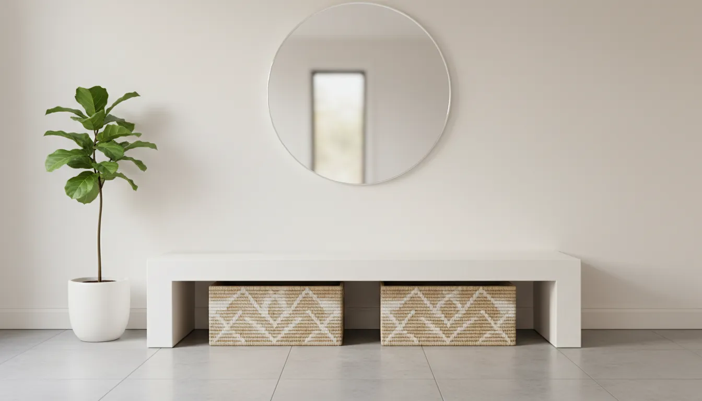
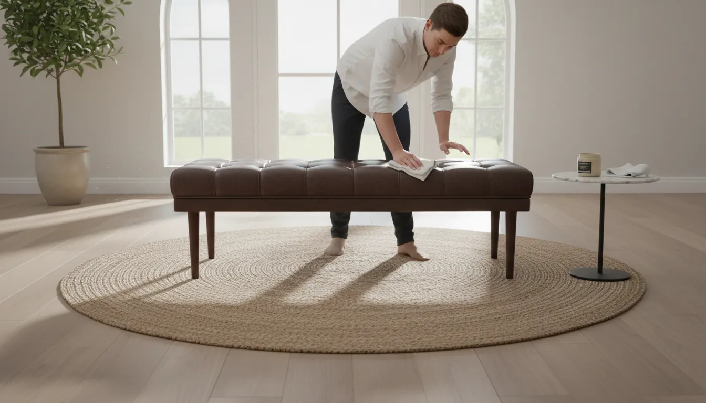

# Shoe Storage Benches That Double as Stylish Entryway Seating

The entryway is the handshake of the home. It is the first space guests experience upon arrival and the last thing you see before departing for the day. Despite its importance in setting the tone for the rest of the house, the entryway often falls victim to the chaos of daily life. Piles of discarded sneakers, rain boots, and sandals can quickly transform a welcoming foyer into a cluttered obstacle course.

The challenge lies in balancing necessary utility with aesthetic appeal. While traditional shoe racks are functional, they rarely offer a sophisticated visual element. This is where the shoe storage bench emerges as the quintessential solution for modern living. By marrying the comfort of seating with the practicality of organization, these furniture pieces serve a dual purpose that maximizes square footage and elevates home decor.

In this comprehensive guide, we will explore the nuances of selecting the perfect shoe storage bench, examining material durability, design integration, and capacity requirements to help you curate an entryway that is as organized as it is stylish.

## The Intersection of Form and Function

Interior design philosophy often dictates that every item in a small space must justify its footprint. The entryway, typically limited in size, requires furniture that works twice as hard. A shoe storage bench is not merely a box for footwear; it is an anchor point for the room.

Psychologically, a dedicated seat near the door encourages a transition ritual. It invites you to sit, pause, and remove your shoes, effectively keeping outdoor grit and allergens from tracking into the main living areas. From a design perspective, the bench adds horizontal weight to the room, balancing vertical elements like coat racks or mirrors.

However, not all benches are created equal. The market is saturated with options ranging from industrial metal racks to velvet-tufted ottomans. Choosing the right piece requires a deep understanding of your specific storage needs and your home’s architectural style.

## Assessing Your Storage Needs and Space Constraints

Before purchasing furniture, one must conduct a thorough audit of the entryway. This involves more than simply measuring the width of the wall. It requires an honest assessment of household habits and inventory.

### Measuring for Clearance and Flow
The most common mistake homeowners make is selecting a bench that impedes traffic flow. In a narrow hallway, depth is the critical dimension. A bench that is too deep will make the space feel claustrophobic and may obstruct the full swing of the front door. Ensure there is at least 36 inches of clearance for walking paths. If your entryway is particularly tight, consider reading our guide on [Small Entryway Organization Tips](/posts/small-entryway-organization-tips) to maximize vertical space.

### calculating Capacity
Consider the volume and type of footwear your household uses daily. A family of four will have significantly different requirements than a single professional.
*   **The Daily Rotation:** The bench should store the shoes currently in use—usually two to three pairs per person.
*   **Boot Height:** Standard cubbies often fail to accommodate tall winter boots or rain gear. Look for adjustable shelving or benches with a taller compartment.
*   **Hidden vs. Visible:** Do you prefer your shoes to be on display for easy access, or hidden away behind doors for a cleaner look?

## Defining Your Aesthetic: Materials and Styles

The material of your storage bench dictates its durability and its contribution to your home's decor theme. Whether your style leans toward rustic farmhouse, mid-century modern, or sleek industrial, there is a material profile to match.

### The Warmth of Natural Wood
Wood is the most versatile material for entryway furniture. Solid hardwoods like oak, walnut, and maple offer longevity and can withstand the heavy traffic of a busy foyer.
*   **Rustic/Farmhouse:** Look for reclaimed wood or distressed finishes. These pieces hide scuffs well and add character.
*   **Mid-Century Modern:** Opt for walnut finishes with tapered legs and clean lines.
*   **Scandi-Minimalist:** Light woods like birch or ash combined with white accents create an airy, uncluttered feel.

For those seeking that classic, sturdy appeal, a wooden bench with integrated dividers is a timeless choice.

*   **Recommended Product:** [Farmhouse Wooden Shoe Storage Bench](https://www.amazon.com/s?k=farmhouse+wooden+shoe+storage+bench&tag=hats0f8-20)

### The Luxury of Upholstery
For a softer, more inviting look, upholstered benches are superior. These pieces resemble traditional living room furniture but feature hidden internal storage.
*   **Fabrics:** Velvet adds a touch of glamour, while linen offers a casual, breezy vibe. Leather (or high-quality faux leather) is excellent for durability and ease of cleaning.
*   **Tufting:** Button tufting adds texture and depth, making the bench feel like a premium design element rather than just a storage unit.
*   **The Trade-off:** While beautiful, fabric benches require more maintenance, particularly in wet climates. It is advisable to treat the fabric with a stain guard if you have young children or pets.

*   **Recommended Product:** [Modern Velvet Shoe Storage Bench](https://www.amazon.com/s?k=modern+velvet+shoe+storage+bench&tag=hats0f8-20)

### Industrial Metal and Mixed Media
Industrial design emphasizes raw functionality. Metal benches, often paired with distressed wood tops, are incredibly durable. They are resistant to moisture and mud, making them ideal for regions with harsh weather. The open framework of metal racks also allows for better air circulation around damp shoes, preventing odors.

*   **Recommended Product:** [Industrial Metal Shoe Rack Bench](https://www.amazon.com/s?k=industrial+metal+shoe+rack+bench&tag=hats0f8-20)

## Storage Configurations: Cubbies, Drawers, and Flip-Tops

The architecture of the storage itself is just as important as the exterior finish. The method by which you access your footwear changes the user experience.

### Open Cubbies and Shelves
The open-shelf design is the most common and practical for high-traffic homes.
*   **Pros:** It offers immediate visual access. You can see exactly where your shoes are, making it easier to grab a pair and go. It also forces a level of discipline; because the shoes are visible, you are more likely to keep them tidy.
*   **Cons:** Visual clutter. If the shoes are dirty or mismatched, the entryway can look messy.
*   **Solution:** Use wicker or wire baskets within the cubbies to hide flip-flops, laces, and shoe care accessories while maintaining the open structure.

### Flip-Top Storage Benches
These units feature a hinged seat that lifts to reveal a deep chest-style compartment.
*   **Pros:** Excellent for hiding clutter completely. This is the cleanest visual option.
*   **Cons:** It is not ideal for daily shoe retrieval. Having to clear off the seat (moving pillows or bags) and lift the lid every time you leave the house can become tedious.
*   **Best Use:** Use the internal compartment for off-season footwear, umbrellas, heavy wool socks, or reusable shopping bags, while keeping a small tray under the bench for the one pair of shoes you wear daily.

### Drawer and Cabinet Combinations
For the ultimate organization, look for benches that incorporate drawers or sliding doors.
*   **Drawers:** Perfect for smaller items like keys, sunglasses, and dog leashes.
*   **Cabinets:** Slatted cabinet doors allow for ventilation while obscuring the contents. This style mimics the look of a sideboard or credenza, elevating the furniture piece beyond a simple utility rack.

## Styling Your Entryway Around the Bench

Once you have selected the perfect shoe storage bench, the next step is integrating it into the broader design of your entryway. The bench should not stand alone; it needs to be part of a vignette.

### The Wall Above
The vertical space directly above the bench is prime real estate.
*   **Mirrors:** A large mirror is essential in an entryway. It allows for a final outfit check and reflects light, making small foyers appear larger.
*   **Artwork:** A gallery wall or a single statement piece can inject personality into the space.
*   **Hooks:** Install a row of high-quality coat hooks above the bench. This creates a complete "mudroom" effect, even without a dedicated room.

### Softening with Textiles
Hard furniture needs soft accents to feel welcoming.
*   **Pillows:** Add two or three throw pillows to the bench. This introduces color and pattern. Choose performance fabrics that are easy to wash.
*   **Rugs:** Place a runner or a small area rug in front of the bench. This defines the zone and provides a soft place to land your feet. For more advice on floor coverings, read our article on [Selecting the Perfect Entryway Rug](/posts/selecting-the-perfect-entryway-rug).

### Functional Accessories
*   **Trays:** If your bench has a solid wood surface, place a small decorative tray on one end to catch mail or keys.
*   **Greenery:** A potted plant (real or high-quality faux) adds life and vibrancy to the transition area.

## Maintenance and Care for Entryway Furniture

Entryway furniture endures more wear and tear than almost any other piece in the home. It faces moisture, mud, road salt, and constant friction.

### Wood Care
Dust regularly with a microfiber cloth. Every few months, apply a wood conditioner or polish to prevent the finish from drying out, especially if the bench is near a radiator or direct sunlight. If water spots occur from wet raincoats, address them immediately.

### Fabric Care
For upholstered benches, vacuum the seat weekly to remove dust and allergens. Treat spills immediately by blotting, not rubbing. If you live in a snowy area, ensure salt-stained boots are not brushed against the fabric.

### Managing Odors
Shoe storage can inevitably trap odors.
*   **Ventilation:** Ensure the bench isn't packed so tightly that air cannot circulate.
*   **Sachets:** Place cedar blocks or lavender sachets inside drawers or cubbies to maintain freshness.
*   **Baking Soda:** For flip-top benches, a small open container of baking soda can help absorb moisture and smells.

## DIY and Customization Possibilities

For the creative homeowner, a store-bought bench can be the foundation for a custom project.

*   **Hardware Swap:** Replacing standard knobs or handles on a bench with high-end brass or matte black hardware can instantly upgrade the look of an affordable piece.
*   **Custom Cushions:** If you purchase a wooden bench, you can create a custom foam cushion upholstered in a fabric that perfectly matches your window treatments or living room accents.
*   **Paint and Stain:** An unfinished wood bench offers a blank canvas. You can stain it to match your hardwood floors or paint it a bold accent color like navy blue or emerald green to make a statement.

## Conclusion

The entryway sets the expectation for the rest of your home. A cluttered, disorganized foyer creates stress the moment you walk through the door, whereas a curated, organized space offers a sense of relief and welcome.

A shoe storage bench is one of the most effective investments you can make for your home’s organization. It bridges the gap between the utilitarian need to store footwear and the desire for a stylish, comfortable home environment. By carefully considering your capacity needs, measuring your space accurately, and selecting a material that complements your decor, you can transform a chaotic drop zone into a sophisticated entryway.

Whether you choose a rustic wooden bench with open cubbies or a sleek, velvet-tufted ottoman, the result is the same: a cleaner home, a more organized life, and a beautiful place to sit while you tie your laces.