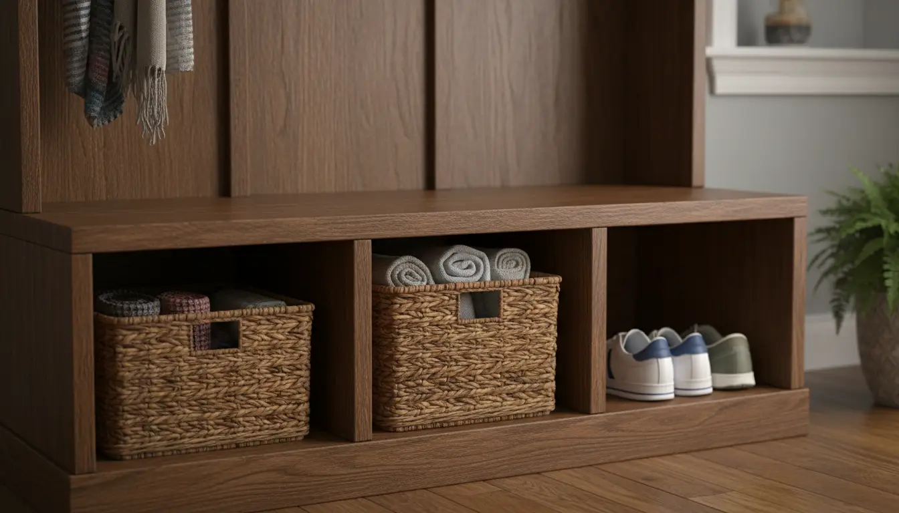
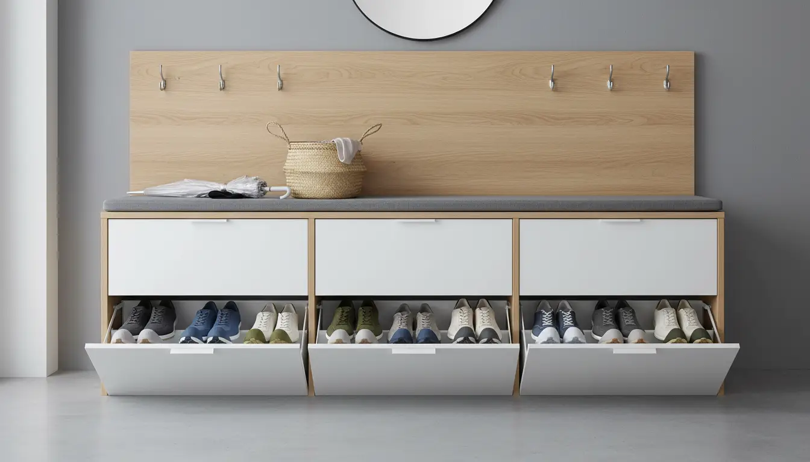
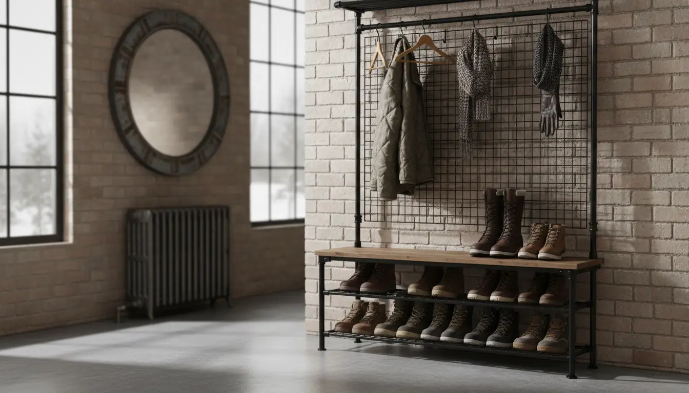

---
title: "Shoe Storage Solutions Built Into Hall Trees: Cubbies, Drawers, and Racks"
slug: "shoe-storage-solutions-built-into-hall-trees-cubbies-drawers-and-racks"
pubDate: "2026-01-28"
description: "Discover the best shoe storage solutions built into hall trees. Compare cubbies, drawers, and racks to organize your entryway and keep floors clutter-free."
author: "Content Bot"
image:
  url: "../../images/blog/shoe-storage-solutions-built-into-hall-trees-cubbies-drawers-and-racks.webp"
  alt: "A modern mudroom featuring a white hall tree with built-in shoe cubbies filled with sneakers and boots."
tags: 
  - Hall Trees
  - Shoe Storage
  - Entryway Organization
  - Mudroom Ideas
  - Furniture Guides
category: "Entryway Organization"
keywords:
  - hall tree with shoe storage
  - entryway shoe bench
  - mudroom organizers
  - shoe cubbies vs drawers
  - hallway coat rack with shoe rack
  - shoe storage ideas
canonical: "https://www.entrywaystorage.com/posts/shoe-storage-solutions-built-into-hall-trees-cubbies-drawers-and-racks"
---

# Shoe Storage Solutions Built Into Hall Trees: Cubbies, Drawers, and Racks

The entryway is the handshake of your home. It is the first thing guests see when they arrive and the last thing you see when you rush out the door. Yet, for many of us, this critical transition zone is often a chaotic landscape of kicked-off sneakers, muddy boots, and mismatched sandals. The "shoe mountain" is a common enemy in households worldwide, tripping up family members and creating visual stress the moment you cross the threshold.

Enter the **hall tree with shoe storage**. This piece of furniture is the heavy lifter of the mudroom, combining coat hooks, benches, and shelving into one cohesive unit. However, not all hall trees are created equal. The effectiveness of your entryway organization largely depends on the specific mechanism used to store footwear. Should you opt for open cubbies for quick access? Do you need the concealed elegance of drawers? Or is a breathable rack the best choice for your climate?

In this comprehensive guide, we will dissect the three primary shoe storage solutions built into hall trees: **cubbies, drawers, and racks**. We will explore the pros and cons of each, helping you determine which style fits your lifestyle, your footwear collection, and your home's aesthetic.

## The Anatomy of an Organized Entryway

Before diving into the specifics of storage mechanisms, it is essential to understand why integrating shoe storage into a vertical unit is superior to standalone racks. A hall tree utilizes vertical space, drawing the eye upward and preventing the floor from looking cluttered. By combining your **entryway shoe bench** with coat storage, you create a dedicated "drop zone" that centralizes all outdoor gear.

When selecting a hall tree, the storage base is the foundation. If the base doesn't function well for your specific shoe habits, the rest of the unit will fail to keep you organized. Let's break down the contenders.

---

## 1. The Classic Cubby System

The cubby system is perhaps the most recognizable form of mudroom storage. It consists of a grid of open compartments, usually located beneath the bench seating of the hall tree. This design is ubiquitous in school lockers and kindergarten classrooms for a reason: it is intuitive and incredibly efficient.

### The Advantages of Open Cubbies

**Visibility and Accessibility:** The primary benefit of cubbies is the "grab-and-go" factor. There are no doors to open or drawers to pull. You can see exactly where your running shoes are, which is particularly helpful for children or family members who are perpetually running late. This visibility ensures that shoes don't get lost in a dark void.

**Defined Boundaries:** Cubbies enforce a "one pair per slot" rule (or two pairs of smaller shoes). This physical boundary prevents the pile-up effect. When every pair of shoes has a dedicated "home," family members are more likely to return them to that spot. It teaches organization through spatial limitations.

**Versatility:** While designed for shoes, cubbies are agnostic containers. If you have fewer shoes but more accessories, a cubby can easily house a folded umbrella, a dog leash, or a small bin for hats and gloves.

### The Downsides of Cubbies

**Visual Clutter:** The strength of visibility is also its weakness. If your shoes are dirty, worn out, or simply mismatched, they are on full display. An open cubby system can look messy if not curated properly.

**Size Limitations:** Standard cubbies are often sized for low-top sneakers or dress shoes. Tall boots, high-tops, or oversized winter muck boots often won't fit, leading to shoes being left on the floor in front of the unit—defeating the purpose.

### Best Practices for Cubby Storage

If you decide that a **hall tree with shoe storage** featuring cubbies is right for you, consider using fabric or wicker baskets within the slots. This gives you the best of both worlds: the structure of a cubby with the concealment of a drawer. This is an excellent strategy for "ugly" storage items like flip-flops or beat-up gardening shoes.

For those with a busy household looking for a robust solution, the **Prepac Wide Hall Tree with 24 Shoe Cubbies** is a massive organizer that dominates the clutter.

This style of furniture is often best suited for:
*   **Families with young children:** Kids are more likely to put shoes away if they don't have to fiddle with hardware.
*   **Narrow entryways:** Cubbies don't require clearance for door swings or drawer extensions.
*   **Sneakerheads:** If you want to display your footwear collection, open cubbies act as a mini-gallery.

If you are looking for a unit that balances style with this high-volume capacity, consider this recommendation:

**Recommended Product:** [Prepac Wide Hall Tree with Shoe Storage](https://www.amazon.com/s?k=Prepac+Wide+Hall+Tree+Shoe+Storage&tag=hats0f8-20)

---

## 2. The Concealed Drawer and Flip-Down Compartment

For the minimalist, the modern design enthusiast, or the homeowner who believes that clutter should be neither seen nor heard, the drawer-based hall tree is the gold standard. This category includes traditional pull-out drawers as well as the increasingly popular European-style "flip-down" shoe compartments.

### The Elegance of Hidden Storage

**Visual Calm:** The most significant advantage of drawers is the immediate reduction of visual noise. Once the drawer is closed, the chaos of the outside world disappears. Your entryway looks pristine, regardless of the condition of the shoes inside. This is crucial for formal living spaces where the front door opens directly into the living room.

**Protection:** Drawers protect your footwear from dust, sunlight (which can fade fabrics), and the occasional pet who enjoys chewing on leather.

**Maximizing Depth:** Flip-down drawers, in particular, utilize depth differently than standard shelves. By storing shoes vertically or at an angle, these units can be incredibly slim, protruding less into the hallway while still accommodating larger shoe sizes.

### The Challenges of Drawers

**Ventilation:** The biggest enemy of shoe storage is moisture and odor. Enclosed drawers, if not properly vented, can trap smells. If you choose this route, ensure you never store damp shoes inside. They must be fully dried on a mat before being tucked away.

**The "Extra Step" Barrier:** It sounds trivial, but opening a drawer is an extra step compared to tossing shoes in a cubby or on a rack. For teenagers or tired adults, this barrier might be enough to result in shoes being left on the floor *next* to the unit.

**Mechanical Failure:** Unlike a static wooden shelf, drawers have moving parts. Hinges, tracks, and handles can wear out over time, especially with heavy daily use.

### Integrating Drawers into Your Hall Tree

When looking for **mudroom organizers** with drawers, pay close attention to the hardware. Soft-close slides are a game-changer, preventing the jarring "bang" of a heavy drawer closing.

If you are tight on space but need a sleek look, flip-down mechanisms are superior. They usually feature two or three tiers, doubling the capacity of a standard bench.

This style is best suited for:
*   **Small Apartments/Condos:** Where visual clutter makes a space feel smaller.
*   **Pet Owners:** To keep shoes safe from teeth and claws.
*   **Formal Entryways:** Where aesthetics take precedence over high-volume utility.

For a modern, streamlined look that incorporates this flip-down technology, check out this option:

**Recommended Product:** [Modern Hall Tree with Flip Down Shoe Storage](https://www.amazon.com/s?k=modern+hall+tree+flip+down+shoe+storage&tag=hats0f8-20)

---

## 3. The Open Rack and Shelf System

Somewhere between the strict regimentation of cubbies and the total concealment of drawers lies the open rack. This usually takes the form of metal slats, wire grids, or simple wooden shelves running the length of the bench base. This is the **hallway coat rack with shoe rack** combination often seen in industrial or farmhouse designs.

### The Practicality of Racks

**Airflow:** This is the undisputed champion feature of the rack system. Wire or slat racks allow air to circulate around the entire shoe, including the sole. For families living in wet climates, snowy regions, or for avid runners, this ventilation is critical for drying out footwear and preventing mold or bacterial growth.

**Flexibility:** Unlike cubbies, which have fixed widths, a long rack allows you to puzzle-piece different shoe types together. You can fit four pairs of bulky boots or six pairs of slim sandals on the same shelf depending on the season. There are no vertical dividers to restrict you.

**Easy Cleaning:** Dirt and debris from shoe soles fall through wire racks to the floor (or a tray) below, keeping the storage surface clean. While this means you have to sweep under the unit, it prevents the build-up of grime inside a dark corner, which is common with cubbies.

### The Drawbacks of Racks

**The "Fall Through" Factor:** If you wear heels or small children's shoes, wide-spaced slats can be annoying. Heels can get stuck, and tiny shoes can tumble through the gaps.

**Visible Clutter:** Like cubbies, everything is visible. However, racks can sometimes look messier because there are no vertical dividers to keep shoes upright. Boots have a tendency to flop over, creating a disheveled look.

### Making Racks Work for You

To maximize the utility of a rack-based hall tree, look for adjustable height shelves. This allows you to designate a taller bottom shelf for Wellingtons and a shorter top shelf for sneakers.

For a robust, industrial aesthetic that can handle heavy winter gear, metal-framed hall trees are ideal. They are durable, easy to wipe down, and usually offer substantial weight capacity.

This style is best suited for:
*   **Wet/Snowy Climates:** Essential for drying wet gear.
*   **Industrial/Farmhouse Decor:** The mix of wood and metal is trendy and timeless.
*   **Variable Footwear:** Great for people whose shoe collection ranges from flip-flops to hiking boots.

For those who need rugged durability combined with style:

**Recommended Product:** [Industrial Hall Tree with Metal Shoe Rack](https://www.amazon.com/s?k=industrial+hall+tree+metal+shoe+rack&tag=hats0f8-20)

---

## Hybrid Solutions: Customizing Your Approach

Rarely does one size fit all. The best **shoe storage ideas** often come from combining these elements. Many high-end hall trees offer a "hybrid" base—perhaps two central drawers for keys and dog leashes, flanked by open shelves for shoes.

### The "Basket Hack"

We touched on this earlier, but it deserves its own section. If you fall in love with a hall tree that has open shelves or cubbies, but you crave the clean look of drawers, *baskets are your best friend*.

By measuring your shelves and purchasing matching baskets (wicker, felt, or wire), you essentially create removable drawers. This allows you to take the basket to the laundry room to clean it, or dump out the sand from the beach trip, which is impossible to do with a built-in drawer. This is a favorite trick among professional organizers.

For more ideas on how to customize standard furniture, you might want to read our guide on [DIY Entryway Modifications](/posts/diy-entryway-modifications-for-custom-storage).

### Boot Considerations

If you live in an area with harsh winters, standard hall trees often fail the "boot test." Standard shelves are rarely tall enough for knee-high boots. In this case, look for a hall tree that has an open space at the very bottom (between the floor and the first shelf) or a designated tall vertical cubby. Alternatively, you can place a boot tray adjacent to the hall tree for the wettest items and reserve the built-in storage for dry shoes.

---

## Choosing the Right Solution for Your Lifestyle

Making the final decision requires a honest audit of your household's habits. Here is a quick checklist to help you decide between cubbies, drawers, and racks.

### 1. The Volume Test
Count the pairs of shoes that are currently in your entryway (not the closet, but the ones actually cluttering the door).
*   **1-4 pairs:** A sleek unit with **flip-down drawers** will suffice and look great.
*   **5-8 pairs:** A standard bench with two levels of **wire racks** is ideal.
*   **9+ pairs:** You need the density of a **cubby system** (possibly a tall unit rather than just a bench).

### 2. The "Dirt" Test
What is on the bottom of those shoes?
*   **Mud/Snow/Water:** Go with **wire racks** or waterproof open shelves. Do not use enclosed wooden drawers; they will warp and smell.
*   **City Dust/Office Wear:** **Drawers** are perfect for keeping nice shoes distinct and protected.
*   **General playground dirt:** **Cubbies** are fine, especially if lined with easy-to-clean shelf liners.

### 3. The Aesthetic Test
What is your home's vibe?
*   **Modern/Minimalist:** Hidden storage (drawers) is non-negotiable.
*   **Farmhouse/Rustic:** Open **cubbies** with wicker baskets fit this look perfectly.
*   **Industrial/Loft:** Metal **racks** and raw wood benches are the way to go.

---

## Maintenance and Longevity

Regardless of which **shoe storage solutions built into hall trees** you choose, maintenance is key to longevity.

**For Cubbies:** Vacuum the corners monthly. Dirt accumulates in the back corners quickly. If the hall tree is made of MDF or particle board (common in affordable furniture), ensure wet shoes never sit directly on the surface, as the material will swell and bubble. Use plastic shelf liners.

**For Drawers:** Periodically tighten the handle screws and lubricate the slides or hinges. Do not overstuff drawers; forcing a drawer shut against the resistance of a shoe heel is the fastest way to break the track mechanism.

**For Racks:** If you have a metal rack, check for rust if you frequently store wet boots. A clear coat of rust-oleum can help protect industrial-style racks. If you have a slat rack, wipe it down to prevent dust buildup that can transfer to the tops of the shoes stored on the shelf below.

For more tips on keeping your entryway furniture in top shape, check out our article on [Maintaining Wood and Metal Entryway Furniture](/posts/maintaining-wood-and-metal-entryway-furniture).

## Conclusion

The battle against entryway clutter is won or lost at the storage level. A hall tree is a fantastic weapon in this fight, but only if the ammunition—the shoe storage mechanism—is suited to the terrain.

*   Choose **Cubbies** for high volume, ease of access, and organizing kids.
*   Choose **Drawers** for a clean, minimalist aesthetic and shoe protection.
*   Choose **Racks** for ventilation, flexibility, and rugged use.

By understanding the distinct advantages of cubbies, drawers, and racks, you can select a hall tree that doesn't just look good in a catalog, but actually works for your family's daily routine. No more tripping over sneakers, no more hunting for the left sandal, and no more "shoe mountain." Just a clean, organized, and welcoming entry to your home.

Whether you opt for the rigid order of a cubby grid or the sleek concealment of a flip-down drawer, the perfect **hall tree with shoe storage** is out there waiting to transform your mudroom. Happy organizing!

