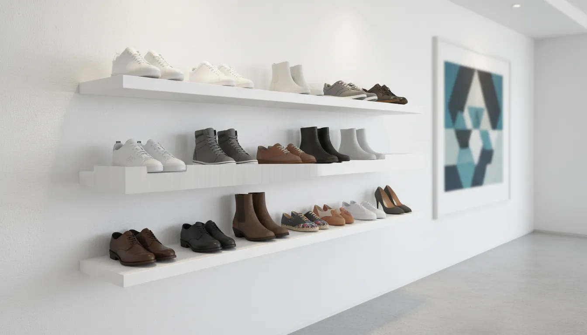
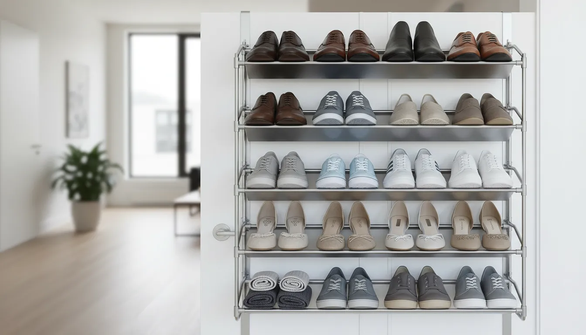
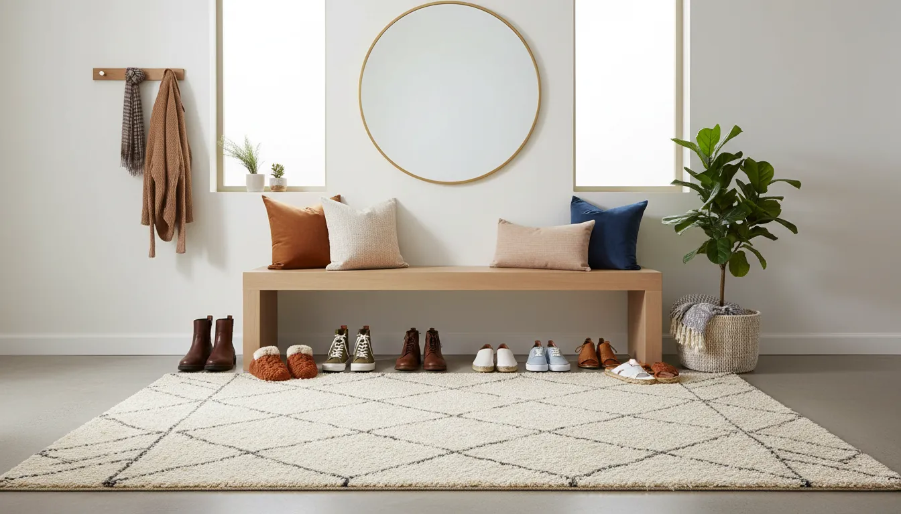

# Smart Shoe Storage Ideas for Studio Apartment Entryways

In the architecture of a studio apartment, every square inch represents valuable real estate. However, no area is more critical—or more prone to chaotic dissolution—than the entryway. This transitional space sets the tone for the entire home. When you live in a compact environment, the "entryway" is often little more than a patch of floor immediately adjacent to the front door. Without a dedicated strategy, this area quickly becomes a bottleneck of discarded footwear, creating both a visual eyesore and a tripping hazard.

The challenge of shoe storage in a studio apartment is twofold: volume and aesthetics. You need a system capable of housing a functional wardrobe of footwear without consuming the floor space required for traffic flow. Furthermore, because the entryway is visible from the living and sleeping areas in most studio layouts, the storage solution must integrate seamlessly with your interior design. It cannot merely be functional; it must be beautiful.

This comprehensive guide explores sophisticated, space-saving strategies to tame the shoe chaos. By leveraging vertical space, utilizing multi-functional furniture, and employing clever concealment tactics, you can transform your cramped entryway into a model of organizational efficiency.

## The Vertical Imperative: Going Up Instead of Out

When floor space is limited, the only logical direction to expand is upward. Vertical storage solutions are the cornerstone of small-apartment organization. They minimize the physical footprint while maximizing storage volume, drawing the eye upward and creating an illusion of height in rooms that might otherwise feel oppressive.

### Slim Tipping-Bucket Cabinets

The tipping-bucket shoe cabinet is arguably the most effective invention for narrow entryways. Unlike traditional shelving units that require 12 to 15 inches of depth to accommodate a standard shoe, tipping cabinets store footwear vertically. This engineering nuance allows the cabinet profile to remain remarkably slim—often as shallow as 6 to 9 inches.

These units sit flush against the wall, encroaching minimally on the hallway. When closed, they conceal the visual clutter of multicolored sneakers and boots behind a clean, solid façade. Many models feature flat tops that function as console tables, providing a designated surface for keys, mail, and decorative elements like a vase or a small lamp.

For a high-quality option that balances modern aesthetics with durability, consider looking for units made from composite wood with reinforced hinges.

[Find the perfect slim shoe cabinet on Amazon](https://www.amazon.com/s?k=narrow+tipping+shoe+cabinet&tag=hats0f8-20)

### Floating Shelves and Wall-Mounted Racks

Preserving the floor plane is a classic interior design trick for making small spaces appear larger. When the eye can see the floor extending to the wall, the brain perceives the room as having more depth. Floating shelves exploit this optical illusion perfectly.

By mounting shelves directly to the wall, you create storage without occupying floor space. For a curated look, install heavy-duty floating shelves at varying heights. Place your most visually appealing footwear—such as designer heels or pristine leather boots—on these shelves as display pieces. This approach treats shoes as décor, blurring the line between storage and art.

Alternatively, wall-mounted racks with pegs or rails offer a more industrial, utilitarian aesthetic. These are particularly effective for hanging items like rain boots or sandals. To maintain a sophisticated look, ensure that the hardware matches the other fixtures in your apartment, such as door handles or light switches.

### The Floor-to-Ceiling Shelving Unit

If you are fortunate enough to have a recessed niche or a corner near your door, a floor-to-ceiling shelving unit can serve as a comprehensive storage library. By taking the storage all the way to the ceiling, you utilize the "dead space" that sits above standard furniture height.

Top shelves should be reserved for out-of-season footwear stored in labeled, uniform boxes. Eye-level shelves can hold everyday shoes, while the lowest shelves are ideal for heavy winter boots. To prevent the unit from looking cluttered, consider using matching bins or baskets for the middle shelves. This creates a rhythm and uniformity that is pleasing to the eye, hiding the contents while keeping them accessible.

## Multi-Functional Furniture: Double Duty Design

In a studio apartment, furniture that serves a single purpose is a luxury few can afford. The most efficient entryways utilize pieces that multitask, combining storage with seating or surface area. This hybridization of function saves space and reduces the number of furniture pieces needed in the room.

### The Storage Bench

A storage bench is a quintessential entryway piece for good reason. It provides a dedicated place to sit while putting on or taking off shoes—a simple comfort that is often overlooked. Beneath the seat, however, lies valuable storage capacity.

There are two primary styles of storage benches: flip-top and cubby-style. Flip-top benches offer a deep internal cavity, ideal for tossing in casual shoes, bags, or seasonal accessories. However, they can be inconvenient for daily use since you must clear the top to access the contents. Cubby-style benches, featuring open slots or drawers beneath the seat, offer superior accessibility for daily footwear.

For a studio, choose a bench with a streamlined silhouette. Avoid bulky, overstuffed upholstery that can make a small entry feel crowded. A sleek wooden bench with metal legs and a thin cushion offers functionality without visual weight.

[Explore stylish entryway storage benches on Amazon](https://www.amazon.com/s?k=entryway+storage+bench+modern&tag=hats0f8-20)

### The Console Table with Lower Clearance

If you prefer the look of a console table over a bench, select a design with a high clearance or a lower shelf. The space beneath a console table is prime real estate for shoe storage. You can place a designated shoe rack underneath, or for a more organic look, use large woven baskets.

Baskets are particularly effective for hiding "ugly" footwear like running shoes or worn flip-flops. They add texture and warmth to the space, countering the hard lines of architecture and cabinetry. Ensure the baskets are large enough to hold shoes flat to prevent damage, but low enough to slide easily under the table.

### Ottomans with Hidden Compartments

For extremely tight entryways where a bench might obstruct the path, a storage ottoman offers a compact alternative. Round or square ottomans can be tucked into corners or placed under floating shelves.

The internal compartment of an ottoman is usually smaller than a bench, making it suitable for slippers or compact flats. However, its primary advantage is flexibility. An ottoman can be easily moved into the living area to serve as extra seating when guests arrive, then returned to the entryway to serve as a shoe station. This fluidity is essential for [maximizing small closet space](/posts/maximizing-small-closet-space) and general living areas in a studio layout.

## Utilizing Hidden and Transitional Spaces

Sometimes, the best way to store shoes in a studio entryway is to make them disappear entirely. Utilizing hidden nooks and transitional spaces keeps the visual environment calm and uncluttered.

### The "Back of Door" Solution Reimagined

Over-the-door shoe organizers have a reputation for being cheap and unattractive, often associated with flimsy plastic pockets. However, the concept is sound, and modern iterations offer much higher aesthetic quality.

Look for over-the-door racks made of powder-coated metal or sturdy fabric with structured pockets. Some systems use wire grids that allow you to customize the arrangement of baskets and hooks. By utilizing the back of the entry door or a nearby coat closet door, you can store 12 to 24 pairs of shoes in space that effectively doesn't exist when the door is open.

If the visual of the rack bothers you, consider hanging it on the *inside* of a closet door, provided there is enough clearance between the door and the clothes inside.

### Tension Rods in Niches

For renters who cannot drill holes into walls, tension rods are a miraculous tool. If your entryway has a small alcove or a weird architectural nook, you can install multiple tension rods at varying depths to create a custom shoe rack.

Place one rod slightly lower and closer to the wall, and a second rod slightly higher and further out. The heel of the shoe catches on the back rod, while the sole rests on the front rod. This creates a slanted display similar to retail shelving. It is inexpensive, customizable, and completely removable upon moving out.

### Rolling Under-Furniture Storage

If your entryway transitions immediately into the living area or bedroom, consider the space under nearby furniture. Rolling storage bins designed for under-bed use can also slide under sofas or raised sideboards.

While this isn't strictly "entryway" storage, it is a valid strategy for studio apartments. Keep your daily rotation of shoes by the door and relegate occasional footwear to these rolling bins. This reduces the sheer volume of items that need to be managed at the threshold.

## Aesthetic Consistency: Blending Storage with Decor

In a studio, there is no separation between "storage space" and "living space." Your shoe rack is likely visible from your bed or your sofa. Therefore, the storage solution must harmonize with your overall interior design scheme.

### Material and Color Coordination

Treat your shoe storage furniture with the same consideration you would give a dining table or a media center. If your apartment features light oak and white accents, a heavy black metal shoe rack will look jarring and cluttered. Match the materials to your existing furniture to create visual continuity.

Painting shelving units the same color as the wall is a designer trick to make them "disappear." This technique reduces visual noise and makes the room feel more expansive. Conversely, if you want the storage to stand out, choose a piece with architectural interest and treat it as a focal point.

### The Power of Uniform Containers

If you opt for open shelving, the visual clutter of mismatched shoes can be overwhelming. The solution is uniformity. Use matching boxes or bins to house the shoes. Whether you choose clear acrylic boxes (to see the contents) or opaque linen bins (to hide them), the repetition of identical containers creates a sense of order and calm.

[Shop premium linen storage boxes for shelves on Amazon](https://www.amazon.com/s?k=linen+storage+bins+with+lids&tag=hats0f8-20)

### Lighting the Entryway

Good lighting elevates any storage solution. A dark corner piled with shoes looks messy; a well-lit niche with organized shelving looks intentional.

If your entryway lacks natural light, consider installing battery-operated puck lights under floating shelves or inside a cabinet. This not only makes it easier to find what you are looking for but also adds a layer of ambient lighting that makes the entryway feel welcoming rather than utilitarian.

## The Seasonal Rotation Strategy

No amount of clever storage can compensate for possessing more items than your space can physically hold. For studio dwellers, the "capsule wardrobe" concept must extend to footwear.

### The "One In, One Out" Rule

To maintain order in a small entryway, adopt a strict maintenance policy. For every new pair of shoes you bring into the apartment, one old pair must be donated, sold, or discarded. This prevents the gradual accumulation of clutter that can overwhelm a small space over time.

### Off-Season Archiving

Only keep shoes that are currently in season in your primary entryway storage. In the summer, heavy winter boots should be cleaned, stuffed with paper to maintain their shape, and stored in less accessible areas, such as high closet shelves or under the bed. In the winter, sandals and espadrilles should be rotated out.

This rotation significantly reduces the number of pairs you need to manage at the door, allowing your entryway storage to breathe and function more efficiently.

## Conclusion: Intentional Living in Compact Spaces

Designing a functional entryway in a studio apartment is an exercise in intentionality. It requires you to be honest about your habits, ruthless about clutter, and creative with space. By selecting the right vertical solutions, investing in multi-functional furniture, and prioritizing aesthetics, you can create an entryway that welcomes you home rather than stressing you out.

Remember that the goal is not just to store shoes; it is to create a seamless transition from the outside world into your personal sanctuary. A tidy, organized entryway sets a precedent of calm and order for the rest of your home, proving that you do not need square footage to live with style and sophistication.

Through the strategic application of these ideas, your studio apartment entryway can evolve from a stumbling block into one of the most efficient and attractive features of your home.