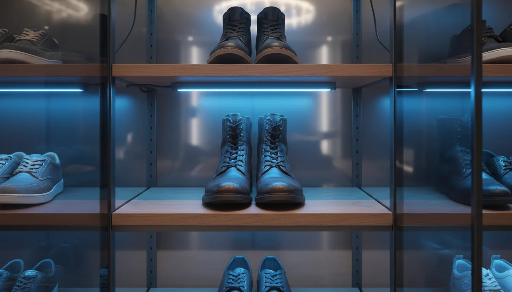
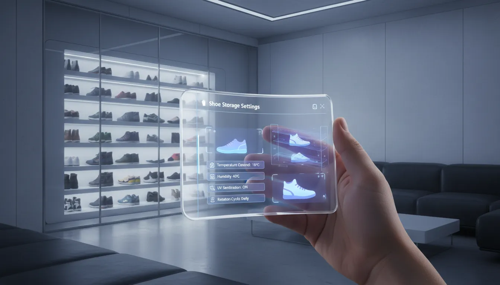

# Smart Shoe Storage Innovations: UV Sanitizing and Deodorizing Entryway Units

The entryway sets the tone for the entire home. It is the transitional space between the chaotic, uncontrolled exterior world and the curated sanctuary of the interior. Traditionally, shoe storage has been a matter of containment: racks, cubbies, and baskets designed simply to keep footwear off the floor. However, as our understanding of hygiene and home health evolves, so too does the technology we employ to manage our living spaces. The era of the passive shoe rack is drawing to a close, making way for smart shoe storage innovations equipped with UV sanitization, ozone deodorization, and climate control.

These intelligent units address a fundamental issue that standard furniture ignores: shoes are vectors for contamination. They track bacteria, allergens, and moisture into the home, while simultaneously serving as breeding grounds for fungi due to the warm, damp environment created by wearing them. Smart storage units transform the entryway from a passive repository into an active hygiene station, preserving both the health of the household and the longevity of the footwear collection.

## The Invisible Threat: Why Sanitization Matters

To understand the necessity of smart storage, one must first acknowledge the biology of the shoe. A study conducted by the University of Arizona found that the average shoe sole carries more than 400,000 units of bacteria, including E. coli and Klebsiella pneumoniae. When shoes are left on a standard open rack or placed inside a dark, unventilated closet, these microorganisms thrive.

Furthermore, the interior of the shoe is subjected to perspiration. The human foot can produce a significant amount of sweat daily. When this moisture is trapped inside leather or synthetic materials without proper ventilation, it encourages the growth of fungi responsible for athlete's foot and onychomycosis (toenail fungus), as well as the bacteria responsible for bromodosis (foot odor).

Smart shoe cabinets mitigate these risks through active intervention. By integrating medical-grade technologies into residential furniture, these units interrupt the reproductive cycle of pathogens and neutralize odors at the molecular level.

## The Core Technologies of Smart Storage

The efficacy of these units relies on a triad of technologies: Ultraviolet Germicidal Irradiation (UVGI), Ozone generation, and thermal dehumidification.

### UV-C Sterilization
Ultraviolet light in the C spectrum (200–280 nm) is a potent disinfectant. It works by penetrating the cell walls of bacteria and viruses, damaging their DNA or RNA, and rendering them unable to replicate. In smart shoe cabinets, UV-C lamps are positioned to bathe the exterior and interior of the footwear in light. This surface-level sterilization is crucial for neutralizing the pathogens picked up from public restrooms, sidewalks, and public transit.

### Ozone Deodorization
While UV light handles surface sterilization, ozone (O3) is a gas that can permeate the porous materials of the shoe. Ozone is highly reactive; it attaches to odor-causing molecules and oxidizes them, effectively breaking down the chemical structure that causes the smell. This is distinct from air fresheners or sprays, which merely mask odors. Ozone eliminates the source. Advanced units use controlled amounts of ozone to ensure the process is safe for indoor environments, often converting the residual ozone back into oxygen before the cabinet door unlocks.

### Thermal Dehumidification
Moisture control is perhaps the most critical factor in shoe preservation. Smart cabinets utilize gentle, circulating heat—usually kept below 115°F (45°C)—to dry footwear. This temperature is carefully calibrated to evaporate sweat and rain without drying out leather or melting the glues used in sneaker construction. By removing moisture, the cabinet creates an environment where fungi cannot survive.

## Top Tier Smart Storage Solutions

The market for smart storage is expanding rapidly, ranging from compact dryers to furniture-grade cabinetry. When selecting a unit, it is vital to consider capacity, technology type, and aesthetic integration.

### The Luxury Smart Cabinet
For homeowners seeking a seamless blend of design and functionality, full-sized smart cabinets are the gold standard. These units often resemble high-end sideboards or consoles. They typically feature multiple compartments, digital touchscreens for cycle selection, and auto-shutoff sensors for safety.

If you are looking for a unit that can handle the volume of a family while maintaining a sleek profile, consider investigating high-capacity smart cabinets.

**Recommended Product:** [Smart Shoe Cabinet with UV Sterilizer](https://www.amazon.com/s?k=Smart+Shoe+Cabinet+with+UV+Sterilizer&tag=hats0f8-20)

### The Compact Sanitizer
Not every entryway has the square footage for a large console. For apartment dwellers or those with smaller mudrooms, compact sanitizing stations offer a viable alternative. These devices often focus on processing one or two pairs at a time but offer more intensive cleaning cycles. They are ideal for runners or athletes who generate high levels of moisture and bacteria in their footwear daily.

**Recommended Product:** [Electric Shoe Boot Dryer and Warmer](https://www.amazon.com/s?k=Electric+Shoe+Boot+Dryer+and+Warmer&tag=hats0f8-20)

### The Modular Ozone System
For those who prefer a more industrial or modular approach, ozone-specific machines can be integrated into existing closet systems. These units prioritize odor elimination and are particularly effective for work boots or heavy winter gear that is difficult to wash.

**Recommended Product:** [Ozone Shoe Deodorizer Machine](https://www.amazon.com/s?k=Ozone+Shoe+Deodorizer+Machine&tag=hats0f8-20)

## Extending the Lifespan of Footwear

Beyond hygiene, the economic argument for smart storage is compelling. High-quality footwear is an investment. Leather dress shoes, designer heels, and performance athletic sneakers degrade primarily due to moisture and bacterial action.

When leather absorbs water, whether from rain or sweat, the fibers swell. As they dry unevenly, they can become brittle and crack. Furthermore, the acidity of perspiration can erode the insoles and linings of shoes. By placing shoes in a temperature-controlled, dehumidified environment immediately after wear, you ensure that the materials return to their neutral state gently. This prevents the warping and creasing associated with air-drying in humid rooms or the damage caused by placing shoes near radiators.

For collectors of limited-edition sneakers, smart storage offers protection against hydrolysis—the chemical breakdown of polyurethane soles caused by humidity. A climate-controlled cabinet is effectively a humidor for your footwear, preserving the structural integrity of the shoe for years longer than standard storage.

For more on preserving luxury items, read our guide on [Climate Controlled Closet Organization](/posts/climate-controlled-closet-organization).

## Integrating Technology into Entryway Aesthetics

One of the primary barriers to adopting new home technology is the "gadget" aesthetic, which often clashes with curated interior design. Fortunately, manufacturers have recognized this hurdle. The latest generation of smart shoe storage is designed to be indistinguishable from contemporary furniture.

### Material Finishes and Form Factors
Modern units are available in high-gloss lacquers, matte minimalist whites, and wood-grain veneers. They often feature handle-less push-to-open doors or discreet recessed handles, contributing to a clean, clutter-free visual line. The digital interfaces are frequently hidden or designed with "sleep modes" where the lights dim, ensuring the unit does not look like a computer server sitting in your hallway.

### Spatial Planning
When incorporating a smart unit, consider it as an anchor piece for the entryway. Because these cabinets are often enclosed, they eliminate the visual noise of piled shoes. This allows for styling the top surface with intentional decor—a structural vase, a catch-all tray for keys, or a piece of art.

Because these units require electricity, placement must be planned around outlet access. Cord management is essential to maintain the sophisticated look. Running cords behind baseboards or using paintable cord covers can keep the installation looking built-in.

## A Buyer’s Guide: What to Look For

Navigating the specifications of smart appliances can be daunting. Here are the critical metrics to evaluate when shopping for an entryway unit.

### Drying Method: Convection vs. Forced Air
Look for units that use forced air circulation rather than static heating elements. Moving air dries shoes more evenly and faster than radiant heat alone. It also prevents "hot spots" that could damage delicate materials.

### Safety Sensors
Since UV-C light is harmful to human eyes and skin, safety features are non-negotiable. A quality smart cabinet must have a magnetic switch or optical sensor that immediately cuts power to the UV lamps if the door is opened during a cycle.

### Noise Levels
These units contain fans and compressors. If your entryway is close to a living room or bedroom, check the decibel rating. A high-quality unit should operate at under 45 dB—roughly the sound level of a quiet library or a refrigerator hum.

### Energy Efficiency
Since these units may run for several hours a day, energy consumption is a valid concern. Look for units with "smart modes" that utilize humidity sensors to run only as long as necessary to dry the shoes, rather than running on a fixed timer. This not only saves electricity but also prevents over-drying.

### Capacity vs. Footprint
Be realistic about the size of footwear you own. High-top sneakers and winter boots require more vertical clearance than loafers. Many smart cabinets have adjustable shelving, but the mechanics of the air ducts sometimes limit how much the shelves can be moved. Verify the internal dimensions against your tallest pair of boots.

## Installation and Maintenance Best Practices

Once you have selected and installed your unit, proper maintenance ensures longevity and safety.

### Filter Maintenance
Most deodorizing units utilize an intake filter to prevent dust from entering the heating elements. These filters should be vacuumed monthly and washed or replaced every three to six months, depending on the dust levels in your home. A clogged filter restricts airflow, forcing the fan to work harder and potentially overheating the unit.

### Interior Cleaning
While the unit is self-sanitizing, physical dirt and mud will still accumulate on the shelves. Wipe down the interior with a damp cloth regularly. Avoid harsh chemical cleaners inside the cabinet, as the heat cycle could vaporize these chemicals, creating potentially irritating fumes.

### UV Bulb Replacement
UV-C bulbs have a finite lifespan, typically rated in hours of operation. Over time, the intensity of the light fades, reducing its germicidal efficacy even if the bulb still appears to glow. Check the manufacturer's rating and schedule replacements accordingly—usually once every 12 to 18 months with daily use.

For broader tips on maintaining an organized entrance, visit our post on [Entryway Maintenance and Cleaning Routines](/posts/entryway-maintenance-and-cleaning-routines).

## The Future of the Smart Entryway

We are currently witnessing only the beginning of this technology's integration into the home. Future iterations of smart shoe storage are expected to feature greater connectivity and automation.

### IoT Integration
The next generation of cabinets will likely integrate with home automation systems like Google Home or Amazon Alexa. Imagine a scenario where you can voice-activate a "Heavy Rain Mode" for your shoe cabinet as you walk in the door, or receive a notification on your phone when your running shoes are fully dried and deodorized.

### Advanced Sensing
Future units may employ AI-driven sensors to detect the specific material of the shoe placed inside, automatically adjusting the temperature and humidity profile to the optimal setting for leather, canvas, or Gore-Tex. This eliminates user error and maximizes the protection of expensive footwear.

### Integrated Air Purification
As open-concept living continues to be popular, the shoe cabinet may evolve into a general air purifier for the entryway. By utilizing its fans and filters continuously at a low setting, the unit could scrub the air of the entire foyer, removing pollen and street pollution before it drifts into the main living areas.

## Conclusion

The shift toward smart shoe storage is more than a trend in gadgets; it is a reflection of a holistic approach to home wellness. By addressing the specific biological and chemical challenges presented by footwear, these units offer a solution that is hygienic, economic, and aesthetic.

We no longer rely on iceboxes to store our food or washboards to clean our clothes; technology has elevated those chores to protect our health and our time. It is logical that the storage of our footwear—the items that physically connect us to the dirt of the outside world—should follow suit.

investing in a UV-sanitizing and deodorizing entryway unit is a proactive step toward a cleaner, fresher home. It protects your family from invisible pathogens, preserves the life of your footwear collection, and maintains the pristine aesthetic of your entryway. As we continue to refine our living spaces, the smart shoe cabinet earns its place as an essential component of the modern, healthy home.