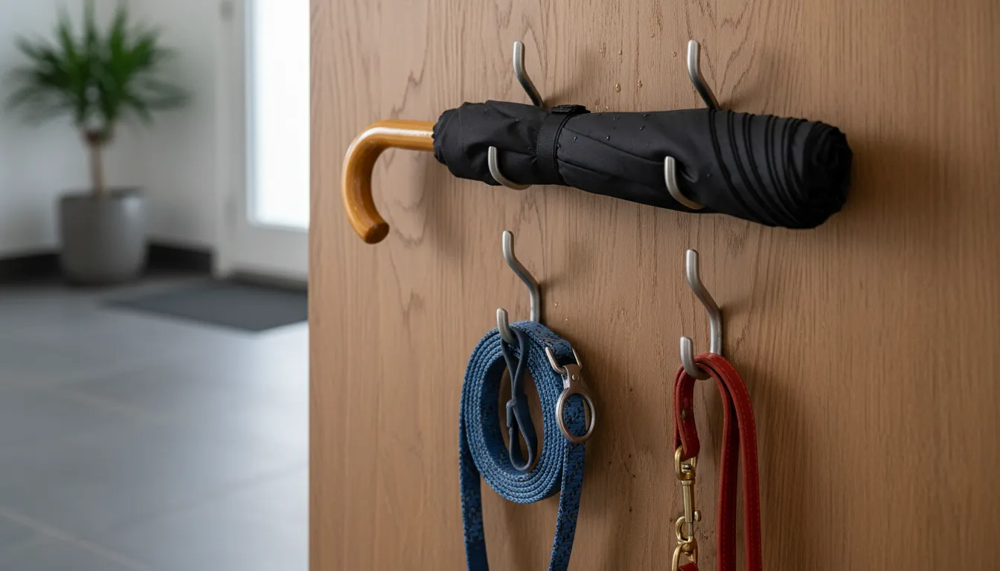
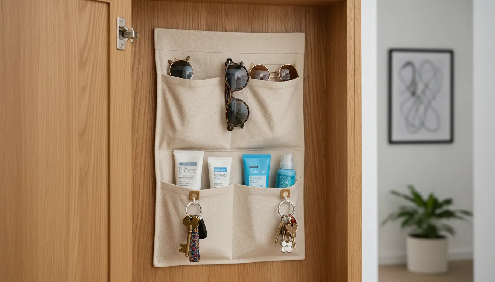

# The Art of Organization: 15 Clever Storage Hacks for Hall Trees

The entryway is more than just a transitional space; it is the prologue to your home’s narrative. It sets the tone for the rest of your interior design and serves as the primary checkpoint for the daily traffic of life. Yet, for many homeowners, this critical area becomes a magnet for chaos. Coats pile up on banisters, shoes create tripping hazards, and keys seem to vanish into thin air. Enter the hall tree—a versatile piece of furniture designed to combat this very disorder. However, owning a hall tree is merely the first step. To truly master the art of organization, one must optimize this furniture piece to its fullest potential.

A standard hall tree provides the skeleton for organization: hooks, a bench, and perhaps a shelf or two. But without a strategic approach, even the most beautiful hall tree can become cluttered and inefficient. By implementing clever storage hacks, you can transform this functional item into a powerhouse of efficiency and style. This comprehensive guide explores fifteen sophisticated methods to elevate your hall tree, ensuring your entryway remains a sanctuary of order and elegance.

## The Psychology of the Entryway

Before diving into specific tactics, it is essential to understand the "why" behind entryway organization. The concept of the "drop zone" is psychological as much as it is physical. When we walk through the door, there is an immediate impulse to shed the burdens of the outside world—heavy coats, wet shoes, and bags. If the environment does not facilitate this shedding process intuitively, clutter ensues.

A well-organized hall tree reduces cognitive load. You do not have to think about where to put your keys or where your umbrella is; the system dictates the action. By refining your hall tree with these fifteen hacks, you are not just tidying up; you are designing a seamless lifestyle workflow.

## Maximizing Vertical Real Estate

Most hall trees are tall, yet the upper regions often go underutilized or become a graveyard for forgotten items. Maximizing vertical space is crucial, particularly in smaller homes where floor space is at a premium.

### 1. The High-Level Seasonal Archive
The uppermost shelf of a hall tree is often difficult to reach, making it an impractical spot for daily items. Instead of leaving this space empty or cluttered with random knick-knacks, transform it into a seasonal archive. Utilizing uniform, opaque bins allows you to store winter accessories in summer or beach gear in winter without creating visual noise.

By placing items in identical woven or canvas baskets, you create a cohesive aesthetic that draws the eye upward without revealing the contents. This hack keeps off-season clutter out of prime storage areas while keeping it accessible enough for the bi-annual swap.

### 2. The Double-Hook Strategy
Standard hall tree hooks are often spaced generously, but they rarely account for the volume of items a modern family possesses. A single hook usually accommodates one heavy coat, leaving no room for a scarf or a handbag.

Replacing standard hooks with heavy-duty double or tri-prong hooks instantly doubles your hanging capacity without requiring additional width. Alternatively, you can install a secondary row of hooks slightly below the main row. This staggered arrangement allows for shorter items, such as jackets or children's backpacks, to hang beneath longer coats, effectively layering your storage.

### 3. Side-Panel Utilization
The sides of a hall tree are frequently ignored surfaces. If your hall tree stands free rather than recessed into a niche, the exterior side panels offer prime real estate for slim storage solutions.

Install a sleek rail system or a series of small command hooks on the side of the unit. This area is perfect for items that are long and awkward to store, such as umbrellas, walking sticks, or even dog leashes. By moving these items to the side, you free up the main front-facing hooks for bulky outerwear, maintaining a clean visual line from the front.

## Optimizing the Bench and Base

The lower half of the hall tree is the heavy lifter, dealing with the dirtiest and heaviest items: shoes and bags. It is also the area most prone to looking messy.

### 4. The "Floating" Shoe Shelf
The space beneath the bench is often a gaping maw where shoes are kicked in haphazardly. To impose order, consider installing a simple, low-profile shelf halfway between the floor and the bottom of the bench seat.

This effectively doubles your shoe storage surface area. Flat shoes and sandals can reside on the bottom, while sneakers or ankle boots sit on the new shelf. This hack prevents the "shoe pile-up" effect and ensures pairs stay together. If installing a permanent shelf is not feasible, stackable shoe racks designed for closets often fit perfectly into these cubbies.

### 5. Drawer Dividers for Hidden Chaos
If your hall tree features a storage bench with a flip-top lid or pull-out drawers, you are likely familiar with the "black hole" phenomenon. Items tossed inside tend to become a jumbled mess.

Implement rigid drawer dividers to compartmentalize this vast space. Dedicate specific sections to specific categories: one section for reusable shopping bags, one for winter gloves, and another for sports gear. This internal structure forces organization and makes retrieving items significantly faster.

### 6. The Boot Tray Slide-Out
Mud and water are the enemies of a clean entryway. While many people use boot trays, they often sit awkwardly in front of the hall tree, becoming a tripping hazard.

A clever hack is to affix felt pads or small casters to the bottom of a sturdy boot tray and place it *under* the hall tree if legs allow, or on the bottom shelf. When you arrive home with wet boots, you simply slide the tray out, deposit your footwear, and slide it back in. This contains the mess and keeps the visual clutter hidden away.

To find the perfect heavy-duty trays or organizers for this hack, you can explore various options that fit your specific dimensions.

[Shop Entryway Boot Trays and Organizers](https://www.amazon.com/s?k=boot+tray+organizer&tag=hats0f8-20)

## Mastering Small Item Management

It is often the smallest items—keys, sunglasses, mail—that create the biggest frustration when misplaced. A hall tree must address these micro-storage needs to be truly functional.

### 7. Magnetic Magic
Wood and metal are common materials for hall trees. If you have a metal unit, or if you can mount a magnetic strip to a wooden upright, you unlock a powerful storage mechanic.

A strong magnetic knife strip (repurposed from the kitchen) can be mounted discreetly on the inside wall of the hall tree structure. This is perfect for holding house keys, car fobs, and even metallic sunglasses. It keeps these small, easily lost items at eye level but out of the way of hanging coats. For a cleaner look, use adhesive magnets on the back of the items themselves to stick them to a designated metal zone.

### 8. The "In-and-Out" Basket System
Paper clutter is a silent killer of entryway aesthetics. Mail, permission slips, and receipts often land on the bench and migrate to the floor.

Designate two small, stylish wire or wicker baskets specifically for paper. Label one "In" (for mail to be sorted) and one "Out" (for returns, letters to mail, or documents for school). Mount these baskets on the wall adjacent to the hall tree or rest them on the highest shelf. This creates a dedicated workflow for paper, preventing it from mixing with clothing and gear.

### 9. Hidden Pocket Organizers
Over-the-door shoe organizers are a staple of closet organization, but they can look tacky in a main hallway. However, you can adapt this concept for a hall tree by cutting a canvas organizer down to size.

Mount a small, multi-pocket organizer on the *inside* of a cabinet door if your unit has them, or on the back panel behind where the coats hang. These pockets are ideal for storing small seasonal items like sunscreen, lint rollers, compact umbrellas, and spare change. They remain completely hidden when coats are hung but are easily accessible when you are rushing out the door.

## Adaptation for Family Dynamics

A hall tree must serve every member of the household, from the tallest adult to the smallest child. Customizing the unit to accommodate different heights and needs is a hallmark of elite organization.

### 10. The Zone Defense
Assigning specific "zones" or cubbies to individual family members fosters accountability. If your hall tree has divided sections, label them subtly with initials or color-coded bins.

When everyone knows exactly which hook and which bin belongs to them, they are more likely to use them. For open bench designs, place distinctive cushions or baskets to demarcate territory. This hack not only organizes items but also organizes behavior, teaching children (and partners) to respect shared spaces.

For more insights on managing family clutter in tight spaces, you might find our guide on [Small Entryway Solutions](/posts/small-entryway-solutions) particularly helpful.

### 11. Adjustable Kid-Level Hooks
One of the most common failures in entryway design is placing hooks out of reach for children. If kids cannot reach the hook, the coat ends up on the floor.

Install a secondary row of hooks at a child-friendly height, perhaps on the vertical supports of the bench or lower on the back panel. As the children grow, these hooks can be repurposed for bags and backpacks, while the upper hooks are graduated to coats. This evolving system ensures the hall tree grows with your family.

### 12. The "Lost and Found" Bin
Despite our best efforts, random items will appear in the entryway: a stray toy, a borrowed book, a lone sock. Rather than letting these items float around, designate a specific small bin as the "Lost and Found."

Once a week, empty this bin. If items belong in other rooms, they are moved. If they are trash, they are tossed. This prevents the hall tree from becoming a permanent residence for homeless objects.

## Aesthetic Integration and Lighting

Organization is not strictly utilitarian; it must also be visually pleasing. A beautiful space encourages maintenance.

### 13. Interior Illumination
Dark corners attract clutter because we cannot see what is there. Adding lighting to your hall tree transforms it from a dark cave of coats into a highlighted display.

Install battery-operated, motion-sensor LED puck lights under the upper shelves or inside cubbies. When you approach to grab your coat or find your shoes, the area illuminates automatically. This adds a touch of luxury and ensures that nothing gets lost in the shadows. It is particularly useful for deep shelves where items tend to get pushed to the back.

[Shop Motion Sensor Cabinet Lights](https://www.amazon.com/s?k=motion+sensor+cabinet+lights&tag=hats0f8-20)

### 14. Mirror Integration
If your hall tree does not include a mirror, adding one is a hack that serves dual purposes. A mirror allows for a final outfit check before leaving, but it also reflects light, making a cramped entryway feel larger and more open.

You can mount a framed mirror directly onto the back panel of the hall tree if space allows, or use peel-and-stick mirror tiles for a more integrated look. This breaks up the visual monotony of wood or metal and adds a layer of sophistication.

### 15. The Uniformity Rule
While not a structural modification, this is perhaps the most impactful aesthetic hack. Replace mismatched hangers with a set of high-quality, matching wooden or velvet hangers.

The visual noise created by wire, plastic, and neon hangers clashes with the serene vibe of an organized home. Uniform hangers create a boutique-like appearance. Furthermore, ensure that the baskets or bins used in the cubbies match in texture and color. This uniformity tricks the eye into seeing the space as less cluttered, even if the volume of items remains the same.

## Maintenance: The Final Piece of the Puzzle

Implementing these hacks is a project; maintaining them is a habit. The most sophisticated storage system will fail without a maintenance protocol.

Adopt a "one in, one out" policy for coats and shoes kept at the hall tree. The entryway is prime real estate, not long-term storage. Only items currently in rotation should reside there. If a winter coat hasn't been worn in two weeks, it should be moved to a closet.

Additionally, consider the seasonal swap a ritual. As spring approaches, take the time to deep clean the hall tree, wipe down the shelves, vacuum the shoe cubbies, and swap the heavy woolens for light trenches and denim jackets. This reset prevents the slow accumulation of dust and debris that makes a space feel dingy.

For a deeper dive into the methodology of keeping high-traffic areas pristine, read our article on [Decluttering Your Mudroom](/posts/decluttering-your-mudroom).

## Conclusion

The hall tree is a humble piece of furniture with the potential to revolutionize your daily routine. It stands as the guardian of your home's threshold, managing the transition between the public and private spheres. By applying these fifteen clever storage hacks—from the strategic use of vertical space and hidden compartments to the integration of lighting and family-focused zones—you elevate the hall tree from a simple coat rack to a sophisticated command center.

Organization is an art form that blends function with aesthetics. It requires seeing beyond the manufacturer's design and customizing the piece to fit the unique rhythm of your life. When every item has a home, and that home is both accessible and beautiful, the stress of leaving and entering the house dissipates, replaced by a sense of calm and control.

Start with one or two of these hacks today. Add a basket for the seasonal overflow, or install those extra hooks for the kids. Small changes yield significant results, turning the chaotic jumble of the entryway into a curated gallery of organized living.

### Recommended Products to Get Started

To help you implement these hacks immediately, here are a few highly recommended tools:

1.  **Storage Baskets**: Essential for the high-level archive and under-bench organization.
    [Shop Woven Storage Baskets](https://www.amazon.com/s?k=woven+storage+baskets&tag=hats0f8-20)

2.  **Heavy Duty Hooks**: Perfect for implementing the double-hook strategy.
    [Shop Heavy Duty Coat Hooks](https://www.amazon.com/s?k=heavy+duty+coat+hooks&tag=hats0f8-20)

3.  **Drawer Dividers**: The key to taming the chaos inside storage benches.
    [Shop Adjustable Drawer Dividers](https://www.amazon.com/s?k=adjustable+drawer+dividers&tag=hats0f8-20)