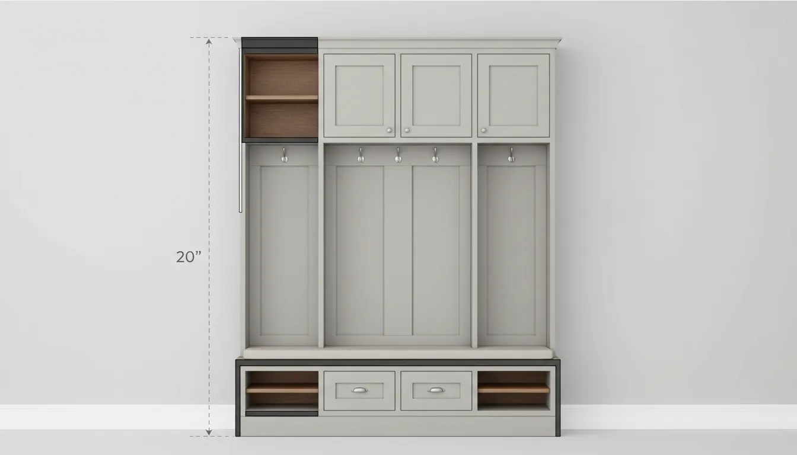
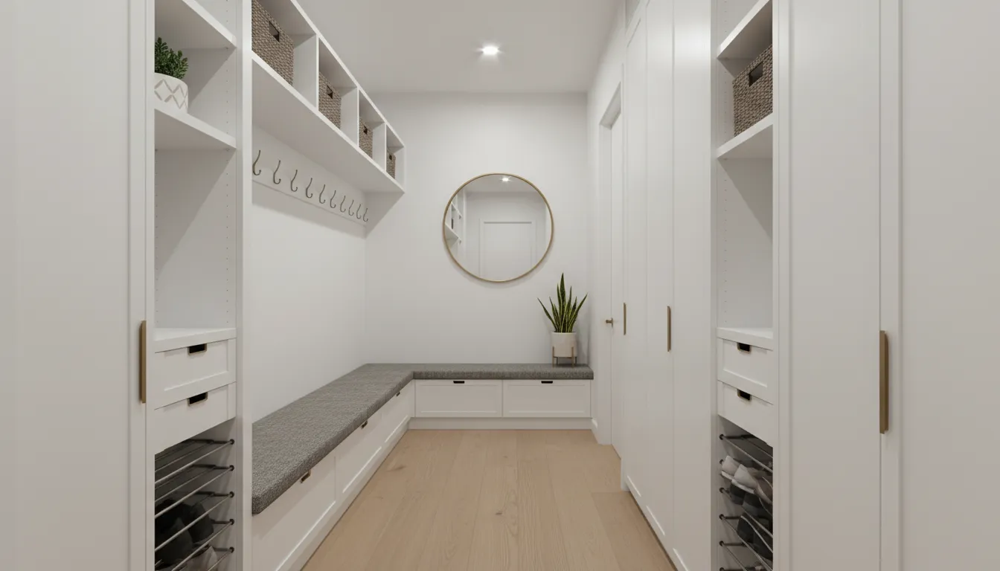
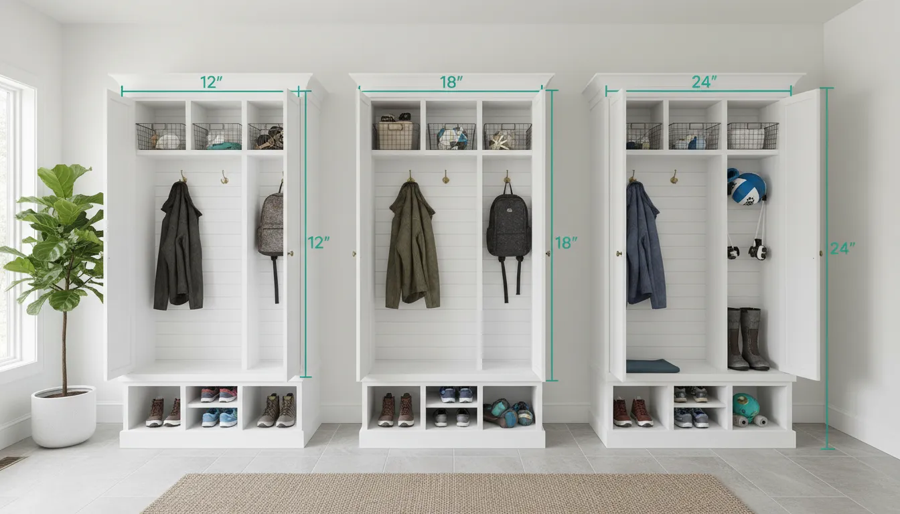

# The Best Depth for Mudroom Lockers: Ensuring Practicality Without Sacrificing Space

The mudroom is the unsung hero of the organized home. It serves as the transitional airlock between the chaos of the outdoors and the sanctuary of the interior. However, the effectiveness of a mudroom hinges entirely on its design specifications. While width and height are often dictated by the length of the wall or the height of the ceiling, depth is the variable that most homeowners and even some designers struggle to optimize. 

Get the depth wrong, and the space feels claustrophobic, impeding the flow of traffic. Make it too shallow, and the utility of the storage is compromised, leading to coats spilling onto the floor and backpacks protruding into walkways.

Determining the best depth for mudroom lockers requires a sophisticated understanding of ergonomics, the dimensions of modern gear, and the spatial limitations of your specific entryway. This guide explores the technical standards and practical nuances of locker depth to help you design a space that is both architecturally sound and effortlessly functional.

## The Anatomy of a Functional Locker

Before dictating a single number as the "best" depth, one must deconstruct the locker into its functional zones. A standard mudroom locker generally consists of three distinct vertical sections, each with unique depth requirements:

1.  **The Upper Cubby:** Used for seasonal items, baskets, or display.
2.  **The Main Compartment:** Used for hanging coats, backpacks, and scarves.
3.  **The Base:** Often a bench with storage underneath for shoes or boots.

Ideally, these sections should not always share a uniform depth. A "stepped" design—where the bench is deeper than the upper cabinets—often provides the superior ergonomic solution.

## The Gold Standard: 14 to 15 Inches for Uppers

For the upper and middle sections of a mudroom locker—the areas where coats hang and baskets sit—the industry standard for custom joinery typically hovers between **14 and 15 inches**. 

Why is this specific dimension so prevalent?

*   **Hook Clearance:** A standard double-pronged coat hook requires roughly 3 to 4 inches of projection. When bulky winter coats are hung, they naturally compress but still require roughly 12 inches of depth to hang freely without protruding aggressively into the room. A 15-inch depth ensures that heavy parkas stay contained within the frame of the locker.
*   **Standard Lumber Dimensions:** From a construction standpoint, plywood often yields efficiently at these widths, minimizing waste during the fabrication of custom cabinetry.
*   **Visual Balance:** In a hallway or laundry room pass-through, a cabinet depth greater than 15 inches can begin to feel oppressive at eye level. Keeping the upper section shallower maintains an open sightline.

If you plan to utilize baskets for gloves, hats, and scarves, standardizing your depth to 15 inches allows you access to the widest variety of retail storage bins. Many off-the-shelf woven baskets are designed to fit 12-inch to 14-inch shelving.

For those looking to organize these upper shelves efficiently, selecting the right bins is paramount. 
[Shop for Woven Storage Baskets](https://www.amazon.com/s?k=Woven+Storage+Baskets&tag=hats0f8-20)

## The Bench Requirement: 18 to 24 Inches

While the upper cabinets function best at a shallower depth, the base of the locker system has a different primary function: seating. To sit comfortably to tie a shoe, an adult requires adequate thigh support.

### The 18-Inch Standard
A depth of **18 inches** is considered the minimum standard for a comfortable bench. This depth allows an adult to sit without feeling perched on a ledge. If your mudroom is in a narrow corridor, 18 inches is likely your maximum limit before you begin to encroach on walking space. 

At 18 inches deep, you have sufficient room underneath for a single row of adult shoes or two rows of small children's shoes. This depth aligns perfectly with standard kitchen chair dimensions, making it a safe ergonomic bet.

### The 20 to 24-Inch Luxury Depth
If space permits, increasing the bench depth to **21 or 24 inches** transforms the utility of the unit. A 24-inch depth—standard for kitchen countertops—offers expansive storage underneath. It allows for deep pull-out drawers that can house bulky winter boots or sports equipment that would otherwise clutter the floor.

Furthermore, if your design involves the upper lockers sitting *on top* of the bench (rather than floating above it), you must account for the "setback." If your upper lockers are 15 inches deep and they sit on an 18-inch bench, you are left with only a 3-inch ledge—useless for sitting. 

**The Golden Ratio of Overhang:**
If you want a bench you can sit on while having lockers behind your back, you need a minimum of 12 to 14 inches of exposed seat depth. 
*   **Scenario A:** Upper lockers are 12 inches deep. The bench should be at least 24 inches deep.
*   **Scenario B:** Upper lockers are 15 inches deep. You will likely need a bench depth of 26+ inches, or you must design the uppers to "float" high enough that the user's head does not strike the cabinetry while sitting.

## The Hanger Rod vs. Hook Dilemma

One of the most critical decisions affecting locker depth is your choice of hanging hardware. This choice alone can dictate whether your lockers need to be 12 inches deep or 24 inches deep.

### The Case for Hooks (12-15 Inches)
The vast majority of mudroom lockers utilize hooks. Hooks are casual, easy for children to use, and space-efficient. Because clothes hang flat against the back panel (or drape naturally), a depth of **12 to 15 inches** is perfectly adequate. This setup prevents the "closet effect" where the unit dominates the room volume.

For high-traffic family homes, durable heavy-duty hooks are essential to prevent hardware failure under the weight of wet wool and denim.
[Shop for Heavy Duty Coat Hooks](https://www.amazon.com/s?k=Heavy+Duty+Coat+Hooks&tag=hats0f8-20)

### The Case for Rods (22-24 Inches)
If your goal is to use coat hangers—perhaps for a more formal entryway or to prevent wrinkles in blazers—you enter the realm of standard closet dimensions. A standard coat hanger on a rod requires a minimum clear depth of **21 inches**, with **24 inches** being ideal to prevent sleeves from rubbing against the doors or face frame.

Implementing a hanger rod in a unit that is only 15 inches deep will result in frustration; the hangers will need to be angled, or the doors will not close. If you must use hangers in a shallow space, consider a "valet rod" which pulls out perpendicular to the back wall, though this reduces overall capacity.

## Shoe Storage: The Mathematical Reality

When planning the depth of the base cubbies, one must be realistic about shoe sizes. A visual estimate is insufficient; precise measurements ensure that cabinet doors can close or that shoes do not become a tripping hazard.

*   **Children's Shoes:** A child's shoe rarely exceeds 9 or 10 inches in length. A 12-inch deep cubby is sufficient.
*   **Women's Shoes:** A women's size 9 is approximately 10.25 inches long. However, heels and boots add bulk. An 14-inch depth is safe.
*   **Men's Shoes:** This is where shallow mudrooms fail. A men's size 12 shoe is nearly 12 inches long. Once you account for the sole extension and the heel counter, the physical footprint can reach 13.5 inches. 

Therefore, if the man of the house wears a size 11 or larger, an **14-inch internal depth** (meaning a 15 or 16-inch external cabinet depth) is the absolute minimum to prevent heels from hanging off the edge of the shelf. For work boots or snow boots, an 18-inch depth is highly recommended to contain the mess.

To keep these deeper shelves clean, rubber boot trays are indispensable. They define the space and protect the joinery from moisture.
[Shop for Rubber Boot Trays](https://www.amazon.com/s?k=Rubber+Boot+Trays&tag=hats0f8-20)

## Navigating Narrow Hallways

Not every home is blessed with a dedicated mudroom room. Many homeowners must integrate lockers into a hallway, laundry pass-through, or garage entry. In these scenarios, the depth of the locker directly impacts the clearance of the walkway.

Building codes generally require a hallway to be a minimum of 36 inches wide. However, for a feeling of comfort, 42 to 48 inches is preferable. 

If you have a 60-inch wide hallway:
*   You can install **18-inch deep** lockers.
*   This leaves you with a **42-inch walkway**, which is spacious and comfortable.

If you have a 48-inch wide hallway:
*   Installing 18-inch lockers leaves only a 30-inch path. This is too tight and likely violates code.
*   **The Solution:** You must opt for a shallow depth profile. Use a **10 to 12-inch** depth for the entire unit. 
*   **The Trade-off:** At 10 inches, you cannot have a functional bench for sitting. In this case, design the unit as floor-to-ceiling cubbies with hooks, and perhaps include a folding seat or a small stool that can be tucked away.

## Open vs. Closed Storage Depth

The decision between open cubbies and lockers with doors also influences the ideal depth. 

**Open Storage:**
Open lockers allow for slightly shallower depths because there are no doors to impede larger items. A backpack that sticks out 1 inch past a 12-inch frame is acceptable in an open locker.

**Closed Storage:**
If you want cabinet doors to hide the clutter (a sophisticated choice for maintaining visual calm), you must add an extra inch of "inset" depth. If your coats occupy 14 inches of space, the cabinet interior must be at least 15 inches, meaning the external build is likely 16 inches. 

Never underestimate the volume of a fully packed child’s backpack. Modern school bags, filled with textbooks, laptops, and lunch boxes, are incredibly bulky. A closed locker intended for students should ideally aim for a **16 to 18-inch internal depth** to ensure the door latches closed without force.

## The Psychological Impact of Depth

Beyond the tape measure, depth plays a psychological role in how we perceive a room. Deep, towering cabinets can feel looming, making a small mudroom feel darker and smaller. 

To mitigate this while maintaining storage capacity:
1.  **Recessed Lockers:** If you are building new or renovating, consider recessing the lockers into the wall cavity. By utilizing the 4 inches of stud space, you can achieve a 16-inch interior depth while the unit only protrudes 12 inches into the room.
2.  **Chamfered Edges:** Custom cabinetry can feature angled or curved corner units that soften the transition from the wall to the deep locker, reducing the visual bulk.
3.  **Color Blocking:** Painting the back of the open lockers a darker color than the face frame can create an illusion of greater depth, while painting the entire unit white or a light neutral reduces its visual weight in the room.

For more strategies on maximizing the utility of tight areas, read our guide on [small entryway organization](/posts/small-entryway-organization-hacks).

## Custom Joinery vs. Prefabricated Solutions

When determining depth, your budget and sourcing method will dictate your constraints.

**Prefabricated (IKEA/Retail):**
Most retail wardrobe units (like the IKEA PAX system) come in two standard depths: roughly **14 inches** and **23 inches**. 
*   The 14-inch units are excellent for tight mudrooms but require forward-facing hanger rails or hooks.
*   The 23-inch units are deep and robust but can overwhelm a standard hallway.

**Semi-Custom Kitchen Cabinets:**
Using kitchen cabinetry standards, you can buy tall utility cabinets (pantry units) which are standard at **24 inches** deep. Wall cabinets are standard at **12 inches** deep. You can stack a 12-inch wall cabinet on top of a 24-inch base cabinet to create a bench effect, though the aesthetics may require substantial trim work to look cohesive.

**Fully Custom:**
This is the only route where you can specify a **16-inch** depth—the often-cited "perfect" dimension for mudroom uppers that balances storage capacity with floor space preservation.

## Summary Table: Ideal Depths by Function

| Component | Minimum Depth | Ideal Depth | Luxury/Max Depth |
| :--- | :--- | :--- | :--- |
| **Upper Cubbies (Hooks)** | 10 inches | 14-15 inches | 16 inches |
| **Upper Lockers (Rod)** | 20 inches | 22 inches | 24 inches |
| **Bench Seating** | 16 inches | 18 inches | 24 inches |
| **Shoe Storage (Kids)** | 10 inches | 12 inches | 14 inches |
| **Shoe Storage (Adults)** | 13 inches | 14-15 inches | 18 inches |

## Conclusion

There is no single magic number for mudroom locker depth, but there is a magic formula: **Function + Flow = Depth.**

If your primary goal is to hide winter coats behind closed doors, you must commit to a depth of 22 to 24 inches. If your goal is to organize grab-and-go items for a busy family in a pass-through laundry room, a stepped design with 18-inch benches and 14-inch uppers is the ergonomic pinnacle.

Do not let standard retail dimensions dictate your home's functionality. Measure your hallway width, measure your largest family member's shoes, and measure the protrusion of your winter coats. By prioritizing these physical realities over arbitrary standards, you ensure that your mudroom remains a practical asset rather than a spatial obstacle.

A well-designed mudroom is an investment in your daily peace of mind. Getting the depth right is the foundational step in ensuring that investment pays dividends for years to come. For further inspiration on layout configurations, explore our article on [layout ideas for family mudrooms](/posts/layout-ideas-for-family-mudrooms).