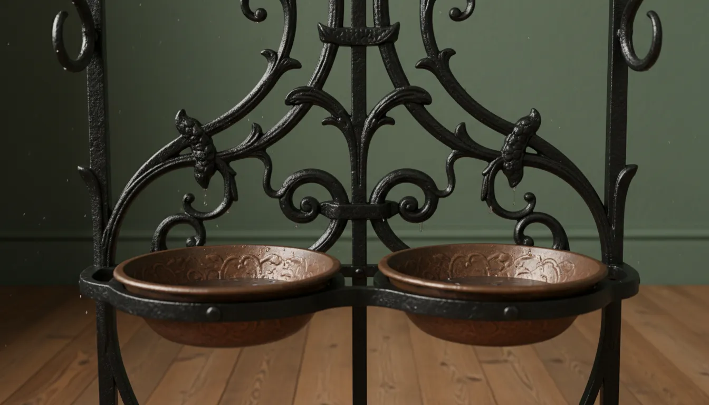
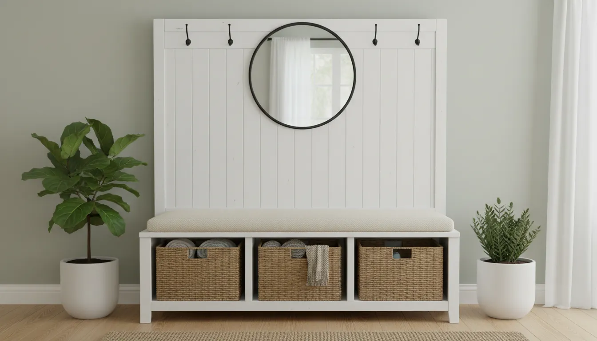
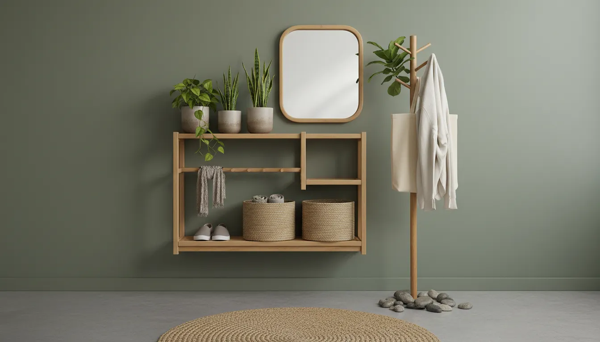

# The Evolution of the Hall Tree: From Victorian Furniture to Modern Entryway Hubs

The entryway of a home is more than a mere passageway; it is a transitional space that sets the tone for the entire residence. It is the threshold between the public world and the private sanctuary. Anchoring this critical space is a piece of furniture that has quietly adapted to over a century of social and architectural change: the hall tree.

While contemporary homeowners view the hall tree primarily as a utilitarian solution for containing the chaos of coats, backpacks, and shoes, its lineage is steeped in etiquette, craftsmanship, and social stratification. Understanding the evolution of the hall tree offers a fascinating glimpse into how our domestic lives have shifted from the formal rigidity of the 19th century to the multifunctional, casual nature of modern living.

## The Victorian Era: The Birth of the Hall Stand

To understand the origins of the hall tree, one must look to the Victorian era in Britain and America. During the mid-to-late 19th century, the "hall stand," as it was often called, was not merely a convenience; it was a necessity born of social protocol and practical innovation.

### The Calling Card Culture and Social Etiquette

The Victorian home was strictly zoned. The front hall was the furthest a stranger or slight acquaintance might penetrate into the house. It was here that visitors left their calling cards—a ritualistic practice essential to upper and middle-class society. Consequently, the earliest hall trees were designed with specific compartments or trays to hold these cards.

These pieces were massive, imposing structures, often crafted from dark, heavy woods like mahogany, walnut, or oak. They served as immediate indicators of the homeowner's wealth and taste. A grand hall stand told a visitor that they had entered a respectable establishment. 

Unlike modern versions which prioritize shoe storage, Victorian hall trees focused heavily on hats and coats. Men wore hats as a mandatory article of clothing when outdoors, and removing them upon entry was a non-negotiable rule of etiquette. The brass or cast-iron hooks found on these antiques were placed high, catering to the top hats and bowlers of the day.

### Materiality and Industrial Innovation

The design of the Victorian hall tree was also influenced by the Industrial Revolution. While the wealthy commissioned hand-carved pieces featuring Gothic Revival or Eastlake details, the mid-19th century saw the rise of cast iron.

Foundries began producing elaborate cast iron hall stands. These were durable, heavy, and capable of intricate ornamentation that mimicked organic forms like branches, vines, and leaves. They often included a central mirror—a critical feature allowing guests to check their appearance before being formally received—and a drip pan at the base for wet umbrellas, a necessary inclusion in the rainy climates of London or the northeastern United States.

## The Transitional Period: 1920s to 1950s

As the 20th century dawned, the rigid social structures of the Victorian age began to erode, and with them, the architectural dominance of the grand entrance hall.

### The Decline of the Foyer

The arrival of the bungalow and the craftsman style home brought a shift toward more modest living spaces. The expansive foyer shrank into a small vestibule or disappeared entirely, opening directly into the living room. The massive, looming hall trees of the previous century became impractical. They were too large for the new scale of domestic architecture and too ornate for the modernizing tastes that preferred the cleaner lines of Art Deco and later, Mid-Century Modernism.

### The Coat Closet Takes Over

By the post-war era of the 1950s, the built-in coat closet became a standard feature in suburban housing developments. Architects integrated storage directly into the walls, rendering the freestanding hall tree largely obsolete. For several decades, the concept of a dedicated piece of furniture for hanging coats fell out of fashion, replaced by simple wall-mounted racks or the hidden storage of the closet.

However, the coat closet had a flaw: it was "out of sight, out of mind." It became a black hole for clutter, and for busy families, the act of opening a door to hang a coat often proved one step too many, leading to items being draped over chairs or banisters.

## The Modern Renaissance: The Rise of the Mudroom

The resurrection of the hall tree in the late 20th and early 21st centuries was driven by a fundamental change in family dynamics and home design: the open-concept floor plan and the "mudroom" philosophy.

As formal living rooms and parlors vanished in favor of "great rooms," the need for organized storage returned. Families required a "drop zone"—a centralized hub to manage the influx of backpacks, sports gear, tech devices, and outerwear. The modern hall tree emerged not as a status symbol, but as a command center for domestic logistics.

### Anatomy of the Modern Hall Tree

Today's hall tree is a hybrid piece of furniture, combining the functions of a coat rack, a storage bench, a shoe rack, and shelving.

1.  **The Bench:** Unlike Victorian stands, modern units almost always include a bench. This facilitates the removal of shoes, reflecting the cultural shift toward shoe-free households to maintain cleanliness.
2.  **Cubby Systems:** Contemporary designs often feature cubbies or baskets. These allow for the compartmentalization of accessories—winter gloves, dog leashes, or mail.
3.  **Integrated Tech:** Some high-end custom units now include charging stations, acknowledging that the smartphone is the modern equivalent of the Victorian calling card—the first thing we put down when we walk in the door.

For those looking to replicate the utility of a mudroom without the cost of built-in cabinetry, freestanding industrial-style units have become increasingly popular. These often combine metal and wood for a look that suits both loft apartments and suburban homes.

[Check out this Industrial Hall Tree with Shoe Storage](https://www.amazon.com/s?k=Industrial+Hall+Tree+with+Shoe+Storage&tag=hats0f8-20)

## Material Shifts: From Solid Oak to Mixed Media

While antiques were crafted from solid hardwoods, the democratization of furniture means modern hall trees utilize a variety of materials. Engineered wood (MDF) with veneers allows for affordable, stylish options that resist warping. Metal frames offer durability and a lighter visual footprint, which is essential for maintaining a sense of space in smaller entryways.

The aesthetic has also broadened. You can find hall trees that channel the rustic farmhouse vibe—featuring beadboard backings and distressed white finishes—or sleek, minimalist bamboo structures that serve studio apartments.

## Choosing the Right Hall Tree for Your Space

Selecting a hall tree requires a balance of spatial awareness and honest assessment of your storage needs. Unlike the one-size-fits-all approach of the past, today's market offers specialized solutions.

### Assessing the "Drop Zone"

Before purchasing, homeowners must analyze their entry habits. Do you kick off shoes immediately? If so, a unit with a robust lower shoe rack is a priority. Do you have heavy winter coats? You need solid, reinforced hooks rather than decorative ones.

For those dealing with tight quarters, the corner hall tree is a brilliant innovation. It utilizes the often-wasted "dead space" behind a door or in a tight vestibule, providing vertical storage without encroaching on the walkway.

[Explore this Corner Hall Tree with Storage Bench](https://www.amazon.com/s?k=Corner+Hall+Tree+with+Storage+Bench&tag=hats0f8-20)

### Visual Weight and Dimensions

In a small hallway, a solid wood unit with sides can feel like a coffin, blocking light and making the space feel claustrophobic. In these instances, "open" designs—those with metal frames and no side panels—maintain sightlines and allow light to pass through. Conversely, in a large, cavernous entryway, a substantial piece of furniture is necessary to anchor the space and prevent it from feeling empty.

For more insights on managing compact areas, read our guide on [maximizing small entryway storage](/posts/maximizing-small-entryway-storage).

## The DIY and Customization Movement

A significant trend in recent years is the "built-in look" achieved through DIY modifications. Homeowners are increasingly purchasing standard flat-pack hall trees and modifying them with trim, molding, and paint to make them appear as custom carpentry.

This speaks to a desire for permanence and architectural integration. While we may not be building Victorian mansions, we still crave the solidity and bespoke nature of that era. By joining multiple narrow hall trees together or flanking a unit with bookshelves, one can create a complete wall system that rivals professional cabinetry.

The farmhouse aesthetic remains particularly dominant in this sector. The combination of bright whites, natural wood bench seats, and black hardware offers a timeless appeal that bridges the gap between traditional warmth and modern cleanliness.

[View this White Farmhouse Hall Tree with Bench and Coat Hooks](https://www.amazon.com/s?k=White+Farmhouse+Hall+Tree+with+Bench+and+Coat+Hooks&tag=hats0f8-20)

## Maintenance and Longevity

The durability of a hall tree is tested daily. It endures wet raincoats, muddy boots, and the weight of heavy bags. Unlike a dining table which is treated with care, a hall tree is a workhorse.

### Caring for Modern Finishes

For units made of particleboard or MDF, moisture is the enemy. It is vital to ensure that wet umbrellas and coats do not drip directly onto laminate surfaces, which can swell and bubble. Using trays for shoes and wiping down the bench regularly preserves the integrity of the piece.

For metal and solid wood units, maintenance is simpler, often requiring only dusting and occasional polishing. However, hooks should be checked periodically. The torque applied by a heavy backpack can loosen screws over time, compromising the structure.

## The Future of the Entryway

As we look forward, the hall tree is likely to evolve further. We are already seeing the integration of smart home features, such as motion-sensor lighting integrated into the frame to illuminate the bench when you arrive home late.

Sustainability is also influencing design. Consumers are increasingly seeking hall trees made from reclaimed woods or fast-growing bamboo, reflecting a consciousness about the environmental impact of fast furniture.

Furthermore, as remote work continues to blur the lines between home and office, the entryway hub might expand to include mail sorting systems or package delivery secure zones. The furniture will adapt, just as it did when the telephone replaced the calling card.

## Conclusion

The journey of the hall tree from the Victorian parlor to the modern mudroom is a testament to the resilience of good design. While the ornamentation has been stripped away and the materials have changed, the core function remains unaltered: to provide a designated place for the accouterments of the outside world, preserving the sanctity and order of the home within.

Whether you opt for an antique cast-iron stand that evokes the romance of a bygone era, or a sleek, industrial unit designed for maximum efficiency, you are participating in a domestic ritual that spans centuries. The hall tree stands guard at the door, a silent butler ready to take your coat and welcome you home.

By choosing the right vessel for your entryway, you do not just organize your space; you curate the experience of arrival. In a world that is increasingly chaotic, that moment of order is a luxury worth investing in.