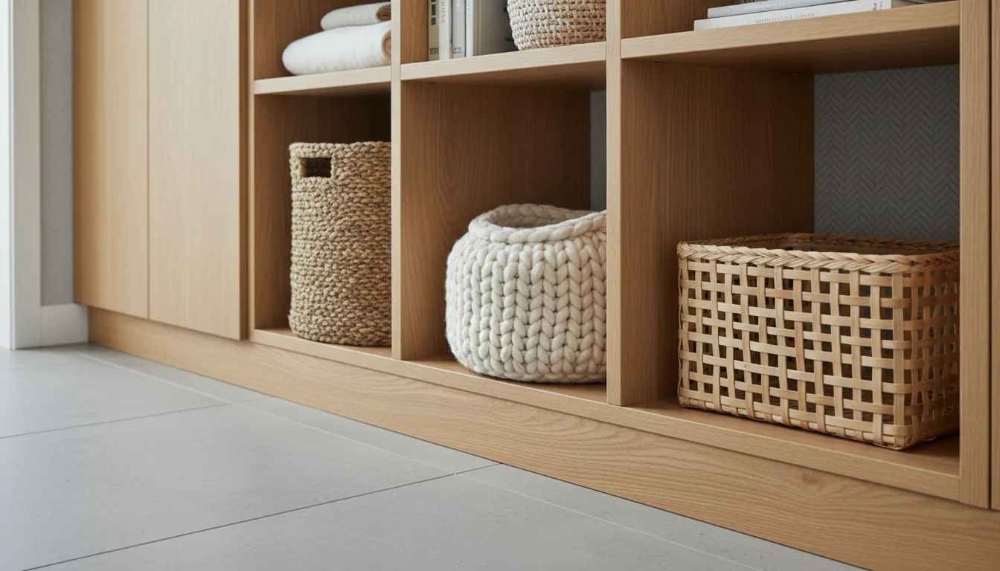
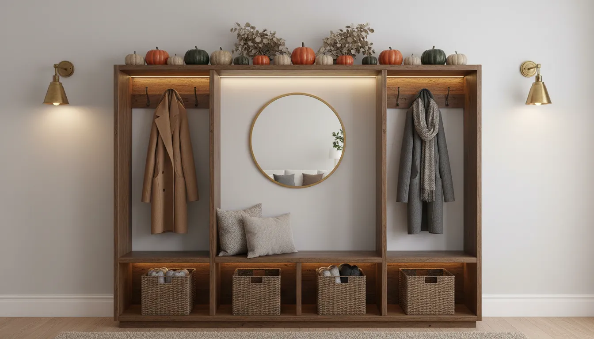

# The Ultimate Buying Guide to Hall Trees and Mudroom Lockers in 2024

The entryway is the handshake of the home. It is the first space guests encounter and the final checkpoint before you step out into the world. Despite its importance, this transitional zone often becomes a landing strip for chaos—scattered shoes, piled coats, and misplaced keys. In 2024, the solution to this disarray is not merely cleaning; it is structural organization. Enter the hall tree and the mudroom locker.

Once relegated to the back doors of farmhouses, these furniture pieces have evolved into sophisticated staples of interior design. They bridge the gap between utilitarian storage and aesthetic elegance. However, the market is saturated with options ranging from flimsy particle board to solid heirloom-quality wood.

This comprehensive guide serves as your roadmap to navigating the complex landscape of entryway storage. Whether you are outfitting a sprawling vestibule or a compact apartment hallway, understanding the nuances of construction, design, and functionality is paramount to making a wise investment.

## Defining the Contenders: Hall Trees vs. Mudroom Lockers

Before analyzing dimensions and materials, it is essential to distinguish between the two primary categories of entryway furniture. While the terms are often used interchangeably, they serve distinct design philosophies and spatial needs.

### The Hall Tree
A hall tree is typically an all-in-one standalone unit. Its anatomy generally consists of a bench for seating, a back panel with hooks for coats, and often some form of upper or lower storage. Hall trees are designed to be open and accessible. They are ideal for spaces where visual weight needs to be minimized. The open structure prevents a small hallway from feeling claustrophobic, maintaining an airy atmosphere while providing essential organization.

### The Mudroom Locker
Mudroom lockers derive their inspiration from cabinetry. They are characterized by segmented vertical compartments—"lockers"—that provide dedicated space for each family member. Unlike the open concept of a hall tree, mudroom lockers often feature doors, allowing you to conceal visual clutter entirely. This style creates a more built-in, custom look and is generally heavier and more substantial. It is the preferred choice for larger families where the volume of outerwear requires aggressive containment strategies.

## Assessing Your Space: The Metrics of Fit

The most common error buyers make is prioritizing style over spatial ergonomics. A hall tree that impedes traffic flow or blocks light switches turns a solution into a nuisance. Before browsing retailers, conduct a rigorous assessment of your available space.

### 1. The Traffic Flow Rule
Your entryway is a high-traffic artery. When measuring depth, you must account for more than just the footprint of the unit. Consider the "swing zone." If your front door opens inward, ensure the hall tree does not obstruct its path. furthermore, aim to leave at least 36 to 48 inches of clearance in front of the unit to allow a person to sit comfortably on the bench to put on shoes without blocking the hallway for others.

### 2. Vertical Real Estate
Height is a critical factor often overlooked. Standard hall trees range from 65 to 74 inches tall. However, many modern homes feature higher ceilings. A short unit in a room with 9-foot ceilings can look diminutive and out of scale. Conversely, buying a unit that is too tall may conflict with crown molding. Measure the distance from the floor to the ceiling, and also account for any baseboards. Most standalone units will not sit flush against the wall unless you modify your baseboards or choose a unit with a recessed back.

### 3. Obstruction Mapping
Map out the wall where you intend to place the furniture. Note the location of:
*   Electrical outlets (you may need to cut access holes in the backing).
*   Thermostats and light switches.
*   Air vents or returns.
*   Windowsills.

Failure to account for these fixed elements often results in costly returns or awkward placement.

## Material Composition: Durability and Longevity

In 2024, furniture manufacturing utilizes a vast spectrum of materials. Understanding what lies beneath the finish will tell you how long the piece will last and how much weight it can support.

### Engineered Wood (MDF and Particle Board)
The vast majority of affordable hall trees are constructed from Medium Density Fiberboard (MDF) or particle board covered in a laminate veneer.
*   **Pros:** Cost-effective, smooth finish, resistant to warping from humidity changes.
*   **Cons:** Susceptible to water damage if the veneer is chipped; screws can strip out over time; lower weight capacity for the bench.
*   **Verdict:** Excellent for budget-conscious buyers or low-traffic zones. If selecting MDF, look for high-density variants with reinforced hardware.

### Solid Wood
Solid wood units (pine, oak, rubberwood) offer superior durability and aesthetic appeal.
*   **Pros:** extremely strong; can be refinished or painted; holds hardware securely; withstands heavy daily use.
*   **Cons:** Higher price point; susceptible to expansion and contraction in extreme climates.
*   **Verdict:** An investment piece. If you plan to keep the furniture for decades, solid wood is the superior choice.

### Metal and Mixed Media
Industrial trends have popularized metal frames paired with wood benches.
*   **Pros:** High structural integrity; visually lightweight; practically immune to wear and tear on the frame.
*   **Cons:** Can feel cold or austere in traditional settings.
*   **Verdict:** Ideal for modern lofts, apartments, and homes with an industrial or rustic aesthetic.

## Feature Selection: Configuring for Your Lifestyle

Functionality is subjective. A hall tree perfect for a single professional may be disastrous for a family of five. Curate your features based on your daily habits.

### Storage Capacity: Open vs. Closed
Do you want to see your items, or hide them? Open cubbies encourage easy access but require discipline to keep tidy. If your reality involves mismatched sneakers and overflowing backpacks, opt for units with closed drawers or cabinet doors. This allows you to maintain a serene visual environment regardless of the chaos inside the drawers.

### The Bench Requirement
If the primary purpose of the unit is to facilitate putting on and taking off shoes, the bench must be robust. Check the weight capacity specifications carefully. Many budget particle board units have a limit of 200 pounds, while metal or solid wood options can support 400 pounds or more. For added comfort and style, consider units that come with cushions, or plan to add your own.

### Hook Count and Type
Standard hall trees come with three to five double-prong hooks. For families, this is rarely enough. Look for units with side-by-side hooks or double rows. Furthermore, consider the height of the hooks. If you have small children, a unit with lower hooks or the ability to add adhesive hooks to the lower frame can encourage independence.

## Top Recommendations for 2024

Based on current market trends, durability ratings, and consumer feedback, here are three distinct categories of recommendations for upgrading your entryway.

### 1. The Versatile All-Rounder
For those seeking a balance between traditional aesthetics and modern utility, brands like Bush Furniture offer comprehensive solutions. These units often feature a blend of closed cabinetry and open shelving, suitable for transitional home styles.

For a robust option that fits most standard entryways, consider this category:
[Bush Furniture Hall Tree with Storage Bench](https://www.amazon.com/s?k=Bush+Furniture+Hall+Tree&tag=hats0f8-20)

### 2. The Industrial Modernist
If your home leans towards urban chic or you require a slimmer profile, mixed-media units utilizing metal frames are exceptional. They are often easier to assemble and move than their solid wood counterparts.

For a sleek, durable metal and wood combination:
[Industrial Hall Tree with Bench and Shoe Storage](https://www.amazon.com/s?k=Industrial+Hall+Tree+with+Bench&tag=hats0f8-20)

### 3. The Large-Scale Organizer
For large families or spacious mudrooms, a single narrow tower is insufficient. You need a wide unit that mimics built-in lockers. Look for wide configurations that maximize wall coverage.

For maximum storage capacity and a substantial presence:
[Prepac Wide Hall Tree with Shoe Storage](https://www.amazon.com/s?k=Prepac+Wide+Hall+Tree&tag=hats0f8-20)

## Design Styles and Aesthetic Integration

Your hall tree should not look like an afterthought. It should harmonize with your home's architectural integrity.

### The Modern Farmhouse
Dominating the market in 2024, the modern farmhouse style combines white or cream finishes with natural wood accents. Look for beadboard backing (vertical grooves), cup pull hardware, and distressed wood benches. This style adds warmth and brightness to dark hallways.

### The Minimalist Scandi
Scandinavian design focuses on clean lines, light woods (like birch or ash), and white accents. These units often lack heavy molding or decorative trim. They prioritize function and simplicity, making them perfect for smaller apartments where visual clutter must be reduced.

### The Classic Traditional
Rich dark woods like mahogany or walnut finishes characterize the traditional style. These pieces often feature crown molding at the top and raised paneling on drawers. They convey a sense of permanence and luxury, well-suited for formal foyers.

## Installation and Safety: The Non-Negotiables

Once you have selected your unit, installation is the next critical phase. Because hall trees are tall and often front-heavy (especially when loaded with coats), safety is paramount.

### Anchoring is Mandatory
Regardless of how stable the unit feels, you must anchor it to the wall. This is non-negotiable for households with children or pets. Most reputable manufacturers include a tip-over restraint kit. If yours does not, purchase heavy-duty furniture straps or L-brackets. Secure the anchor into a wall stud, not just the drywall, to ensure it can withstand pulling force.

### Managing Baseboards
As mentioned earlier, baseboards prevent flush placement. You have three options:
1.  **The Cut-Out:** Carefully cut away the section of the baseboard where the unit will stand. This provides the most built-in look.
2.  **The Notch:** If you are handy with a jigsaw, you can notch the bottom of the furniture legs to fit over the baseboard.
3.  **The Gap:** Simply anchor the top of the unit to the wall using spacers. While this leaves a gap behind the unit, it is the easiest method. You can hide the gap with trim if desired.

## The Built-In Hack: Elevating Store-Bought Furniture

One of the most popular trends in 2024 is the "IKEA Hack" or the semi-custom approach. You can take a standard, flat-pack hall tree and make it look like a $5,000 custom mudroom installation with a few simple modifications.

*   **Crown Molding:** Add crown molding to the top of the unit to bridge the gap between the furniture and the ceiling.
*   **Baseboard Integration:** Wrap your room’s baseboards around the bottom of the unit.
*   **Caulk and Paint:** Caulk every seam where the unit meets the wall. Paint the unit the same color as your trim or a contrasting accent color.
*   **Hardware Upgrade:** Swap out generic knobs and hooks for high-end brass or matte black hardware.

For more ideas on how to customize your space, read our guide on [Small Entryway Hacks](/posts/small-entryway-hacks-maximize-space) to see how minor changes create major impact.

## Accessorizing for Function and Form

A hall tree is a skeleton; accessories are the muscle. Without proper organizational tools, the unit will become a clutter magnet.

### Baskets and Bins
Measure your cubbies precisely. Purchase baskets that fill the space as fully as possible to maximize storage volume. Woven baskets add texture and warmth (great for farmhouse styles), while wire baskets offer an industrial edge and allow you to see the contents. Label these bins by family member or by category (e.g., "Winter Gear," "Sports," "Dog Walking").

### Rugs and Runners
Place a durable runner rug in front of the hall tree. This anchors the furniture visually and protects your floors from wet shoes and grit. Choose materials like wool or washable synthetics that can withstand heavy traffic.

### Lighting
If your hallway is dark, consider adding lighting to the hall tree. Battery-operated puck lights adhered to the underside of the upper shelf can illuminate the bench area, making it easier to find items and adding a cozy ambiance in the evening.

## Maintenance: Keeping Your Entryway Pristine

To ensure your investment lasts through 2024 and beyond, establish a maintenance routine.

*   **Seasonal Rotation:** Do not treat your hall tree as long-term storage. Move off-season coats to a closet. This prevents the hooks from becoming overloaded and damaging the backing.
*   **Hardware Tightening:** Every six months, check the screws on the hooks and the assembly cam locks. The constant weight of coats can loosen these over time.
*   **Moisture Management:** If you live in a snowy or rainy climate, use a boot tray. Do not place wet boots directly onto a wood or particle board shelf, as the water will eventually cause the material to swell and bubble.

## Conclusion

Investing in a hall tree or mudroom locker is a commitment to a more organized, serene lifestyle. It transforms the frantic energy of leaving the house into a streamlined routine. By carefully considering your space, choosing the right materials, and selecting a design that complements your home, you create an entryway that is resilient, functional, and welcoming.

Whether you opt for a sleek industrial rack or a substantial mudroom locker system, the key to satisfaction lies in the details—measuring accurately, anchoring safely, and accessorizing thoughtfully. With the insights provided in this guide, you are now equipped to navigate the market and select the perfect piece to welcome you home every day.

For further inspiration on organizing other areas of your home, explore our deep dive into [Decluttering Your Living Space](/posts/decluttering-your-living-space-101) for strategies that complement your new entryway setup.